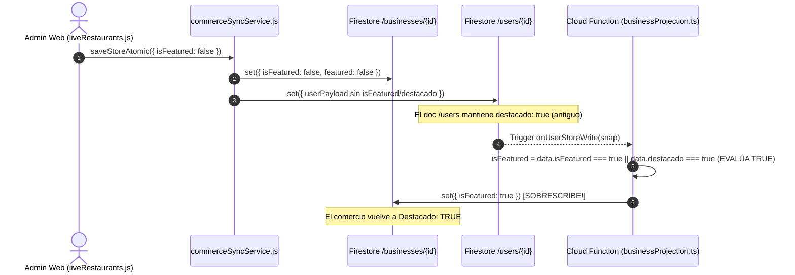

# 01_FORENSIC_AUDIT.md
## Auditoría Forense — Consistencia Canónica de Identidad de Comercio, Geolocalización y Featured SSOT
**Protocolo:** BSD-COMMERCE-IDENTITY-GEO-FEATURED-CONSISTENCY-001  
**Fecha:** 28 de Agosto, 2026  
**Ambiente:** Enterprise Live (Firebase: `bluesystem-7c9af`)  
**Auditor:** Senior Developer & Auditor de BlueSystem  

---

### 1. Resumen Ejecutivo de la Auditoría
Se realizó una inspección forense exhaustiva sobre los flujos de administración de comercios, sincronización atómica, disparadores de Cloud Functions, catálogos territoriales y motores de elegibilidad de flota (`FleetEligibilityEngine`), abarcando:
1. **Admin Web:** `panel-admin/public/js/dashboard/liveRestaurants.js` y `panel-admin/public/js/services/commerceSyncService.js`.
2. **Merchant Onboarding:** `merchant-onboarding-portal/src/components/Step2LocationContact.tsx` y `merchant-web/src/shared/constants/geoCatalog.ts`.
3. **Cloud Functions:** `functions/src/triggers/businessProjection.ts` y `functions/src/triggers/orders.ts`.
4. **Android Client & Courier Apps:** `app/src/main/java/com/example/domain/engine/FleetEligibilityEngine.kt` y `app/src/main/java/com/example/FirebaseManager.kt`.

---

### 2. Matriz de Evidencia Forense por Módulo

| Módulo / Archivo | Estado Inicial | Anomalía Identificada | Impacto Técnico / Operacional |
| :--- | :--- | :--- | :--- |
| **`liveRestaurants.js`** | Formulario `renderStoreModal` (L380-L485) | Omitía campos territoriales: `departmentId`, `municipalityId`, `latitude`, `longitude`, `googleMapsUrl`, `placeId`. | El Administrador no podía ver ni editar la ubicación geográfica ni coordenadas de un comercio; al guardar, se perdía o no se actualizaba la ubicación. |
| **`commerceSyncService.js`** | `saveStoreAtomic` (L11-L175) | `businessPayload` no mapeaba atributos geográficos ni normalizaba `isFeatured`. Error de referencia `existingStore` no definido en línea 61. | Inconsistencia en Firestore; ReferenceError en tiempo de ejecución al evaluar `existingStore`. |
| **`commerceSyncService.js`** | `toggleStoreFeaturedAtomic` (L473-L487) | Solo escribía en `/businesses/{storeId}`, sin sincronizar `/users/{storeId}`. | Dejaba el documento legacy `/users` con el valor obsoleto, provocando una carrera de sincronización. |
| **`businessProjection.ts`** | Trigger `onUserStoreWrite` (L56-L98) | L56 evaluaba `isFeatured = data.isFeatured === true \|\| data.destacado === true`. | **Segundo Escritor Fantasma:** Al modificarse `/users`, la función revivía `isFeatured: true` sobreescribiendo `/businesses/{id}` aunque el Admin lo hubiera desmarcado. |
| **`orders.ts`** | Trigger `notifyNewOrder` (L43-L135) | No estampaba de forma autoritativa server-side el municipio y coordenadas del comercio en `/orders`. | El municipio dependía del payload enviado por la App Cliente, susceptible a manipulación o desincronización con el catálogo del comercio. |
| **`geoCatalog.ts`** | Catálogo en Functions y Merchant Web | Existía en `functions/src/domain/geo/` y `merchant-web`, pero faltaba en `panel-admin`. | El Admin Web no disponía de la lista oficial de los 17 departamentos y municipios para validación en tiempo real. |

---

### 3. Evidencia de Traza de Ejecución y Carrera de Escritores (Ghost Writer)

---

### 4. Conclusión Forense
El comportamiento anómalo donde los comercios no guardaban su ubicación o reactivaban el estado "Destacado" no era un problema de red o de interfaz, sino una falla estructural de **Falta de SSOT** combinada con una **carrera de doble escritura (Dual Writer Race Condition)** disparada por el trigger reactivo `onUserStoreWrite`.
