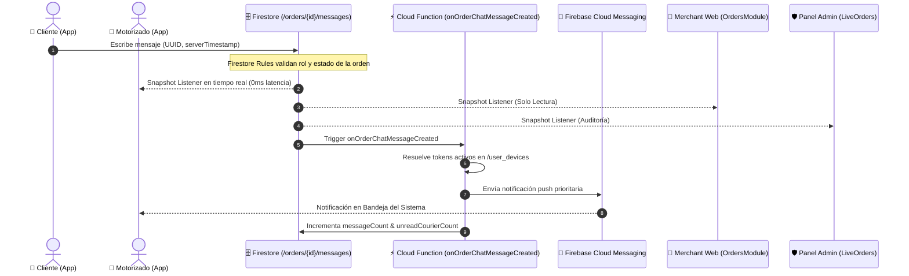

# ARQUITECTURA TÉCNICA Y MODELO DE DATOS (02_ORDER_LIVE_CHAT_CALL_ARCHITECTURE.md)

**Protocolo:** BSDEL-ORDER-LIVE-CHAT-CALL-001  
**Módulo:** ORDER LIVE CHAT & CALL  
**Fecha:** 2026-08-28  
**Arquitectura:** ONE CORE / ONE BACKEND / ONE DATABASE / SINGLE SOURCE OF TRUTH

---

## 1. Esquema Canónico de Base de Datos

### Ruta de Subcolección: `/orders/{orderId}/messages/{messageId}`

```typescript
interface OrderChatMessage {
  id: string;                         // UUID / clientMessageId generado en cliente (Idempotencia)
  orderId: string;                    // ID de la orden canónica
  senderId: string;                   // UID autenticado en Firebase Auth
  senderRole: 'CUSTOMER' | 'COURIER' | 'SYSTEM';
  senderNameSnapshot: string;         // Snapshot inmutable del nombre del remitente
  senderName: string;                 // Nombre legible
  text: string;                       // Texto sanitizado (1 - 2000 chars)
  type: 'TEXT' | 'SYSTEM' | 'CALL_EVENT';
  createdAt: FirebaseFirestore.Timestamp; // Server Timestamp
  readAt: FirebaseFirestore.Timestamp | null;
  readBy: string[];                   // Lista de UIDs que han leído el mensaje
  status: 'SENT' | 'DELIVERED' | 'READ';
  tenantId?: string;                  // Aislamiento Multi-Tenant
  businessId?: string;                // Aislamiento de Comercio
}
```

### Agregados en el Documento Principal `/orders/{orderId}` (Cero Consultas $N+1$)

```typescript
{
  hasConversation: boolean,           // true si existen mensajes
  messageCount: number,               // Contador atómico (FieldValue.increment)
  lastMessageAt: Timestamp,           // Fecha del último mensaje
  lastMessageText: string,            // Vista previa para badges
  lastMessageSenderRole: string,      // Rol del remitente del último mensaje
  unreadCustomerCount: number,        // Mensajes no leídos por el cliente
  unreadCourierCount: number          // Mensajes no leídos por el motorizado
}
```

---

## 2. Flujo de Datos y Eventos en Tiempo Real



---

## 3. Integración de Llamadas Telefónicas y Privacidad

1. **Resolución Segura**:
   - Para el **Cliente**: El teléfono del motorizado se resuelve desde el documento `/users/{courierId}` mediante Firestore SDK autenticado.
   - Para el **Motorizado**: El teléfono del cliente se resuelve desde el campo `customerPhone` / `senderPhone` de la orden asignada.
2. **Intent Nativo**:
   - `Intent.ACTION_DIAL` con URI `tel:$phone` abre el marcador telefónico del dispositivo móvil sin grabar audio ni almacenar registros privados fuera del dispositivo.
3. **Registro de Evento de Auditoría**:
   - Al pulsar el botón de llamada, se inserta automáticamente un mensaje de tipo `CALL_EVENT` en la conversación con texto `"📞 Cliente inició llamada al motorizado"` para garantizar la trazabilidad operacional.
