# 02_ROOT_CAUSE_ANALYSIS.md
## Análisis de Causa Raíz (RCA) — Identidad, Geolocalización y Featured SSOT
**Protocolo:** BSD-COMMERCE-IDENTITY-GEO-FEATURED-CONSISTENCY-001  
**Fecha:** 28 de Agosto, 2026  
**Ambiente:** Enterprise Live (Firebase: `bluesystem-7c9af`)  

---

### 1. Árbol de Causa Raíz (5 Porqués / RCA)

#### Problema A: La edición de comercios en Admin Web no permitía gestionar Departamento, Municipio, Coordenadas ni enlace de Google Maps.
1. **¿Por qué?** Porque el modal `renderStoreModal` en `liveRestaurants.js` solo renderizaba inputs para Nombre, Categoría, Teléfono, Correo, Dirección de texto simple, Costo de Envío, Tiempo y Estado.
2. **¿Por qué?** Porque cuando se migró el módulo administrativo, no se incorporó el contrato geográfico canónico creado en el Onboarding (`Step2LocationContact.tsx`).
3. **¿Por qué?** Porque no existía la biblioteca client-side `geoCatalog.js` cargada en `dashboard.html`.
4. **¿Por qué?** Porque el catálogo geográfico oficial de los 17 departamentos estaba aislado en el backend (`functions/src/domain/geo/geoCatalog.ts`) y en el portal merchant, sin un bridge reutilizable en el panel admin.
5. **Causa Raíz A:** Desconexión entre el contrato canónico territorial de la plataforma y los componentes de UI/Servicio del Admin Web.

#### Problema B: Los comercios marcados como "Normales" (No Destacados) volvían a aparecer como "Destacados" automáticamente.
1. **¿Por qué?** Porque el valor de `isFeatured` en `/businesses/{businessId}` volvía a cambiar a `true` tras unos milisegundos o tras actualizaciones de perfil.
2. **¿Por qué?** Porque la Cloud Function `onUserStoreWrite` en `businessProjection.ts` se disparaba y proyectaba los datos de `/users/{userId}` hacia `/businesses/{userId}`.
3. **¿Por qué?** Porque la función ejecutaba `const isFeatured = data.isFeatured === true || data.destacado === true;`, donde `destacado` en `/users` conservaba el valor antiguo `true`.
4. **¿Por qué?** Porque `commerceSyncService.saveStoreAtomic` y `toggleStoreFeaturedAtomic` actualizaban `/businesses`, pero al sincronizar con `/users` omitían `isFeatured: false` o no sincronizaban `/users` en el toggle.
5. **Causa Raíz B:** **Patrón de Doble Escritor No Coordinado (Dual-Writer Race Condition)** donde un trigger reactivo secundario sobrescribía la verdad canónica con datos obsoletos.

#### Problema C: Asignación y visibilidad de órdenes en flotas no segmentadas por municipio.
1. **¿Por qué?** Porque si un comercio no tenía `municipalityId` registrado en `/businesses`, la orden se creaba con `municipalityId` vacío o derivado libremente de la app del cliente.
2. **¿Por qué?** Porque no existía un paso server-side de validación y estampado autoritativo en `notifyNewOrder` (`orders.ts`).
3. **Causa Raíz C:** Ausencia de validación server-authoritative del municipio del comercio en el ciclo de vida de la orden.

---

### 2. Matriz de Corrección Quirúrgica Aplicada

```mermaid
graph TD
    A[Admin Web: liveRestaurants.js] -->|1. Valida contra GeoCatalog| B[commerceSyncService.js]
    B -->|2. Batch ACID| C[Firestore /businesses/id SSOT]
    B -->|2. Batch ACID| D[Firestore /users/id Legacy Sync]
    C -->|3. Read-Back Verification| A
    D -->|4. Trigger onUserStoreWrite| E[businessProjection.ts]
    E -->|5. isFeatured = Boolean data.isFeatured| C
    F[Customer App: Crea Orden] -->|6. Trigger onCreate| G[orders.ts: notifyNewOrder]
    G -->|7. Lee /businesses/id| C
    G -->|8. Estampa Municipio & Depto Autoritativo| H[Firestore /orders/orderId]
    H -->|9. available_orders FCM| I[Fleet Pool & Couriers del Mismo Municipio]
```

