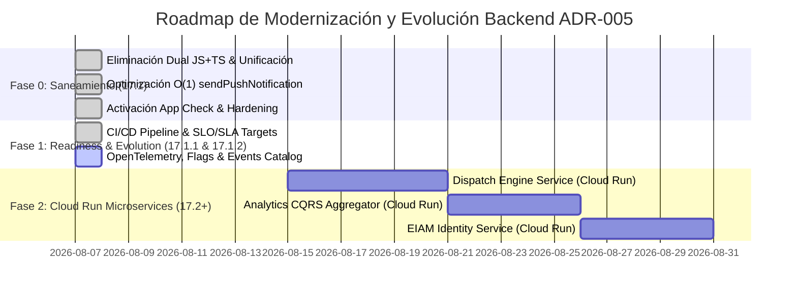

# ADR-005: Enterprise Backend Architecture & Modernization Plan

**Estado:** `ACEPTADO Y ENRIQUECIDO CON ENTERPRISE EVOLUTION`  
**Fecha:** Agosto 2026  
**Autores:** Equipo de Arquitectura BlueSystem Enterprise  
**Reemplaza:** Propuestas teóricas previas de backend  
**Afecta a:** Cloud Functions, Firebase Services, Cloud Run, Firestore Rules, Observabilidad, Eventos de Dominio y SDKs Clientes (Android / Web)

---

## 1. Contexto

Con la finalización de la auditoría forense del backend actual (**Sprint 16.5 Enterprise Backend Assessment**), la ejecución del saneamiento core (**Sprint 17.1**) y la certificación de preparación para producción (**Sprint 17.1.1**), se certificó el estado real de la infraestructura de **BlueSystem Delivery**:

- **Saneamiento Core Completado:** Unificación 100% TypeScript en `functions/src/`, eliminación del backend dual JS+TS, optimización de notificaciones FCM de $O(N)$ a $O(1)$ indexado y hardening de App Check.
- **Preparación para Producción:** Pipeline CI/CD en GitHub Actions, especificación SLO/SLA cuantitativa, índices compuestos en Firestore, alertas de presupuesto GCP y plan de Disaster Recovery.
- **Evolución Enterprise Requerida:** Inclusión de trazabilidad distribuida (OpenTelemetry), banderas dinámicas (Feature Flags Remote Config), catálogo oficial de eventos de dominio, política de versionado de API y blueprint arquitectónico para microservicios Cloud Run.

---

## 2. Decisión Arquitectónica

Se aprueba el **Plan de Modernización y Evolución Backend de BlueSystem Delivery**, estructurado en la siguiente matriz de transformación:

```
Cloud Functions Actuales: 10
  ├── 🟢 Se Mantienen (Unificadas en TS v2): 5
  ├── 🟡 Se Refactorizan / Optimizan: 3
  └── 🔴 Se Eliminan (Obsoletas / Duplicadas): 2
Cloud Run Nuevos (Microservicios): 3
Firebase Extensions: 0 (Sustituidas por servicios propios)
Pilares de Evolución Enterprise: 5 (OpenTelemetry, Feature Flags, Versioning, Domain Events, Cloud Run Blueprint)
```

---

## 3. Matriz de Transformación de Servicios Backend

### 3.1. Consolidación de Cloud Functions (10 $\rightarrow$ 8 Unificadas en TS)

| Función | Tipo | Estado Futuro | Estrategia de Refactorización / Unificación |
| :--- | :--- | :--- | :--- |
| `notifyNewOrder` | Firestore Trigger (`orders.onCreate`) | 🟢 Se Mantiene | Migrada a TypeScript en `src/triggers/orders.ts`. |
| `notifyOrderStatusChange` | Firestore Trigger (`orders.onUpdate`) | 🟢 Se Mantiene | Migrada a TypeScript en `src/triggers/orders.ts`. |
| `onPaymentStatusUpdated` | Firestore Trigger (`orders.onUpdate`) | 🟢 Se Mantiene | Migrada a TypeScript en `src/triggers/orders.ts`. |
| `setUserClaims` | Firestore Trigger (`users.onWrite`) | 🟢 Se Mantiene | Núcleo de asignación de Custom Claims EIAM Multi-Tenant (`src/triggers/auth.ts`). |
| `setMembershipClaims` | Firestore Trigger (`membership.onWrite`) | 🟢 Se Mantiene | Gestión de membresías y acceso a sucursales (`src/triggers/auth.ts`). |
| `sendPushNotification` | Callable HTTPS (`https.onCall`) | 🟡 Se Refactoriza | **Optimización $O(1)$ / Indexada:** Eliminación del Full Scan. Búsqueda directa con `where('isActive', '==', true)` y `where('role', '==', segment)`. |
| `adminUpdateUser` | Callable HTTPS (`https.onCall`) | 🟡 Se Refactoriza | Migrada a TS en `src/callables/admin.ts`. Delegación incondicional a la lógica de claims EIAM. |
| `diagnoseFcmSystem` | Callable HTTPS (`https.onCall`) | 🟡 Se Refactoriza | Migrada a TS en `src/callables/admin.ts`. Agregación eficiente sin escaneo de colecciones inactivas. |
| `adminResetPassword` | Callable HTTPS (`https.onCall`) | 🔴 Se Elimina | Sustituida por flujo nativo client-side de Firebase Auth SDK (`sendPasswordResetEmail`). |
| `refreshUserClaims` | Callable HTTPS (`https.onCall`) | 🔴 Se Elimina | Integrada directamente como opción dentro de `adminUpdateUser`. |

---

## 4. Los 5 Pilares de Evolución Enterprise

### 4.1. Pilar 1: Trazabilidad Distribuida con OpenTelemetry & Cloud Trace
- Implementación de la propagación del header W3C `traceparent` mediante el helper `Tracer` (`functions/src/shared/tracing/tracer.ts`).
- Permite rastrear la trayectoria completa de una transacción mediante un único `traceId` transversal entre Cliente -> Cloud Functions -> Cloud Run -> Maps -> FCM -> Firestore.

### 4.2. Pilar 2: Feature Flags & Rollout Progresivo (Remote Config)
- Integración de Firebase Remote Config para despliegue gradual de nuevas características (canary rollouts al 10%, 25%, 100%), A/B testing e interruptores de emergencia operacionales (`killswitches`).
- Documentado en [docs/feature_flags/FEATURE_FLAGS_GUIDE.md](file:///c:/Users/geral/OneDrive/Escritorio/TECNOCOMP%202026/Sistemas/BlueSystem_delivery/docs/feature_flags/FEATURE_FLAGS_GUIDE.md).

### 4.3. Pilar 3: Política Inmutable de Versionado de API & Contratos
- Todos los endpoints de Cloud Functions y Cloud Run deben incluir versionado explícito (`/v1/`, `/v2/`).
- Los contratos JSON deben garantizar compatibilidad hacia atrás con una ventana de depreciación obligatoria de **90 días de soporte**.
- Documentado en [docs/architecture/API_VERSIONING_POLICY.md](file:///c:/Users/geral/OneDrive/Escritorio/TECNOCOMP%202026/Sistemas/BlueSystem_delivery/docs/architecture/API_VERSIONING_POLICY.md).

### 4.4. Pilar 4: Catálogo Oficial de Eventos de Dominio
- Catálogo inmutable de eventos de negocio: `OrderCreated_v1`, `OrderAccepted_v1`, `DriverAssigned_v1`, `DriverArrived_v1`, `OrderDelivered_v1`, `OrderCancelled_v1`, `PaymentVerified_v1`.
- Documentado en [docs/architecture/DOMAIN_EVENTS_CATALOG.md](file:///c:/Users/geral/OneDrive/Escritorio/TECNOCOMP%202026/Sistemas/BlueSystem_delivery/docs/architecture/DOMAIN_EVENTS_CATALOG.md).

### 4.5. Pilar 5: Blueprint de Microservicios Cloud Run
- Todo microservicio futuro en Google Cloud Run deberá cumplir incondicionalmente los **9 Mandamientos del Blueprint**:
  1. Stateless (Sin Estado).
  2. Protocolos REST JSON / gRPC.
  3. Health Probes (`/healthz` Liveness y `/ready` Readiness).
  4. Structured Logging JSON.
  5. Secret Manager Integration.
  6. Service Account IAM dedicada.
  7. OpenTelemetry Trace Context.
  8. Versionado `/v1/`.
  9. Graceful Shutdown (<10s).
- Documentado en [docs/architecture/CLOUD_RUN_BLUEPRINT.md](file:///c:/Users/geral/OneDrive/Escritorio/TECNOCOMP%202026/Sistemas/BlueSystem_delivery/docs/architecture/CLOUD_RUN_BLUEPRINT.md).

---

## 5. Roadmap Global de Ejecución



---

## 6. Certificación

El presente **ADR-005 v2.0 (Enriquecido)** constituye la norma oficial definitiva de arquitectura backend para **BlueSystem Delivery Enterprise**.

**Firma:**  
*Equipo de Arquitectura BlueSystem Enterprise*
