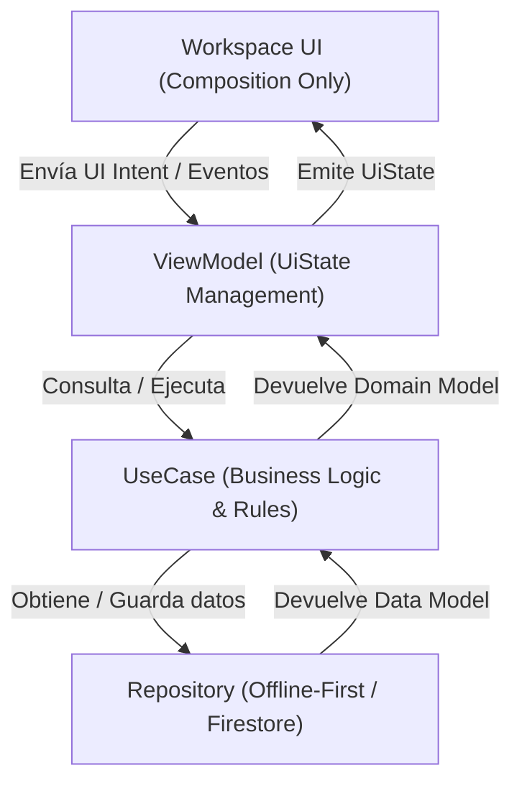
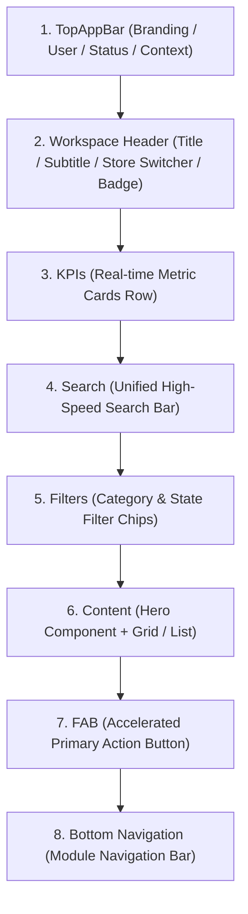

# ADR-009: Workspace Architecture Standard (WAS) v1.0 — Estándar de Arquitectura y Estructura de Workspaces

**Estado:** `OFICIAL (DE CUMPLIMIENTO OBLIGATORIO)`  
**Versión:** `1.0.0`  
**Fecha:** `7 de Agosto de 2026`  
**Autores:** Equipo de Arquitectura, UI/UX y Dirección Tecnológica BlueSystem Enterprise  
**Relación:** Expande a [ADR-005 (BSDS v1.0)](file:///c:/Users/geral/OneDrive/Escritorio/TECNOCOMP%202026/Sistemas/BlueSystem_delivery/ADR-005-BLUESYSTEM-DESIGN-SYSTEM.md), [ADR-006 (BDL v2.0)](file:///c:/Users/geral/OneDrive/Escritorio/TECNOCOMP%202026/Sistemas/BlueSystem_delivery/ADR-006-BLUESYSTEM-DESIGN-LANGUAGE.md) y [ADR-007 (BEL v3.0)](file:///c:/Users/geral/OneDrive/Escritorio/TECNOCOMP%202026/Sistemas/BlueSystem_delivery/ADR-007-BLUESYSTEM-EXPERIENCE-LANGUAGE.md)  
**Compatibilidad:** `Android (Material Design 3 / Jetpack Compose)` · `Web React (TailwindCSS)` · `Flutter (futuro)`  
**Afecta a:** Todos los Workspaces del ecosistema BlueSystem (Cliente, Comercio, Repartidor, Administrador, Analytics, Configuración)

---

## 1. Contexto y Propósito (WAS v1.0)

A medida que **BlueSystem Enterprise v2.1** escala en complejidad y cantidad de módulos funcionales, se vuelve crítico estandarizar no solo la apariencia visual (BSDS - ADR-005), la semántica (BDL - ADR-006) y la experiencia multisensorial (BEL - ADR-007), sino **la estructura interna, el flujo de datos y la arquitectura composicional de cada pantalla principal (Workspace)**.

El **Workspace Architecture Standard (WAS v1.0)** establece las reglas definitivas para el diseño, separación de responsabilidades, jerarquía visual y rendimiento de los Workspaces operacionales y administrativos en la plataforma.

---

## 2. Los 5 Principios Fundamentales del WAS v1.0

### 🟢 Principio 1: Un Workspace = Una Capacidad de Negocio
> *"Single Responsibility per Workspace"*

1. **Definición de Dominio Exclusivo:** Cada Workspace representa exactamente una capacidad o dominio funcional de negocio (ej. Operaciones, Pedidos, Productos, Finanzas, Marketing, Configuración).
2. **Prohibición de Duplicidad:** **Nunca existirá más de un Workspace para la misma función o capacidad de negocio.**
3. **Flujos Unificados:** Se prohíbe fragmentar una misma función operativa en múltiples pantallas dispares o crear Workspaces paralelos con solapamiento funcional. Todo flujo derivado debe vivir como una sub-vista modal o estado dentro del mismo Workspace principal.

---

### 🟢 Principio 2: Un Workspace NO Contiene Lógica
> *"Composition-Only Workspace Architecture"*

1. **Composición Pura:** El Workspace es strictly una capa de **composición declarativa y renderizado visual**. Su única responsabilidad es organizar visualmente los componentes según el Layout Standard.
2. **Prohibición de Lógica en UI:** Queda estrictamente prohibido incluir en las vistas del Workspace:
   * Consultas directas a Firestore o APIs de backend.
   * Reglas de cálculo financiero, impuestos o comisiones.
   * Mutaciones directas de estado de BD o transformaciones de modelos de datos complejos.
   * Filtrados masivos pesados sobre colecciones en el navegador/dispositivo.
3. **Distribución Canónica de Capas (Clean Architecture):**
   * **`ViewModel`**: Administra el `UiState` y el manejo de intenciones de usuario (`UiIntent` / MVI). Es la única fuente de verdad para la vista.
   * **`UseCase`**: Encapsula las reglas puras de negocio, validaciones y lógica de dominio aislada.
   * **`Repository`**: Abstrae las fuentes de datos (Firestore, LocalStorage offline-first, caché en memoria) y orquesta la sincronización atómica.

---

### 🟢 Principio 3: Estructura Canónica y Jerarquía Visual
> *"Standard Layout Stack"*

Todo Workspace en BlueSystem Enterprise debe implementar exactamente la misma secuencia compositiva vertical, de arriba a abajo:

#### Descripción Detallada del Stack:
1. **`TopAppBar`**: Encabezado global de la aplicación. Muestra navegación de alto nivel, estado de conexión (Online/Offline), indicador de sucursal activa y perfil de usuario.
2. **`Workspace Header`**: Título claro del Workspace, subtítulo descriptivo del estado actual y badges semánticos (BDL).
3. **`KPIs`**: Fila horizontal de 2 a 4 tarjetas de indicadores clave de rendimiento (KPI Cards) con actualización en vivo.
4. **`Search`**: Barra de búsqueda unificada de alta velocidad con autocompletado e historial reciente.
5. **`Filters`**: Tira de chips de filtrado categórico, estados operacionales (ej: Pendiente, En Preparación, Entregado) o rangos de fecha.
6. **`Content`**: Contenedor dinámico principal que inicia de forma obligatoria con el **Hero Component** del módulo, seguido del grid o lista de datos.
7. **`FAB (Floating Action Button)`**: Botón flotante acelerador en la esquina inferior derecha para desencadenar la acción primaria del Workspace.
8. **`Bottom Navigation`**: Barra de navegación inferior para alternar entre los Workspaces principales de la aplicación.

---

### 🟢 Principio 4: Estándar Acelerado de 2-Toques
> *"Max 2-Tap Action Rule"*

1. **Regla de Eficiencia Operativa:** Toda acción frecuente o relevante dentro de un Workspace DEBE ser ejecutable en un **máximo de 2 toques** por parte del usuario.
   * **Toque 1:** Abrir/Desplegar la acción (ej: presionar el FAB, tocar una tarjeta de pedido o seleccionar un filtro de acción rápida).
   * **Toque 2:** Confirmar / Ejecutar la acción (ej: confirmar cambio de estado a "Listo", pausar producto, aplicar descuento).
2. **Prohibición de Profundidad:** Quedan prohibidos los flujos que requieran navegar a través de múltiples modales anidados, pantallas intermedias o formularios extensos para operaciones del día a día.

#### Tabla de Ejemplo de Cumplimiento (2-Tap Compliance):
| Acción Operativa | Toque 1 | Toque 2 | Resultado |
| :--- | :--- | :--- | :--- |
| **Aceptar Pedido** | Tocar tarjeta de pedido | Presionar "Aceptar" | Estado actualizado a `PREPARING` |
| **Pausar Producto** | Tocar toggle en `Smart Catalog` | Confirmar suspensión | Producto inactivo en tiempo real |
| **Nuevo Abono de Crédito** | Presionar FAB `+` | Ingresar monto y presionar "Registrar" | Abono e impacto en saldo atómico |
| **Cambiar Sucursal** | Tocar Selector en `Workspace Header` | Seleccionar sucursal | Vista y datos recalculados |

---

### 🟢 Principio 5: Hero Component Obligatorio por Workspace
> *"Signature Feature Component"*

Cada capacidad de negocio debe estar liderada dentro del área de `Content` por un **Hero Component** distintivo, optimizado para resumir y controlar el núcleo del dominio:

| Workspace / Módulo | Hero Component Oficial | Función Principal |
| :--- | :--- | :--- |
| 📊 **Dashboard / Operaciones** | **`Hero Dashboard`** | Visión holística 360° en tiempo real del estado del comercio, alertas activas y sugerencias de Blue AI. |
| 📦 **Pedidos / Envíos** | **`Smart Queue`** | Cola inteligente de pedidos con ordenamiento por SLA, gestión de estados en un toque y tiempos de preparación. |
| 🏷️ **Productos / Inventario** | **`Smart Catalog`** | Gestor visual acelerado de productos con actualización instantánea de stock, modificadores y precios. |
| 📣 **Marketing / Promociones** | **`Campaign Builder`** | Diseñador y monitor dinámico de campañas, cupones de descuento y promociones activas. |
| 💰 **Finanzas / Contabilidad** | **`Finance Radar`** | Radar de flujo de caja, balance diario, comisiones acumuladas y liquidaciones pendientes. |
| 👥 **Clientes / Fidelización** | **`Customer 360`** | Vista centralizada de la base de clientes, historial de consumo, segmento VIP y puntos de lealtad. |

---

## 3. Checklist de Gobernanza y Verificación WAS v1.0

Antes de aprobar cualquier Pull Request o cambio en el código fuente de un Workspace (ej. en `presentation/business/...`), el auditor/desarrollador debe verificar:

- [ ] **Cumplimiento de Dominio:** ¿El Workspace atiende exactamente una capacidad de negocio sin duplicar otro Workspace existiendo en la app?
- [ ] **Aislamiento de Lógica:** ¿La vista Jetpack Compose / React está libre de lógica de negocio, consultas directas a Firestore o cálculos complejos? ¿Todo pasa por `ViewModel` / `UseCase` / `Repository`?
- [ ] **Secuencia de Layout Stack:** ¿Cumple estrictamente el orden: `TopAppBar` ➔ `Workspace Header` ➔ `KPIs` ➔ `Search` ➔ `Filters` ➔ `Content (Hero Component)` ➔ `FAB` ➔ `Bottom Navigation`?
- [ ] **Regla de 2-Toques:** ¿La acción principal del módulo y las operaciones frecuentes se completan en 2 toques o menos?
- [ ] **Hero Component Presente:** ¿El Workspace incluye su Hero Component correspondiente (`Hero Dashboard`, `Smart Queue`, `Smart Catalog`, `Campaign Builder`, etc.)?

---

## 4. Estado de Cumplimiento e Integración

El estándar **ADR-009 (WAS v1.0)** entra en vigor de forma **inmediata y obligatoria** para todos los desarrollos, refactorizaciones y auditorías en el ecosistema BlueSystem Enterprise.
