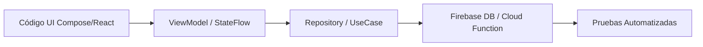
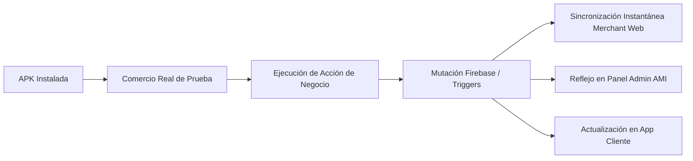

# ADR-010: Estándar de Cierre de Integración y Certificación E2E (Sprint 18.1)

**Estado:** Aprobado  
**Fecha:** 2026-08-07  
**Autor:** Senior Developer & Auditor de BlueSystem  
**Módulo:** Ecosistema Global (App Móvil, Merchant Web, Panel AMI, Firebase Cloud Functions)  

---

## 1. Contexto y Problema

Durante el desarrollo de grandes módulos (como Comercio, Clientes, Motorizado y Administrador), es común que existan vistas de UI completas, estructuras ViewModel bien diseñadas o incluso tests unitarios aislados, pero sin que la acción de negocio completa se comunique efectivamente con Firestore, ejecute la Cloud Function adecuada ni se sincronice en tiempo real con las demás aplicaciones del ecosistema.

Para evitar falsos positivos de completitud, este ADR formaliza la **Regla Definitiva de Certificación de Integración**.

---

## 2. Decisión Arquitectónica

### 2.1 Regla de Gobernanza de Completitud Funcional
> **Ninguna funcionalidad podrá marcarse como "Implemented" únicamente por existir código, UI, ViewModel o tests.**  
> Debe existir evidencia objetiva y verificable de la traza completa:  
> `UI → lógica → persistencia → sincronización → resultado visible`.

---

### 2.2 Protocolo de Validación en Dos Niveles

Todo componente o acción debe superar rigurosamente dos niveles de verificación:

#### Nivel A — Técnico

#### Nivel B — Usuario Real (Ecosistema Tripartito)

---

### 2.3 Taxonomía Oficial de Estatus de Certificación

1. 🟢 **CERTIFIED (100% Integrado):**  
   Funciona de punta a punta. Supera el Nivel A y Nivel B. Genera impacto real en Firestore, dispara Cloud Functions cuando corresponde y se sincroniza en tiempo real en los 3 o 4 puntos de contacto.

2. 🟡 **PARTIAL (Parcialmente Integrado):**  
   Funciona la persistencia o lectura en Firestore, pero falta una función específica (ejemplo: reordenamiento persistente, exportación de reportes o timbre en segundo plano).

3. 🔴 **MOCK (Simulado / Placeholder):**  
   La interfaz gráfica existe, pero no posee integración real con Firestore ni servicios backend; opera sobre datos estáticos en duro (`mockData`).

---

## 3. Consecuencias y Reglas de Aplicación

1. Se prohíbe dar por finalizado cualquier Sprint o Hito si existen componentes categorizados como 🔴 **MOCK** en flujos críticos.
2. Todas las fichas de botones deben explicitar su estado 🟢, 🟡 o 🔴 y documentar su traza de ejecución exacta.
3. La certificación debe ser re-validada mediante pruebas de regresión ante cualquier refactorización del core de red o servicios en `db.ts` / Repositorios.

---
*Aprobado y registrado en la gobernanza de arquitectura de BlueSystem Enterprise v2.1.*
