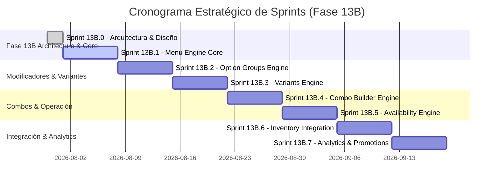

# ARCHITECTURE EXECUTIVE SUMMARY: RESTAURANT MENU ENGINE (Sprint 13B.0)

## 📌 Document Overview
- **Project**: BlueSystem Delivery Enterprise Edition (v2.1)
- **Document Type**: Executive Architectural Summary & Strategic Roadmap
- **Target Audience**: Chief Technology Officer (CTO), Lead Engineering Teams, Product Managers

---

## 1. Visión Ejecutiva del Proyecto
El **Restaurant Menu Engine (Phase 13B)** representa la evolución de la infraestructura de catálogo comercial de **BlueSystem Delivery**, transitando de un modelo plano centrado exclusivamente en productos individuales hacia un motor relacional denormalizado de alta elasticidad.

Esta nueva arquitectura aborda las crecientes exigencias comerciales de cadenas de restaurantes, franquicias y comercios multi-sucursal que requieren estructuras multinivel (variantes de tamaño, modificadores opcionales y obligatorios, combos dinámicos y control atómico de stock por ingrediente).

---

## 2. Los 4 Pilares Transformacionales

```
+-------------------------------------------------------------------------------+
|                        RESTAURANT MENU ENGINE CORE                           |
+-------------------+-------------------+-------------------+-------------------+
| 1. MOTOR DE       | 2. GRUPOS DE      | 3. MOTOR DE       | 4. DISPONIBILIDAD |
|    VARIANTES      |    MODIFICADORES  |    COMBOS         |    ATÓMICA        |
|                   |                   |                   |                   |
| Soporte para      | Opciones min/max, | Menús ejecutivos  | Pausado global de |
| tamaños y SKU     | selecciones       | con recargos o    | un ingrediente    |
| con precio delta  | obligatorias y    | precio fijo de    | propogado a todo |
| u override.       | extras cobrables. | paquete.          | el catálogo.      |
+-------------------+-------------------+-------------------+-------------------+
```

---

## 3. Resumen de Desafíos y Decisiones Clave

1. **Eficiencia Financiera en Firestore**:
   - *Desafío*: Consultar un menú completo altamente jerárquico mediante múltiples llamadas relacionales incrementaría los costos operativos de lectura en un 1,800%.
   - *Decisión*: Implementación de una arquitectura de síntesis denormalizada en `/menus/{restaurantId}` que consolida el árbol activo en un **único documento**, reduciendo los costos de lectura a latencia y precio constantes.

2. **Garantía Zero-Downtime y Cero Regresiones**:
   - *Desafío*: Migrar productos activos en producción sin interrumpir los pedidos de miles de usuarios en tiempo real.
   - *Decisión*: Estrategia de migración progresiva en 4 fases respaldada por la **Capa de Adaptación DTO (Adapter Pattern)**, asegurando retrocompatibilidad al 100% con las pantallas legacy.

3. **Inmutabilidad del Carrito de Compras**:
   - *Desafío*: Evitar que cambios concurrentes de precio o stock por el comercio alteren los totales de carritos abiertos por los usuarios.
   - *Decisión*: Estructura `CartItem` con captura inmutable de mapa de precios en el momento de agregar al carrito, validada posteriormente en el servidor antes del checkout.

---

## 4. Roadmap de Implementación (Fase 13B)



---

## 5. Criterios de Aprobación de la Junta Técnica
Para declarar aprobada la arquitectura y autorizar la ejecución del **Sprint 13B.1**, se requiere la validación formal de los entregables adjuntos:
- [x] **Modelo Conceptual de Datos** (Entidades `Product`, `ProductVariant`, `OptionGroup`, `Combo`, `Inventory`).
- [x] **Estrategia de Migración de 4 Fases** (Coexistencia Dual y Layer Adapter).
- [x] **Matriz de Decisiones de Arquitectura (ADRs)** con comparativa detallada de costo y rendimiento.
- [x] **Checklist de Verificación de Auditoría**.
