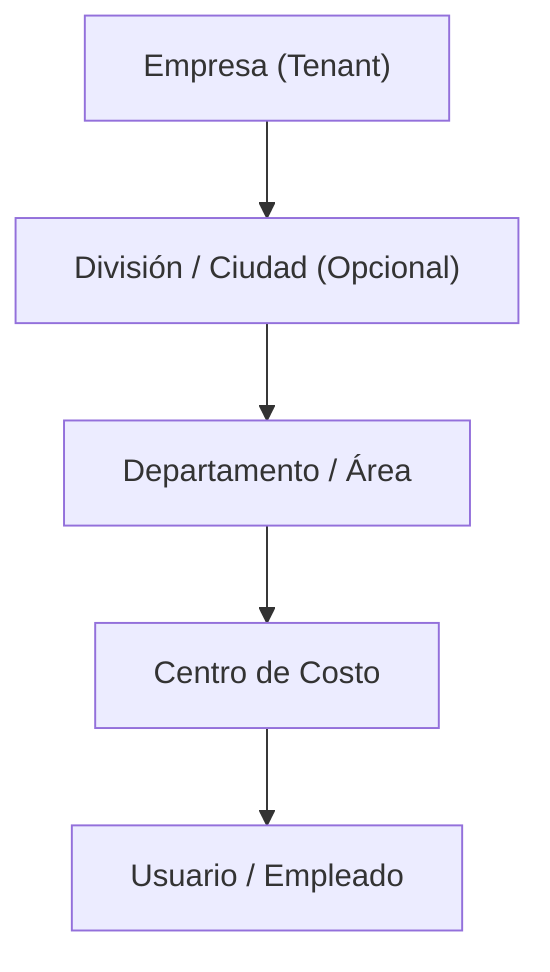
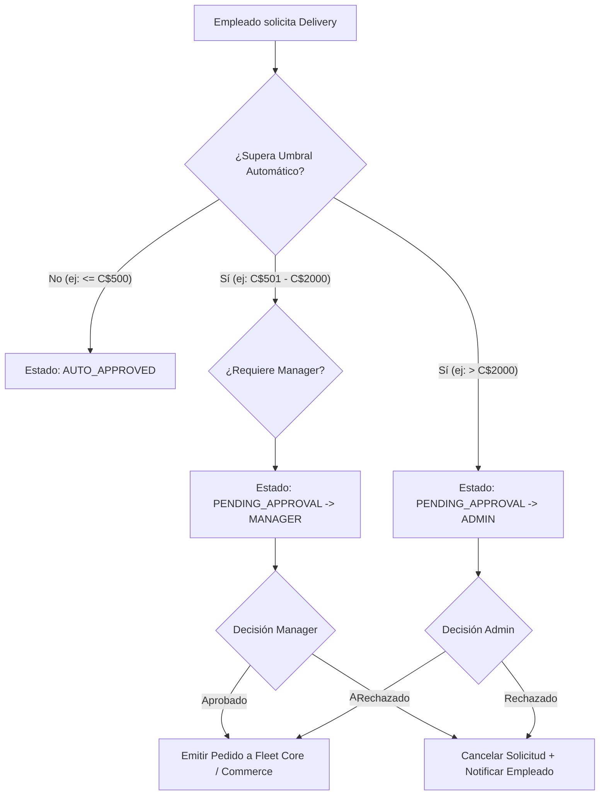

# BSD-ACT-021 — ENTERPRISE BUSINESS PLATFORM SPECIFICATION
**BlueSystem Delivery v2.2 Enterprise — Módulo B2B / Clientes Corporativos**  
*Documento Canónico de Especificación y Diseño Arquitectónico*

---

## 📋 1. Metadatos de la Actividad

| Campo | Valor Canónico |
| :--- | :--- |
| **Identificador:** | `BSD-ACT-021` |
| **Nombre:** | Enterprise Business Platform (B2B Layer) |
| **Estado:** | 🟢 **ESPECIFICADA** / 🟡 **PENDIENTE DE IMPLEMENTACIÓN (ROADMAP)** |
| **Modo Operativo:** | `AUDIT-FIRST → SPECIFICATION → HUMAN GATE → IMPLEMENTATION` |
| **Mutación de Código:** | `0` (Zero Code Drift en esta fase) |
| **Deployment:** | `0` (Bloqueado por NO AUTO-ROLLOUT POLICY - ADR-014) |
| **Clasificación:** | Architectural Specification & Data Contract |

---

## 🎯 2. Visión y Objetivo Estratégico

Transformar BlueSystem Delivery en una plataforma de entrega omnicanal capaz de atender **clientes corporativos e institucionales (B2B)** además del modelo tradicional de consumidor final (B2C), sin bifurcar la base de código ni crear sistemas paralelos.

### Casos de Uso Objetivo:
- **Corporaciones y Oficinas:** Solicitudes de correspondencia, suministros, catering y servicios entre sedes.
- **Universidades e Institutos:** Logística inter-campus y envíos departamentales.
- **Hospitales y Clínicas:** Envíos de documentos, suministros médicos y paquetería interna controlada.
- **Cadenas y Franquicias:** Control de gastos de delivery y logística interna multi-sucursal.
- **Organizaciones con Control Presupuestario:** Empresas que exigen aprobación multinivel, centros de costo y facturación consolidada.

---

## 🏛️ 3. Principios Arquitectónicos Inmutables

1. **ONE CORE, ONE BACKEND, ONE FIRESTORE SSOT:**
   - 🚫 **PROHIBIDO CREAR:** `/ordersEnterprise`, `/ordersCorporate`, `/deliveryTripsEnterprise`, `/couriersEnterprise`.
   - ✅ **CANÓNICO:** Se utilizan exclusivamente `/orders/{orderId}` (Commerce) y `/deliveryTrips/{tripId}` (X→Y).
   - Los pedidos empresariales incorporan metadatos aditivos sin romper contratos vigentes.
2. **FLEET CORE COMPARTIDO:** La red de motorizados y algoritmos de asignación operan idénticamente para B2C y B2B.
3. **AISLAMIENTO MULTI-TENANT ESTRICTO (EIAM v2.2):** Los datos corporativos residen segregados por `tenantId`, `enterpriseId`, `departmentId` y `costCenterId`.
4. **POLÍTICA ZERO TRUST & SERVER-SIDE AUTHORITY:** Ninguna validación presupuestaria, cálculo de balance o aprobación se confía al cliente; todo se evalúa en Cloud Functions transaccionales.
5. **TRAZABILIDAD Y AUDITORÍA ATÓMICA:** Toda mutación o aprobación emite un evento inmutable a `/audit_events`.

---

## 🏢 4. Modelo de Tenant y Clasificación

Se amplía conceptualmente el modelo de tenants en Firestore:

```typescript
export type TenantType = 'PLATFORM' | 'MERCHANT' | 'ENTERPRISE';

export interface EnterpriseTenantProfile {
  tenantId: string;
  tenantType: TenantType; // 'ENTERPRISE'
  name: string;
  legalName: string;
  taxId?: string; // RUC / NIT
  status: 'ACTIVE' | 'SUSPENDED' | 'PENDING_APPROVAL';
  plan: 'ENTERPRISE_STARTER' | 'ENTERPRISE_PRO' | 'ENTERPRISE_CUSTOM';
  settings: {
    allowSelfRegistration: boolean;
    requireDepartment: boolean;
    requireCostCenter: boolean;
    requireBusinessPurpose: boolean;
    requireInternalReference: boolean;
    allowOverBudgetRequests: boolean; // Si true, pasa a aprobación especial
  };
  billing: {
    model: 'PREPAID' | 'CREDIT_LINE' | 'MONTHLY_INVOICE';
    creditLimit: number;
    currentBalance: number;
    availableCredit: number;
    billingPeriod: 'MONTHLY' | 'BIWEEKLY';
    financialStatus: 'AVAILABLE' | 'LOW_BALANCE' | 'LIMIT_REACHED' | 'SUSPENDED';
    currency: 'NIO' | 'USD';
  };
  createdAt: FirebaseFirestore.Timestamp;
  updatedAt: FirebaseFirestore.Timestamp;
}
```

---

## 👥 5. Roles y Matriz de Permisos EIAM

```
Empresa (ENTERPRISE_OWNER)
│
├── Administración General (ENTERPRISE_ADMIN)
│     ├── Finanzas y Facturación (ENTERPRISE_FINANCE)
│     └── Gestión de Flotas / Despacho (ENTERPRISE_DISPATCHER)
│
├── Gerencias de Área / Sucursal (ENTERPRISE_MANAGER / ENTERPRISE_APPROVER)
│
├── Empleados Solicitantes (ENTERPRISE_REQUESTER)
│
└── Auditores / Observadores (ENTERPRISE_VIEWER)
```

| Rol EIAM | Alcance Operativo | Capacidades Clave |
| :--- | :--- | :--- |
| `ENTERPRISE_OWNER` | Organización completa | Gobernanza global de la cuenta, contratos y nombramiento de admins |
| `ENTERPRISE_ADMIN` | Configuración & EIAM | Gestión de usuarios, departamentos, presupuestos y políticas |
| `ENTERPRISE_MANAGER` | División / Sucursal | Aprobación de solicitudes de su departamento hasta umbral medio |
| `ENTERPRISE_APPROVER` | Aprobación financiera | Aprobación de órdenes de alto valor que excedan límites |
| `ENTERPRISE_FINANCE` | Facturación & Crédito | Visualización de saldos, recargas, estados de cuenta y facturas |
| `ENTERPRISE_DISPATCHER`| Operaciones y Logística | Solicitud y monitoreo masivo de envíos para la empresa |
| `ENTERPRISE_REQUESTER` | Solicitudes personales | Creación de pedidos B2B con cargo a su centro de costo asignado |
| `ENTERPRISE_VIEWER` | Solo Lectura | Reportes, auditoría y trazabilidad sin capacidad de mutación |

---

## 🏬 6. Estructura Jerárquica y Centros de Costo

La jerarquía es **flexible y desacoplada** para adaptarse desde PyMEs hasta corporaciones multinacionales:



### Contrato de Centro de Costo:
```typescript
export interface EnterpriseCostCenter {
  costCenterId: string;
  enterpriseId: string;
  departmentId: string;
  name: string;
  code: string; // ej: "CC-MKT-001"
  status: 'ACTIVE' | 'INACTIVE';
  monthlyBudget: number;
  currentConsumption: number;
  availableBudget: number;
  currency: 'NIO' | 'USD';
  approverUserIds: string[];
  createdAt: FirebaseFirestore.Timestamp;
  updatedAt: FirebaseFirestore.Timestamp;
}
```

---

## 🔐 7. Motor de Aprobaciones (Approval Engine)

Flujo de evaluación server-side en el momento de creación del pedido:



### Reglas de Configuración de Aprobación por Tenant:
- `thresholdAuto`: Umbral con auto-aprobación (ej: `500.00`).
- `thresholdManager`: Umbral que requiere aprobación de Gerente de Área (ej: `2000.00`).
- `thresholdAdmin`: Montos mayores que requieren aprobación de Admin/Owner.

---

## 📦 8. Contrato Aditivo de Pedidos Corporativos

En las colecciones canónicas `/orders/{orderId}` y `/deliveryTrips/{tripId}`, se agregan los siguientes campos aditivos:

```typescript
export interface EnterpriseOrderMetadata {
  isEnterpriseOrder: boolean;
  enterpriseId: string;
  enterpriseName: string;
  requestedByUserId: string;
  requestedByUserName: string;
  departmentId?: string;
  departmentName?: string;
  costCenterId?: string;
  costCenterName?: string;
  costCenterCode?: string;
  
  // Flujo de Aprobación
  approvalStatus: 'NOT_REQUIRED' | 'PENDING_APPROVAL' | 'APPROVED' | 'REJECTED';
  approvedByUserId?: string;
  approvedByUserName?: string;
  approvedAt?: FirebaseFirestore.Timestamp;
  rejectionReason?: string;
  
  // Trazabilidad Interna
  businessPurpose?: string;
  internalReference?: string; // ej: "REQ-2026-00451"
  purchaseOrderNumber?: string;
  chargeTo: 'ENTERPRISE_CREDIT' | 'COST_CENTER' | 'EMPLOYEE_REIMBURSEMENT';
}
```

> [!IMPORTANT]
> **Compatibilidad Garantizada:** Los campos canónicos `customerId`, `businessId`, `branchId`, `assignedCourierId`, `status` y `serviceType` se mantienen intactos. Las apps de Comercio y Motorizado solo reciben los datos operacionales relevantes sin exponer presupuestos o saldos corporativos.

---

## 🖥️ 9. Superficie Visual: Enterprise Portal

El portal corporativo constituye una superficie desacoplada de Admin Web y Merchant Web:

```
ENTERPRISE PORTAL
├── 📊 Dashboard Ejecutivo (KPIs de gasto, envíos, consumo vs presupuesto)
├── 📝 Solicitudes y Envíos en Curso (Monitoreo en tiempo real)
├── 🛂 Bandeja de Aprobaciones Pendientes (Acciones: Aprobar, Rechazar, Observar)
├── 🏢 Estructura Corporativa (Departamentos, Sucursales y Centros de Costo)
├── 👥 Usuarios y Membresías (Invitación, asignación de roles y centros de costo)
├── 💰 Presupuestos y Límites (Asignación mensual y alertas de consumo)
├── 💳 Finanzas y Facturación (Línea de crédito, consumo consolidado y facturas)
├── 📈 Reportes e Inteligencia (Exportación contable, SLA, auditoría de envíos)
└── ⚙️ Configuración y Políticas de Aprobación
```

---

## 🔒 10. Seguridad y Auditoría

1. **Firestore Rules:**
   - Validación estricta `request.auth.token.enterpriseId == resource.data.enterpriseId`.
   - Protección contra manipulación de `costCenterId` y `approvalStatus` desde cliente.
2. **Cloud Functions Idempotentes:**
   - `enterpriseCreateOrderRequest`: Crea solicitud con bloqueo preventivo de presupuesto.
   - `enterpriseApproveOrder`: Modifica estado atómicamente y libera el pedido hacia el comercio o Fleet Core.
   - `enterpriseRejectOrder`: Revierte la reserva de presupuesto y cancela la orden.
3. **Eventos de Auditoría Canónicos (`/audit_events`):**
   - `ENTERPRISE_CREATED`, `USER_INVITED`, `ORDER_REQUESTED`, `ORDER_APPROVED`, `ORDER_REJECTED`, `BUDGET_EXCEEDED`, `CREDIT_UPDATED`.

---

## 🚩 11. Feature Flags de Control

- `enterprise_business_enabled`: Master switch para activación de capacidades B2B.
- `enterprise_approvals_enabled`: Control de flujo de aprobaciones.
- `enterprise_budget_enabled`: Control del motor de presupuestos.
- `enterprise_billing_enabled`: Facturación periódica y líneas de crédito.
- `enterprise_reports_enabled`: Acceso a reportes ejecutivos.

---

## 🚦 12. Veredicto y Estado en Roadmap

- **Estado Actual:** 🟢 **ESPECIFICADA / 🟡 PENDIENTE DE IMPLEMENTACIÓN (ROADMAP)**.
- **Mutaciones:** 0 en código de producción.
- **Siguiente Paso Operativo:** Apertura formal de Human Gate cuando el calendario del proyecto autorice la ejecución de la Fase 21.0 (Discovery & EIAM Contracts).
