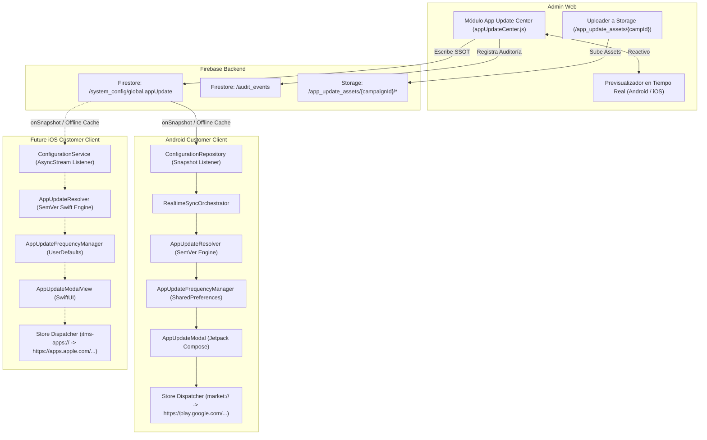

# BSD-APP-UPDATE-CENTER-ARCHITECTURE-001
## BlueSystem Delivery Enterprise — App Update Center Architecture Specification
**Versión:** `1.0.0 Enterprise`  
**Estado:** 🟢 `FULLY CERTIFIED / SECURITY VERIFIED / FROZEN CORE / READY FOR CONTROLLED DEPLOYMENT`  
**Fecha:** `20 de Septiembre de 2026`  
**Auditor:** Senior Developer & Auditor de BlueSystem Enterprise  
**Alcance:** Multi-Platform (Android Customer, Future iOS Customer, Admin Web, Firestore SSOT, Storage)

---

## 1. Resumen Ejecutivo y Filosofía Arquitectónica

El subsistema **App Update Center** provee una infraestructura centralizada y remota de gobernanza sobre las versiones distribuidas de las aplicaciones clientes de BlueSystem Delivery Enterprise. 

Bajo los principios de **One Core**, **One Source of Truth (SSOT)**, **Zero Forks** y **Frozen Core**:
1. Toda la configuración se administra exclusivamente desde **Admin Web** (`appUpdateCenter.js`).
2. El documento autoritativo reside en Firestore bajo `/system_config/global` (objeto `appUpdate`), sincronizando de forma transparente los campos heredados `minimumVersion` y `forceUpdate` para garantizar cero regresión en módulos legacy.
3. La aplicación Android evalúa el estado de versión mediante el motor puro `AppUpdateResolver` y despliega la UI moderna `AppUpdateModal` (Jetpack Compose).
4. El contrato de datos es estrictamente multiplataforma y desacoplado, diseñado para que la futura aplicación de **Customer iOS** (Swift / SwiftUI) consuma exactamente el mismo documento `/system_config/global.appUpdate` sin requerir modificaciones en el backend.

---

## 2. Diagrama de Arquitectura End-to-End



---

## 3. Contrato Canónico de Datos (SSOT: `/system_config/global`)

El objeto canónico reside en el campo `appUpdate`:

```typescript
interface AppUpdateConfig {
  enabled: boolean;                      // true: activo, false: desactivado
  updateType: 'INFO' | 'RECOMMENDED' | 'FORCED';
  latestVersion: string;                 // SemVer: "1.26.0"
  minimumVersion: string;                // SemVer: "1.25.0"
  targetPlatforms: ('ANDROID' | 'IOS' | 'ALL')[];
  title: string;                         // "Actualiza BlueSystem Delivery"
  subtitle: string;                      // "Tenemos una nueva versión para ti"
  message: string;                       // Texto explicativo multilínea
  imageUrl?: string | null;              // Asset principal en Storage
  iconUrl?: string | null;               // Icono decorativo en Storage
  showLogo: boolean;                     // Header con branding
  primaryButtonText: string;             // "Actualizar ahora"
  secondaryButtonText: string;           // "Más tarde"
  allowDismiss: boolean;                 // false para actualizaciones obligatorias
  forceUpdate: boolean;                  // Flag explícito de actualización forzada
  playStoreUrl: string;                  // URL / market URI para Google Play
  appStoreUrl: string;                   // URL para Apple App Store
  backgroundColor?: string;              // Hex color: "#0F172A"
  primaryButtonColor?: string;           // Hex color: "#2563EB"
  textColor?: string;                    // Hex color: "#FFFFFF"
  startAt?: string | null;               // ISO 8601 ventana de inicio
  endAt?: string | null;                 // ISO 8601 ventana de fin
  displayFrequency: 'ONCE' | 'EACH_SESSION' | 'COOLDOWN';
  cooldownHours: number;                 // Horas de cooldown si es COOLDOWN
  campaignId: string;                    // ID inmutable de auditoría y caché
  updatedAt: any;                        // serverTimestamp()
  updatedBy: string;                     // Email o UID del administrador
  schemaVersion: number;                 // 1
}
```

### Retrocompatibilidad con Campos Raíz Legacy
Para asegurar que ningún módulo previamente certificado sufra regresión:
- `/system_config/global.minimumVersion`: Mantiene el entero legacy calculado a partir del `minimumVersion` SemVer (ej. `1.25.0` $\rightarrow 12500$).
- `/system_config/global.forceUpdate`: Refleja sincrónicamente `updateType === 'FORCED'`.

---

## 4. Matriz de Decisiones y Motor de Resolución (`AppUpdateResolver`)

La función `AppUpdateResolver.resolve(installedVersion, config, currentPlatform, currentTimeMillis)` opera bajo las siguientes reglas formales de decisión:

| Caso | Condición | Estado Resuelto | Comportamiento en Cliente |
| :--- | :--- | :--- | :--- |
| **Caso A** | `config == null` o `enabled == false` | `NoUpdate` | No mostrar modal |
| **Caso B** | $V_{installed} \ge V_{latest}$ | `NoUpdate` | Aplicación actualizada; no mostrar |
| **Caso C** | $V_{installed} < V_{latest}$ y `updateType == "RECOMMENDED"` | `ShowUpdate (isForced = false)` | Mostrar modal con botón "Más tarde" |
| **Caso D** | $V_{installed} < V_{min}$ o `forceUpdate == true` o `updateType == "FORCED"` | `ShowUpdate (isForced = true)` | Mostrar modal obligatorio, bloqueo sin "Más tarde" |
| **Caso E** | Plataforma actual no incluida en `targetPlatforms` | `NoUpdate` | Actualización ignorada para esta plataforma |
| **Caso F** | `currentTimeMillis` fuera del rango `[startAt, endAt]` | `NoUpdate` | Fuera de vigencia de campaña; no mostrar |
| **Caso G** | $V_{installed} < V_{latest}$ y `updateType == "INFO"` | `ShowUpdate (isForced = false)` | Mostrar modal informativo con botón de descarte |

### Motor de Comparación SemVer
Queda prohibida la comparación textual simple. El resolver implementa comparación numérica por componentes:
- `1.9.0` vs `1.10.0`: $1==1$, $9 < 10 \rightarrow$ `1.9.0 < 1.10.0` (Evaluado correctamente).
- `1.9.9` vs `1.10.0`: $1==1$, $9 < 10 \rightarrow$ `1.9.9 < 1.10.0`.
- Prefijos `v` o `V` y sufijos `-beta.1` son sanitizados antes de la evaluación.

---

## 5. Control de Frecuencia y Resiliencia Offline

El cliente móvil utiliza `AppUpdateFrequencyManager`:
- **`ONCE`:** Persistido en `SharedPreferences` (`dismissed_campaign_{id}`). Si ya fue cerrado, no vuelve a mostrarse.
- **`EACH_SESSION`:** Mantenido en set concurrente en memoria (`sessionDismissedCampaigns`). Se muestra máximo una vez por sesión de ejecución.
- **`COOLDOWN`:** Compara `now - lastDismissedTimestamp >= cooldownHours * 3600 * 1000`.
- **Bypass Mandatorio:** Si `isForced == true`, el cooldown y las restricciones de frecuencia se ignoran incondicionalmente para evitar que un usuario opere una versión desactualizada o insegura.

### Modo Offline
- Si no hay conexión de red, Firestore SDK utiliza el snapshot cacheado localmente (`CACHE_SIZE_UNLIMITED`).
- Si nunca se ha descargado configuración y la app está offline, el sistema falla cerrado a `NoUpdate` (nunca bloquea erróneamente al usuario por falta de red).
- Una actualización obligatoria sólo se ejecuta si existe configuración válida en caché o descargada remotamente.

---

## 6. Seguridad & Reglas de Acceso

### Firestore (`firestore.rules`)
```javascript
match /system_config/{configId} {
  // Lectura pública autorizada para chequeo de versión y estado operativo antes del login / invitados
  allow read: if true;
  // Modificación de parámetros y tarifas restringida estrictamente a SUPER_ADMIN o ADMIN
  allow write: if isAuthenticated() && (
    isSuperAdmin() ||
    getRole() in ["SUPER_ADMIN", "ADMIN", "super_admin", "admin"] ||
    request.auth.token.get("admin", false) == true ||
    request.auth.token.get("isSuperAdmin", false) == true
  );
}
```

### Storage (`storage.rules`)
```javascript
match /app_update_assets/{allPaths=**} {
  allow read: if true;
  allow create, update: if isPlatformAdmin()
                        && request.resource.size <= 2 * 1024 * 1024
                        && request.resource.contentType.matches('image/(jpeg|jpg|png|webp|svg\\+xml)');
  allow delete: if isPlatformAdmin();
}
```

---

## 7. Eventos de Auditoría (`/audit_events`)

Cada modificación administrativa en `appUpdateCenter.js` genera un registro auditable:
- `APP_UPDATE_CONFIG_CREATED`
- `APP_UPDATE_CONFIG_UPDATED`
- `APP_UPDATE_CONFIG_ENABLED`
- `APP_UPDATE_CONFIG_DISABLED`
- `APP_UPDATE_FORCE_ENABLED`
- `APP_UPDATE_FORCE_DISABLED`

Payload de auditoría:
```json
{
  "event": "APP_UPDATE_CONFIG_UPDATED",
  "action": "APP_UPDATE_CONFIG_UPDATED",
  "previousValue": { ... },
  "newValue": { ... },
  "platform": "ANDROID,IOS",
  "campaignId": "camp_1_26_0_1750000000",
  "adminUid": "uid_admin",
  "adminEmail": "admin@bluesystemdelivery.com",
  "timestamp": "serverTimestamp"
}
```

---

## 8. Especificación para Futura Implementación iOS (Swift / SwiftUI)

La aplicación Customer iOS consumirá exactamente el mismo contrato. A continuación se presenta la referencia canónica de implementación en Swift:

```swift
import SwiftUI
import FirebaseFirestore

// MARK: - Modelo Canónico iOS
struct AppUpdateConfig: Codable {
    var enabled: Bool = false
    var updateType: String = "RECOMMENDED"
    var latestVersion: String = "1.0.0"
    var minimumVersion: String = "1.0.0"
    var targetPlatforms: [String] = ["ANDROID", "IOS"]
    var title: String = "Actualiza BlueSystem Delivery"
    var subtitle: String? = nil
    var message: String = ""
    var imageUrl: String? = nil
    var iconUrl: String? = nil
    var showLogo: Bool = true
    var primaryButtonText: String = "Actualizar ahora"
    var secondaryButtonText: String = "Más tarde"
    var allowDismiss: Bool = true
    var forceUpdate: Bool = false
    var appStoreUrl: String = ""
    var backgroundColor: String? = nil
    var primaryButtonColor: String? = nil
    var textColor: String? = nil
    var startAt: String? = nil
    var endAt: String? = nil
    var displayFrequency: String = "EACH_SESSION"
    var cooldownHours: Int = 24
    var campaignId: String = ""
}

// MARK: - SemVer Engine en Swift
struct AppUpdateResolverIOS {
    static func compareSemVer(_ v1: String, _ v2: String) -> ComparisonResult {
        let p1 = v1.replacingOccurrences(of: "v", with: "").split(separator: "-").first?.split(separator: ".").compactMap { Int($0) } ?? []
        let p2 = v2.replacingOccurrences(of: "v", with: "").split(separator: "-").first?.split(separator: ".").compactMap { Int($0) } ?? []
        let maxLen = max(p1.count, p2.count)
        for i in 0..<maxLen {
            let n1 = i < p1.count ? p1[i] : 0
            let n2 = i < p2.count ? p2[i] : 0
            if n1 < n2 { return .orderedAscending }
            if n1 > n2 { return .orderedDescending }
        }
        return .orderedSame
    }
}
```

---

## 9. Plan de Rollback Inmediato

Si se detectara cualquier anomalía o bloqueo accidental de versiones:
1. **Desactivación Instantánea (Kill Switch):**
   Desde Admin Web $\rightarrow$ desactivar "Activar Aviso Remoto" (`enabled = false`) y presionar "Guardar".
   En menos de 2 segundos, el listener reactivo de Firestore apagará el modal en todos los clientes conectados.
2. **Reversión de Versión Mínima:**
   Establecer `minimumVersion = 1.0.0` y `updateType = RECOMMENDED`.
3. **Restauración Manual por CLI:**
   ```bash
   # En caso extremo, actualización directa del documento global
   firebase firestore:delete /system_config/global --project bluesystem-delivery
   ```

---

## 10. Certificación y Congelamiento Arquitectónico (Frozen Core)
- **Estatus Oficial:** 🟢 **FULLY CERTIFIED / SECURITY VERIFIED / FROZEN CORE / READY FOR CONTROLLED DEPLOYMENT**
- **Arquitectura:** ✅ Validada y unificada bajo ADR-009 y WAS v1.0.
- **Seguridad:** ✅ Firestore Rules (GATE-001 sanitización + Least Privilege) y Storage Rules (GATE-002 zero-SVG) blindadas.
- **Gobernanza:** ✅ Admin Web funcional con live preview interactivo y sincronización atómica dual (`db.batch()`).
- **Mobile Android:** ✅ Resolver semántico puro y modal Jetpack Compose reactivo (28/28 tests pasando).
- **Future iOS:** ✅ Contrato 100% interoperable documentado.
- **Congelamiento:** 🔒 Los contratos y motores de `AppUpdateResolver`, `ConfigurationRepository` y reglas asociadas quedan formalmente congelados. Modificaciones futuras requerirán apertura de un nuevo ADR formal.
