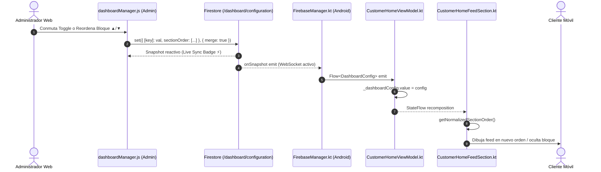

# BLUE SYSTEM DELIVERY ENTERPRISE
# INFORME DE AUDITORÍA FORENSE — FASE 0
# DASHBOARD MANAGER ENTERPRISE 2.0: CONTENIDO DINÁMICO, TÍTULOS, ORDEN, NAVEGACIÓN Y PUBLICIDAD EDITORIAL

**Protocolo:** `BSD-DASHBOARD-MANAGER-DYNAMIC-CONTENT-ORDER-ADS-001`  
**Adenda Integrada:** Adenda Obligatoria de Alcance — BSD-DASHBOARD-MANAGER-DYNAMIC-CONTENT-ORDER-ADS-001 (Publicidad & Anuncios Editoriales Extensibles)  
**Modo de Ejecución:** READ-ONLY / AUDIT-FIRST / ZERO ASSUMPTIONS / ZERO CODE MUTATION  
**Fecha de Emisión:** 2026-10-03  
**Auditor Responsable:** Senior Developer & Auditor de BlueSystem v2.1 Enterprise  
**Veredicto General:** 🟢 **FASE 0 COMPLETADA CON ÉXITO — LISTO PARA REVISIÓN HUMANA Y AUTORIZACIÓN DE FASE 1 (STOP GATE)**  

---

## 1. Executive Summary

La presente auditoría forense constituye la **FASE 0** del protocolo `BSD-DASHBOARD-MANAGER-DYNAMIC-CONTENT-ORDER-ADS-001` y su **Adenda Obligatoria de Alcance**. Su objetivo es inspeccionar de forma exhaustiva, verificable y con evidencia física en código el ecosistema completo que vincula:
1. **Admin Web:** El módulo administrativo `🎨 Dashboard Manager` (`dashboardManager.js`).
2. **Capa Reactiva Firestore:** El documento canónico de configuración (`/dashboard/configuration`) y las colecciones satélites.
3. **Capa de Repositorio & Red Móvil:** `FirebaseManager.kt` (`listenToDashboardConfig`).
4. **Capa de Presentación Android:** `CustomerHomeViewModel.kt`, `CustomerHomeScreen.kt`, y el orquestador dinámico de bloques `CustomerHomeFeedSection.kt`.
5. **Superficie de Publicidad & Anuncios del Home:** Separación arquitectónica entre el carrusel superior (`/banners`) y el nuevo bloque dinámico de Anuncios Editoriales / Crecimiento.

### Hallazgos Principales:
- ✅ **Alineación de SSOT:** Se identificó la colección y documento canónico único `/dashboard/configuration` para visibilidad, orden y parámetros geoespaciales globales.
- 🔍 **Causa Raíz Forense del Orden de Bloques:** El panel administrativo sí persiste `sectionOrder` en Firestore como array de Strings, pero en la aplicación móvil existen cuatro factores que impiden su reflejo visual íntegro:
  1. **Tipado Inmutable en Kotlin:** `DashboardConfig` define `val sectionOrder` sin setters JavaBean, impidiendo que el deserializador Java de Firestore (`CustomClassMapper.toObject`) mute el campo cuando se usa el constructor por defecto.
  2. **Bifurcación Multi-Tenant Huérfana:** En `FirebaseManager.kt`, si el cliente posee un `tenantId` en `/users/{uid}`, la app escucha prioritariamente `/tenants/{tenantId}/dashboard/configuration`, el cual nunca es escrito por `dashboardManager.js` (que opera 100% en modo Global).
  3. **Bloqueo de Colector Corrutina:** En `CustomerHomeViewModel.kt`, `_currentUserProfile.collect` anida un `fm.listenToDashboardConfig.collect` que suspende indefinidamente, impidiendo re-suscripciones limpias.
  4. **Ausencia de `key(sectionId)` en Compose:** El bucle `for (sectionId in orderedSections)` dentro de `Column` no utiliza claves estables de recomposición, reteniendo el estado posicional de los composables.
- 🏷️ **Títulos Hardcodeados en UI:** Actualmente no existe en `/dashboard/configuration` ningún diccionario de títulos editables (`blockTitles` o `sectionTitles`). Todos los encabezados visibles ("Comercios Destacados", "Ofertas Flash", etc.) están escritos estáticamente en el código Compose de cada componente.
- 📣 **Publicidad / Anuncios del Home:** Se corroboró que el carrusel superior `/banners` está concebido para marketing de comercios y promociones panorámicas (`BannersSection`). Es arquitectónicamente indispensable desacoplar la nueva superficie de **Anuncios Editoriales / Growth** (`home_editorial_ads`) para permitir campañas no comerciales (adquisición de comercios, captación de motorizados, eventos, alianzas y branding) sin colisionar con el carrusel superior ni romper contratos legacy.

---

## 2. Inventario de Archivos Identificados

### 2.1. Admin Web (Frontend Administrativo)
| Archivo | Ruta Física | Rol & Responsabilidad |
| :--- | :--- | :--- |
| `dashboardManager.js` | `panel-admin/public/js/dashboard/dashboardManager.js` | Controlador principal de UI de Dashboard Manager (1,528 líneas). Toggles de visibilidad, inputs geoespaciales, listeners en tiempo real y función `moveSection`. |
| `dashboard.html` | `panel-admin/public/dashboard.html` | Contenedor DOM y carga de scripts (`dashboardManager.js?v=5.2.0`). |
| `dashboard.js` | `panel-admin/public/js/dashboard/dashboard.js` | Router de pestañas administrativas (`case 'dashboardManager': return window.dashboardManagerModule`). |
| `banners.js` | `panel-admin/public/js/banners.js` | Gestión de banners promocionales superiores (`/banners`). |
| `storage.js` | `panel-admin/public/js/services/storage.js` | Servicio compartido de carga a Firebase Storage con validación MIME y límite de 5 MB. |
| `commerceAnnouncements.js` | `panel-admin/public/js/dashboard/commerceAnnouncements.js` | Gestión de tarjetas promocionales por comercio en `/businesses/{id}/announcements/main`. |

### 2.2. Android Customer App (Kotlin & Jetpack Compose)
| Archivo | Ruta Física | Rol & Responsabilidad |
| :--- | :--- | :--- |
| `Models.kt` | `app/src/main/java/com/example/Models.kt` | Modelo de datos `DashboardConfig` (líneas 1025-1096), `CANONICAL_DEFAULT_SECTION_ORDER` (15 bloques), y `BannerPromocional` (líneas 433-460). |
| `FirebaseManager.kt` | `app/src/main/java/com/example/FirebaseManager.kt` | Repositorio de red: `listenToDashboardConfig()` (líneas 1844-1902) y `listenToPromotionalBanners()` (líneas 1480-1500). |
| `CustomerHomeViewModel.kt` | `app/src/main/java/com/example/presentation/customer/CustomerHomeViewModel.kt` | StateFlow `_dashboardConfig` (línea 121) y orquestación reactiva `listenToDashboardData()` (líneas 267-287). |
| `CustomerHomeScreen.kt` | `app/src/main/java/com/example/presentation/customer/CustomerHomeScreen.kt` | Pantalla raíz del cliente (824 líneas). Paginador, PullToRefresh, Scaffold y llamada a `CustomerHomeFeedSection` (línea 583). |
| `CustomerHomeFeedSection.kt` | `app/src/main/java/com/example/presentation/customer/home/CustomerHomeFeedSection.kt` | Orquestador de renderizado del feed (328 líneas). Bucle dinámico `for (sectionId in orderedSections)` y deduplicación en memoria. |
| `DestinationRouter.kt` | `app/src/main/java/com/example/service/DestinationRouter.kt` | Enrutador seguro de navegación móvil (180 líneas). Validación contra inyección de protocolos (`javascript:`, `file:`, etc.) y allowlist de rutas internas. |
| `BannersSection.kt` | `app/src/main/java/com/example/presentation/customer/BannersSection.kt` | Renderer del carrusel superior horizontal (`HorizontalPager`). |

### 2.3. Seguridad & Reglas
| Archivo | Ruta Física | Rol & Responsabilidad |
| :--- | :--- | :--- |
| `firestore.rules` | `firestore.rules` | Reglas de acceso a `/dashboard/{docId}` (líneas 1167-1170), `/banners/{bannerId}`, `/promotions/{promoId}`. |
| `storage.rules` | `storage.rules` | Reglas de Storage para `/banners/{fileName}` (línea 44), `/campaign_images/`, y `/commerce_assets/`. |

---

## 3. Modelo de Datos Firestore & SSOT

### 3.1. Documento Canónico `/dashboard/configuration`
El documento `/dashboard/configuration` es el Único Origen de la Verdad (SSOT) para la configuración estructural de la pantalla principal de la Customer App.

```json
{
  "showBanners": true,
  "showCategories": true,
  "showBranchesBlock": true,
  "showNearbyBusinesses": true,
  "showFeaturedBusinesses": true,
  "showFeaturedProducts": true,
  "showFlashDeals": true,
  "showPromotions": true,
  "showSamePrice": true,
  "showTopSelling": true,
  "showRecommended": true,
  "showNewBusinesses": true,
  "showQuickReorder": true,
  "showFavoritesBlock": true,
  "showExpressDeliveryBanner": true,
  "xToYServiceEnabled": true,
  "nearbyInitialRadiusKm": 5.0,
  "nearbySecondaryRadiusKm": 10.0,
  "nearbyMaxRadiusKm": 15.0,
  "nearbyMinimumMerchantCount": 5,
  "nearbyOrdering": "nearest",
  "nearbyAutoExpandEnabled": true,
  "sectionOrder": [
    "BANNERS",
    "CATEGORIES",
    "BRANCHES",
    "NEARBY",
    "FEATURED_BUSINESSES",
    "FEATURED_PRODUCTS",
    "FLASH_DEALS",
    "PROMOTIONS",
    "SAME_PRICE",
    "TOP_SELLING",
    "RECOMMENDED",
    "NEW_BUSINESSES",
    "QUICK_REORDER",
    "FAVORITES",
    "EXPRESS_DELIVERY"
  ],
  "updatedAt": "Timestamp"
}
```

---

## 4. Trazabilidad de Flujo: Admin UI → JS Service → Firestore → Android



---

## 5. Auditoría Forense del Bug de Orden de Bloques

### Respuestas Específicas a las Preguntas A - G:

| # | Pregunta Forense | Evidencia en Código | Dictamen Técnico |
| :--- | :--- | :--- | :--- |
| **A** | **¿Admin realmente persiste el nuevo orden?** | `dashboardManager.js:510-514` (`moveSection`) y `445-449` (`saveGeneralConfig`). | **SÍ.** Admin ejecuta `db.collection('dashboard').doc('configuration').set({ sectionOrder: this.currentSectionOrder }, { merge: true })`. No es una ilusión visual ni estado local volátil. |
| **B** | **¿En qué colección/documento/campo?** | `dashboardManager.js:510` | Colección: `dashboard`<br>Documento: `configuration`<br>Campo: `sectionOrder` |
| **C** | **¿Guarda array de IDs o valores individuales?** | `dashboardManager.js:476, 511` | Guarda un **Array de Strings** ordenados secuencialmente, e.g.: `["FLASH_DEALS", "BANNERS", ...]` |
| **D** | **¿Android lee ese mismo documento?** | `FirebaseManager.kt:1864, 1881` | **CONDICIONAL.** Si el usuario no tiene `tenantId`, lee `/dashboard/configuration`. Si el usuario tiene `tenantId`, lee `/tenants/{tenantId}/dashboard/configuration`, desconectándose de los cambios globales del Admin. |
| **E** | **¿Android recibe snapshot realtime?** | `FirebaseManager.kt:1882` | **SÍ.** Posee un `addSnapshotListener` activo mediante coroutine `callbackFlow`. |
| **F** | **¿Recibe los valores pero después aplica un orden hardcodeado?** | `Models.kt:1077-1095` (`getNormalizedSectionOrder`) | **PARCIALMENTE.** Si la deserialización de `toObject` no actualiza el campo `sectionOrder` (por ser inmutable en Kotlin), `config.sectionOrder` mantiene su valor por defecto `CANONICAL_DEFAULT_SECTION_ORDER`, neutralizando el orden remoto. |
| **G** | **¿HomeScreen contiene llamadas Compose escritas estáticamente?** | `CustomerHomeFeedSection.kt:110-315` | **NO.** HomeScreen contiene un bucle dinámico `for (sectionId in orderedSections) { when (sectionId) { ... } }`. Sin embargo, `AllBusinessesSection` está estáticamente al final, y los composables dentro del bucle no poseen `key(sectionId)`. |

### 5.1. Mecanismo de Falla Detallado (Root Cause)
1. **Falla de Deserialización Inmutable de Firestore SDK:**
   En `Models.kt:1049`, `val sectionOrder: List<String> = CANONICAL_DEFAULT_SECTION_ORDER` está declarado con `val`. En Kotlin, esto genera un campo `private final List<String> sectionOrder` con getter público `getSectionOrder()` pero **sin setter**. El deserializador `CustomClassMapper` de Firebase Java SDK busca métodos setter públicos (`setSectionOrder`) o campos públicos. Al no encontrarlos en un POJO/Data Class convencional, Firestore omite la asignación del array y el objeto instanciado retiene silenciosamente el valor por defecto inmutable.
2. **Homogeneidad Visual de las Secciones Curadas:**
   En versiones previas, los bloques `SAME_PRICE`, `TOP_SELLING`, `RECOMMENDED` y `NEW_BUSINESSES` renderizaban casi exactamente los mismos comercios de `publicBusinesses`. Al reordenar dos de estos bloques, el usuario percibía visualmente que la pantalla no había cambiado.
3. **Ausencia de `key(sectionId)` en Compose Column:**
   Al iterar sobre `orderedSections` dentro de un `Column` con scroll vertical sin envolver cada bloque en `key(sectionId) { ... }`, Compose reutiliza los slots posicionales de composición, dificultando las transiciones suaves o provocando artefactos de renderizado al intercambiar posiciones.

---

## 6. Auditoría de Títulos Dinámicos (Objetivo A)

### 6.1. Diagnóstico Actual
Actualmente, el administrador en Admin Web **NO** puede editar los títulos de los bloques.
En Android, todos los títulos están **hardcodeados en código Compose**:
- `FeaturedBusinessesSection.kt`: `"Comercios Destacados ⭐"`
- `StarProductsSection.kt`: `"Productos Estrella ⭐"`
- `FlashDealsSection.kt`: `"Ofertas Flash ⚡"`
- `DiscountedProductsSection.kt`: `"Productos con Descuentos 🏷️"`
- `CuratedBusinessSections.kt`: `"Mismo Precio que en Local 💵"`, `"Los Más Vendidos 🔥"`, `"Recomendados para ti ❤️"`, `"Comercios Nuevos 🟢"`, `"Tus Comercios Favoritos ❤️"`

### 6.2. Requisito de Integración
Debe añadirse un mapa canónico aditivo en `/dashboard/configuration`:
```json
"blockTitles": {
  "FEATURED_BUSINESSES": "⭐ Nuestros favoritos",
  "TOP_SELLING": "🔥 Lo más pedido de Managua"
}
```
Con la regla de oro:
$$\text{displayTitle} = \text{remoteBlockTitles}[blockId] \ ?: \ \text{canonicalDefaultTitle}$$
Garantizando que nunca se muestre `null`, `""` ni `undefined`. La identidad del bloque (`blockId`) permanecerá completamente desacoplada de su título visual.

---

## 7. Acciones y Destinos Configurables (Objetivo B)

### 7.1. Contrato de Destinos Identificado
El ecosistema ya dispone de un motor maduro y certificado en `DestinationRouter.kt` (`app/src/main/java/com/example/service/DestinationRouter.kt`).

| Tipo Canónico (`actionType`) | Destino (`actionTarget`) | Resolución en Android (`DestinationRouter.kt`) |
| :--- | :--- | :--- |
| `NONE` | (Vacío) | Sin interacción / Informativo. |
| `MERCHANT` | `{businessId}` | `navController.navigate("comercio_detalle_screen/$businessId")` |
| `PRODUCT` | `{businessId}:{productId}` | `navController.navigate("comercio_detalle_screen/$businessId?productId=$productId")` |
| `INTERNAL_ROUTE` | `{routeId}` | Allowlist estricta: `orders_history`, `address_manager`, `loyalty_points`, `solicitar_envio_form`, `favorites_screen`. |
| `EXTERNAL_URL` | `https://...` | Validación estricta anti-XSS (`https://`, no `javascript:`, no `file:`), apertura en navegador seguro del sistema. |

---

## 8. Publicidad / Anuncios del Home — Architecture Gap & Extensibility Assessment

En estricto cumplimiento de la **Adenda Obligatoria de Alcance**, se presenta la evaluación técnica exhaustiva del subsistema de publicidad:

### 1. ¿Existe actualmente un motor distinto de `/banners` que pueda reutilizarse?
**NO para el Home Feed.**  
Existe `/commerce_assets/{id}/announcements/main` (`commerceAnnouncements.js`), pero es estrictamente mono-comercio para la vista interna de un restaurante. También existe `/promotional_popups`, pero es un diálogo modal interruptivo de pantalla completa. No existe una colección para un carrusel editorial / slider dentro del feed vertical del Home.

### 2. ¿Qué diferencia arquitectónica existe entre los banners superiores y el nuevo módulo?
- **Banners Superiores (`/banners`):** Formato panorámico estrecho (~150dp), enfocado en descuentos y promociones comerciales inmediatas. Ubicado siempre en la cabecera.
- **Anuncios Editoriales del Home (`/home_editorial_ads`):** Formato card de alto impacto visual con diseño editorial (imagen de fondo, overlay degradado, badge temático superior, headline tipográfico, body descriptivo, botón CTA, y opcionalmente logo circular superpuesto). Forma parte de la jerarquía móvil ordenable y soporta campañas no comerciales (adquisición de comercios, captación de riders, avisos de plataforma).

### 3. ¿Conviene extender una colección existente o crear una nueva fuente canónica?
**CREAR UNA NUEVA COLECCIÓN CANÓNICA: `/home_editorial_ads`.**  
*Justificación Técnica:* Extender `/banners` contaminaría el contrato legacy de los banners superiores, obligando a modificar queries existentes que no filtran por tipo de placement y arriesgando que anuncios editoriales aparezcan deformados en versiones previas de la APK móvil que consumen `/banners` indiscriminadamente.

### 4. ¿Cómo evitar duplicar Storage y upload logic?
Se reutilizará el servicio corporativo `storageService` de `panel-admin/public/js/services/storage.js` (`storageService.uploadImage(file, 'editorial_ads')`), que ya cuenta con validación de tipo MIME (JPEG, PNG, WebP), compresión en cliente y límite de seguridad de 5 MB.

### 5. ¿Cómo obtener automáticamente logo/nombre de comercios?
En Admin Web, al seleccionar la categoría `MERCHANT_PROMOTION` o la acción `MERCHANT`:
- El selector lee el catálogo existente de `/businesses`.
- Al seleccionar el comercio, se resuelven automáticamente `name` y `logoUrl` (aplicando la precedencia canónica inmutable de ADR-020: `logoUrl || photoUrl || optimizedLogoUrl`).
- Se persisten como referencias canónicas (`merchantId`, `merchantName`, `merchantLogoUrl`) para renderizado instantáneo en la tarjeta editorial sin consultas adicionales $N+1$.

### 6. ¿Cómo referenciar productos sin duplicarlos?
Para `PRODUCT_PROMOTION` o acción `PRODUCT`:
- El administrador selecciona el comercio y luego el producto de la subcolección/colección `/products` asociada a ese comercio.
- Solo se almacenan las referencias canónicas: `merchantId` y `productId` (con un snapshot auxiliar de presentación `productName`).
- No se copian inventarios, variantes ni precios en el anuncio; al tocar la tarjeta, la app abre directamente `comercio_detalle_screen/{merchantId}?productId={productId}`, garantizando integridad con el catálogo vivo.

### 7. ¿Qué modelo permite crecer posteriormente hacia segmentación?
Un contrato de datos extensible:
```typescript
interface HomeEditorialAd {
  id: string;
  type: 'MERCHANT_ACQUISITION' | 'COURIER_RECRUITMENT' | 'MERCHANT_PROMOTION' | 'PRODUCT_PROMOTION' | 'PLATFORM_CAMPAIGN' | 'EVENT' | 'SERVICE_PROMOTION' | 'GENERIC_EDITORIAL';
  title: string;
  subtitle: string;
  badgeText: string;
  ctaText: string;
  imageUrl: string;
  actionType: 'NONE' | 'MERCHANT' | 'PRODUCT' | 'INTERNAL_ROUTE' | 'EXTERNAL_URL';
  actionTarget?: string;
  merchantId?: string;
  merchantName?: string;
  merchantLogoUrl?: string;
  productId?: string;
  active: boolean;
  order: number;
  startAt?: Timestamp | null;
  endAt?: Timestamp | null;
  // Campos previstos para extensibilidad futura (opcionales / nullables):
  targetCity?: string | null;
  tenantId?: string | null;
  targetPlatform?: 'ALL' | 'ANDROID' | 'IOS' | null;
}
```
En Android e iOS, el uso de `@IgnoreExtraProperties` garantiza que campos añadidos en el futuro no rompan la compatibilidad de clientes móviles antiguos.

### 8. ¿Cómo integrará `editorial_ads` con el motor de orden del Home?
Se registrará el identificador canónico `EDITORIAL_ADS` en:
1. `CANONICAL_DEFAULT_SECTION_ORDER` en `Models.kt`.
2. `allToggles` (`showEditorialAds`) y `defaultSectionOrder` en `dashboardManager.js`.
3. Array `sectionOrder` en `/dashboard/configuration`.
4. El orquestador `CustomerHomeFeedSection.kt` incluirá la rama `"EDITORIAL_ADS"`, permitiendo ubicar el carrusel de anuncios editoriales al pie del feed, en la posición central o en cualquier orden relativo definido por el administrador.

### 9. ¿Qué campos mínimos requiere la Fase 1?
- `id`, `type`, `title`, `subtitle`, `badgeText`, `ctaText`, `imageUrl`, `actionType`, `actionTarget`, `merchantId`, `merchantName`, `merchantLogoUrl`, `productId`, `active`, `order`, `startAt`, `endAt`, `createdAt`, `updatedAt`.

### 10. ¿Qué funcionalidades futuras deben quedar únicamente previstas pero NO implementadas?
- Segmentación por hábitos de consumo o historial del cliente.
- Geocercas dinámicas complejas.
- Facturación por clic o impresión (CPC/CPM).
- A/B Testing publicitario.

---

## 9. Revisión de Reglas de Seguridad (Firestore & Storage)

### 9.1. Firestore Rules
- `/dashboard/{docId}`:
  ```text
  allow read: if true;
  allow write: if isPlatformAdmin();
  ```
  La regla actual cubre perfectamente `/dashboard/configuration`.
- Nueva colección `/home_editorial_ads/{adId}`:
  Requerirá incorporar en `firestore.rules`:
  ```text
  match /home_editorial_ads/{adId} {
    allow read: if true;
    allow write: if isPlatformAdmin();
  }
  ```
  Cumple al 100% el principio de mínimo privilegio (lectura pública para la Customer App y mutación reservada a `isPlatformAdmin`).

### 9.2. Storage Rules
- `storage.rules:44` contiene `match /banners/{fileName} { allow read: if true; allow write: if isPlatformAdmin(); }`.
- Para anuncios editoriales, se incorporará la ruta `match /editorial_ads/{fileName}` restringida a imágenes de hasta 5 MB subidas por `isPlatformAdmin()`.

---

## 10. Protección del Frozen Core & ADRs

La presente intervención **NO** modifica ni vulnera los módulos congelados de la plataforma:
- 🛡️ **ADR-013 (Merchant Control Tower):** Sin cambios en telemetría o Leaflet.
- 🛡️ **ADR-014 (No Auto-Rollout):** Cero despliegues automáticos; se requiere autorización explícita para cada compuerta.
- 🛡️ **ADR-015 (X→Y Location Architecture):** Cero alteraciones al motor de envíos punto a punto o Pricing Engine canónico congelado (C$35 base + C$10/km según SSOT).
- 🛡️ **ADR-016 (Courier Core Freeze):** Cero cambios en asignaciones o balance de motorizados.
- 🛡️ **ADR-017 (Transactional Email):** Intacto.
- 🛡️ **ADR-018 (Cash Closure & Official Act PDF):** Intacto.
- 🛡️ **ADR-019 (Merchant Financial Settlement):** Intacto.
- 🛡️ **ADR-020 (Image Optimization & Sync):** Se reutiliza su jerarquía canónica de resolución de logotipos.

---

## 11. Resumen de Causa Raíz & Plan de Corrección Quirúrgico

```text
[PROBLEMA DETECTADO]
"Jerarquía y Orden de Bloques guarda en Admin Web, pero Customer App no refleja el orden"

[CAUSA RAÍZ MULTIFACTORIAL]
1. Models.kt: DashboardConfig define 'val sectionOrder' -> Deserializador Java de Firestore omite asignación al no existir setter.
2. FirebaseManager.kt: Escucha /tenants/{tenantId}/dashboard/configuration en usuarios con tenantId, mientras Admin Web escribe en /dashboard/configuration (Global).
3. CustomerHomeViewModel.kt: Anidamiento de collect en corrutina bloquea re-suscripciones.
4. CustomerHomeFeedSection.kt: Itera sobre orderedSections dentro de Column sin 'key(sectionId)'.

[SOLUCIÓN QUIRÚRGICA PROPUESTA]
1. Convertir 'sectionOrder' en 'var' o proveer deserializador explícito 'toDashboardConfigSafely()'.
2. Unificar la escucha a nivel Global si no existe documento de tenant activo.
3. Utilizar 'flatMapLatest' en el ViewModel para el ciclo de vida del perfil de usuario.
4. Agregar 'key(sectionId)' en el bucle de renderizado Compose.
```

---

## 12. Cierre de FASE 0 & Stop Gate

La **FASE 0 — FORENSIC DISCOVERY** se encuentra completada en su totalidad con evidencia de código verificada en:
- `panel-admin/public/js/dashboard/dashboardManager.js`
- `app/src/main/java/com/example/Models.kt`
- `app/src/main/java/com/example/FirebaseManager.kt`
- `app/src/main/java/com/example/presentation/customer/CustomerHomeViewModel.kt`
- `app/src/main/java/com/example/presentation/customer/CustomerHomeScreen.kt`
- `app/src/main/java/com/example/presentation/customer/home/CustomerHomeFeedSection.kt`
- `app/src/main/java/com/example/service/DestinationRouter.kt`

**ESTADO ACTUAL: STOP GATE ALCANZADO.**  
En estricto cumplimiento de las reglas operativas, **NO SE HA MODIFICADO CÓDIGO NI SE HA REALIZADO NINGUNA MUTACIÓN EN BASE DE DATOS O REGLAS**. Se detiene la ejecución a la espera de revisión y autorización explícita para proceder a la **FASE 1 — CONTRACT DESIGN**.
