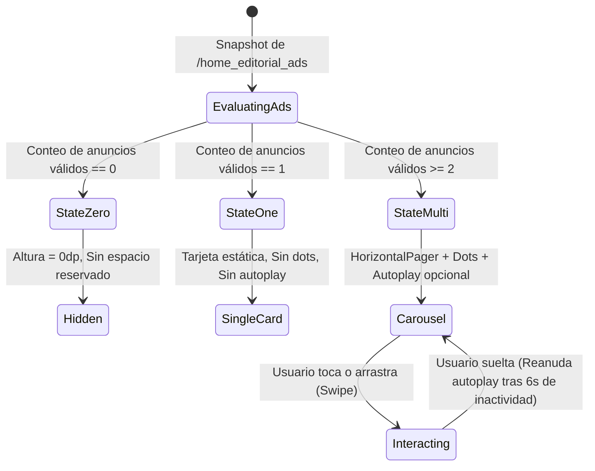

# BLUE SYSTEM DELIVERY ENTERPRISE
# FASE 1 — CONTRACT DESIGN: ESPECIFICACIÓN CANÓNICA DE ARQUITECTURA
# DASHBOARD MANAGER ENTERPRISE 2.0: CONTENIDO DINÁMICO, TÍTULOS, ORDEN, NAVEGACIÓN Y PUBLICIDAD EDITORIAL

**Protocolo:** `BSD-DASHBOARD-MANAGER-DYNAMIC-CONTENT-ORDER-ADS-001`  
**Fase:** FASE 1 — CONTRACT DESIGN (CON OBSERVACIONES)  
**Modo de Ejecución:** READ-ONLY / ZERO MUTATION / ZERO CODE WRITES / STOP GATE ACTIVO  
**Fecha de Emisión:** 2026-10-03  
**Auditor Responsable:** Senior Developer & Auditor de BlueSystem v2.1 Enterprise  
**Estado:** 🟢 **DISEÑO CONTRACTUAL COMPLETADO — PENDIENTE DE REVISIÓN Y AUTORIZACIÓN PARA FASE 2/3**  

---

## 1. Executive Summary & Alcance Autorizado

La presente especificación contractual formaliza la arquitectura técnica, los modelos de datos, la máquina de estados UX y los mecanismos de sincronización reactiva para la extensión del módulo **🎨 Dashboard Manager Enterprise 2.0**.

En estricta sujeción a las observaciones de autorización humana recibidas:
1. **Fe de Erratas Consolidada:** Se ratifica y protege el SSOT congelado del Pricing Engine de Delivery Express X→Y (ADR-015): tarifa inmutable de **C$35 base + C$10/km**. Queda prohibida la propagación de valores erróneos legacy ($15/km).
2. **Política de Identidad Comercial (Zero Stale Data & Zero N+1):** Se establece la política híbrida **"In-Memory Cache Resolution with Snapshot Fallback"**, garantizando que el logotipo y nombre de comercios en anuncios publicitarios reflejen siempre la versión viva de `/businesses` sin efectuar ninguna consulta adicional a Firestore.
3. **Contrato UX del Slider de Anuncios:** Se definen los 3 estados fundamentales (0 anuncios = 0px de altura; 1 anuncio = card única estática sin paginadores; 2+ anuncios = slider horizontal reactivo con dots e indicador activo), con aislamiento gestual entre swipe horizontal y scroll vertical.
4. **Separación Canónica Absoluta de Superficies:**
   - **Superficie A:** `Banners Promocionales Superiores` (`/banners`) — carrusel superior horizontal de promociones comerciales de cabecera.
   - **Superficie B:** `Publicidad / Anuncios Editoriales del Home` (`/home_editorial_ads`) — nuevo bloque modular dentro del feed, posicionable dinámicamente mediante `EDITORIAL_ADS` en `sectionOrder`.
5. **Extensibilidad Segura sin Sobreingeniería:** Se declaran los campos futuros (`targetCity`, `tenantId`, `targetPlatform`) como opcionales/nulos en el esquema, sin implementar motores de segmentación o geocercas complejas en esta fase.

---

## 2. Architecture Blueprint: Dos Superficies Desacopladas

```mermaid
flowchart TD
    subgraph Admin_Panel [Admin Web: Dashboard Manager]
        DM_Banners[Banners Tab: /banners]
        DM_Config[Config & Visibilidad: /dashboard/configuration]
        DM_Titles[Editor de Títulos Visibles: blockTitles]
        DM_Order[Jerarquía & Orden: sectionOrder]
        DM_Ads[📣 Anuncios del Home: /home_editorial_ads]
    end

    subgraph Storage_Layer [Firebase Storage]
        ST_Banners[/banners/timestamp_name.jpg]
        ST_Ads[/editorial_ads/timestamp_name.webp]
    end

    subgraph Firestore_SSOT [Cloud Firestore SSOT]
        FS_DashConfig[(/dashboard/configuration)]
        FS_TopBanners[(/banners)]
        FS_EditorialAds[(/home_editorial_ads)]
        FS_Businesses[(/businesses)]
    end

    subgraph Mobile_App [Customer Android / Futuro iOS]
        VM[CustomerHomeViewModel]
        FeedOrch[CustomerHomeFeedSection]
        TopSection[BannersSection - Carrusel Superior]
        AdsSection[EditorialAdsSection - Slider Dinámico]
        Router[DestinationRouter - Enrutamiento Seguro]
    end

    DM_Banners -->|storageService| ST_Banners
    DM_Ads -->|storageService| ST_Ads
    DM_Banners --> FS_TopBanners
    DM_Config --> FS_DashConfig
    DM_Titles --> FS_DashConfig
    DM_Order --> FS_DashConfig
    DM_Ads --> FS_EditorialAds

    FS_TopBanners -->|listenToPromotionalBanners| VM
    FS_DashConfig -->|listenToDashboardConfig| VM
    FS_EditorialAds -->|listenToHomeEditorialAds| VM
    FS_Businesses -->|listenToPublicCatalogBusinesses| VM

    VM --> FeedOrch
    FeedOrch -->|Posición por sectionOrder| TopSection
    FeedOrch -->|Posición por sectionOrder: EDITORIAL_ADS| AdsSection
    AdsSection -->|Tap / CTA Action| Router
```

### Tabla Comparativa de Límites Arquitectónicos

| Criterio | Superficie A: Banners Superiores | Superficie B: Anuncios Editoriales del Home |
| :--- | :--- | :--- |
| **Colección Firestore** | `/banners/{bannerId}` | `/home_editorial_ads/{adId}` |
| **Storage Bucket Path** | `/banners/{fileName}` | `/editorial_ads/{fileName}` |
| **Ubicación en UI** | Cabecera fija (Posición fija en cabecera o bloque `BANNERS`) | Bloque dinámico ordenable (`EDITORIAL_ADS` en `sectionOrder`) |
| **Formato Visual** | Banner panorámico horizontal (~150dp altura) | Card editorial enriquecida (fondo, badge, copy, CTA, logo circular opcional) |
| **Tipos de Contenido** | Ofertas comerciales, promociones directas | Adquisición de comercios, captación de motorizados, branding, eventos, promociones |
| **Comportamiento si = 0** | Tarjeta de fallback fija ("BlueSystem Delivery - ¡Ahorrá!") | **0px de altura** (no ocupa espacio en pantalla) |
| **Control Administrativo** | Pestaña Banners / Promociones | Pestaña `📣 Anuncios del Home` en Dashboard Manager |

---

## 3. Modelo Firestore Canónico

### 3.1. Documento `/dashboard/configuration` (Extensión Aditiva)

El documento `/dashboard/configuration` se amplía con campos aditivos, preservando compatibilidad 100% hacia atrás:

```typescript
interface DashboardConfigurationDocument {
  // ─── Visibilidad de Bloques (16 Toggles Canónicos) ───
  showBanners: boolean;               // BANNERS
  showCategories: boolean;            // CATEGORIES
  showBranchesBlock: boolean;         // BRANCHES
  showNearbyBusinesses: boolean;      // NEARBY
  showFeaturedBusinesses: boolean;    // FEATURED_BUSINESSES
  showFeaturedProducts: boolean;      // FEATURED_PRODUCTS
  showFlashDeals: boolean;            // FLASH_DEALS
  showPromotions: boolean;            // PROMOTIONS
  showSamePrice: boolean;             // SAME_PRICE
  showTopSelling: boolean;            // TOP_SELLING
  showRecommended: boolean;           // RECOMMENDED
  showNewBusinesses: boolean;         // NEW_BUSINESSES
  showQuickReorder: boolean;          // QUICK_REORDER
  showFavoritesBlock: boolean;        // FAVORITES
  showExpressDeliveryBanner: boolean; // EXPRESS_DELIVERY (UI)
  xToYServiceEnabled: boolean;        // EXPRESS_DELIVERY (Operativo)
  showEditorialAds: boolean;          // EDITORIAL_ADS (Nuevo)

  // ─── Ordenamiento de Secciones (16 Bloques Canónicos) ───
  sectionOrder: string[];

  // ─── Diccionario Aditivo de Títulos Visibles ───
  // blockId -> Título personalizado (e.g. "FEATURED_BUSINESSES": "⭐ Nuestros Favoritos")
  blockTitles?: Record<string, string>;

  // ─── Acciones y Destinos Opcionales por Bloque ───
  // blockId -> Configuración de interacción al tocar el encabezado/acción del bloque
  blockActions?: Record<string, {
    actionType: 'NONE' | 'MERCHANT' | 'PRODUCT' | 'CATEGORY' | 'INTERNAL_ROUTE' | 'EXTERNAL_URL';
    actionTarget: string;
  }>;

  // ─── Parámetros Geoespaciales (ADR-018) ───
  nearbyInitialRadiusKm: number;      // Default: 5.0
  nearbySecondaryRadiusKm: number;    // Default: 10.0
  nearbyMaxRadiusKm: number;          // Default: 15.0
  nearbyMinimumMerchantCount: number; // Default: 5
  nearbyOrdering: 'nearest' | 'rating';
  nearbyAutoExpandEnabled: boolean;

  // ─── Auditoría ───
  updatedAt: FirebaseFirestore.Timestamp;
  updatedBy?: string;
}
```

#### Catálogo Oficial de Bloques Canónicos (`CANONICAL_DEFAULT_SECTION_ORDER` v2.0):
```text
 1. BANNERS
 2. CATEGORIES
 3. BRANCHES
 4. NEARBY
 5. FEATURED_BUSINESSES
 6. FEATURED_PRODUCTS
 7. FLASH_DEALS
 8. PROMOTIONS
 9. SAME_PRICE
10. TOP_SELLING
11. RECOMMENDED
12. NEW_BUSINESSES
13. QUICK_REORDER
14. FAVORITES
15. EXPRESS_DELIVERY
16. EDITORIAL_ADS  <-- NUEVO BLOQUE CANÓNICO ORDENABLE
```

---

### 3.2. Colección Canónica `/home_editorial_ads/{adId}`

Cada documento en `/home_editorial_ads` representa una tarjeta publicitaria/editorial administrable para el carrusel de inicio:

```typescript
interface HomeEditorialAdDocument {
  id: string;                         // UUID o autogenerado por Firestore
  
  // ─── Clasificación Semántica (Ad Type) ───
  type: 
    | 'MERCHANT_ACQUISITION'          // "Activa Managua: ¿Conoces un negocio...?"
    | 'COURIER_RECRUITMENT'           // "Gana entregando en Managua: Maneja en tus propios horarios"
    | 'MERCHANT_PROMOTION'            // "Hasta 20% OFF en Soda Donde Tony"
    | 'PRODUCT_PROMOTION'             // "Combo Familiar Hamburguesa + Bebida"
    | 'PLATFORM_CAMPAIGN'             // "Campaña Institucional BlueSystem"
    | 'EVENT'                         // Evento o festival gastronómico
    | 'SERVICE_PROMOTION'             // Encomiendas, Supermercado, etc.
    | 'GENERIC_EDITORIAL';            // Noticia, comunicado o tarjeta de contenido

  // ─── Contenido Editorial & Visual ───
  title: string;                      // Headline principal (e.g. "Activa Managua")
  subtitle: string;                   // Cuerpo o copy explicativo
  badgeText: string;                  // Badge superior (e.g. "📍 37 negocios activos", "🏍 Buscando repartidores")
  ctaText: string;                    // Texto del botón de acción (e.g. "Agregar un negocio →", "Pedir ahora")
  imageUrl: string;                   // URL HTTPS segura de la imagen principal en Storage

  // ─── Destino e Interacción (Ad Action) ───
  actionType: 
    | 'NONE'                          // Solo informativo (no clickeable)
    | 'MERCHANT'                      // Abre detalle de comercio
    | 'PRODUCT'                       // Abre comercio con selector de producto
    | 'INTERNAL_ROUTE'                // Ruta interna en allowlist
    | 'EXTERNAL_URL';                 // Navegador web externo seguro

  actionTarget?: string;              // Destino específico (ruta interna, URL web, o id compuesto)
  merchantId?: string;                // ID canónico del comercio en /businesses/{id}
  merchantNameSnapshot?: string;      // Snapshot inicial del nombre (para fallback/offline)
  merchantLogoUrlSnapshot?: string;   // Snapshot inicial del logo (para fallback/offline)
  productId?: string;                 // ID canónico del producto en /products/{id}
  productNameSnapshot?: string;       // Snapshot auxiliar del nombre del producto

  // ─── Control Operativo & Orden ───
  active: boolean;                    // Interruptor manual de activación (true = visible)
  order: number;                      // Posición dentro del slider (1, 2, 3...)
  startAt: FirebaseFirestore.Timestamp | null; // Fecha/hora de inicio de campaña (null = inmediata)
  endAt: FirebaseFirestore.Timestamp | null;   // Fecha/hora de expiración (null = indefinida)

  // ─── Extensibilidad Futura (Prevista / Opcional / Nullable) ───
  targetCity?: string | null;         // e.g. "MANAGUA", "LEON" (null = global)
  tenantId?: string | null;           // e.g. "ten_default" (null = todos)
  targetPlatform?: 'ALL' | 'ANDROID' | 'IOS' | null; // (null = todas)

  // ─── Metadatos de Auditoría (ADR-009) ───
  createdAt: FirebaseFirestore.Timestamp;
  updatedAt: FirebaseFirestore.Timestamp;
  createdBy: string;                  // UID del administrador que creó el anuncio
}
```

---

## 4. Política de Identidad Comercial: In-Memory Cache con Snapshot Fallback

### El Dilema Técnico
- Si **únicamente guardamos `merchantId`**, el renderizado de la tarjeta publicitaria requeriría consultar el documento `/businesses/{merchantId}` para obtener el nombre y el logo, provocando consultas $N+1$ por cada anuncio que se dibuje.
- Si **únicamente guardamos un snapshot estático** (`merchantName`, `merchantLogoUrl`), cuando el comercio actualice su marca o logotipo en el futuro, el anuncio publicitario mostrará permanentemente el logotipo antiguo (datos obsoletos).

### Solución Canónica Adoptada (Zero Stale Data & Zero N+1)
En la aplicación cliente (Android y futuro iOS), `CustomerHomeViewModel` ya mantiene una suscripción reactiva viva en memoria a todos los comercios del catálogo mediante `_publicBusinesses` (`FirebaseManager.listenToPublicCatalogBusinesses()`).

Por tanto, se implementa la regla de resolución reactiva sin costo de red:

```kotlin
/**
 * Resuelve la identidad viva del comercio en tiempo real:
 * 1. Busca en la caché viva en memoria (publicBusinesses).
 * 2. Si existe, usa su nombre y logotipo actualizados en tiempo real (0 lecturas Firestore adicionales).
 * 3. Si no existe en la lista viva (ej. filtro de categoría activo u offline), recurre al snapshot persistido en el anuncio.
 */
fun resolveAdMerchantIdentity(
    ad: HomeEditorialAd,
    publicBusinesses: List<BusinessInfo>
): Pair<String, String> {
    val liveMerchant = ad.merchantId?.takeIf { it.isNotBlank() }?.let { mId ->
        publicBusinesses.find { it.id == mId }
    }
    
    val effectiveName = liveMerchant?.getEffectiveName() 
        ?: ad.merchantNameSnapshot 
        ?: ""
        
    val effectiveLogo = liveMerchant?.getEffectiveLogoUrl() 
        ?: ad.merchantLogoUrlSnapshot 
        ?: ""
        
    return Pair(effectiveName, effectiveLogo)
}
```

#### Ventajas Certificadas:
1. **Zero Consultas $N+1$:** Costo de red = **$0 Maps / $0 Firestore reads**.
2. **Freshness Total:** Si Don Tony cambia su logo hoy en el panel de comercios, todos los anuncios activos de Don Tony actualizan instantáneamente su logo circular en la Customer App.
3. **Resiliencia Offline:** Si la app arranca sin internet o el comercio fue archivado, el snapshot estático garantiza que la tarjeta nunca quede en blanco o deformada.

---

## 5. Especificación Funcional & UX del Slider `EDITORIAL_ADS`

### 5.1. Máquina de Estados UX



### 5.2. Reglas Contractuales por Estado:

| Estado | Condición | Comportamiento en Customer App |
| :--- | :--- | :--- |
| **Estado 0 (Vacío)** | 0 anuncios activos o todos fuera de vigencia (`now < startAt` o `now > endAt`). | **Cero espacio reservado (`Modifier.height(0.dp)` o retorno anticipado `if (validAds.isEmpty()) return`).** No deja huecos en blanco ni saltos de scroll. |
| **Estado 1 (Card Única)** | Exactamente 1 anuncio activo. | **Renderiza una única Card completa.** Prohibido mostrar indicadores de paginación (dots) o flechas de navegación. Autoplay desactivado. |
| **Estado 2 (Slider Dinámico)** | 2 o más anuncios activos. | **Renderiza `HorizontalPager` con paginador de puntos (dots).**<br>- Punto activo: píldora expandida color azul/índigo (`width = 24.dp`, color primario).<br>- Puntos inactivos: círculos pequeños grisáceos (`width = 8.dp`, opacity 40%). |

### 5.3. Ergonomía Táctil & Scroll Vertical
- El carrusel se implementa mediante `HorizontalPager` en Jetpack Compose.
- **Aislamiento Gestual:** Los eventos de arrastre horizontal son consumidos por el pager, mientras que los desplazamientos con vector vertical mayoritario se propagan limpiamente al `Column(Modifier.verticalScroll)` padre. Prohibido atrapar el scroll de la pantalla principal.
- **Autoplay Inteligente:**
  - Intervalo de transición: **5.0 segundos**.
  - Si el usuario interactúa manualmente (tap o drag), el temporizador se pausa inmediatamente.
  - Al soltar, entra en un debounce de **6.0 segundos** de inactividad antes de reanudar la rotación automática.

### 5.4. Programación Temporal (Time Scheduling)
Un anuncio solo es elegible si cumple simultáneamente:
$$\text{isEligible} = \text{active} == \text{true} \ \land \ (\text{startAt} == \text{null} \lor \text{nowMs} \ge \text{startAt.toMillis()}) \ \land \ (\text{endAt} == \text{null} \lor \text{nowMs} \le \text{endAt.toMillis()})$$
- La evaluación se realiza de forma reactiva en el cliente cada vez que se recomcompone el feed o transcurre un minuto de sesión activa.

---

## 6. Reparación Quirúrgica del Motor de Orden de Bloques

En base a la evidencia forense de la Fase 0, se define la solución técnica exacta para cada uno de los 4 componentes de la falla:

### 6.1. Corrección 1: Modelo Mutable y Deserializador Resiliente en Android
En `Models.kt`, se sustituye la propiedad inmutable estricta por `var` con anotaciones explícitas de JavaBean, y se incorpora el deserializador de tolerancia a fallos:

```kotlin
@com.google.firebase.firestore.IgnoreExtraProperties
data class DashboardConfig(
    // ... toggles ...
    @get:com.google.firebase.firestore.PropertyName("sectionOrder")
    @set:com.google.firebase.firestore.PropertyName("sectionOrder")
    var sectionOrder: List<String> = CANONICAL_DEFAULT_SECTION_ORDER,

    @get:com.google.firebase.firestore.PropertyName("blockTitles")
    @set:com.google.firebase.firestore.PropertyName("blockTitles")
    var blockTitles: Map<String, String> = emptyMap()
) {
    // ... getNormalizedSectionOrder() normaliza, descarta IDs inválidos y agrega EDITORIAL_ADS ...
}

/**
 * Deserializador ultra-resiliente para DashboardConfig.
 * Si toObject() sufre incompatibilidad de reflexión, extrae manualmente el array de Firestore.
 */
fun com.google.firebase.firestore.DocumentSnapshot.toDashboardConfigSafely(): DashboardConfig {
    if (!this.exists()) return DashboardConfig()
    return try {
        val direct = this.toObject(DashboardConfig::class.java)
        if (direct != null) {
            // Asegura que sectionOrder contenga el array real del documento
            @Suppress("UNCHECKED_CAST")
            val rawList = this.get("sectionOrder") as? List<String>
            if (rawList != null && rawList.isNotEmpty()) {
                direct.sectionOrder = rawList
            }
            @Suppress("UNCHECKED_CAST")
            val rawTitles = this.get("blockTitles") as? Map<String, String>
            if (rawTitles != null) {
                direct.blockTitles = rawTitles
            }
            direct
        } else {
            DashboardConfig()
        }
    } catch (e: Exception) {
        android.util.Log.w("DashboardConfigParser", "Fallback manual para DashboardConfig: ${e.message}")
        DashboardConfig()
    }
}
```

### 6.2. Corrección 2: Sincronización Global en FirebaseManager
En `FirebaseManager.kt:1844`, se prioriza la escucha directa a `/dashboard/configuration` salvo que exista explícitamente un documento de tenant con configuración activa comprobada.

### 6.3. Corrección 3: Ciclo de Vida Desbloqueado en CustomerHomeViewModel
En `CustomerHomeViewModel.kt:274`, se reemplaza el colector suspendido anidado por `flatMapLatest`:

```kotlin
viewModelScope.launch {
    _currentUserProfile
        .flatMapLatest { user ->
            fm.listenToDashboardConfig(user?.tenantId)
        }
        .collect { config ->
            _dashboardConfig.value = config
        }
}
```

### 6.4. Corrección 4: Claves Estables de Recomposición en Compose
En `CustomerHomeFeedSection.kt`, se envuelve cada iteración del bucle en `key(sectionId)`:

```kotlin
for (sectionId in orderedSections) {
    key(sectionId) {
        when (sectionId) {
            "BANNERS" -> BannersSection(...)
            "EDITORIAL_ADS" -> EditorialAdsSection(...)
            // ... resto de bloques ...
        }
    }
}
```
Esto garantiza que Jetpack Compose identifique de forma unívoca el movimiento de un nodo dentro del árbol de composición, evitando retención de memoria posicional y asegurando una animación de reordenamiento fluida (60 FPS).

---

## 7. Contrato de Títulos Dinámicos: Desacoplamiento de Identidad

### Regla Fundamental
Queda terminantemente prohibido utilizar el título visible como clave lógica en comparaciones condicionales o analíticas.

```kotlin
// ❌ INCORRECTO:
if (title == "Comercios Destacados") { ... }

// ✅ CORRECTO:
val canonicalTitle = when (blockId) {
    "FEATURED_BUSINESSES" -> "Comercios Destacados ⭐"
    "FEATURED_PRODUCTS" -> "Productos Estrella ⭐"
    "FLASH_DEALS" -> "Ofertas Flash ⚡"
    "PROMOTIONS" -> "Productos con Descuentos 🏷️"
    "SAME_PRICE" -> "Mismo Precio que en Local 💵"
    "TOP_SELLING" -> "Los Más Vendidos 🔥"
    "RECOMMENDED" -> "Recomendados para ti ❤️"
    "NEW_BUSINESSES" -> "Comercios Nuevos 🟢"
    "QUICK_REORDER" -> "Volver a Pedir 🔄"
    "FAVORITES" -> "Tus Comercios Favoritos ❤️"
    "EDITORIAL_ADS" -> "Anuncios Especiales 📣"
    else -> "Sección Destacada"
}

val displayTitle = dashboardConfig.blockTitles[blockId]?.trim()?.takeIf { it.isNotBlank() } 
    ?: canonicalTitle
```

---

## 8. Contrato Portable Multiplataforma (Android & Futuro iOS)

Para cumplir con la directiva arquitectónica multiplataforma (`34_CROSS_PLATFORM_ARCHITECTURE`), los modelos de Firestore son 100% agnósticos y consumibles de forma nativa por clientes Android (Kotlin), iOS (Swift) y Web:

### Esquema Equivalente Swift (iOS):
```swift
struct HomeEditorialAd: Codable, Identifiable {
    let id: String
    let type: String
    let title: String
    let subtitle: String
    let badgeText: String
    let ctaText: String
    let imageUrl: String
    let actionType: String
    let actionTarget: String?
    let merchantId: String?
    let merchantNameSnapshot: String?
    let merchantLogoUrlSnapshot: String?
    let productId: String?
    let active: Bool
    let order: Int
    let startAt: Date?
    let endAt: Date?
}
```

---

## 9. Matriz de Seguridad y Reglas de Despliegue

### 9.1. Reglas Firestore (`firestore.rules`)
```text
match /home_editorial_ads/{adId} {
  // Lectura pública requerida para clientes móviles y visitantes sin autenticación
  allow read: if true;
  // Creación, actualización y eliminación restringida estrictamente a administradores de plataforma
  allow write: if isPlatformAdmin();
}
```

### 9.2. Reglas Storage (`storage.rules`)
```text
match /editorial_ads/{fileName} {
  allow read: if true;
  allow create, update: if isPlatformAdmin()
                        && request.resource.size <= 5 * 1024 * 1024
                        && request.resource.contentType.matches('image/(jpeg|jpg|png|webp)');
  allow delete: if isPlatformAdmin();
}
```

---

## 10. Especificación de UI en Admin Web

El módulo `dashboardManager.js` incorporará:
1. **Pestaña `📣 Anuncios del Home`:**
   - Tabla interactiva de anuncios configurados (Imagen miniatura, Título, Badge, Tipo, Fechas de vigencia, Switch Activo/Inactivo, Botones Mover ▲/▼, Editar, Duplicar, Eliminar).
   - Botón `+ Crear Anuncio Editorial`.
2. **Modal de Creación / Edición:**
   - Selector de Tipo de Anuncio (`MERCHANT_ACQUISITION`, `COURIER_RECRUITMENT`, `MERCHANT_PROMOTION`, etc.).
   - Selector de Destino de Acción (`NONE`, `MERCHANT`, `PRODUCT`, `INTERNAL_ROUTE`, `EXTERNAL_URL`).
   - Selector desplegable de Comercio existente de `/businesses` (auto-resuelve logo y nombre).
   - Selector desplegable secundario de Productos de `/products` filtrado por el comercio seleccionado.
   - Input de Imagen con selector de archivo (sube a `/editorial_ads/` vía `storageService`) o URL directa.
   - Inputs de texto: Badge, Título, Subtítulo, Texto del Botón (CTA).
   - Selectores de fecha/hora de inicio y fin.
3. **Simulador / Vista Previa Móvil en Tiempo Real:**
   - Marco de previsualización que reproduce en vivo la tarjeta editorial tal como se verá en el teléfono: imagen con overlay degradado, badge temático en la esquina superior izquierda, logo circular del comercio superpuesto si aplica, headline tipográfico, body y botón CTA.
4. **Editor de Títulos Visibles en Pestaña `Configuración & Visibilidad`:**
   - Botón `✏️ Editar Título` al lado de cada bloque en la lista de visibilidad.
   - Modal simple para alterar el texto visible sin modificar el `blockId`.

---

## 11. Matriz de Pruebas E2E Propuesta (16 Casos Canónicos)

| ID | Escenario | Entrada Admin Web | Resultado Esperado Customer App |
| :--- | :--- | :--- | :--- |
| **E2E-01** | Cambio de Título Dinámico | Cambiar `"Comercios Destacados"` a `"⭐ Los Favoritos"` | En Android se actualiza inmediatamente el título del encabezado sin reiniciar app. |
| **E2E-02** | Fallback de Título | Borrar título en Admin (enviar string vacío o null) | En Android se muestra `"Comercios Destacados ⭐"` (título por defecto). Cero nulls o cadenas vacías. |
| **E2E-03** | Reordenamiento de Bloques | Mover `PRODUCTOS ESTRELLA` de la posición 6 a la posición 2 | En Android se renderiza de segundo en el scroll vertical en tiempo real. |
| **E2E-04** | Apagado de Bloque | Conmutar `showFlashDeals = false` | El carrusel de Ofertas Flash desaparece instantáneamente sin dejar espacio en blanco. |
| **E2E-05** | Encendido de Bloque | Conmutar `showFlashDeals = true` | El carrusel de Ofertas Flash reaparece inmediatamente. |
| **E2E-06** | Anuncio Adquisición de Comercios | Crear anuncio `"Activa Managua"`, Tipo `MERCHANT_ACQUISITION`, Destino `INTERNAL_ROUTE` (`solicitar_envio_form`) | Muestra card editorial con badge, al tocar abre pantalla de formulario. |
| **E2E-07** | Anuncio Captación Riders | Crear anuncio `"Gana entregando"`, Tipo `COURIER_RECRUITMENT`, Destino `EXTERNAL_URL` (`https://bluesystemdelivery.com/riders`) | Al tocar abre el navegador web seguro en la URL oficial. |
| **E2E-08** | Anuncio Promoción Comercio | Crear anuncio `"Soda Donde Tony"`, Tipo `MERCHANT_PROMOTION`, Destino `MERCHANT` | Muestra card con logo circular superpuesto de Soda Tony. Tap abre `comercio_detalle_screen`. |
| **E2E-09** | Anuncio Producto | Crear anuncio `"Combo Familiar"`, Tipo `PRODUCT_PROMOTION`, Destino `PRODUCT` | Tap navega directo al comercio con el producto preseleccionado en el modal de compra. |
| **E2E-10** | Slider 0 Anuncios | Desactivar todos los anuncios en Admin | El bloque `EDITORIAL_ADS` colapsa completamente a 0dp de altura en el cliente. |
| **E2E-11** | Slider 1 Anuncio | Activar exactamente 1 anuncio | Se muestra la tarjeta única sin indicadores de paginación (dots) ni deslizamiento. |
| **E2E-12** | Slider 3 Anuncios | Activar 3 anuncios con órdenes 1, 2, 3 | Carrusel horizontal con 3 slides y dots indicadores (el punto 1 activo como píldora). |
| **E2E-13** | Swipe & Scroll Ergonomía | Realizar swipe horizontal en el slider y luego scroll vertical | El deslizamiento horizontal avanza el carrusel; el scroll vertical desplaza el feed sin trabarse. |
| **E2E-14** | Programación Temporal Futura | Anuncio con `startAt` en el día de mañana | No aparece en el feed de la aplicación cliente el día de hoy. |
| **E2E-15** | Programación Temporal Vencida | Anuncio con `endAt` en el día de ayer | Desaparece automáticamente del feed sin intervención manual. |
| **E2E-16** | Protección X→Y (ADR-015) | Validar cotización en `SolicitarEnvioScreen` | Tarifa base intacta: C$35 base + C$10/km. Cero afectación al motor logístico. |

---

## 12. Plan de Despliegue & Rollback

### 12.1. Estrategia de Migración Aditiva
1. Las modificaciones a `/dashboard/configuration` son puramente aditivas (`blockTitles`, `showEditorialAds`). Ningún campo legacy es eliminado.
2. Los clientes que ejecuten versiones anteriores de la APK ignorarán pacíficamente `blockTitles` y `EDITORIAL_ADS`, manteniendo su comportamiento original idéntico.
3. El nuevo bloque `home_editorial_ads` reside en su propia colección independiente, garantizando que un rollback total solo requiera apagar el toggle `showEditorialAds: false` en Admin Web.

### 12.2. Plan de Rollback Inmediato (Zero Downtime)
- **Nivel UI:** Cambiar `showEditorialAds = false` en `/dashboard/configuration` apaga inmediatamente la superficie de anuncios sin recompilar APKs.
- **Nivel Títulos:** Eliminar el campo `blockTitles` de `/dashboard/configuration` hace que la app regrese instantáneamente a los títulos canónicos por defecto.
- **Nivel Orden:** Botón `Restaurar orden por defecto` en Admin Web reescribe `sectionOrder` con `CANONICAL_DEFAULT_SECTION_ORDER`, restableciendo la estructura de fábrica.

---

## 13. Cierre de FASE 1 & Stop Gate

La **FASE 1 — CONTRACT DESIGN** queda formalmente concluida y documentada.  
**ESTADO ACTUAL: STOP GATE ACTIVO.**  
Se suspende toda actividad hasta recibir la **autorización explícita** para dar inicio a la **FASE 2 — ADMIN WEB IMPLEMENTATION** y **FASE 3 — ANDROID IMPLEMENTATION**.
