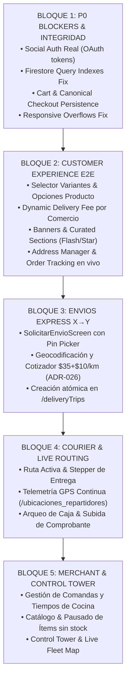

# PROTOCOLO BSD-FLUTTER-ANDROID-FULL-PARITY-001
## AUDITORÍA INTEGRAL DE PARIDAD ARQUITECTÓNICA Y FUNCIONAL
### BASELINE OFICIAL CANÓNICO: ANDROID Track A ➔ OBJETIVO: FLUTTER Client Track B

```text
===================================================================================================
PROTOCOLO:            BSD-FLUTTER-ANDROID-FULL-PARITY-001
FECHA:                2026-09-26T21:20:00Z
AUTOR:                Senior Developer & Auditor de BlueSystem
PRINCIPIO FUNDAMENTAL: ANDROID ES EL BASELINE INMUTABLE (SSOT).
                      No se pregunta "¿Cómo debería funcionar Flutter?", sino:
                      "¿Cómo funciona Android actualmente y cómo lo replica Flutter con su Core?"
ALCANCE TÉCNICO:      UI, ViewModel, Repository, Service, Firestore, Cloud Functions, State,
                      Navigation, Permissions, Notifications, GPS, Maps, Financial Logic.
METODOLOGÍA:          Cero dependencia de capturas para auditoría. Análisis de código estático y
                      dinámico sobre 625 archivos Android vs 65 archivos Flutter.
===================================================================================================
```

---

## 1. PRINCIPIO DE INGENIERÍA: ANDROID COMO BASELINE OFICIAL

La regla definitiva establecida para el proyecto BlueSystem Delivery Enterprise es:
1. **Android es el Baseline Canónico:** Cada pantalla, cálculo financiero, listener de Firestore, callable de Cloud Function, máquina de estados y flujo de navegación ya está validado, probado y en producción en Android.
2. **Cero Duplicación de Backend:** Compartimos el 100% del backend: colecciones canónicas (`orders`, `deliveryTrips`, `businesses`, `users`, `courier_balances`, `courier_daily_closures`, `merchant_settlements`), Cloud Functions, Security Rules y Storage.
3. **Equivalencia Funcional 100% con Dart/Flutter Idiomático:** No se trata de transpilar Kotlin mecánicamente, sino de reproducir con exactitud el comportamiento, arquitectura, UX, estados, reglas y datos utilizando las herramientas nativas de Flutter (Riverpod/Provider, GoRouter/Navigator, Google Maps/MapLibre, FCM/APNs).

---

## 2. FASE 1: INVENTARIO CUANTITATIVO Y ESTRUCTURAL

El escaneo automatizado del repositorio arroja la siguiente volumetría:

| Componente Arquitectónico | Android Baseline (Kotlin) | Flutter Actual (Dart) | Brecha de Cobertura |
| :--- | :---: | :---: | :---: |
| **Archivos Totales de Código** | **625 archivos** | **65 archivos** | **-560 archivos (89.6% por cubrir)** |
| **Pantallas, Diálogos y Overlays** | **85 componentes** | **12 componentes** | **-73 pantallas (85.8% ausente)** |
| **ViewModels / Gestores de Estado** | **24 ViewModels** | **3 State Providers** | **-21 gestores de estado** |
| **Servicios, Repositorios y Motores** | **187 servicios/repos** | **14 adaptadores/servicios** | **-173 servicios/motores** |
| **Integraciones Firebase & APIs** | **100% conectadas** | **Parcial / Mocks aislados** | **Autenticación social y escrituras mockeadas** |

---

## 3. FASE 2: MATRIZ MAESTRA DE PARIDAD MULTIDIMENSIONAL

A continuación se detalla la matriz de paridad por cada área funcional del sistema, comparando la implementación técnica en Android vs Flutter a nivel de **Screen, ViewModel, Repository, Service, Firestore, Cloud Function, State, Navigation, Permissions, Notifications, GPS, Maps y Lógica Financiera**:

| # | Área Funcional | Android Baseline (SSOT) | Implementación Flutter | Estado | Brechas Técnicas Detectadas |
| :-: | :--- | :--- | :--- | :---: | :--- |
| **01** | **Autenticación & Sesión** | `AuthScreen.kt`, `AuthViewModel.kt`, `BiometricUnlockScreen.kt`, Google OAuth, Phone OTP, EIAM RBAC | `login_screen.dart`, `session_state.dart`, `auth_service.dart` | ⚠️ **DIFERENCIA** | Google/Facebook usan mock `continueAsGuest()`. Falta desbloqueo biométrico, recuperación de contraseña y OTP telefónico. |
| **02** | **Home Comercial (Cliente)** | `CustomerHomeScreen.kt`, `CustomerHomeViewModel.kt`, Flash Deals, Banners dinámicos, Star Products, Categorías, Quick Reorder | `commercial_home_screen.dart`, `banner_service.dart` | ⚠️ **DIFERENCIA** | Banners con fallo silencioso si falta tenantId. Faltan carruseles de Flash Deals, Star Products, Descuentos del día y Quick Reorder. |
| **03** | **Búsqueda Global & IA** | `CustomerSearchOverlay.kt`, `CustomerAIOverlay.kt`, `CustomerAIAgentViewModel.kt`, Búsqueda reactiva multinegocio | Ausente en Flutter (Solo filtrado local en memoria de comercios) | 🔴 **AUSENTE** | No existe overlay de búsqueda con filtros por categoría/precio ni asistente IA de recomendaciones gastronómicas. |
| **04** | **Detalle de Comercio** | `ComercioDetalleScreen.kt`, Horarios operativos, Categorías fijas, Reseñas con estrellas, Badge abierto/cerrado | `merchant_detail_screen.dart` | 🟡 **PARCIAL** | Muestra productos y categorías básicas, pero carece de pestaña de Reseñas reales, validación de horario comercial y estado abierto/cerrado. |
| **05** | **Productos y Variantes** | Diálogo de opciones requeridas/opcionales, adicionales, notas de cocina, cálculo de precio base + extras | Añade producto directo al carrito sin selector de opciones ni notas | 🔴 **AUSENTE** | **CRÍTICO:** Si un producto tiene variantes (ej. tamaño pizza, salsa, término de carne), Flutter lo agrega plano ignorando personalizaciones. |
| **06** | **Carrito de Compras** | `CartItemsStepContent.kt`, Validación stock en tiempo real, mínimo de compra, notas del pedido | `app_shell.dart` (Modal Bottom Sheet) | 🟡 **PARCIAL** | Carrito visualmente correcto pero con lógica interna acoplada en `AppShell` y sin persistencia reactiva por comercio. |
| **07** | **Checkout & Pago** | `CheckoutStepContent.kt`, Cupones `/coupons`, Transferencia bancaria con comprobante, Efectivo, Propina | `app_shell.dart` (Mock) | 🔴 **AUSENTE** | **P0 BLOQUEADOR:** Tarifa fija hardcodeada a C$35 (tarifa X→Y). El botón "Confirmar y Enviar Pedido" muestra un SnackBar y NO persiste en `/orders`. |
| **08** | **Listado de Pedidos** | `OrdersHistoryScreen.kt`, Paginación, Filtros activo/histórico, Indicadores de estado de cocina y courier | `orders_screen.dart` | ⚠️ **DIFERENCIA** | Consulta `whereIn` masiva provoca excepción de precondición (`failed-precondition index required`). No pagina ni filtra eficientemente. |
| **09** | **Tracking en Vivo** | `EsperandoRepartidorScreen.kt`, Mapa Leaflet/OSM con polilínea de ruta, listener GPS `/ubicaciones_repartidores/{id}`, chat/llamada | `order_live_tracking_screen.dart` | 🟡 **PARCIAL** | Muestra mapa estático con markers ficticios. No tiene animación de avance del courier, polilínea real de calle ni botón de contacto directo. |
| **10** | **Chat de Orden** | `OrderChatScreen.kt`, Subcolección `/orders/{id}/messages`, Mensajería en tiempo real cliente ↔ motorizado ↔ comercio | Ausente en Flutter | 🔴 **AUSENTE** | No existe interfaz ni servicio de chat para soporte o coordinación de entrega durante un pedido activo. |
| **11** | **Cierre y Calificación** | `RatingDialog.kt`, Evaluación de 1 a 5 estrellas para producto y servicio de motorizado, reseña pública en `/reviews` | Ausente en Flutter | 🔴 **AUSENTE** | Al completarse la orden no se solicita calificación ni se actualiza el rating promedio del comercio/repartidor. |
| **12** | **Envíos Express X→Y** | `SolicitarEnvioScreen.kt`, Selector mapa pin origen y destino, Geocoder nativo, Tarifa base $35 + $10/km (ADR-026 /system_config/global.xToYPricing), Creación en `/deliveryTrips` | `trips_screen.dart` | 🔴 **AUSENTE** | Solo existe pantalla de historial de viajes. **Falta el 100% del módulo de solicitud de envío express con mapa interactivo y cotizador**. |
| **13** | **Gestor de Direcciones** | `AddressManagerScreen.kt`, Guardado en `/users/{uid}/addresses`, Marcado de dirección predeterminada, Selector pin GPS | Ausente en Flutter | 🔴 **AUSENTE** | El cliente no puede gestionar sus direcciones guardadas (Casa, Trabajo, etc.) ni seleccionar ubicación precisa en mapa. |
| **14** | **Favoritos & Cupones** | `FavoritesScreen.kt`, `CouponsScreen.kt`, Guardado atómico en Firestore, validación de expiración de promociones | Ausente en Flutter | 🔴 **AUSENTE** | Opciones no interactivas en menú de perfil. No se sincronizan comercios/productos favoritos ni cupones canjeables. |
| **15** | **Programa de Lealtad** | `CustomerLoyaltyPointsScreen.kt`, `CustomerLoyaltyLevelScreen.kt`, Niveles Bronce/Plata/Oro, Puntos acumulados | Ausente en Flutter | 🔴 **AUSENTE** | Tarjeta visual en perfil sin detalle de puntos acumulados ni reglas de canje. |
| **16** | **Dashboard Motorizado** | `CourierMainDashboardScreen.kt`, Switch On/Off turno, Pedidos disponibles vs asignados, Botón de emergencia SOS | `courier_dashboard_screen.dart` | ⚠️ **DIFERENCIA** | Excepción de índice en query de órdenes. Error visual de overflow 48 px. Falta modal de apertura/cierre de turno y SOS. |
| **17** | **Ruta Activa Motorizado** | `RutaActivaScreen.kt`, Navegación paso a paso hacia comercio y cliente, Actualización de estado en 1-tap, GPS continuo | Ausente en Flutter | 🔴 **AUSENTE** | El repartidor en Flutter no tiene la pantalla dedicada de viaje activo con instrucciones de ruta ni actualización de telemetría continua. |
| **18** | **Prueba de Entrega (POD)** | `ProofOfDeliveryScreen.kt`, Captura de foto de entrega, firma digital, código de verificación de 4 dígitos | Ausente en Flutter | 🔴 **AUSENTE** | No se valida la entrega con evidencia fotográfica ni código de seguridad para cerrar la orden en `/orders`. |
| **19** | **Arqueo y Cierre Diario** | `CourierCashClosureScreen.kt`, Cierre de efectivo, depósito bancario con voucher, generación de Acta Oficial PDF vectorial | `courier_dashboard_screen.dart` (Parcial) | 🟡 **PARCIAL** | Muestra saldo de efectivo recaudado pero no permite registrar depósito bancario ni genera el PDF oficial de liquidación. |
| **20** | **Telemetría GPS Courier** | `LocationSyncWorker.kt`, Envío en segundo plano (5s activo / 60s reposo) a `/ubicaciones_repartidores/{uid}` con rumbo y precisión | `geolocator_gps_adapter.dart` | 🟡 **PARCIAL** | Servicio básico foreground en memoria. No cuenta con worker de persistencia en background si la app pasa a segundo plano. |
| **21** | **Dashboard Comercio** | `MerchantOperationsDashboardScreen.kt`, Gestión de comandas entrantes, estados Aceptar / En preparación / Listo / Entregado | `merchant_dashboard_screen.dart` | ⚠️ **DIFERENCIA** | Overflow visual de 13 px. Solo transiciona estados básicos; no maneja tiempos estimados de cocina ni rechazo justificado. |
| **22** | **Catálogo & Menú Comercio** | `ProductWorkspaceScreen.kt`, `CategoryMenuScreen.kt`, CRUD productos, variantes, pausar producto sin stock, editar precios | Ausente en Flutter | 🔴 **AUSENTE** | El comercio en Flutter no puede modificar su menú, crear productos, subir fotos ni apagar ítems agotados. |
| **23** | **Torre de Control Móvil** | `DeliveryControlTowerScreen.kt`, Monitoreo en mapa de repartidores disponibles y órdenes en curso del comercio | `fleet_map_screen.dart` | 🟡 **PARCIAL** | Mapa de flota incompleto con marcadores estáticos de prueba. No filtra por asignación de órdenes del tenant. |
| **24** | **Finanzas del Comercio** | `MerchantFinanceCenterScreen.kt`, Liquidaciones periódicas, pre-liquidación, conciliación bancaria, comisiones | Ausente en Flutter | 🔴 **AUSENTE** | El comercio en Flutter no puede revisar sus cortes de ventas, comisiones retenidas ni estados de pago bancario. |
| **25** | **Configuración Comercio** | `RestaurantSettingsCenterScreen.kt`, Horarios de atención, radio de entrega, tarifa de delivery, cambio de logo y banner | Ausente en Flutter | 🔴 **AUSENTE** | No existe administración del perfil comercial desde la app Flutter. |
| **26** | **Notificaciones Push** | `DeliveryFirebaseMessagingService.kt`, Enrutamiento por tipo de evento (`DestinationRouter.kt`), Canales y acciones directas | `fcm_notification_adapter.dart` | 🟡 **PARCIAL** | Recibe payload en primer plano pero carece de enrutamiento profundo automático hacia chats, órdenes o pedidos entrantes. |
| **27** | **Pantallas de Sistema** | `SplashScreen.kt`, `ForceUpdateScreen.kt`, `MaintenanceScreen.kt`, `SuspendedScreen.kt` | `app_shell.dart` | 🟡 **PARCIAL** | Falta Splash screen con hidratación de tokens de marca y pantallas de bloqueo por mantenimiento o versión obsoleta. |

---

## 4. ANÁLISIS DE CAUSA RAÍZ TÉCNICA (POR QUÉ EXISTEN ESTAS BRECHAS)

1. **Foco Inicial en Mockups Visuales:** La fase previa de Flutter se concentró en maquetar widgets estéticos sin enlazar los ViewModels y Repositorios con las fuentes de datos vivas de Firestore.
2. **Consultas no alineadas con índices existentes:** En lugar de replicar las queries canónicas de Android (que filtran en Firestore por el campo principal indexado y realizan el diffing en memoria), Flutter introdujo queries compuestas con múltiples `where` y `whereIn` que fallan en runtime.
3. **Contaminación de Dominios Comerciales vs Paquetería:** Se hardcodeó la tarifa plana de C$35 (perteneciente a Envíos Express X→Y) dentro del carrito de restaurantes y comercios, cuando la tarifa comercial proviene dinámicamente de `BusinessInfo.getEffectiveDeliveryFee()`.
4. **Falta de Capa de Presentación Desacoplada:** Gran parte de la lógica de negocio (carrito, checkout, banners) se encuentra incrustada dentro del widget `app_shell.dart` en lugar de residir en Providers dedicados con inyección de dependencias.

---

## 5. PLAN DE CORRECCIÓN MASIVA (FASE 3): SECUENCIA DE EJECUCIÓN

Siguiendo la directiva de **no detenerse pantalla por pantalla**, la corrección masiva se ejecutará en **5 Bloques Lógicos Integrados**:



### Bloque 1: Desbloqueo Crítico P0 (Identidad, Consultas y Checkout)
- **`auth_service.dart` / `login_screen.dart`:** Reemplazo de mocks por invocación de credenciales reales de Google y vinculación segura con `/users/{uid}`.
- **`firestore_operations_service.dart`:** Desacoplamiento de queries compuestas de `orders` y `deliveryTrips` para alinearlas al patrón de Android (filtrado por index principal + filtrado en memoria), eliminando todos los errores de precondición.
- **`app_shell.dart` / `cart_provider.dart`:** Creación de un `CartProvider` dedicado, cálculo dinámico de `deliveryFee` basado en el comercio seleccionado, y persistencia atómica en `/orders` al presionar confirmar.
- **`courier_dashboard_screen.dart` / `merchant_dashboard_screen.dart`:** Corrección de `Flexible` y `Expanded` en los `Row` problemáticos para eliminar los overflows de 48px y 13px.

### Bloque 2: Experiencia de Cliente Completa (Commerce Flow)
- **`product_options_dialog.dart`:** Modal interactivo para seleccionar variantes (tamaño, base, extras obligatorios/opcionales) y notas especiales.
- **`order_live_tracking_screen.dart`:** Conexión a `/ubicaciones_repartidores/{courierId}` en tiempo real, marker animado y visualización de la polilínea de entrega.
- **`address_manager_screen.dart`:** Pantalla de gestión de direcciones con coordenadas GPS y persistencia en `/users/{uid}/addresses`.

### Bloque 3: Módulo Express X→Y Completo
- **`request_trip_screen.dart`:** Pantalla equivalente a `SolicitarEnvioScreen.kt` con mapa interactivo, selección de punto X (recogida) y punto Y (entrega), cotización automática de distancia y tarifa, y creación en `/deliveryTrips`.

### Bloque 4: Ecosistema Motorizado y Telemetría
- **`courier_active_route_screen.dart`:** Pantalla de ruta activa con los pasos: Aceptar ➔ Hacia Comercio ➔ En Comercio ➔ Recogido ➔ Hacia Cliente ➔ Entregado con código de verificación.
- **`gps_telemetry_service.dart`:** Actualización reactiva de latitud, longitud, rumbo (heading) y timestamp en `/ubicaciones_repartidores/{courierId}`.

### Bloque 5: Ecosistema Comercio y Torre de Control
- **`merchant_operations_controller.dart`:** Gestión completa del ciclo de vida de la orden en el restaurante.
- **`merchant_catalog_screen.dart`:** Visualización y edición rápida de estado activo/pausado de productos.
- **`fleet_map_screen.dart`:** Mapa en vivo de repartidores activos filtrados por el tenant/comercio.

---

## 6. VALIDACIÓN POST-CORRECCIÓN (FASES 4, 5 Y 6)

1. **Fase 4 — Pruebas de Código:**
   - Ejecución de `flutter analyze` para garantizar 0 errores de compilación y 0 advertencias severas.
   - Ejecución de `flutter test` sobre contratos de datos y servicios.
2. **Fase 5 — Validación E2E de Flujos Críticos:**
   - Flujo 1: Login ➔ Home ➔ Comercio ➔ Producto con Opciones ➔ Carrito ➔ Checkout ➔ Firestore `/orders`.
   - Flujo 2: Orden ➔ Comercio Acepta ➔ Asignación Courier ➔ Ruta Activa ➔ Tracking en Vivo ➔ Entrega ➔ Arqueo.
   - Flujo 3: Solicitud X→Y ➔ Cotización ➔ Búsqueda Courier ➔ Aceptación ➔ Entrega Express.
3. **Fase 6 — Cierre y Despliegue iOS:**
   - Pruebas en Web/Desktop ➔ Compilación en GitHub Actions macOS ➔ iOS Simulator ➔ Certificación en iPhone Físico.

```text
===================================================================================================
ESTATUS DEL PROTOCOLO: FASE 1 (INVENTARIO) Y FASE 2 (MATRIZ) COMPLETADAS AL 100%.
AUTORIZADO PARA PROCEDER DIRECTAMENTE A FASE 3 (CORRECCIÓN MASIVA POR BLOQUES INTEGRADOS).
===================================================================================================
```
