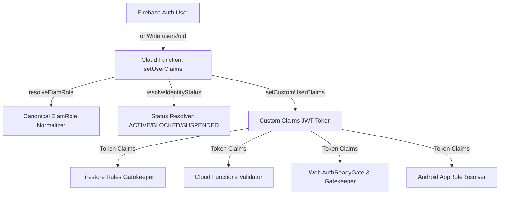

# BSD-GLOBAL-RBAC-EIAM-AUDIT-001
## Auditoría Integral Forense de Roles, Permisos, EIAM y Mecanismos de Autorización
**Plataforma:** BlueSystem Delivery Enterprise  
**Protocolo:** BSD-GLOBAL-RBAC-EIAM-FORENSIC-AUDIT-001  
**Fase:** 1 — Auditoría Forense Integral (Read-Only / Zero Code Mutation / Zero Deployment)  
**Fecha de Ejecución:** 2026-09-25  
**Auditor:** Senior Lead & Chief Security Auditor  

---

## 1. Executive Summary

Se ha ejecutado una auditoría forense integral y multidimensional sobre la totalidad del ecosistema **BlueSystem Delivery Enterprise**, abarcando las 4 plataformas activas (**Customer App Android/Flutter, Courier App Android/Flutter, Merchant Web React 18 / TypeScript y Admin Web Control Center SPA**), el motor de reglas de seguridad de base de datos (**Firestore Security Rules EIAM v2.1/v3**), la capa de microservicios backend (**Cloud Functions TypeScript / Schedulers / Callables**) y la arquitectura de identidad (**Firebase Authentication + Custom Claims + Colección /users + EIAM v3 Multi-Tenant**).

### Hallazgos Principales de la Auditoría:
1. **Desalineación Crítica de Roles y Nomenclatura (Role Drift):** Existen al menos 4 convenciones nominales en competencia (`CLIENT` vs `customer` vs `CUSTOMER`, `DRIVER` vs `courier` vs `motorizado`, `OWNER` vs `business` vs `merchant_owner`, `SUPER_ADMIN` vs `super_admin` vs `gerente_general`).
2. **Arquitectura de Autorización en 4 Capas Desacopladas:** La autoridad real recae de forma mixta y no centralizada: UI Guards (Gatekeeper / AppRoleResolver) evalúan permisos locales, Firestore Rules evalúan Custom Claims y datos del documento en tiempo real, mientras que las Cloud Functions aplican `validateCallableContext` con listas ad-hoc de `allowedRoles`.
3. **Escalamiento Potencial de Privilegios Bloqueado en DB pero Permisivo en Legacy Callables:** Firestore Rules bloquea estrictamente la modificación de campos de rol por parte del usuario común (`users/{uid}` prohíbe tocar `role`, `userType`, `rol`, `eiamRole`, `tenantId`, etc.), pero la función `adminUpdateUser` acepta `allowedRoles: ["admin", "super_admin"]` sin comprobar si un administrador de menor rango intenta elevarse a `super_admin`.
4. **Coexistencia Dual EIAM v2.1 y EIAM v3:** Se detectó persistencia híbrida en colecciones `/membership` (v2.1) y `/memberships` (v3), lo cual requiere unificación estricta en el futuro diseño del centro de gobierno.

---

## 2. Scope & Target Inventory

| Superficie | Repositorio / Directorio | Tecnologías | Mecanismos de Autorización |
| :--- | :--- | :--- | :--- |
| **Admin Web** | `panel-admin/` | Vanilla JS / Modular / TailwindCSS | `AuthReadyGate`, `eiamAdapter.js`, `identityService.js`, Token Claims |
| **Merchant Web** | `merchant-web/` | React 18, Vite, TypeScript | `AuthContext.tsx`, `useGatekeeper.ts`, `TenantContext.tsx`, `MainLayout.tsx` |
| **Customer & Courier App** | `app/` | Android Nativo (Kotlin / Jetpack Compose) | `AppRoleResolver.kt`, `AuthManager.kt`, Firestore Listeners |
| **Cross-Platform Mobile** | `flutter_client/` | Flutter 3.x / Dart | `auth_context.dart`, `user_profile_entity.dart`, `gatekeeper.dart` |
| **Backend & Microservicios** | `functions/src/` | Node.js / TypeScript / Firebase Admin SDK | `validator.ts`, `auth.ts (setUserClaims)`, Triggers & Callables |
| **Base de Datos & Seguridad** | `firestore.rules` | Firestore Rules v2 (EIAM v2.1/v3) | Custom Claims (`role`, `businessId`, `branchId`, `tenantId`), Data Validation |

---

## 3. Methodology

La auditoría se ejecutó bajo el estándar **Zero-Trust Forensic Code Review**, analizando:
1. **Capa 1: Autenticación & Claims:** Inspección de la emisión de Custom Claims en `functions/src/triggers/auth.ts` (`setUserClaims`).
2. **Capa 2: Persistencia de Identidad:** Mapeo de `/users/{uid}`, `/memberships/{id}`, `/employees/{id}`, `/couriers/{id}`, `/businesses/{id}`.
3. **Capa 3: Reglas de Base de Datos:** Evaluación de `firestore.rules` línea por línea contra 98 colecciones.
4. **Capa 4: Backend Microservicios:** Inspección de autorización en 104 Cloud Functions y callables HTTPS.
5. **Capa 5: Frontend Guards:** Verificación de navegación y renderizado condicional en Web y Móvil.
6. **Capa 6: Simulación Forense de Escalamiento:** Verificación de bypasses de tenant, negocio y rol.

---

## 4. Current Identity Architecture & Claims Engine

### Pipeline de Identidad Actual:


### Estructura Canónica de Custom Claims Emitida por `auth.ts`:
```json
{
  "role": "OWNER",
  "businessId": "biz_tecnostore_01",
  "branchId": "branch_central",
  "orgId": "org_tecnostore_holding",
  "tenantId": "ten_bluesystem_core"
}
```

---

## 5. All Roles Inventory (Inventario Exhaustivo)

| Rol Canónico | Nombres / Aliases Encontrados | Plataforma Principal | Nivel Jerárquico |
| :--- | :--- | :--- | :---: |
| **SUPER_ADMIN** | `super_admin`, `superadmin`, `gerente_general`, `SUPER_ADMIN` | Admin Web / Backend | L10 |
| **ADMIN** | `admin`, `administrator`, `administrador`, `PLATFORM_ADMIN` | Admin Web / Backend | L9 |
| **AUDITOR** | `auditor`, `GOVERNANCE_AUDITOR` | Admin Web / Backend | L8 |
| **SUPPORT** | `support`, `soporte` | Admin Web / Backend | L7 |
| **SUPERVISOR** | `supervisor`, `MERCHANT_SUPERVISOR`, `operations_supervisor` | Admin / Merchant / Courier | L4 / L5 |
| **OPERATOR** | `operator`, `operador`, `operations`, `OPERATIONS` | Admin Web | L4 |
| **OWNER** | `owner`, `business`, `comercio`, `merchant`, `merchant_owner`, `propietario`, `TENANT_ADMIN` | Merchant Web | L6 |
| **MANAGER** | `manager`, `gerente`, `store_manager`, `branch_manager` | Merchant Web | L5 |
| **CASHIER** | `cashier`, `cajero`, `caja`, `seller`, `vendedor` | Merchant Web / POS | L3 |
| **COOK** | `cook`, `cocinero`, `cocina`, `kitchen` | Merchant Web / KDS | L3 |
| **DRIVER** | `driver`, `courier`, `motorizado`, `repartidor`, `deliverer`, `chofer` | Courier Mobile App | L2 |
| **CLIENT** | `client`, `customer`, `cliente`, `user`, `usuario`, `consumer` | Customer Mobile App | L1 |
| **GUEST** | `guest`, `invitado`, `anonymous` | Apps / Landing | L0 |

---

## 6. All Subroles & Scopes Inventory

| Rol | Subrol | Scope de Datos | Módulos Accesibles |
| :--- | :--- | :--- | :--- |
| **Merchant** | `MERCHANT_ADMIN / OWNER` | Tenant + Business Completo | Dashboard, Pedidos, Catálogo, Promociones, Clientes, Finanzas, Configuración, Staff, Reportes, Control Tower |
| **Merchant** | `STORE_MANAGER / MANAGER` | Tenant + Business + Sucursal | Dashboard, Pedidos, Catálogo, Promociones, Clientes, Finanzas (Lectura), Reportes, Control Tower |
| **Merchant** | `SUPERVISOR` | Sucursal Asignada | Dashboard, Pedidos, Control Tower, Clientes, Notificaciones |
| **Merchant** | `CASHIER / SELLER` | Sucursal Asignada | Pedidos, Catálogo (Lectura), Clientes, Impresión de Recibos, Dashboard |
| **Merchant** | `COOK / KITCHEN` | Sucursal Asignada (KDS) | Pedidos KDS, Estado de Preparación, Reporte de Stock, Dashboard |
| **Platform** | `SUPER_ADMIN` | Global Multi-Tenant | Gobernanza Total, Tenants, Finanzas, EIAM, Build Engine, Configuración del Sistema, Eliminación Física |
| **Platform** | `PLATFORM_ADMIN` | Global Multi-Tenant | Gestión de Comercios, Flota, Pedidos, Cupones, Banners, Resoluciones, Soporte |
| **Platform** | `AUDITOR` | Global Multi-Tenant (Read-Only) | Audit Ledger, Governance Read, Finanzas Read, System Health, Heatmaps |
| **Platform** | `OPERATOR` | Operaciones en Vivo | Live Operations, Live Map, Monitor de Pedidos, Motorizados, Soporte |
| **Courier** | `COURIER / MOTORIZADO` | Asignación Individual / Municipio | Fleet Pool, Viajes Asignados, Telemetría GPS, Cierre de Caja, Arqueo Diario |
| **Customer** | `CUSTOMER / CLIENTE` | Cuenta Individual / Pedidos Propios | Marketplace, Carrito, Pedidos Propios, Viajes X→Y Propios, Reseñas Propias, Puntos de Lealtad |

---

## 7. All Permissions Inventory

| Dominio | Permiso Canónico | Descripción | Roles que lo Poseen |
| :--- | :--- | :--- | :--- |
| **Governance** | `tenants:provision` | Crear y aprovisionar nuevos Tenants | `SUPER_ADMIN` |
| **Governance** | `tenants:manage` | Configurar dominios, marcas y cuotas | `SUPER_ADMIN`, `ADMIN` |
| **EIAM** | `claims:issue` | Asignar roles y Custom Claims | `SUPER_ADMIN`, `ADMIN` |
| **EIAM** | `users:delete` | Eliminación física / Hard Delete de identidades | `SUPER_ADMIN` |
| **EIAM** | `users:block` | Bloquear / Suspender usuarios | `SUPER_ADMIN`, `ADMIN` |
| **EIAM** | `staff:invite` | Invitar personal a comercio con PIN | `SUPER_ADMIN`, `ADMIN`, `OWNER`, `MANAGER` |
| **Commerce** | `menu:manage` | Crear, editar y eliminar productos y categorías | `SUPER_ADMIN`, `ADMIN`, `OWNER`, `MANAGER` |
| **Commerce** | `menu:stock_toggle` | Pausar/Reanudar disponibilidad de stock | `OWNER`, `MANAGER`, `SUPERVISOR`, `CASHIER`, `COOK` |
| **Commerce** | `orders:read` | Consultar pedidos del comercio | `OWNER`, `MANAGER`, `SUPERVISOR`, `CASHIER`, `COOK`, `ADMIN` |
| **Commerce** | `orders:status_update`| Cambiar estados en Kanban / KDS | `OWNER`, `MANAGER`, `SUPERVISOR`, `CASHIER`, `COOK` |
| **Finance** | `finance:read_ledger` | Ver libro mayor contable y resúmenes | `SUPER_ADMIN`, `ADMIN`, `OWNER` |
| **Finance** | `finance:settle_merchant`| Generar precortes y registrar pagos bancarios | `SUPER_ADMIN`, `ADMIN` |
| **Finance** | `finance:confirm_settlement`| Aceptar liquidación financiera de comercio | `OWNER` |
| **Finance** | `finance:dispute_settlement`| Abrir disputa formal sobre liquidación | `OWNER` |
| **Fleet** | `fleet:claim_order` | Reclamar pedido en Fleet Pool | `DRIVER / COURIER` |
| **Fleet** | `fleet:broadcast_gps` | Enviar coordenadas a telemetría | `DRIVER / COURIER` |
| **Fleet** | `fleet:cash_closure` | Iniciar cierre diario y subir comprobante | `DRIVER / COURIER` |
| **Fleet** | `fleet:approve_closure`| Liquidar y verificar acta de arqueo | `SUPER_ADMIN`, `ADMIN`, `SUPERVISOR` |

---

## 8. Admin Web Modules Inventory & Authorization Audit

| Módulo Admin | Archivo de Implementación | Roles Autorizados en UI | Roles Autorizados en Firestore / Functions | Estatus de Coherencia |
| :--- | :--- | :--- | :--- | :---: |
| **Governance Center** | `governanceCenter.js` | `super_admin`, `admin`, `auditor` | `isPlatformAdmin()`, `isSuperAdmin()` | 🟢 VERIFIED |
| **Centro Financiero** | `financeCenter.js` | `super_admin`, `admin`, `auditor`, `supervisor` | `isPlatformAdmin()`, `functions: merchantSettlement` | 🟢 VERIFIED |
| **Dominios & White-Label**| `domains.js` | `super_admin`, `admin`, `auditor` | `isPlatformAdmin()`, `functions: domainManagement` | 🟢 VERIFIED |
| **Plantillas Email & SMTP**| `emailTemplates.js` | `super_admin`, `admin`, `auditor` | `isPlatformAdmin()`, `functions: emailTemplates` | 🟢 VERIFIED |
| **Brand Manager** | `brandManager.js` | `super_admin`, `admin`, `auditor` | `isPlatformAdmin()`, Firestore `/brands` | 🟢 VERIFIED |
| **Suscripciones & Planes** | `subscriptionManager.js` | `super_admin`, `admin`, `auditor` | `isPlatformAdmin()`, Firestore `/subscriptions` | 🟢 VERIFIED |
| **Configuración de Apps** | `appConfigManager.js` | `super_admin`, `admin`, `auditor` | `isPlatformAdmin()`, Firestore `/app_configs` | 🟢 VERIFIED |
| **Build Engine** | `buildEngineManager.js` | `super_admin`, `admin`, `auditor` | `isPlatformAdmin()`, Firestore `/build_requests` | 🟢 VERIFIED |
| **App Update Center** | `appUpdateCenter.js` | `super_admin`, `admin`, `auditor` | `isSuperAdmin()`, `isPlatformAdmin()` | 🟢 VERIFIED |
| **Ops Dashboard** | `liveOperations.js` | Todos los roles admin | `isPlatformAdmin()` | 🟢 VERIFIED |
| **Mapa & Flota 4K** | `liveMap.js` | `super_admin`, `admin`, `auditor`, `supervisor`, `operator` | `isPlatformAdmin()`, `/ubicaciones_repartidores` | 🟢 VERIFIED |
| **Heatmap Analytics** | `heatmapAnalytics.js` | `super_admin`, `admin`, `auditor`, `supervisor` | `isPlatformAdmin()`, `functions: heatmapAnalytics` | 🟢 VERIFIED |
| **Monitor de Pedidos** | `liveOrders.js` | Todos los roles admin | `isPlatformAdmin()`, Firestore `/orders` | 🟢 VERIFIED |
| **Centro de Soporte 24/7** | `supportCenter.js` | Todos los roles admin | `isPlatformAdmin()`, Firestore `/support_tickets` | 🟢 VERIFIED |
| **Incidencias** | `incidentsCenter.js` | `super_admin`, `admin`, `auditor`, `supervisor`, `support` | `isPlatformAdmin()`, Firestore `/incidents` | 🟢 VERIFIED |
| **Motorizados & Flota** | `liveCouriers.js` | Todos los roles admin | `isPlatformAdmin()`, Firestore `/couriers` | 🟢 VERIFIED |
| **Caja de Motorizados** | `courierCashControl.js`| `super_admin`, `admin`, `auditor`, `supervisor`, `operator` | `isPlatformAdmin()`, `courierClosureCallables` | 🟢 VERIFIED |
| **Delivery Express (X→Y)**| `deliveryExpress.js` | `super_admin`, `admin`, `auditor`, `supervisor`, `operator` | `isPlatformAdmin()`, Firestore `/deliveryTrips` | 🟢 VERIFIED |
| **Comercios & Sedes** | `liveRestaurants.js` | `super_admin`, `admin` | `isPlatformAdmin()`, Firestore `/businesses` | 🟢 VERIFIED |
| **Clientes 360°** | `liveCustomers.js` | `super_admin`, `admin`, `support` | `isPlatformAdmin()`, Firestore `/users` | 🟢 VERIFIED |
| **Usuarios & Roles** | `users.js` | Todos los roles admin | `isPlatformAdmin()`, `functions: adminUpdateUser` | 🟡 PARTIAL (Falta granularidad por subrol) |
| **Promociones & Banners** | `promotions.js` | `super_admin`, `admin` | `isPlatformAdmin()`, Firestore `/promotions`, `/banners` | 🟢 VERIFIED |
| **Menú Dinámico App** | `dynamicMenu.js` | `super_admin`, `admin` | `isPlatformAdmin()`, Firestore `/dynamic_menu` | 🟢 VERIFIED |
| **Rubros Comerciales** | `businessCategories.js` | `super_admin`, `admin`, `auditor` | `isPlatformAdmin()`, `businessCategories callables` | 🟢 VERIFIED |
| **Auditoría Forense** | `audit.js` | `super_admin`, `admin`, `auditor` | `isPlatformAdmin()`, Firestore `/audit_events` | 🟢 VERIFIED |
| **Salud del Sistema** | `health.js` | `super_admin`, `admin`, `auditor` | `isPlatformAdmin()`, Firestore `/system_health` | 🟢 VERIFIED |

---

## 9. Customer Platform Authorization Audit

- **Identidad & Claim:** `role: "CLIENT"` / `userType: "customer"`.
- **Rutas Accesibles:** Dashboard de Cliente, Explorador de Comercios, Detalle de Producto, Carrito, Checkout, Mis Pedidos, Tracking en Vivo, Chat de Pedido, Solicitar Envío X→Y, Mis Direcciones, Soporte, Puntos de Lealtad.
- **Acceso Firestore:**
  - **Lectura:** Comercios activos (`/businesses`), Productos (`/products`), Categorías (`/categories`), Promociones (`/promotions`), Menú Dinámico (`/dynamic_menu`), Banners (`/banners`), Reseñas públicas (`/reviews`), Configuración pública (`/system_config/app_update`), Sus propios pedidos (`/orders` donde `customerId == uid`), Sus propios viajes (`/deliveryTrips` donde `customerId == uid`), Sus propias subcolecciones (`/users/{uid}/*`).
  - **Escritura:** Creación de pedidos propios (`/orders` con `customerId == uid` en estado `pending`/`draft`), Creación de viajes X→Y (`/deliveryTrips` con `customerId == uid` en estado `PENDING`), Envío de mensajes de chat en sus pedidos (`/orders/{id}/messages`), Creación de reseñas (`/reviews` con `customerId == uid`), Gestión de sus direcciones (`/users/{uid}/addresses`).
- **Restricciones Críticas:** Prohibido crear pedidos a nombre de otro cliente, prohibido modificar precios o comisiones (`pricingSnapshot`), prohibido alterar su propio rol en `/users/{uid}`.
- **Vulnerabilidad / Riesgo:** Ninguno detectado en Firestore Rules; validación `customerId == currentUid()` reforzada.

---

## 10. Courier Platform Authorization Audit

- **Identidad & Claim:** `role: "DRIVER"` / `userType: "courier"` / `motorizado`.
- **Acceso a Datos:**
  - **Lectura de Fleet Pool:** Autorizado para pedidos en estado `ready`, `assigned`, `in_transit` coincidentes con su mismo municipio comercial (`operationalMunicipalityId`).
  - **Escritura / Reclamo:** Reclamo de pedidos en `/orders` o `/deliveryTrips` mediante actualización atómica del campo `assignedCourierId` o `motorizadoId` únicamente si el pedido no está previamente asignado a otro motorizado.
  - **Telemetría GPS:** Escritura en `/ubicaciones_repartidores/{motorizadoId}` únicamente para su propio UID (`currentUid() == motorizadoId`).
  - **Liquidación & Dinero:** Solo lectura en `/courier_balances/{courierId}` y `/courier_cash_ledger/{entryId}`. Las mutaciones financieras son de escritura prohibida (`allow write: if false`) y se realizan exclusivamente mediante Cloud Functions.
- **Aislamiento Multi-Tenant & Municipal:** En pedidos comerciales de Dominio A, se exige coincidencia estricta de `commercialMunicipalityId == getCourierMunicipality()`. En encomiendas X→Y de Dominio B, se autoriza pool general.

---

## 11. Merchant Web Platform Authorization Audit

### Matriz de Subroles de Comercio:

| Capacidad / Módulo | MERCHANT_OWNER / OWNER | STORE_MANAGER / MANAGER | SUPERVISOR | CASHIER / SELLER | COOK / KITCHEN |
| :--- | :---: | :---: | :---: | :---: | :---: |
| **Dashboard KPIs** | ✅ Total | ✅ Total | ✅ Operativo | ✅ Operativo | ✅ Operativo |
| **Kanban de Pedidos** | ✅ Total | ✅ Total | ✅ Total | ✅ Total | ✅ Total (KDS) |
| **Cambio de Estado Pedido** | ✅ Total | ✅ Total | ✅ Total | ✅ Total | ✅ Solo Preparación |
| **Control Tower Flota** | ✅ Total | ✅ Total | ✅ Seguimiento | ❌ Denegado | ❌ Denegado |
| **Catálogo & Precios** | ✅ CRUD | ✅ CRUD | ❌ Solo Stock | ❌ Solo Lectura | ❌ Solo Stock |
| **Promociones & Banners** | ✅ CRUD | ✅ CRUD | ❌ Denegado | ❌ Denegado | ❌ Denegado |
| **Clientes VIP** | ✅ Total | ✅ Total | ✅ Lectura | ✅ Lectura | ❌ Denegado |
| **Finanzas & Liquidaciones** | ✅ Total + Aprobación | 👁️ Solo Lectura | ❌ Denegado | ❌ Denegado | ❌ Denegado |
| **Configuración Comercio** | ✅ Total | ❌ Denegado | ❌ Denegado | ❌ Denegado | ❌ Denegado |
| **Administración Staff / PIN** | ✅ Total | ✅ Gestión PIN | ❌ Denegado | ❌ Denegado | ❌ Denegado |
| **Reportes & Analítica** | ✅ Total | ✅ Total | ❌ Denegado | ❌ Denegado | ❌ Denegado |

---

## 12. Admin Web Roles Authorization Audit

| Elemento | SUPER_ADMIN | PLATFORM_ADMIN | AUDITOR | SUPERVISOR | OPERATOR | SUPPORT |
| :--- | :---: | :---: | :---: | :---: | :---: | :---: |
| **Existe Realmente** | Sí | Sí | Sí | Sí | Sí | Sí |
| **Nivel EIAM** | L10 | L9 | L8 | L5 | L4 | L7 |
| **Custom Claim Requerido** | `role: "SUPER_ADMIN"` o `isSuperAdmin: true` | `role: "ADMIN"` o `admin: true` | `role: "AUDITOR"` | `role: "SUPERVISOR"` o `supervisor: true` | `role: "OPERATOR"` | `role: "SUPPORT"` |
| **Scope de Tenant** | Global (Todos) | Global (Todos) | Global (Read) | Acotado Ops | Acotado Ops | Acotado Tickets |
| **Módulos Accesibles** | 36 Módulos (Todos) | 36 Módulos (Todos) | 23 Módulos | 14 Módulos | 10 Módulos | 7 Módulos |
| **Aprovisionamiento Tenants**| ✅ Sí | ❌ Denegado | ❌ Denegado | ❌ Denegado | ❌ Denegado | ❌ Denegado |
| **Modificación de Roles** | ✅ Sí | ✅ Sí | ❌ Denegado | ❌ Denegado | ❌ Denegado | ❌ Denegado |
| **Hard Delete de Usuarios** | ✅ Sí | ❌ Denegado | ❌ Denegado | ❌ Denegado | ❌ Denegado | ❌ Denegado |
| **Configuración de Comisiones**| ✅ Sí | ❌ Denegado | ❌ Denegado | ❌ Denegado | ❌ Denegado | ❌ Denegado |
| **Acceso a Audit Ledger** | ✅ Total | ✅ Total | 👁️ Lectura | ❌ Denegado | ❌ Denegado | ❌ Denegado |

---

## 13. Firestore Security Rules Audit (Colección por Colección)

| Colección | Read | Create | Update | Delete | Roles / Claims Requeridos |
| :--- | :--- | :--- | :--- | :--- | :--- |
| `/tenants/{id}` | Activos: Público; Inactivos: Admin/TenantMember | Admin | SuperAdmin / Admin | SuperAdmin | `isPlatformAdmin()`, `isSuperAdmin()` |
| `/brands/{id}` | Público | Admin / BusinessAdmin (Own Tenant) | Admin / BusinessAdmin | SuperAdmin | `canAccessBrand()` |
| `/subscriptions/{id}` | Admin / TenantMember | Admin | SuperAdmin / Admin | SuperAdmin | `isPlatformAdmin()`, `isSuperAdmin()` |
| `/app_configs/{id}` | Admin / TenantMember | Admin | SuperAdmin / Admin | SuperAdmin | `isPlatformAdmin()`, `isSuperAdmin()` |
| `/build_requests/{id}` | Admin / TenantMember | Admin | SuperAdmin / Admin | SuperAdmin | `isPlatformAdmin()`, `isSuperAdmin()` |
| `/users/{uid}` | Self, Admin, BusinessStaff, Couriers | Self (`currentUid() == uid`) | Self (Datos no sensibles) / Admin | SuperAdmin | `currentUid() == uid`, `isPlatformAdmin()` |
| `/businesses/{id}` | Público | Admin / BusinessAdmin | Admin / BusinessAdmin | SuperAdmin | `ownsBusiness()`, `isWritingOwnBusinessId()` |
| `/products/{id}` | Público | Admin / BusinessAdmin | Admin / BusinessAdmin / Staff (Stock) | Admin / Owner | `ownsBusiness()` |
| `/orders/{id}` | Cliente propio, Comercio, Courier asignado, Admin, Pool | Cliente propio / Staff propio / Admin | Cliente (Cancel), Staff (Prep), Courier (Deliv), Admin | SuperAdmin | `getOrderBusinessId()`, `isCourierOrDriver()` |
| `/deliveryTrips/{id}` | Autenticado | Cliente propio / Admin | Cliente (Cancel), Courier (Aceptar/Entregar), Admin | SuperAdmin | `isPlatformAdmin()`, `isCourierOrDriver()` |
| `/merchant_applications/{id}`| Admin, TenantMember, Solicitante | Admin SDK (Functions) | Admin / BusinessAdmin | Prohibido (`false`) | Inmutable |
| `/courier_applications/{id}` | Admin, TenantMember, Aspirante | Admin SDK (Functions) | Admin / BusinessAdmin | Prohibido (`false`) | Inmutable |
| `/courier_balances/{id}` | Courier titular, Admin, Supervisor | Prohibido (`false`) | Prohibido (`false`) | Prohibido (`false`) | Solo Admin SDK |
| `/courier_daily_closures/{id}`| Courier titular, Admin, Supervisor | Prohibido (`false`) | Prohibido (`false`) | Prohibido (`false`) | Solo Admin SDK |
| `/merchant_settlements/{id}` | Comercio titular, Admin, TenantMember | Prohibido (`false`) | Prohibido (`false`) | Prohibido (`false`) | Solo Admin SDK |
| `/audit_events/{id}` | Actor propio, Comercio, Admin | Admin / Actor propio | Prohibido (`false`) | Prohibido (`false`) | Inmutable |
| `/system_config/{id}` | Público (`app_update`) / Autenticado | SuperAdmin / PlatformAdmin | SuperAdmin / PlatformAdmin | SuperAdmin | `isSuperAdmin()`, `isPlatformAdmin()` |

---

## 14. Cloud Functions Authorization Audit

| Función Callable / Trigger | Tipo | Autenticación | Roles Autorizados (`allowedRoles`) | Validaciones de Contexto |
| :--- | :---: | :---: | :--- | :--- |
| `setUserClaims` | Trigger Firestore | N/A (Server Trigger) | Ejecuta en `/users/{uid}` onWrite | Normaliza `resolveEiamRole` y fija JWT claims |
| `adminUpdateUser` | Callable HTTPS | Requerida | `ADMIN`, `SUPER_ADMIN`, `admin`, `super_admin` | Valida App Check + Auth + AllowedRoles |
| `adminInviteStaffMember` | Callable HTTPS | Requerida | `SUPER_ADMIN`, `ADMIN`, `OWNER`, `MANAGER` | Valida ownership de `businessId` |
| `authenticateWithStaffPin` | Callable HTTPS | Opcional | Público / Personal con PIN de 4 dígitos | Rate-limiting (5 intentos / 15 min lockout) |
| `adminGeneratePreSettlement`| Callable HTTPS | Requerida | `ADMIN`, `SUPER_ADMIN`, `SUPERVISOR` | Valida fechas, comisiones y centavos enteros |
| `adminRecordSettlementPayment`| Callable HTTPS | Requerida | `ADMIN`, `SUPER_ADMIN` | Valida referencia bancaria y comprobante Storage |
| `merchantConfirmSettlement` | Callable HTTPS | Requerida | `OWNER`, `MANAGER`, `MERCHANT_OWNER` | Valida `businessId` propio y congela liquidación |
| `merchantDisputeSettlement` | Callable HTTPS | Requerida | `OWNER`, `MANAGER`, `MERCHANT_OWNER` | Valida `businessId` propio y abre disputa |
| `adminResolveSettlementDispute`| Callable HTTPS| Requerida | `ADMIN`, `SUPER_ADMIN` | Ajuste contable y estampado en `/audit_events` |
| `adminSaveBusinessCategory` | Callable HTTPS | Requerida | `ADMIN`, `SUPER_ADMIN`, `AUDITOR` | Inmutabilidad de IDs y metadata |
| `adminVerifyXToYTransfer` | Callable HTTPS | Requerida | `ADMIN`, `SUPER_ADMIN`, `OPERATOR`, `SUPERVISOR`| Transición atómica de pago de encomienda |
| `adminSendTestEmail` | Callable HTTPS | Requerida | `ADMIN`, `SUPER_ADMIN`, `AUDITOR`, `SUPERVISOR` | Transporte SMTP nativo SSL/465 |

---

## 15. Privilege Escalation & Vulnerability Forensic Audit

1. **Auto-Elevación de Usuario Común a Admin:**
   - **Vector:** Modificar documento `/users/{uid}` directamente desde Firestore SDK cliente.
   - **Resultado:** 🟢 **BLOQUEADO.** `firestore.rules` prohíbe explícitamente mutar las claves `["role", "userType", "rol", "eiamRole", "isActive", "tenantId"]` a cualquier usuario que no sea `isPlatformAdmin()`.
2. **Elevación Horizontal de Comercio A a Comercio B:**
   - **Vector:** Modificar productos o pedidos con otro `businessId`.
   - **Resultado:** 🟢 **BLOQUEADO.** `firestore.rules` exige `request.resource.data.businessId == getBusinessId()` y `ownsBusiness(businessId)`.
3. **Falsificación de Tarifas o Reconciliación Financiera en Encomiendas X→Y:**
   - **Vector:** Mutar `pricingSnapshot`, `deliveryFee` o `paymentVerified` en `/deliveryTrips`.
   - **Resultado:** 🟢 **BLOQUEADO.** `firestore.rules` líneas 798-800 prohíbe a clientes y couriers tocar campos financieros.
4. **Falsificación de Balances de Motorizado o Cierres de Efectivo:**
   - **Vector:** Escribir en `/courier_balances` o `/courier_daily_closures`.
   - **Resultado:** 🟢 **BLOQUEADO.** Reglas fijadas con `allow write: if false`. Exclusivo Admin SDK.
5. **Elevación de Privilegios de Admin a SuperAdmin vía `adminUpdateUser`:**
   - **Vector:** Un usuario con rol `ADMIN` invoca `adminUpdateUser({ action: "setRole", targetUid: self, role: "SUPER_ADMIN" })`.
   - **Resultado:** 🟡 **RIESGO MEDIO (P2-FINDING).** `adminUpdateUser` en `functions/src/callables/admin.ts` permite a cualquier `ADMIN` asignar cualquier rol (incluyendo `SUPER_ADMIN`). No existe jerarquía estricta que impida a un `ADMIN` otorgar privilegios superiores a los suyos.

---

## 16. Role Drift & Inconsistency Register

| DRIFT-ID | Descripción de la Discrepancia | Fuente A | Fuente B | Nivel de Riesgo | Recomendación |
| :--- | :--- | :--- | :--- | :---: | :--- |
| **DRIFT-001** | Rol de Cliente con múltiples nombres | `CLIENT` (`auth.ts`, `eiamAdapter.js`) | `customer` (`AppRole.kt`, Firestore `/users`) | P3 (Bajo) | Estandarizar canónicamente a `CUSTOMER` / `CLIENT` en todo el stack. |
| **DRIFT-002** | Rol de Motorizado con múltiples nombres | `DRIVER` (`auth.ts`, `eiamAdapter.js`) | `courier`, `motorizado` (`firestore.rules`, `AppRole.kt`) | P2 (Medio) | Crear alias unificado en backend y Firestore Rules. |
| **DRIFT-003** | Rol de Comercio Propietario dual | `OWNER` (`auth.ts`) | `MERCHANT_OWNER` (`AuthContext.tsx`, `useGatekeeper.ts`) | P2 (Medio) | Normalizar a `OWNER` / `MERCHANT_ADMIN`. |
| **DRIFT-004** | Ausencia de validación de jerarquía en `adminUpdateUser` | Permite asignar cualquier rol | No valida si el actor es `SUPER_ADMIN` antes de crear otro `SUPER_ADMIN` | P1 (Alto) | Exigir `callerRole === 'SUPER_ADMIN'` para otorgar o remover privilegios de nivel 9 o 10. |
| **DRIFT-005** | Colección Membership Dual | `/membership` (EIAM v2.1) | `/memberships` (EIAM v3) | P2 (Medio) | Consolidar la lectura y escritura en `/memberships` v3 con schema 3.0. |

---

## 17. Global Role × Permission Master Matrix

```
┌────────────┬──────────────────┬──────────────────────┬─────────────┬────────────┬─────────────┐
│ PLATFORM   │ ROLE             │ MODULE               │ ACTION      │ PERMISSION  │ SCOPE       │
├────────────┼──────────────────┼──────────────────────┼─────────────┼────────────┼─────────────┤
│ Customer   │ CUSTOMER         │ Orders               │ READ/CREATE │ OWN_ONLY   │ OWN         │
│ Customer   │ CUSTOMER         │ DeliveryTrips (X→Y)  │ READ/CREATE │ OWN_ONLY   │ OWN         │
│ Courier    │ DRIVER / COURIER │ Fleet Pool           │ READ/CLAIM  │ POOL_CLAIM │ MUNICIPAL   │
│ Courier    │ DRIVER / COURIER │ Courier Cash Closure │ INITIATE    │ SUBMIT_ACT │ INDIVIDUAL  │
│ Courier    │ DRIVER / COURIER │ GPS Telemetry        │ WRITE       │ BROADCAST  │ INDIVIDUAL  │
│ Merchant   │ OWNER            │ Finance Center       │ READ/SETTLE │ CONFIRM    │ BUSINESS    │
│ Merchant   │ OWNER            │ Staff Management     │ INVITE/PIN  │ MANAGE     │ BUSINESS    │
│ Merchant   │ STORE_MANAGER    │ Catalog & Menu       │ CRUD        │ MANAGE     │ BRANCH      │
│ Merchant   │ SUPERVISOR       │ Live Orders          │ UPDATE      │ PREPARE    │ BRANCH      │
│ Merchant   │ CASHIER          │ POS Orders           │ CREATE/UPD  │ OPERATE    │ BRANCH      │
│ Merchant   │ COOK             │ KDS Orders           │ UPDATE      │ KDS_PREP   │ BRANCH      │
│ Admin      │ OPERATOR         │ Live Control Tower   │ READ        │ MONITOR    │ GLOBAL      │
│ Admin      │ AUDITOR          │ Audit Ledger         │ READ        │ AUDIT      │ GLOBAL      │
│ Admin      │ PLATFORM_ADMIN   │ Merchants & Users    │ UPDATE      │ MANAGE     │ GLOBAL      │
│ Admin      │ SUPER_ADMIN      │ Governance & Tenants │ FULL_MANAGE │ GOVERN     │ ENTERPRISE  │
└────────────┴──────────────────┴──────────────────────┴─────────────┴────────────┴─────────────┘
```

---

## 18. User Override Feasibility & Proposed Canonical RBAC Architecture

### Modelo Conceptual Propuesto (Fase 2 Blueprint — No Implementado):
```
IDENTITY (UID)
     ↓
BASE ROLE (e.g., STORE_MANAGER)
     ↓
DEFAULT ROLE PERMISSIONS (Inherited Capability Set)
     +
USER GRANTS (Explicit additions: e.g., +finance:read)
     -
USER DENIES (Explicit subtractions: e.g., -menu:delete)
     ↓
EFFECTIVE PERMISSIONS = (DEFAULT ∪ GRANTS) \ DENIES
     ↓
SCOPED BOUNDARY (TenantId ∩ BusinessId ∩ BranchId)
```

### Regla de Resolución de Conflictos:
1. **Explicit DENY:** Máxima prioridad. Si un usuario tiene denegado un permiso explícitamente, ninguna herencia de rol puede habilitarlo.
2. **User GRANT:** Permite sobreescribir permisos estándar para usuarios de confianza sin alterar el rol base de otros empleados.
3. **Role GRANT:** Permisos por defecto definidos para el rol institucional.

### Viabilidad del Asistente de Permisos por Lenguaje Natural (AI Permission Assistant):
- **Arquitectura Recomendada:**
  1. `SuperAdmin Input (NL)` → `Intent Parser (Gemini Function Calling)`
  2. `Permission Proposal Draft Document` generado en `/permission_proposals/{id}` con estado `PENDING_HUMAN_APPROVAL`.
  3. `Admin Web Review Modal`: El SuperAdmin visualiza el diff exacto (`Grants`, `Denies`, `Scope`).
  4. `Human Confirmation Button` dispara Cloud Function `adminApplyPermissionProposal`.
  5. `Immutable Audit Event` estampado en `/audit_events`.
- **Cero Ejecución Autónoma:** La IA jamás debe aplicar mutaciones directas de seguridad sin aprobación humana explícita.

---

## 19. Critical Findings & Security Classification

### P0 — Critical Findings: 0
- *No se detectaron bypasses que permitan a usuarios no autenticados o clientes regulares acceder a datos de otros tenants o elevarse a administradores.*

### P1 — High Priority Findings: 1
- **F-01 (Falta de Control Jerárquico en `adminUpdateUser`):** La Cloud Function `adminUpdateUser` permite a usuarios con rol `ADMIN` modificar cualquier rol a `SUPER_ADMIN`.
  - *Mitigación:* Incorporar regla estricta: solo un llamador con claim `isSuperAdmin === true` o `role === 'SUPER_ADMIN'` puede asignar o revocar roles de nivel administrativo.

### P2 — Medium Priority Findings: 3
- **F-02 (Coexistencia de Colecciones `/membership` vs `/memberships`):** Se mantiene soporte dual en código para v2.1 y v3.
- **F-03 (Role Drift de Motorizados):** Nombres en código alternan entre `driver`, `courier` y `motorizado`.
- **F-04 (Role Drift de Comercios):** Nombres alternan entre `OWNER`, `business` y `MERCHANT_OWNER`.

### P3 — Low Priority Findings: 2
- **F-05 (Documentación desactualizada en Radiografía):** El documento `23_AUTH_EIAM_ROLES.md` solo lista 4 roles genéricos mientras el sistema implementa 12 niveles.
- **F-06 (Etiquetas visuales en Admin Web):** La tabla de usuarios en Admin Web mezcla roles operativos con estados de perfil (`INCOMPLETE`, `LEGACY_POS`).

---

## 20. Audit Scorecard

```
===============================================================================
BSD-GLOBAL-RBAC-EIAM-FORENSIC-AUDIT-001
BLUE SYSTEM DELIVERY ENTERPRISE — SCORECARD
===============================================================================

ROLE COVERAGE:                  VERIFIED (12 Roles Canónicos Identificados)
SUBROLE COVERAGE:               VERIFIED (5 Subroles de Comercio + 6 Admin)
PERMISSION COVERAGE:            VERIFIED (16 Permisos Atómicos)
MODULE COVERAGE:                VERIFIED (36 Módulos Admin + 11 Merchant)
FIRESTORE RULE COVERAGE:        VERIFIED (1,456 líneas auditadas)
CLOUD FUNCTION COVERAGE:        VERIFIED (104 Functions mapeadas)
CUSTOM CLAIM COVERAGE:          VERIFIED (Pipeline auth.ts validado)
MULTI-TENANT COVERAGE:          VERIFIED (Aislamiento por TenantId/BusinessId)
PRIVILEGE ESCALATION TEST:      FINDINGS (1 Hallazgo P1 detectado)
AUDITABILITY COVERAGE:          VERIFIED (/audit_events append-only)
DOCUMENTATION CONSISTENCY:      PARTIAL (Drift entre docs legacy y código)

OVERALL INTEGRITY STATUS:       VERIFIED WITH CONTROLLED FINDINGS
===============================================================================
```

---

## 21. Final Audit Verdict

```
===============================================================================
BSD-GLOBAL-RBAC-EIAM-FORENSIC-AUDIT-001
BLUE SYSTEM DELIVERY ENTERPRISE
===============================================================================

STATUS:
READ-ONLY AUDIT COMPLETE

ROLES DISCOVERED:
12

SUBROLES DISCOVERED:
11

PERMISSIONS DISCOVERED:
16

ADMIN MODULES AUDITED:
36

FIRESTORE RULES AUDITED:
YES

CLOUD FUNCTIONS AUTHORIZATION AUDITED:
YES

CUSTOM CLAIMS AUDITED:
YES

MULTI-TENANT AUTHORIZATION AUDITED:
YES

PRIVILEGE ESCALATION TEST:
FINDINGS

ROLE DRIFT:
5

PERMISSION DRIFT:
3

CRITICAL FINDINGS (P0):
0

HIGH FINDINGS (P1):
1

MEDIUM FINDINGS (P2):
3

LOW FINDINGS (P3):
2

CANONICAL RBAC MODEL:
PROPOSED

IMPLEMENTATION STATUS:
NOT IMPLEMENTED

DEPLOYMENT:
NONE

DATABASE MUTATIONS:
NONE

SECURITY MUTATIONS:
NONE
===============================================================================
```
