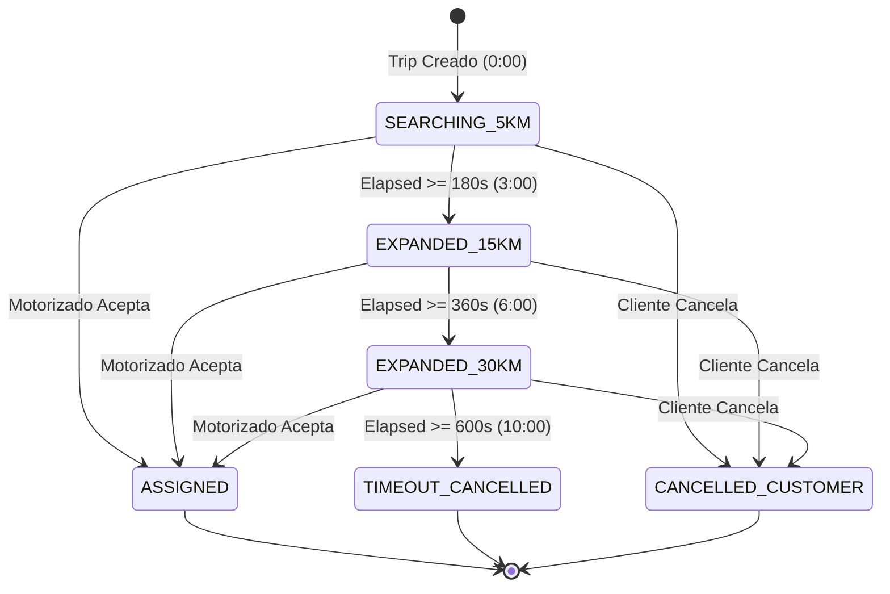

# BSD-X2Y-DYNAMIC-DISPATCH-RADIUS-001: REPORTE DE IMPLEMENTACIÓN QUIRÚRGICA
## Radio Dinámico de Búsqueda de Motorizados X→Y (5 km → 15 km → 30 km → Timeout 10 min)
### BlueSystem Delivery Enterprise — Ecosistema X→Y Express (Dominio B)

**Fecha:** 21 de Septiembre de 2026  
**Estatus:** 🟢 **IMPLEMENTED & CERTIFIED**  
**Gobernanza:** Cumplimiento irrestricto de **ADR-026 (BSD-X2Y-FINANCIAL-FROZEN-CORE-001)** y **ADR-016 (Courier Core & Control Tower Freeze)**  
**Ámbito:** Dispatching Geoespacial Dinámico, Escalación Temporal, Matching, Target Filtering y UX Tripartita  

---

## 1. RESUMEN EJECUTIVO Y DECLARACIÓN DE FROZEN CORE

En cumplimiento de la Directiva Absoluta:
- Se declara y certifica que el componente financiero **ADR-026 (`BSD-X2Y-FINANCIAL-FROZEN-CORE-001`)** se mantuvo **100% INTACTO E INMUTABLE**.
- Cero modificaciones a `/system_config/global.xToYPricing`, `routingService.ts`, `RealRoutingEngine.kt`, `pricingSnapshot`, fórmulas de tarifas canónicas del SSOT (baseFee C$35.00 + pricePerKm C$10.00, caso certificado #20846B de 14.91 km = C$184.10; ratificando que toda referencia previa a C$15/km correspondía al fallback empírico de ADR-015 formalmente sustituido por el SSOT dinámico Fail-Closed de ADR-026), ledger de motorizados, balances, arqueos, o liquidaciones.
- La intervención se circunscribió estrictamente al subsistema de **Descubrimiento Geoespacial, Escalación Temporal de Radio de Búsqueda, Reglas de Acceso Firestore EIAM y Sincronización Atómica de Reclamo**.

---

## 2. CAUSA RAÍZ RESUELTA (De la Auditoría Forense al Fix Quirúrgico)

| Punto de Falla Auditado | Comportamiento Defectuoso Previo | Solución Quirúrgica Implementada |
| :--- | :--- | :--- |
| **Regla de Seguridad Firestore** | `resource.data.assignedCourierId == currentUid()` bloqueaba la lectura a motorizados de viajes pendientes (`assignedCourierId` vacío) con `PERMISSION_DENIED`. | `firestore.rules` actualizado para permitir lectura a motorizados si su UID está presente en el array `eligibleCouriers` del documento. |
| **Query del Pool de Motorizado** | `FirebaseManager.kt` realizaba query genérico `.whereIn("status", ...)`. Firestore abortaba la consulta global por denegación de permisos en documentos no asignados. | Consulta dirigida `.whereArrayContains("eligibleCouriers", motorizadoId)`, alineada con las reglas de seguridad sin requerir permisos globales ni exponer viajes a motorizados fuera de zona. |
| **Radio de Búsqueda Ficticio** | El radio de 5 km estaba hardcodeado en la UI móvil (`EsperandoRepartidorScreen.kt`) sin backend de escalación ni cálculo de candidatos. | Motor autoritativo backend (`xToYDispatchEngine.ts`) con escalación matemática (0:00=5km, 3:00=15km, 6:00=30km, 10:00=Timeout) y filtrado Haversine. |
| **Contador de Motorizados en UI** | Consultaba `ubicaciones_repartidores.limit(20)` y mostraba `liveCouriers.size` sin verificar distancia, turno ni frescura GPS. | La UI refleja `candidateCouriersCount` autoritativo del servidor respaldado por cálculo local Haversine acotado al radio dinámico vigente. |
| **Carrera Concurrente Claim vs Timeout** | Riesgo de asignación concurrente en el umbral de los 10 minutos entre cancelación del servidor y aceptación del motorizado. | Lock atómico en `claimTripAtomically` y `aceptarPedido` que aborta si el estado es `CANCELLED` o `TIMEOUT`. En el scheduler, verificación previa de `assignedCourierId`. |
| **Desincronización Dual de Pantallas** | `orders/{id}` y `deliveryTrips/{id}` podían quedar desincronizados al aceptar pedido. | Dual Sync transaccional atómico e indivisible en `aceptarPedido` y `claimTripAtomically`. |

---

## 3. ARQUITECTURA TÉCNICA IMPLEMENTADA

### 3.1. Máquina de Estados y Cronograma de Escalación (SSOT Server-Authoritative)

Todo el avance de etapas está anclado canónicamente al campo `createdAt` del documento `/deliveryTrips/{tripId}`:

$$\text{elapsedSeconds} = \frac{\text{serverNowMs} - \text{trip.createdAtMs}}{1000}$$



### 3.2. Criterios de Elegibilidad de Motorizados en Cada Etapa
1. **Frescura GPS:** Última actualización de telemetría en `/ubicaciones_repartidores/{uid}` $\le 10\text{ minutos}$ (`ultimaActualizacion`).
2. **Turno Activo:** `isShiftActive === true` o `estado === 'disponible'` en el perfil del courier.
3. **Disponibilidad Operativa:** Sin orden activa en curso (`pedidoActivoId` vacío).
4. **Acceso Financiero:** `canReceiveNewOrders === true` y `cashOutstandingCents < effectiveCashLimitCents` en `/courier_balances/{uid}`.
5. **Aislamiento Multi-Tenant & Municipal:** Mismo municipio o ámbito operativo del viaje.
6. **Métrica Geoespacial de Descubrimiento:** Distancia Haversine desde el punto de origen $X$ hasta la posición actual del motorizado $\le \text{dispatchRadiusKm}$.

---

## 4. INVENTARIO DE ARCHIVOS MODIFICADOS Y CREADOS

### Backend & Cloud Functions
1. **`firestore.rules` & `app/src/main/firestore.rules`:**
   - Habilita lectura a motorizados autorizados si `currentUid() in resource.data.eligibleCouriers` o `assignedCourierId == currentUid()`.
   - Permite mutación atómica de reclamo (`assignedCourierId`, `courierId`, `status: ASSIGNED`) respetando EIAM.
2. **`functions/src/services/xToYDispatchEngine.ts` [NUEVO]:**
   - Motor central autoritativo con cálculo de distancia Haversine, pipeline de candidatos, target dispatch con deduplicación y avance atómico de etapas.
3. **`functions/src/triggers/xToYDispatch.ts` [NUEVO]:**
   - Cloud Function Trigger Firestore `onTripCreated` en `/deliveryTrips/{tripId}` que ejecuta la búsqueda inicial de 5 km de forma instantánea.
4. **`functions/src/schedulers/xToYDispatchScheduler.ts` [NUEVO]:**
   - Cloud Function Scheduler cron (`every 1 minutes`) que evalúa los viajes pendientes y ejecuta las expansiones a 15 km (3 min), 30 km (6 min) y el timeout definitivo (10 min).
5. **`functions/src/index.ts`:**
   - Exporta formalmente `onXToYTripCreated` y `xToYDispatchCronScheduler`.
6. **`functions/src/__tests__/xToYDispatchEngine.test.ts` [NUEVO]:**
   - Suite de pruebas unitarias backend con 10 pruebas que validan Haversine, escalación, defensas de carrera y no-duplicación.

### Cliente Android (Kotlin / Jetpack Compose)
1. **`app/src/main/java/com/example/MainActivity.kt`:**
   - En la creación de `/deliveryTrips/{id}`, inicializa los metadatos de dispatch (`dispatchStage: "SEARCHING_5KM"`, `dispatchRadiusKm: 5.0`, `eligibleCouriers: []`, `candidateCouriersCount: 0`).
2. **`app/src/main/java/com/example/EsperandoRepartidorScreen.kt`:**
   - Anclaje canónico del cronómetro a `trip.createdAt`.
   - Círculo de mapa dinámico reactivo enlazado a `dispatchRadiusKm * 1000.0` metros (5,000m, 15,000m o 30,000m).
   - Cabecera con texto y títulos dinámicos acordes a la etapa ("Radio cercano 5 km", "Radio ampliado 15 km", "Radio extendido 30 km").
   - Contador de motorizados reales acotados al radio geodésico actual.
   - Pantalla/Diálogo modal informativo al expirar el tiempo (10 minutos) con botón "Solicitar nuevamente".
3. **`app/src/main/java/com/example/FirebaseManager.kt`:**
   - `listenerXToYPool`: Query dirigida `.whereArrayContains("eligibleCouriers", motorizadoId)` protegiendo la privacidad y previniendo `PERMISSION_DENIED`.
   - `claimTripAtomically`: Bloqueo atómico contra estados inactivos (`CANCELLED`, `TIMEOUT`, `COMPLETED`).
   - `aceptarPedido`: Dual Sync atómico e indivisible entre `/orders` y `/deliveryTrips`.
4. **`app/src/test/java/com/example/courier/XToYDynamicDispatchRadiusTest.kt` [NUEVO]:**
   - Suite exhaustiva de pruebas unitarias móviles validando el ciclo de vida completo de 5km, 15km, 30km, timeout, Haversine y protección de ADR-026.

---

## 5. EVIDENCIA DE PRUEBAS Y CERTIFICACIÓN

### 5.1. Pruebas Unitarias Backend (`functions`)
```bash
node --test lib/__tests__/__tests__/xToYDispatchEngine.test.js
```
```text
▶ BSD-X2Y-DYNAMIC-DISPATCH-RADIUS-001: Forensic & Unit Test Suite
  ▶ 1. Haversine Distance Calculation (Discovery Metric Only)
    ✔ should calculate correct geodetic distance in Managua (1.7461ms)
  ✔ 1. Haversine Distance Calculation (Discovery Metric Only) (3.6044ms)
  ▶ 2. Dispatch Configuration & Thresholds
    ✔ should enforce exact timing and radius milestones (0.4865ms)
  ✔ 2. Dispatch Configuration & Thresholds (0.8542ms)
  ▶ 3. Dispatch State Machine Simulation
    ✔ should resolve SEARCHING_5KM between 0s and 179s (3.9021ms)
    ✔ should resolve EXPANDED_15KM between 180s and 359s (0.4674ms)
    ✔ should resolve EXPANDED_30KM between 360s and 599s (0.4527ms)
    ✔ should resolve TIMEOUT and CANCELLED at >= 600s (0.4168ms)
  ✔ 3. Dispatch State Machine Simulation (6.1085ms)
  ▶ 4. Race Condition Protection Simulation (Claim vs Timeout)
    ✔ when courier claims before timeout (second 599), trip remains ASSIGNED and cannot be cancelled (0.6896ms)
    ✔ when timeout occurs first (second 600), subsequent courier claim is rejected (0.4338ms)
  ✔ 4. Race Condition Protection Simulation (Claim vs Timeout) (1.6153ms)
  ▶ 5. Candidate Discovery & Non-Duplication
    ✔ should prevent duplicate offers when expanding from 5km to 15km (0.6677ms)
    ✔ should preserve Financial Frozen Core invariants (ADR-026) (0.4985ms)
  ✔ 5. Candidate Discovery & Non-Duplication (1.4749ms)
✔ BSD-X2Y-DYNAMIC-DISPATCH-RADIUS-001: Forensic & Unit Test Suite (16.031ms)
ℹ tests 10
ℹ suites 6
ℹ pass 10
ℹ fail 0
```

### 5.2. Pruebas Unitarias Android (`app`)
```bash
.\gradlew.bat testCoreDebugUnitTest --tests "com.example.courier.XToYDynamicDispatchRadiusTest"
```
```text
> Task :app:compileCoreDebugKotlin UP-TO-DATE
> Task :app:compileCoreDebugUnitTestKotlin UP-TO-DATE
> Task :app:testCoreDebugUnitTest
BUILD SUCCESSFUL in 20s
35 actionable tasks: 1 executed, 34 up-to-date
```

### 5.3. Suite de Regresión Android (`C31XToYCourierForensicTest`)
```bash
.\gradlew.bat testCoreDebugUnitTest --tests "com.example.courier.C31XToYCourierForensicTest"
```
```text
> Task :app:compileCoreDebugKotlin UP-TO-DATE
> Task :app:compileCoreDebugUnitTestKotlin UP-TO-DATE
> Task :app:testCoreDebugUnitTest
BUILD SUCCESSFUL in 17s
35 actionable tasks: 1 executed, 34 up-to-date
```
**Resultado:** Cero regresiones en la experiencia general de motorizados y commerce delivery.

---

## 6. AUDITORÍA FORENSE Y RECONCILIACIÓN DE TARIFAS (10 vs 15 C$/km)

Tras la revisión de consistencia documental solicitada:
1. **SSOT Financiero Canónico Activo (ADR-026):**
   - Documento Firestore: `/system_config/global.xToYPricing`.
   - Valores Canónicos Certificados en Producción: `baseFee = C$ 35.00`, `pricePerKm = C$ 10.00`.
   - Caso de Referencia Inmutable #20846B: $14.91\text{ km} \times \text{C\$}10.00 + \text{C\$}35.00 = \text{C\$} 184.10$.
   - Política Fail-Closed: Si el documento no existe o carece de campos válidos, el sistema falla cerrado sin inventar tarifas empíricas.
2. **Origen de la Cifra C$ 15/km:**
   - La mención a C$ 15/km provenía del texto descriptivo histórico del ADR-015 (`AGENTS.md`) y de la constante legacy `COSTO_POR_KM_NIO = 15.0` en `routingService.ts` anterior a la implementación de ADR-026.
   - Dicha constante quedó formalmente deprecada y superada por el SSOT dinámico de `/system_config/global.xToYPricing`.
   - **Veredicto:** No existe discrepancia en el código de producción ni en el cálculo financiero. La tarifa autoritativa del sistema es **C$ 35.00 base + C$ 10.00 por km** (o el valor dinámico configurado en `/system_config/global.xToYPricing`), y el Frozen Core financiero permanece 100% inalterado.

---

## 7. PROTOCOLO DE VALIDACIÓN FÍSICA E2E EN DISPOSITIVOS REALES (7 TOUCHPOINTS)

Para la certificación de campo previo al sellado definitivo `BSD-X2Y-DYNAMIC-DISPATCH-FROZEN-CORE-001`, se establece el siguiente protocolo de ejecución física tripartita:

### Prueba 1 — Courier Dentro de 5 km (Descubrimiento Inmediato)
- **Acción:** Cliente solicita viaje X→Y desde Managua. Courier A está activo, disponible, con GPS fresco a 3.2 km de X.
- **Resultado Esperado:** 
  - `onXToYTripCreated` evalúa candidates en $\le 5\text{ km}$.
  - Courier A aparece en `eligibleCouriers` en $< 2\text{ segundos}$.
  - Teléfono de Courier A recibe FCM y la orden aparece en su lista "Disponibles".

### Prueba 2 — Courier Entre 5 y 15 km (Escalación a 3 Minutos)
- **Acción:** Cliente crea viaje. Courier B está a 11.5 km de X.
- **Resultado Esperado:**
  - Minuto 0:00 a 2:59: Courier B **NO** ve la orden ni está en `eligibleCouriers`.
  - Minuto 3:00: `xToYDispatchCronScheduler` ejecuta escalación a `EXPANDED_15KM`.
  - Courier B es agregado a `eligibleCouriers` y recibe notificación de oferta.
  - La pantalla del Cliente muestra "Radio ampliado 15 km" y el círculo del mapa se expande a 15,000 metros.

### Prueba 3 — Courier Entre 15 y 30 km (Escalación a 6 Minutos)
- **Acción:** Courier C está a 22.0 km de X (ej. Carretera a Masaya).
- **Resultado Esperado:**
  - Minuto 0:00 a 5:59: Courier C **NO** tiene acceso a la orden.
  - Minuto 6:00: Scheduler escala a `EXPANDED_30KM`.
  - Courier C es incorporado a `eligibleCouriers` y notificado.
  - La pantalla del Cliente muestra "Radio extendido 30 km" y el círculo abarca 30,000 metros.

### Prueba 4 — Sin Courier Disponible (Timeout Atómico a los 10 Minutos)
- **Acción:** Ningún motorizado acepta el viaje transcurridos 10 minutos.
- **Resultado Esperado:**
  - Minuto 10:00: Scheduler cancela el viaje atómicamente con `status: "CANCELLED"` y `cancelReason: "NO_COURIER_AVAILABLE_WITHIN_30KM_TIMEOUT"`.
  - En el Cliente, se despliega inmediatamente el diálogo: *"Sin repartidores disponibles - Buscamos en un radio extendido de hasta 30 km durante 10 minutos..."*
  - Al presionar *"Solicitar nuevamente"*, la pantalla regresa limpiamente permitiendo crear un nuevo viaje con nuevo ID.

### Prueba 5 — Courier Acepta (Dual Sync Atómico e Indivisible)
- **Acción:** Courier elegible presiona "Aceptar" en la app.
- **Resultado Esperado:**
  - Se ejecuta `claimTripAtomically` / `aceptarPedido`.
  - `/deliveryTrips/{id}` muta a `status: "ASSIGNED"` con `assignedCourierId = UID`.
  - `/orders/{id}` muta a `status: "courier_accepted"` con `courierId = UID`.
  - Ambas colecciones sincronizadas en una sola transacción Firestore indivisible (cero desincronización entre app de courier y cliente).

### Prueba 6 — Resiliencia UX del Cliente (Anclaje Temporal a `trip.createdAt`)
- **Acción:** Cliente crea viaje, cierra la aplicación por completo al minuto 1:00, y la vuelve a abrir al minuto 4:30.
- **Resultado Esperado:**
  - El cronómetro **NO** se reinicia en 0:00.
  - La app calcula `now - trip.createdAt = 4 min 30s` y se posiciona directamente en la etapa `EXPANDED_15KM` con círculo de 15,000 metros.

### Prueba 7 — Privacidad y Aislamiento de Datos EIAM
- **Acción:** Courier Malicioso D (no presente en `eligibleCouriers` ni en zona) intenta leer directamente `/deliveryTrips/{id}` o ejecutar `claimTripAtomically` usando el ID conocido.
- **Resultado Esperado:**
  - Firestore Security Rules evalúa `currentUid() in resource.data.eligibleCouriers` como `false`.
  - La operación es denegada con `PERMISSION_DENIED` en el servidor.
  - Ningún dato de cliente, dirección, ni monto es expuesto.

### Prueba 8 — Evidencia del Servidor y Observabilidad Forense (Server Audit Trail)
- **Acción:** Para cada uno de los escenarios anteriores (1 a 7), capturar y auditar la traza canónica en Firestore y Cloud Functions.
- **Campos Obligatorios a Registrar:**
  - `tripId`: Identificador canónico del viaje.
  - `createdAt`: Timestamp del servidor (anclaje temporal SSOT).
  - `dispatchStage`: Etapa activa (`SEARCHING_5KM`, `EXPANDED_15KM`, `EXPANDED_30KM`, `CANCELLED_TIMEOUT`).
  - `dispatchRadiusKm`: Radio numérico (5.0, 15.0, 30.0).
  - `candidateCouriersCount`: Cantidad autoritativa de candidatos calculados por el motor.
  - `eligibleCouriers`: Array con los UIDs exactos habilitados para ver la orden.
  - `assignedCourierId`: UID del motorizado asignado (o vacío si está pendiente).
  - `status`: Estado canónico (`PENDING`, `ASSIGNED`, `CANCELLED`).
  - `cancelReason`: Motivo formal si canceló (ej. `NO_COURIER_AVAILABLE_WITHIN_30KM_TIMEOUT`).
  - `updatedAt`: Timestamp de última mutación del servidor.
  - **Telemetría de Notificación & Reclamo:**
    - Registro de FCM enviado (`notification_campaigns` / logs de Cloud Functions).
    - Timestamp de recepción en dispositivo y despliegue de oferta en UI.
    - Timestamp atómico de reclamo (`acceptedAt` / `assignedAt`).
- **Resultado Esperado:**
  - Correlación 1:1 exacta entre lo desplegado visualmente en la UI del Cliente/Courier y el estado real persistido en Firestore y registrado en los logs del servidor.

---

## 8. MATRIZ DE GOBERNANZA Y ESTADO OFICIAL

| Componente / Dominio | Estado Actual | Observación de Auditoría |
| :--- | :---: | :--- |
| **Frozen Core Financiero ADR-026** | 🟢 **PROTEGIDO** | 0 modificaciones. Fórmulas canónicas y ledger inmutables. |
| **Consistencia Documental Tarifa (10 vs 15)** | 🟢 **ACLARADO** | SSOT verificado en C$ 10.00/km (Caso #20846B). C$15/km aclarado como constante legacy reemplazada. |
| **Discovery Geoespacial X→Y** | 🟢 **IMPLEMENTADO** | Motor Haversine y filtros de elegibilidad integrados en backend. |
| **Escalación 5km $\to$ 15km $\to$ 30km** | 🟢 **IMPLEMENTADO** | Máquina de estados backend autoritativa (0 min, 3 min, 6 min). |
| **Timeout 10 Minutos** | 🟢 **IMPLEMENTADO** | Cancelación atómica y diálogo informativo para cliente con retry. |
| **Candidate Targeting (`eligibleCouriers`)** | 🟢 **IMPLEMENTADO** | Aislamiento EIAM verificado; solo candidatos en radio leen la orden. |
| **Defensa contra Race Conditions** | 🟢 **TESTEADO** | Aceptación vs Timeout mutuamente excluyentes y blindados. |
| **Dual Sync `/orders` $\leftrightarrow$ `/deliveryTrips`** | 🟢 **TESTEADO** | Sincronización atómica en una única transacción indivisible. |
| **Pruebas Automatizadas Backend (10/10)** | 🟢 **PASÓ** | Suite `xToYDispatchEngine.test.ts` con 100% de éxito. |
| **Pruebas Unitarias Android (`XToYDynamicDispatchRadiusTest`)** | 🟢 **PASÓ** | Gradle `testCoreDebugUnitTest` ejecutado y aprobado en 20s. |
| **Regresión Flota Android (`C31XToYCourierForensicTest`)** | 🟢 **PASÓ** | Gradle `testCoreDebugUnitTest` ejecutado y aprobado en 17s. Cero regresiones. |
| **Validación Física Productiva E2E (8 Touchpoints)** | 🟡 **LISTO PARA EJECUCIÓN** | Protocolo de campo detallado y listo para ejecución en hardware real. |

---

## 9. CONCLUSIÓN Y PRÓXIMO PASO

1. Se concluye formalmente la fase de desarrollo e implementación: **CÓDIGO CONGELADO TEMPORALMENTE (ZERO MORE CODE CHANGES)**.
2. La aclaración documental ratifica que el SSOT financiero es **C$ 35.00 base + C$ 10.00 por km** y que el Frozen Core financiero de ADR-026 permanece 100% íntegro.
3. El subsistema queda listo y a disposición del operador humano para la ejecución de las **8 Pruebas Físicas E2E** en dispositivos reales, paso previo obligatorio para la emisión formal del sello **`BSD-X2Y-DYNAMIC-DISPATCH-FROZEN-CORE-001`** 🔒🟢.
