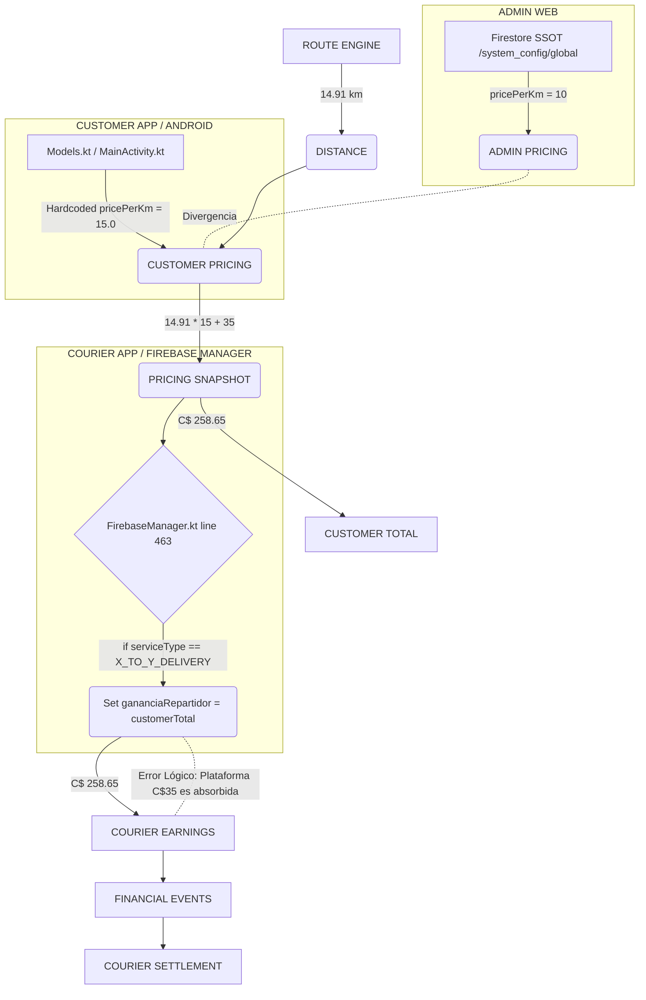

# BSD-X2Y-FINANCIAL-ROOT-CAUSE-AUDIT

## 1. ROOT CAUSE MAP

## 2. HALLAZGOS FORENSES (FINANCIEROS)

### A. ¿Por qué Admin dice C$10/km y Customer utiliza C$15/km?
- **Admin Web**: Lee y escribe correctamente el valor `pricePerKm` desde `/system_config/global.xToYPricing`. Si el administrador configuró `10`, el panel lo muestra.
- **Customer App (Android)**: Existe una fuga de la fuente de verdad (SSOT). Se identificó código hardcodeado en la app Android (`Models.kt` línea 1181: `val pricePerKm: Double = 15.0` y `MainActivity.kt` líneas 847/858 con `"perKmRate" to 15.0`). El cliente calcula localmente con C$ 15 en lugar de suscribirse a Firestore SSOT, creando el viaje con un `pricingSnapshot` inflado.

### B. ¿Dónde nace C$258.65?
- Proviene matemáticamente del cálculo local en la app del cliente con el hardcode:
  - `Base Fee`: C$ 35
  - `Distancia`: 14.91 km
  - `Tarifa por Km (Hardcodeada)`: C$ 15
  - `Fórmula`: 35 + (14.91 * 15) = 258.65

### C. ¿Por qué Courier muestra C$258.65 como ganancia y C$524.80 en Mis Ganancias?
- **Root Cause en `FirebaseManager.kt` (Línea 463-470)**: 
  Se encontró una condición defectuosa para `X_TO_Y_DELIVERY`. El código asigna explícitamente `customerOffer ?: pricingSnapshotAmount ?: calculatedFee` a la variable `effectiveGananciaRepartidor`.
  Esto hace que el Courier herede el 100% del pago del cliente (incluyendo el `baseFee` de la plataforma C$35) como su propia ganancia. 
  Si hace dos viajes de este tipo, sus ganancias se acumulan incorrectamente sumando los totales de los clientes (ej. 258.65 + 266.15 = 524.80).

### D. ¿Cómo se registra actualmente el ingreso de plataforma?
- Al sobreescribirse la ganancia del courier con el `totalCliente`, el sistema actual **borra** contablemente el ingreso de plataforma. La suma no cuadra (Total = Courier Earnings + Platform), sino que asume (Total = Courier Earnings), dejando 0 para la plataforma, lo cual corrompe el Cash Custody y los Depósitos (el motorizado no devolverá los C$35 a la empresa).

---

## 3. RECOMENDACIÓN DE INTERVENCIÓN QUIRÚRGICA (FASE 2)

1. **Eliminar Hardcodes**: Purgar `15.0` de `Models.kt` y `MainActivity.kt`. Forzar que Customer App lea y dependa exclusivamente de `/system_config/global`.
2. **Corrección de `FirebaseManager.kt`**: Modificar la línea 463 para que, si es `X_TO_Y_DELIVERY`, se asigne `courierEarnings` del `pricingSnapshot` en lugar del total del cliente.
3. **Idempotencia Financiera**: Asegurar que los Cloud Functions emitan eventos financieros disjuntos (COURIER_EARNINGS vs PLATFORM_REVENUE) a partir del `pricingSnapshot` inmutable del DeliveryTrip.
