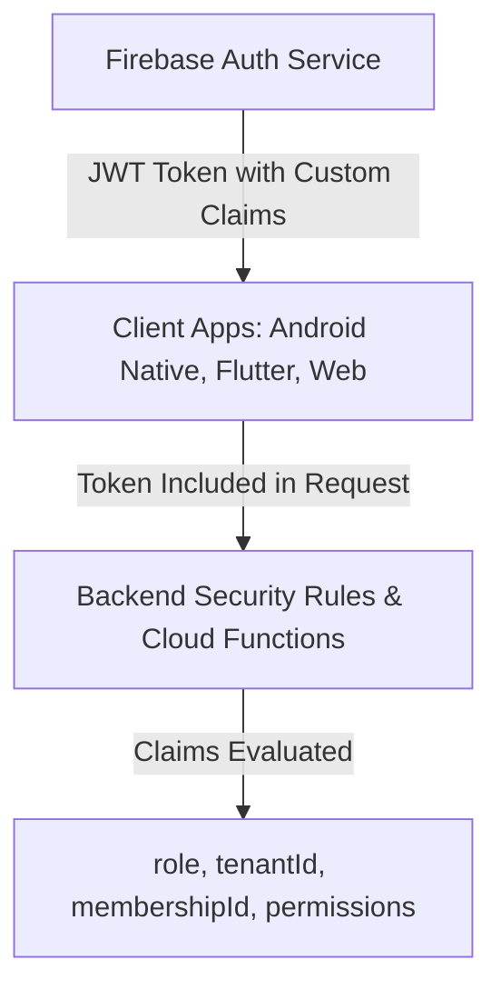

# C2D25E.4 — FIREBASE AUTHENTICATION & EIAM AUDIT
## Protocol ID: `BSD-C2D25E4-MULTI-PLATFORM-CORE-FLUTTER-STRATEGY-AUDIT-001`

---

### 1. Modelo de Identidad Canónica EIAM v2.2/v3

El sistema de autenticación centralizado se basa en **Firebase Authentication** complementado con **Enterprise Identity & Access Management (EIAM)**:



### 2. Estructura Canónica de Custom Claims

```json
{
  "role": "customer | courier | merchant | admin | super_admin",
  "tenantId": "tenant_01_core | tenant_02_fitoni | tenant_03_enterprise",
  "membershipId": "mem_usr_849204",
  "brandId": "brand_fitoni_01",
  "permissions": ["orders:create", "orders:view", "tracking:view"],
  "accountStatus": "ACTIVE"
}
```

---

### 3. Evaluación de Compatibilidad Multiplataforma

1. **Reutilización Directa:** Firebase Auth proporciona SDKs oficiales de primera clase para **Flutter (iOS y Android)** (`firebase_auth`), **Android Nativo** y **Web**.
2. **Cero Duplicación de Identidad:** Un usuario registrado en la base de datos puede iniciar sesión indistintamente desde la app Android nativa actual o desde una nueva app Flutter con las mismas credenciales y recibiendo exactamente los mismos Custom Claims.
3. **Flujos Soportados:** Email/Password, Teléfono (SMS OTP), Custom Tokens y Sign-in anónimo.

---

### 4. Veredicto de Autenticación

```text
══════════════════════════════════════════════════════════════
AUTHENTICATION MULTI-PLATFORM VERDICT:
🟢 100% UNIFIED & UNIVERSAL (ONE IDENTITY MODEL FOR ALL CLIENTS)
══════════════════════════════════════════════════════════════
```
