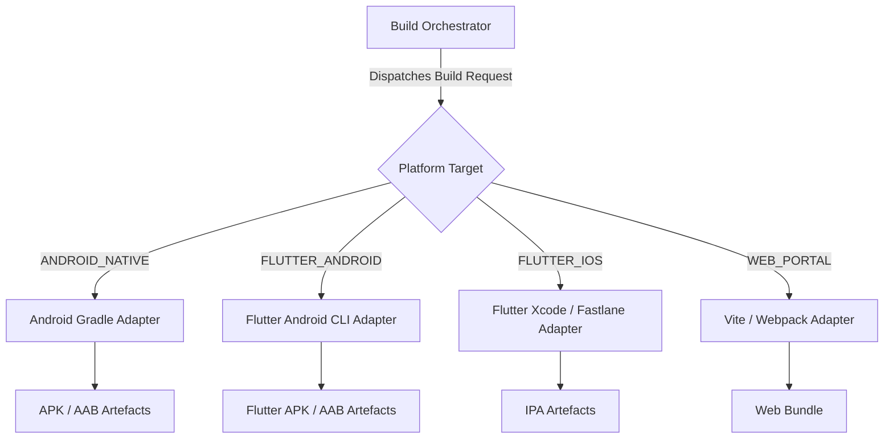

# C2D25E.4 — BUILD ENGINE MULTI-PLATFORM AUDIT
## Protocol ID: `BSD-C2D25E4-MULTI-PLATFORM-CORE-FLUTTER-STRATEGY-AUDIT-001`

---

### 1. Desacoplamiento Arquitectónico del Build Engine

Actualmente, el Build Engine se compone conceptualmente de un Orquestador y Adaptadores por plataforma:



---

### 2. Separación entre Orquestación y Toolchains Específicos

- **Build Orchestrator (Core):**
  - Valida el token de autorización (`BuildAuthorizationEntity`).
  - Resuelve la configuración de marca (`tools/brand_asset_resolver.js`).
  - Genera el hash criptográfico SHA-256 del artefacto final.
  - Registra el artefacto en Cloud Storage y actualiza `/build_requests/{id}`.
- **Platform Build Adapters (Específicos):**
  - `Android Gradle Adapter`: Invoca `./gradlew assembleWhitelabelRelease`.
  - `Flutter Build Adapter`: Invocará `flutter build apk` o `flutter build ipa` en fases futuras autorizadas.

---

### 3. Veredicto del Build Engine

```text
══════════════════════════════════════════════════════════════
BUILD ENGINE MULTI-PLATFORM VERDICT:
🟢 ARCHITECTURALLY DECOUPLED (ORCHESTRATOR IS FULLY PLATFORM-AGNOSTIC)
══════════════════════════════════════════════════════════════
```
