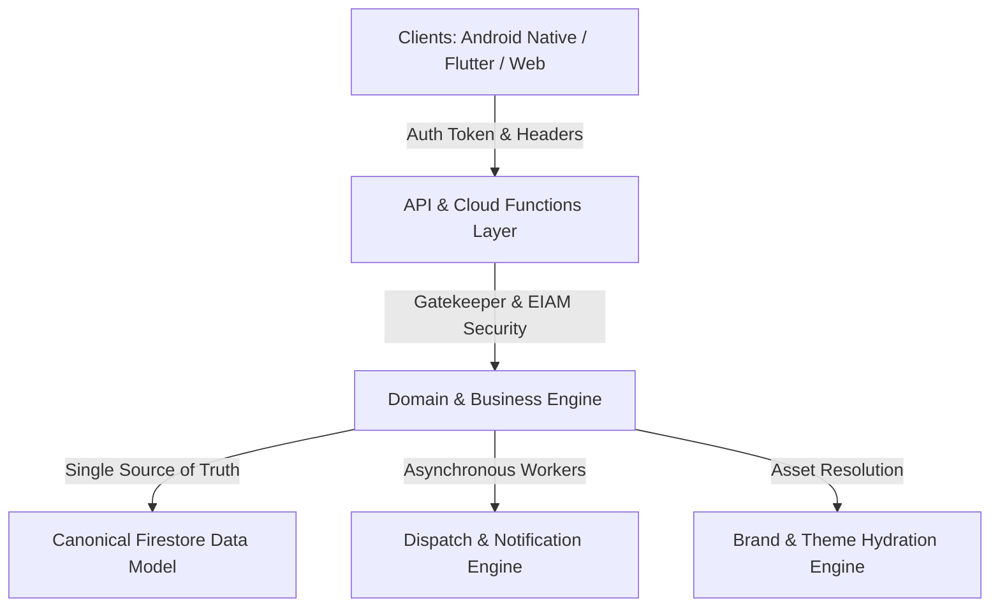

# C2D25E.4 — CURRENT BLUE SYSTEM CORE STATE
## Protocol ID: `BSD-C2D25E4-MULTI-PLATFORM-CORE-FLUTTER-STRATEGY-AUDIT-001`

---

### 1. Inventario y Estado del Core Canónico

El Core de BlueSystem Delivery Enterprise está estructurado en 6 capas arquitectónicas universales:

### 2. Clasificación de Componentes del Core

| Componente | Archivo / Ubicación | Rol Canónico | Estado Multi-Platform |
| :--- | :--- | :--- | :--- |
| **Authentication & EIAM** | `functions/src/triggers/auth.ts`, `services/eiam-identity-service` | Asignación de Custom Claims (`role`, `tenantId`, `permissions`), tokens JWT | 🟢 100% Frontend-Agnostic |
| **Gatekeeper Engine** | `functions/src/domain/gatekeeper/gatekeeper.ts` | Evaluación de Default-Deny, Suscripción, Entitlements y Cuotas | 🟢 100% Frontend-Agnostic |
| **Platform Data Models** | `functions/src/domain/platform/models.ts` | Entidades Tenant, Brand, Subscription, AppConfig, BuildRequest | 🟢 100% Frontend-Agnostic |
| **Order Lifecycle Triggers** | `functions/src/triggers/orders.ts` | Máquina de estados de pedidos, validación de transiciones, cálculo de SLAs | 🟢 100% Frontend-Agnostic |
| **Trip (X→Y) Triggers** | `functions/src/triggers/trips.ts` | Ciclo de vida de envíos punto a punto, asignación atómica de motorizados | 🟢 100% Frontend-Agnostic |
| **Notification Worker** | `functions/src/services/notificationQueueWorker.ts` | Despacho FCM Multicast con soporte simultáneo Android & APNs (iOS) | 🟢 100% Frontend-Agnostic |
| **Coupon & Loyalty Engine**| `functions/src/callables/coupons.ts`, `loyaltyCallables.ts` | Aplicación de cupones, saldo de puntos, validación de elegibilidad | 🟢 100% Frontend-Agnostic |
| **Merchant Lifecycle** | `functions/src/triggers/merchantLifecycleSync.ts` | Sincronización de catálogos, estados de activación y sucursales | 🟢 100% Frontend-Agnostic |
| **Email Service** | `functions/src/services/emailService.ts` | Envíos SMTP transaccionales con reintentos e idempotencia | 🟢 100% Frontend-Agnostic |
| **Brand Asset Resolver** | `tools/brand_asset_resolver.js`, `BrandVisualConfig` | Transformación de paletas HEX, tipografías y URLs de assets a configuraciones de cliente | 🟢 100% Frontend-Agnostic |

---

### 3. Principio de Fuente Única de Verdad (Single Source of Truth)

1. **Sin Esquemas Duplicados:** No existen ni se requieren esquemas específicos como `flutter_orders` o `flutter_users`. Toda la información se persiste en las colecciones maestras `/orders`, `/users`, `/tenants`, `/brands`.
2. **Contratos Inmutables:** Los campos de identidad (`tenantId`, `brandId`, `customerId`, `courierId`, `orderId`) mantienen exactamente la misma semántica en Android Native, Flutter Android, Flutter iOS y Web.
3. **Idempotencia Transaccional:** Todas las operaciones monetarias y de asignación se ejecutan mediante `runTransaction` o Cloud Functions protegidas.
