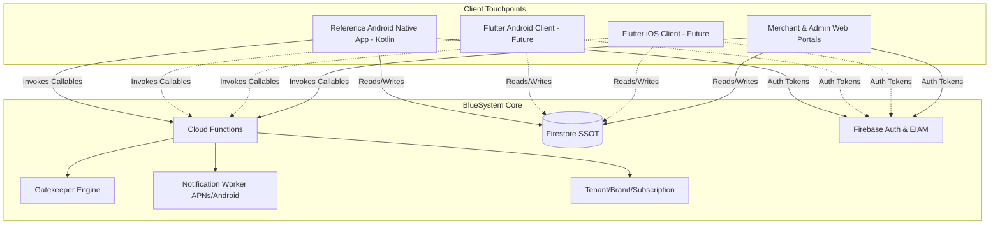

# C2D25E.4 — ECOSYSTEM DEPENDENCY MAP
## Protocol ID: `BSD-C2D25E4-MULTI-PLATFORM-CORE-FLUTTER-STRATEGY-AUDIT-001`

---

### 1. Mapa de Dependencias del Ecosistema

---

### 2. Análisis de Dependencias Cruzadas
- **Core a Clientes:** CERO dependencias. El Core no importa ni invoca ningún módulo de cliente.
- **Clientes a Core:** Dependencia limpia y desacoplada a través de Firebase SDKs y Cloud Functions HTTPS Callables.
