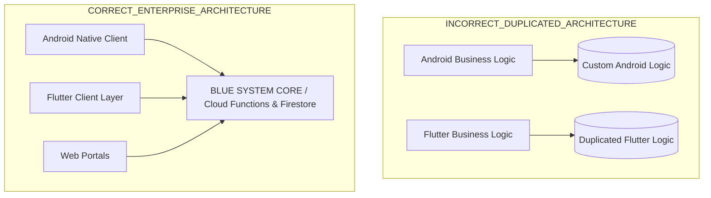

# C2D.25E.5 — CORE / CLIENT BOUNDARY ANALYSIS
## Protocol ID: `BSD-C2D25E5-FLUTTER-FOUNDATION-MULTIPLATFORM-ARCHITECTURE-001`

---

### 1. Clasificación Canónica de Componentes

```text
┌─────────────────────────────────────────────────────────────────────────────┐
│                       CORE / CLIENT BOUNDARY TAXONOMY                       │
├─────────────────────────────────────────────────────────────────────────────┤
│ (A) BLUE SYSTEM CORE: Backend / Rules / Domain / Single Source of Truth      │
│ (B) ANDROID REFERENCE CLIENT: Native App (Track A)                          │
│ (C) FLUTTER CLIENT LAYER: Multi-Platform Presentation & Services            │
│ (D) PLATFORM ADAPTER: OS Capabilities Abstraction (GPS, Push, SecureStore)  │
│ (E) SHARED CONTRACT: Canonical Schemas, Claims & Error Codes                │
└─────────────────────────────────────────────────────────────────────────────┘
```

| Componente | Clasificación | Ubicación Canónica | Justificación Técnica |
| :--- | :--- | :--- | :--- |
| **Dispatch & Order State Machine** | `BLUE SYSTEM CORE` | `functions/src/triggers/orders.ts` | Reglas de asignación y transición de órdenes autoritativas en Backend. |
| **X→Y Delivery Pricing Engine** | `BLUE SYSTEM CORE` | `functions/src/callables/calculateDeliveryRoute.ts` | Tarifa base ($35) + distancia calculada autoritativamente. |
| **Courier Settlement & Ledger** | `BLUE SYSTEM CORE` | `functions/src/callables/courierSettlement.ts` | Cuadre de caja y cierre diario inmutable. |
| **Security Rules (EIAM v2.2/v3)** | `BLUE SYSTEM CORE` | `firestore.rules`, `storage.rules` | Aislamiento estricto y control de acceso en servidor. |
| **Android Compose Views & Activities** | `ANDROID REFERENCE CLIENT` | `app/src/main/java/` | Implementación nativa de referencia protegida en Track A. |
| **Room Database & WorkManager** | `ANDROID REFERENCE CLIENT` | `app/src/main/java/` | Cache offline nativa de Android. |
| **Flutter Widgets & Theme Builder** | `FLUTTER CLIENT LAYER` | `flutter_client/lib/presentation/` | Renderizado declarativo multiplataforma para nuevas apps. |
| **Flutter Domain Entities & Services** | `FLUTTER CLIENT LAYER` | `flutter_client/lib/domain/` | Clientes que consumen el Core sin duplicar lógica de negocio. |
| **GPS / Location Provider** | `PLATFORM ADAPTER` | `flutter_client/lib/platform/gps/` | Abstracción de `Geolocator` / FusedLocationProvider / CoreLocation. |
| **Push Notifications (FCM/APNs)** | `PLATFORM ADAPTER` | `flutter_client/lib/platform/notifications/` | Abstracción de recepción y registro de tokens de dispositivo. |
| **Secure KeyStore / Keychain** | `PLATFORM ADAPTER` | `flutter_client/lib/platform/storage/` | Cifrado nativo de credenciales en reposo. |
| **AppConfig / Tenant / Brand Models** | `SHARED CONTRACT` | `functions/src/domain/platform/models.ts` & `flutter_client/lib/core/` | Contratos espejo idénticos en TypeScript y Dart. |

---

### 2. Flujo Arquitectónico Correcto vs. Incorrecto



**Conclusión:** Flutter opera estrictamente como una capa de presentación y consumo de servicios, garantizando **Cero Duplicación de Lógica de Negocio** y **Cero Regresiones en el Core**.
