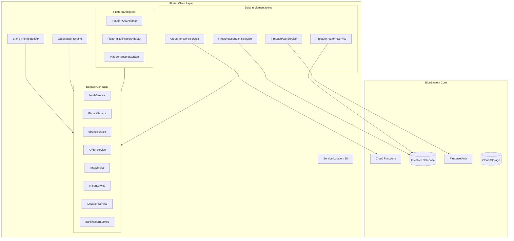

# C2D.25E.5 — DEPENDENCY MAP
## Protocol ID: `BSD-C2D25E5-FLUTTER-FOUNDATION-MULTIPLATFORM-ARCHITECTURE-001`

---

### 1. Mapa de Dependencias del Ecosistema

```mermaid
graph TD
    subgraph BACKEND_CORE [BlueSystem Core]
        CF[Cloud Functions]
        FS[(Firestore Database)]
        AUTH[Firebase Auth]
        GCS[(Cloud Storage)]
    end

    subgraph FLUTTER_FOUNDATION [Flutter Client Layer]
        DI[Service Locator / DI]
        GATE[Gatekeeper Engine]
        THEME[Brand Theme Builder]
        
        subgraph DOMAIN_INTERFACES [Domain Contracts]
            IAUTH[IAuthService]
            ITEN[ITenantService]
            IBRAND[IBrandService]
            IORD[IOrderService]
            ITRIP[ITripService]
            IFLEET[IFleetService]
            ILOC[ILocationService]
            INOT[INotificationService]
        end
        
        subgraph DATA_SERVICES [Data Implementations]
            FAUTH[FirebaseAuthService]
            FPLAT[FirestorePlatformService]
            FOPS[FirestoreOperationsService]
            FCF[CloudFunctionsService]
        end
        
        subgraph PLATFORM_ADAPTERS [Platform Adapters]
            PGPS[PlatformGpsAdapter]
            PNOT[PlatformNotificationAdapter]
            PSEC[PlatformSecureStorage]
        end
    end

    %% Wiring
    DATA_SERVICES --> DOMAIN_INTERFACES
    PLATFORM_ADAPTERS --> DOMAIN_INTERFACES
    
    FAUTH --> AUTH
    FPLAT --> FS
    FOPS --> FS
    FCF --> CF
    
    GATE --> DOMAIN_INTERFACES
    THEME --> DOMAIN_INTERFACES
```
