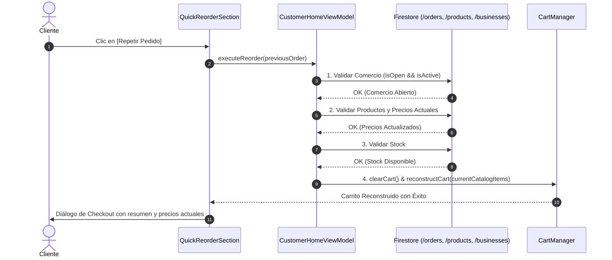

# BLUE SYSTEM DELIVERY ENTERPRISE
# C2D — CUSTOMER DASHBOARD DESIGN & CORRECTION MASTER PLAN (AMENDED)
## ESPECIFICACIÓN TÉCNICA DEFINITIVA, GOBERNANZA DE SERVICIOS, SEGURIDAD DE ANALÍTICAS Y CERTIFICACIÓN E2E

**Protocolo:** `BSD-C2D-CUSTOMER-DASHBOARD-AMENDMENT-001`  
**Nombre Oficial:** C2D — Revisión, Amendment y Cierre Técnico del Customer Dashboard Master Plan  
**Tipo de Actividad:** ARCHITECTURAL REVIEW / TECHNICAL AMENDMENT / CONTRACT VALIDATION / SECURITY REVIEW  
**Modo:** AUDIT-FIRST / READ-ONLY / ZERO CODE MUTATION / ZERO DB MUTATION / ZERO DEPLOYMENT  
**Fecha:** 2026-09-07  
**Auditor Principal & Diseñador de Sistemas:** Senior Developer & Auditor de BlueSystem v2.1 Enterprise  
**Estado del Amendment:** 🟢 **TECHNICAL AMENDMENT SEALED / READY FOR IMPLEMENTATION C2D**

---

## 01. Executive Summary

El presente documento constituye el **Amendment Técnico Oficial** sobre el Plan Maestro de Diseño y Corrección del Customer Dashboard (`C2D_CUSTOMER_DASHBOARD_DESIGN_CORRECTION_MASTER_PLAN.md`). 

A través de esta revisión exhaustiva, se detectaron y subsanaron deficiencias críticas presentes en la formulación inicial:
1. **Riesgo de Seguridad en Analíticas (P0):** La propuesta preliminar de autorizar `allow create, update: if isAuthenticated()` sobre `/dashboardAnalytics` exponía los agregados financieros y de conversión a manipulación maliciosa de contadores (`revenue`, `orders`). Se sustituye por una **Arquitectura de Analíticas en Dos Capas**: Capa de Ingesta de Eventos Inmutables (`/dashboard_events/{eventId}`) y Capa de Agregación Autorizada por Servidor.
2. **Definición Canónica de Métrica Única de Ventas:** Se elimina la ambigüedad entre `salesVolume30d` y `monthlySalesCount`, fijando como métrica autoritativa indivisible **`unitsSold30d: Int`**, calculada exclusivamente por agregadores backend sobre órdenes completadas.
3. **Contrato de Verdad Semántica para Comercios:** Se prohíbe el uso de heurísticas locales en memoria. Se establecen esquemas formales en Firestore para `priceParityVerified` (Mismo Precio), `activatedAt` (Comercios Nuevos) y un algoritmo ponderado determinista de 4 factores para Recomendados.
4. **Gobernanza Formal de X→Y (Servicio vs Feed):** Se consolida la clasificación técnica canónica: `X_TO_Y_DELIVERY` es un **Módulo de Capacidad de Plataforma (Platform Capability Module)**, mientras que `EXPRESS_DELIVERY` es un **Bloque de Entrada de Servicio (Customer Service Entry Block)** en el feed dinámico de la Home, manteniendo desacoplados `serviceEnabled` de `homeVisible`.
5. **Reordenamiento Seguro de 7 Capas para `QUICK_REORDER`:** Se especifica el motor de reordenamiento que construye un nuevo carrito sobre el catálogo vivo, garantizando que jamás se cobren precios desactualizados ni se ordenen platillos descontinuados.
6. **Ampliación a 17 Certification Gates:** Se formaliza una batería de 17 puertas de calidad indispensables antes de cualquier paso a producción.

---

## 02. Amendment Scope

El alcance del presente Amendment abarca:
- Validación técnica y de seguridad de [firestore.rules](file:///c:/Users/geral/OneDrive/Escritorio/TECNOCOMP%202026/Sistemas/BlueSystem_delivery/firestore.rules).
- Alineación del contrato de modelos Kotlin ([Models.kt](file:///c:/Users/geral/OneDrive/Escritorio/TECNOCOMP%202026/Sistemas/BlueSystem_delivery/app/src/main/java/com/example/Models.kt)) con el panel administrativo ([dashboardManager.js](file:///c:/Users/geral/OneDrive/Escritorio/TECNOCOMP%202026/Sistemas/BlueSystem_delivery/panel-admin/public/js/dashboard/dashboardManager.js)) y Firestore (`/dashboard/configuration`).
- Especificación del motor de reordenamiento [QuickReorderSection.kt](file:///c:/Users/geral/OneDrive/Escritorio/TECNOCOMP%202026/Sistemas/BlueSystem_delivery/app/src/main/java/com/example/presentation/customer/home/QuickReorderSection.kt).
- Definición de los estados canónicos y la matriz de fallos para X→Y Delivery.
- Política formal del motor anti-duplicación `DashboardDeduplicationEngine`.
- Protección estricta de todos los módulos congelados certificados (ADR-013 a ADR-020).

**Exclusiones Estrictas:**
- Cero mutaciones de código en esta sesión.
- Cero despliegues a Firebase Functions, Hosting o Rules.
- Cero alteraciones al motor de despacho de Courier ni al cotizador Haversine.

---

## 03. Source Evidence

Todas las decisiones contenidas en este Amendment se fundamentan en evidencia técnica comprobada en el repositorio:
1. `CUSTOMER_DASHBOARD_BLOCKS_FORENSIC_AUDIT_REPORT.md`: Auditoría forense previa que demostró la ausencia del renderer de `QUICK_REORDER`, la omisión de `/dashboardAnalytics` en las reglas y las heurísticas arbitrarias de `CuratedBusinessSections.kt`.
2. `docs/BLUE_SYSTEM_PLATFORM_RADIOGRAPHY/16_FIRESTORE_COMPLETE_MAP.md`: Mapeo exhaustivo de colecciones existentes.
3. `docs/BLUE_SYSTEM_PLATFORM_RADIOGRAPHY/17_FIRESTORE_SECURITY.md`: Matriz de seguridad EIAM v2.1/v3.
4. `docs/BLUE_SYSTEM_PLATFORM_RADIOGRAPHY/25_MENU_BANNERS_PROMOTIONS.md`: Contrato de caché inteligente y versionado de menú (ADR-003).
5. `functions/src/domain/gatekeeper/catalog.ts`: Catálogo canónico de capacidades donde `X_TO_Y_DELIVERY` figura como módulo de plataforma.
6. `C29_COURIER_X_TO_Y_DELIVERY_EXPERIENCE_CERTIFICATION_REPORT.md`: Certificación E2E de operaciones de motorizados para encomiendas.

---

## 04. Current Plan Defects (Defectos del Plan Previo Corregidos)

| ID Defecto | Sección Original | Deficiencia Detectada | Corrección en este Amendment |
| :--- | :--- | :--- | :--- |
| **DEF-01** | Sección 14 (Analytics) | Proponía `allow create, update: if isAuthenticated()` en `/dashboardAnalytics`, permitiendo al cliente alterar métricas agregadas de `revenue` y `orders`. | Se bifurca en Capa de Eventos Inmutables (`/dashboard_events`) y Capa de Agregados protegida por servidor. |
| **DEF-02** | Sección 08 (Redesign) | Mencionaba indistintamente `monthlySalesCount` y `salesVolume30d`. | Se estandariza una única métrica canónica: **`unitsSold30d`**. |
| **DEF-03** | Sección 08 (Redesign) | Asumía la existencia de `activatedAt` sin especificar fallback ni regla de auditoría. | Se define fallback estricto: `activatedAt` $\rightarrow$ `approvedAt` $\rightarrow$ No califica como nuevo. |
| **DEF-04** | Sección 13 (15 Bloques) | No distinguía semánticamente entre bloques de catálogo comercial y entradas de servicios de plataforma. | Se establece: **14 Bloques Comerciales + 1 Bloque de Entrada de Servicio (`EXPRESS_DELIVERY`)**. |
| **DEF-05** | Sección 27 (Gates) | Solo definía 5 puertas de certificación genéricas. | Se expande formalmente a **17 Certification Gates (Gate 0 a Gate 16)**. |

---

## 05. Corrected Architecture

```mermaid
flowchart TD
    subgraph Gatekeeper_Layer [Capa de Capacidad y Entitlements]
        GK[Gatekeeper: MODULE_CATALOG]
        CapXY[Capability: X_TO_Y_DELIVERY]
        SubPlan[Tenant Subscription Plan]
    end

    subgraph Admin_Control [Dashboard Manager Enterprise v2.3]
        DM_Toggles[Toggles de Visibilidad: 14 Commerce + 1 Service]
        DM_Order[Orden de Bloques: Array Canónico de 15 IDs]
        DM_Ops[Platform Services Switch: xToYServiceEnabled]
    end

    subgraph Storage_Layer [Capa de Datos Firestore]
        FS_Config[/dashboard/configuration]
        FS_Events[/dashboard_events - Inmutable append-only]
        FS_Aggs[/daily_merchant_analytics - Server Aggregated]
        FS_Biz[/businesses - Canonical Verified Attributes]
    end

    subgraph Client_Presentation [Customer Home Architecture]
        DedupeEngine[DashboardDeduplicationEngine M=2]
        FeedOrchestrator[CustomerHomeFeedSection - 15 Renderers]
        QuickReorderComp[QuickReorderSection - 7-Layer Validator]
        ExpressBannerComp[ExpressDeliveryBanner - Governed Component]
    end

    Gatekeeper_Layer --> Admin_Control
    Admin_Control --> FS_Config
    FS_Config --> Client_Presentation
    Client_Presentation --> DedupeEngine
    DedupeEngine --> FeedOrchestrator
    FeedOrchestrator --> QuickReorderComp
    FeedOrchestrator --> ExpressBannerComp
    Client_Presentation -->|Log Safe Events| FS_Events
    FS_Events -.->|Server Processing| FS_Aggs
```

---

## 06. Analytics Security Amendment (P0)

### El Riesgo Eliminado:
Permitir que un cliente móvil autenticado ejecute `setDoc` con merge sobre `/dashboardAnalytics/{docId}` permite ataques de manipulación en los que un atacante inyecta:
```json
{
  "orders": 999999,
  "revenue": 50000000.0,
  "clicks": 1000000
}
```
Esto destruiría por completo la integridad financiera del Business Intelligence de la empresa y los rankings de comercios.

### Arquitectura de Dos Capas Aprobada:

#### Capa 1: Registro Inmutable de Eventos (`/dashboard_events/{eventId}`)
Colección append-only donde los clientes registran interacciones en tiempo real:
- `eventId`: UUID generado por cliente o deterministic hash.
- **Operaciones Permitidas:** Únicamente `create`.
- **Operaciones Prohibidas:** Terminantemente denegados `update` y `delete`.

#### Regla Canónica en `firestore.rules`:
```javascript
match /dashboard_events/{eventId} {
  allow read: if isPlatformAdmin();
  allow create: if isAuthenticated() &&
    request.resource.data.keys().hasOnly([
      'eventId', 'tenantId', 'customerId', 'itemId', 'itemType', 
      'eventType', 'timestamp', 'sessionId', 'sectionId'
    ]) &&
    request.resource.data.customerId == request.auth.uid &&
    request.resource.data.itemType in ['banner', 'business', 'product', 'deal', 'branch', 'express_delivery'] &&
    request.resource.data.eventType in ['impression', 'click', 'add_to_cart'] &&
    request.resource.data.timestamp == request.time;
  allow update, delete: if false;
}
```

#### Capa 2: Agregados y Métricas de Rendimiento (`/dashboardAnalytics/{docId}`)
- **Escritura para Clientes:** `allow write: if false;`
- **Actualización:** Gestionada exclusivamente por Cloud Functions o Admin Backend:
  - Las conversiones de `order` y `revenue` se calculan en el servidor cuando una orden es creada o completada en `/orders/{orderId}`.
  - Los clics e impresiones se agregan en batch mediante función programada cada hora.

---

## 07. Analytics Data Model

### Matriz de Atributos de Evento (`/dashboard_events`):

| Campo | Tipo | Origen | Modificable por Cliente | Restricción de Validación |
| :--- | :--- | :--- | :---: | :--- |
| `eventId` | String | Cliente (UUID) | Solo en `create` | No vacío, longitud $\le 64$ |
| `tenantId` | String | Cliente / Contexto | Solo en `create` | Coincide con tenant o `"default"` |
| `customerId` | String | Cliente | Solo en `create` | `== request.auth.uid` |
| `itemId` | String | Cliente | Solo en `create` | ID del banner, comercio o producto |
| `itemType` | String | Cliente | Solo en `create` | Enum estricto |
| `eventType` | String | Cliente | Solo en `create` | `'impression' \| 'click' \| 'add_to_cart'` |
| `sectionId` | String | Cliente | Solo en `create` | Uno de los 15 Section IDs canónicos |
| `sessionId` | String | Cliente | Solo en `create` | ID de sesión efímera del usuario |
| `timestamp` | Timestamp | Servidor | ❌ Inmutable | `== request.time` (Server Timestamp) |

---

## 08. Data Contract Amendment

Se establece la estructura canónica del contrato de configuración en [Models.kt](file:///c:/Users/geral/OneDrive/Escritorio/TECNOCOMP%202026/Sistemas/BlueSystem_delivery/app/src/main/java/com/example/Models.kt):

```kotlin
@com.google.firebase.firestore.IgnoreExtraProperties
data class DashboardConfig(
    // 14 Toggles Comerciales Existentes
    val showBanners: Boolean = true,
    val showCategories: Boolean = true,
    val showBranchesBlock: Boolean = true,
    val showFeaturedBusinesses: Boolean = true,
    val showFeaturedProducts: Boolean = true,
    val showPromotions: Boolean = true,
    val showSamePrice: Boolean = true,
    val showFlashDeals: Boolean = true,
    val showTopSelling: Boolean = true,
    val showRecommended: Boolean = true,
    val showNewBusinesses: Boolean = true,
    val showQuickReorder: Boolean = true,
    val showFavoritesBlock: Boolean = true,
    val showNearbyBusinesses: Boolean = true,

    // 1 Toggle de Entrada de Servicio (Bloque 15)
    val showExpressDeliveryBanner: Boolean = true,

    // Parámetros Geoespaciales Cerca de Ti (Actividad #18)
    val nearbyInitialRadiusKm: Double = 5.0,
    val nearbySecondaryRadiusKm: Double = 10.0,
    val nearbyMaxRadiusKm: Double = 15.0,
    val nearbyMinimumMerchantCount: Int = 5,
    val nearbyAutoExpandEnabled: Boolean = true,
    val nearbyOrdering: String = "nearest", // "nearest" | "rating"

    // Gobernanza Operativa de Plataforma
    val xToYServiceEnabled: Boolean = true,

    // Array Canónico de 15 Secciones
    val sectionOrder: List<String> = CANONICAL_DEFAULT_SECTION_ORDER
) {
    companion object {
        val CANONICAL_DEFAULT_SECTION_ORDER: List<String> = listOf(
            "BANNERS",
            "CATEGORIES",
            "BRANCHES",
            "NEARBY",
            "FEATURED_BUSINESSES",
            "FEATURED_PRODUCTS",
            "FLASH_DEALS",
            "PROMOTIONS",
            "SAME_PRICE",
            "TOP_SELLING",
            "RECOMMENDED",
            "NEW_BUSINESSES",
            "QUICK_REORDER",
            "FAVORITES",
            "EXPRESS_DELIVERY"
        )
    }

    fun getNormalizedSectionOrder(): List<String> {
        val result = mutableListOf<String>()
        val knownUpperSet = CANONICAL_DEFAULT_SECTION_ORDER.toSet()

        sectionOrder.forEach { rawId ->
            val id = rawId.trim().uppercase()
            if (knownUpperSet.contains(id) && !result.contains(id)) {
                result.add(id)
            }
        }

        CANONICAL_DEFAULT_SECTION_ORDER.forEach { canonicalId ->
            if (!result.contains(canonicalId)) {
                result.add(canonicalId)
            }
        }

        return result
    }
}
```

---

## 09. Field Ownership Matrix

| Campo | Entidad / Colección | Dueño de Escritura | Lectores | Imputable / Modificable por | Frecuencia de Actualización |
| :--- | :--- | :--- | :--- | :--- | :--- |
| `sectionOrder` | `/dashboard/configuration` | Admin de Plataforma | Cliente Android, Admin | Admin Web | Bajo demanda |
| `showExpressDeliveryBanner`| `/dashboard/configuration` | Admin de Plataforma | Cliente Android, Admin | Admin Web | Bajo demanda |
| `xToYServiceEnabled` | `/dashboard/configuration` | Operaciones / Admin | Cliente Android, Courier, Backend | Admin Web / Cloud Functions | Bajo contingencia |
| `priceParityVerified` | `/businesses/{id}` | Auditor Comercial | Cliente Android, Merchant | Auditoría Comercial | Tras auditoría de menú |
| `parityAuditedAt` | `/businesses/{id}` | Auditor Comercial | Cliente Android, Merchant | Auditoría Comercial | Tras auditoría de menú |
| `unitsSold30d` | `/businesses/{id}` | Scheduled Cloud Function | Cliente Android, Admin | Job Nocturno Backend | Diaria (02:00 UTC) |
| `activatedAt` | `/businesses/{id}` | Proceso de Onboarding | Cliente Android, Admin | Aprobación Comercial | Una sola vez (Inmutable) |

---

## 10. Top Selling Metric Definition

1. **Métrica Única Canónica:** `unitsSold30d: Int` (Descartado formalmente `monthlySalesCount` para evitar duplicidad).
2. **Fórmula de Cálculo:**
   $$\text{unitsSold30d} = \sum_{\text{orders in last 30d}} \left( \sum \text{item.quantity} \right)$$
   para todas las órdenes donde:
   - `businessId == targetBusinessId`
   - `status == "delivered"` o `status == "completed"`
   - `createdAt >= Timestamp.now() - 30 days`
   - `isTest != true`
   - Excluyendo expresamente órdenes con `status in ["cancelled", "rejected", "refunded"]`.
3. **Persistencia y Actualización:** El valor se almacena como un entero en el documento `/businesses/{businessId}` y se indexa para permitir consultas descendentes directas sin agregaciones al vuelo en el cliente móvil.

---

## 11. Same Price Contract

1. **Nivel de Verificación:** Verificación a **Nivel Comercio (Business-Level Parity)**.
2. **Esquema en Firestore:**
   ```json
   {
     "priceParityVerified": true,
     "parityAuditedAt": "2026-08-15T10:00:00Z",
     "parityAuditedBy": "usr_auditor_01",
     "parityAuditSource": "PHYSICAL_STORE_CHECK"
   }
   ```
3. **Invalidación Automática:**
   - La certificación tiene una vigencia máxima de **90 días**. Si `parityAuditedAt < now - 90 days`, el comercio es excluido automáticamente de la sección.
   - Si un comercio realiza aumentos de precio superiores al $5\%$ en su menú online sin reportar al auditor, la certificación es revocada manualmente o por script de auditoría.
4. **Comportamiento en UI:** Si no hay suficientes comercios con certificación vigente, la sección se oculta limpiamente (`if (samePriceList.isEmpty()) return`) sin romper el layout ni emitir reclamos comerciales falsos.

---

## 12. Recommended Contract

Se formaliza el **Algoritmo Determinista de 4 Factores (Client-Side Affine Engine)**:

$$S_{\text{merchant}} = 0.40 \cdot C_{\text{affinity}} + 0.25 \cdot R_{\text{norm}} + 0.20 \cdot P_{\text{geo}} + 0.15 \cdot F_{\text{trusted}}$$

### Factores:
1. **$C_{\text{affinity}}$ (Afinidad de Categoría - 40%):** Proporción de pedidos que el usuario ha realizado en la categoría de este comercio en sus últimas 5 órdenes completadas. Si coincide con su categoría #1 $\rightarrow 1.0$; si coincide con la #2 $\rightarrow 0.6$; si no hay coincidencia $\rightarrow 0.0$.
2. **$R_{\text{norm}}$ (Calificación Normalizada - 25%):** $(rating - 3.5) / 1.5$. Si $rating \ge 4.8 \rightarrow 1.0$.
3. **$P_{\text{geo}}$ (Proximidad - 20%):** Haversine distance: $\le 2\text{ km} \rightarrow 1.0$; $2-5\text{ km} \rightarrow 0.7$; $5-10\text{ km} \rightarrow 0.4$; $>10\text{ km} \rightarrow 0.1$.
4. **$F_{\text{trusted}}$ (Confianza de Plataforma - 15%):** $1.0$ si `isVerified && isFeatured`, $0.5$ si solo `isVerified`, $0.0$ si ninguno.

### Política para Usuario Nuevo (Cold Start):
Si el cliente no tiene órdenes previas ($C_{\text{affinity}} = 0$), el peso de $C_{\text{affinity}}$ se redistribuye a $R_{\text{norm}}$ ($50\%$) y $P_{\text{geo}}$ ($35\%$). En la UI, el título se adapta a: *"Populares recomendados para comenzar 🎯"*.

---

## 13. New Businesses Contract

1. **Campo Autoritativo:** `activatedAt: Timestamp` en `/businesses/{businessId}`.
2. **Condición Canónica:**
   $$\text{store.activatedAt} \ge (\text{Timestamp.now()} - 30\text{ días})$$
3. **Fallback Escalonado:**
   - Si `activatedAt` existe $\rightarrow$ Usar `activatedAt`.
   - Si `activatedAt` es nulo pero existe `approvedAt` (de onboarding) $\rightarrow$ Usar `approvedAt`.
   - Si ambos son nulos $\rightarrow$ Excluir al comercio de la sección de Nuevos.
4. **Ordenamiento:** Ordenado descendente por `activatedAt` (los más recientemente activados primero).

---

## 14. Anti-Duplication Architecture

El motor `DashboardDeduplicationEngine` se ejecutará al componer el feed, garantizando un balance óptimo entre variedad comercial y respeto a las listas específicas:

### Reglas de Deduplicación:
- **Límite Absoluto:** Ningún comercio puede figurar más de $M = 2$ veces en la totalidad del scroll vertical.
- **Jerarquía de Excepciones:**
  - `FAVORITES`: **Inmune.** Si el usuario guardó un comercio, este se dibuja siempre en Favoritos sin importar si ya apareció antes.
  - `NEARBY`: **Inmune.** Representa la verdad geográfica de proximidad física; nunca se oculta un comercio cercano por motivos de repetición.
  - `FEATURED_BUSINESSES`, `SAME_PRICE`, `TOP_SELLING`, `RECOMMENDED`, `NEW_BUSINESSES`: **Sujetas a Deduplicación.** Si el comercio ya fue renderizado 2 veces previamente, es suprimido de las secciones curadas posteriores.
  - `ALL_BUSINESSES`: Catálogo general al pie; lista todos los comercios del marketplace.

---

## 15. X→Y Governance Amendment

### Definición de los 4 Estados Canónicos de X→Y:

```text
[ESTADO 1: TENANT ENTITLEMENT] ──► Gatekeeper: MODULE_CATALOG.X_TO_Y_DELIVERY
              │
[ESTADO 2: SERVICE OPERATIONAL] ──► Firestore: /dashboard/configuration.xToYServiceEnabled
              │
[ESTADO 3: HOME FEED VISIBILITY]──► Firestore: /dashboard/configuration.showExpressDeliveryBanner
              │
[ESTADO 4: PROFILE MENU ACCESS] ──► UI Route: Screen.SolicitarEnvio.route en ProfileScreen
```

### Matriz Completa de Comportamiento y Fallos:

| Entitlement | xToYServiceEnabled | showExpressDeliveryBanner | Banner Home | Acceso Menú Perfil | Creación Trip Backend | Experiencia del Usuario |
| :---: | :---: | :---: | :---: | :---: | :---: | :--- |
| `true` | `true` | `true` | Visible (Feed) | Activo | Permitido | **Operación Plena:** Banner en Home según `sectionOrder` y acceso por Menú. |
| `true` | `true` | `false` | Oculto | Activo | Permitido | **Home Limpia:** Servicio activo para usuarios habituales desde el Perfil. |
| `true` | `false` | `true` | Visible (Pausado) | Badge "Pausado" | Bloqueado | **Contingencia Informada:** Banner comunica que el servicio está pausado temporalmente. |
| `true` | `false` | `false` | Oculto | Oculto | Bloqueado | **Pausa Total Silenciosa:** Ningún touchpoint visible, backend rechaza creación. |
| `false` | any | any | Oculto | Oculto | Bloqueado (403) | **Tenant sin Licencia:** Servicio completamente inaccesible. |

---

## 16. Quick Reorder Contract

### Flujo Operativo del Reordenamiento (7 Capas):



### Reglas de Integridad Críticas:
1. **Inmutabilidad Histórica:** La orden original en `/orders/{orderId}` es estrictamente de solo lectura; jamás se muta.
2. **Protección contra Variaciones de Menú:** Si un producto subió de precio desde la última orden, se carga con el **precio actual del catálogo**, notificando al usuario mediante un badge informativo (*"Precios actualizados al día de hoy"*).
3. **Platillos Descontinuados:** Si un producto ya no existe o está inactivo, el sistema lo descarta del nuevo carrito y muestra un Toast: *"El producto [X] ya no está disponible y fue omitido"*. Si todos los productos de la orden están descontinuados, se cancela la operación informando al cliente.

---

## 17. 14-Block Final Matrix (+ Block 15: Express Delivery)

| # | ID Canónico | Nombre Visible Oficial | Naturaleza | Fuente Autoritativa | Algoritmo Aprobado | Estado | Acción C2D |
|---|---|---|---|---|---|---|---|
| 01 | `BANNERS` | Banners Promocionales | Commerce Block | `/banners` | Firestore + Filtro `endAt >= now` | 🟢 Funcional | Mantener |
| 02 | `CATEGORIES` | Categorías de Comercios | Commerce Block | `/categories` | Rubros comerciales del catálogo | 🟡 Impreciso | Renombrar Admin |
| 03 | `BRANCHES` | Sucursales por Comercio | Commerce Block | `/branches` | `isOpen == true && active == true` | 🟢 Funcional | Mantener |
| 04 | `NEARBY` | Comercios Cerca de Ti | Commerce Block | En memoria | Haversine multi-etapa (5 $\rightarrow$ 10 $\rightarrow$ 15 km) | 🟢 Óptimo | **CONGELAR** |
| 05 | `FEATURED_BUSINESSES`| Comercios Destacados | Commerce Block | `/businesses` | Campo explícito `isFeatured == true` | 🟢 Funcional | Mantener |
| 06 | `FEATURED_PRODUCTS` | Productos Estrella | Commerce Block | `/featuredProducts` | Sincronización dual con `/products` | 🟢 Funcional | Mantener |
| 07 | `FLASH_DEALS` | Ofertas Flash | Commerce Block | `/flashDeals` | Temporizador estricto en cliente | 🟢 Funcional | Mantener |
| 08 | `PROMOTIONS` | Productos con Descuento | Commerce Block | `/products` | `originalPrice > price` + Add-to-Cart | 🟢 Funcional | Mantener |
| 09 | `SAME_PRICE` | Mismo Precio en Local | Commerce Block | `/businesses` | Certificación `priceParityVerified` | 🟤 Brecha | Exigir Auditoría |
| 10 | `TOP_SELLING` | Los Más Vendidos | Commerce Block | `/businesses` | Métrica única `unitsSold30d` indexada | 🟤 Brecha | Migrar de Rating |
| 11 | `RECOMMENDED` | Recomendados para ti | Commerce Block | En memoria | Scoring de afinidad 4 factores | 🟤 Brecha | Implementar Scoring |
| 12 | `NEW_BUSINESSES` | Comercios Nuevos | Commerce Block | `/businesses` | Filtro `activatedAt >= now - 30d` | 🟤 Brecha | Reemplazar `.reversed()` |
| 13 | `QUICK_REORDER` | Volver a Pedir | Commerce Block | `/orders` (UID) | Validador de menú de 7 capas | 🔴 Fantasma | **IMPLEMENTAR UI** |
| 14 | `FAVORITES` | Tus Comercios Favoritos | Commerce Block | `/users/{uid}/favs`| Cruce reactivo con comercios activos | 🟢 Funcional | Mantener |
| 15 | `EXPRESS_DELIVERY` | Envíos Punto A → B (X→Y)| **Service Entry Block**| Config Feed | Entrada gobernada al cotizador X→Y | 🔵 Brecha | **INCORPORAR A FEED** |

---

## 18. Express Delivery Classification

Queda zanjada formalmente la clasificación arquitectónica:
- **Categoría:** **Customer Service Entry Block (Bloque de Entrada de Servicio)**.
- **Diferenciación:** A diferencia de los bloques 01 al 14, que despliegan colecciones de establecimientos o platillos de terceros, `EXPRESS_DELIVERY` es el punto de acceso directo al servicio de transporte y mensajería de la plataforma.
- **Ubicación Canónica:** Se gobernará dentro del array `sectionOrder`, permitiendo al administrador ubicarlo en la posición 1 (arriba de categorías), en la posición 4 (debajo de Cerca de Ti) o al pie del feed, según la estrategia operativa de cada ciudad.

---

## 19. Firestore Impact

1. **Documento `/dashboard/configuration` (Mutación Mínima y Aditiva):**
   ```json
   {
     "showExpressDeliveryBanner": true,
     "xToYServiceEnabled": true,
     "sectionOrder": [
       "BANNERS", "CATEGORIES", "BRANCHES", "NEARBY", "FEATURED_BUSINESSES",
       "FEATURED_PRODUCTS", "FLASH_DEALS", "PROMOTIONS", "SAME_PRICE",
       "TOP_SELLING", "RECOMMENDED", "NEW_BUSINESSES", "QUICK_REORDER",
       "FAVORITES", "EXPRESS_DELIVERY"
     ]
   }
   ```
2. **Colección `/dashboard_events` (Nueva Colección Inmutable):**
   Estructura optimizada para ingesta sin contención de escrituras.
3. **Colección `/businesses` (Atributos Aditivos Opcionales):**
   Soporte para `unitsSold30d`, `priceParityVerified`, `parityAuditedAt`, `activatedAt`.

---

## 20. Cloud Functions Impact

1. **Funciones Intactas (FROZEN):**
   - `notifyNewOrder` (triggers/orders.ts)
   - `onOrderStatusChanged`
   - `claimOrderCallable`
   - `trips.ts` (triggers de deliveryTrips)
2. **Funciones Aditivas Futuras (Fase 6):**
   - `aggregateTopSellingDaily`: Scheduled Cloud Function (02:00 UTC) para actualizar `unitsSold30d`.
   - `invalidatePriceParityOnMenuChange`: Trigger que desmarca `priceParityVerified` ante aumentos de precio en catálogo.

---

## 21. Customer App Impact

Archivos a modificar quirúrgicamente en la fase de implementación:
- `Models.kt`: Adición de `EXPRESS_DELIVERY` y toggles en `DashboardConfig`.
- `CustomerHomeFeedSection.kt`:
  - Incorporación de rama `"EXPRESS_DELIVERY"` en el ciclo `when (sectionId)`.
  - Eliminación del banner hardcodeado fuera de bucle.
  - Implementación de rama `"QUICK_REORDER"`.
- `QuickReorderSection.kt` (Nuevo archivo en `presentation/customer/home/`).
- `CuratedBusinessSections.kt`: Sustitución de heurísticas en `SamePriceSection`, `TopSellingSection`, `RecommendedSection` y `NewBusinessesSection`.
- `DashboardAnalyticsTracker.kt`: Redirección de eventos hacia `/dashboard_events`.

---

## 22. Admin Impact

Archivos a modificar en `panel-admin/`:
- `public/js/dashboard/dashboardManager.js`:
  - Incorporación de `showExpressDeliveryBanner` en `allToggles`.
  - Incorporación de `EXPRESS_DELIVERY` en `defaultSectionOrder`.
  - Nuevo control maestro de disponibilidad operativa `xToYServiceEnabled`.

---

## 23. Multi-Tenant Strategy

La arquitectura de resolución jerárquica queda formalizada:
1. El cliente consulta primero `/tenants/{tenantId}/dashboard/configuration` (si el usuario pertenece a una franquicia o tenant específico).
2. Si no existe configuración de tenant o no hay conectividad, retrocede de forma transparente e indivisible a `/dashboard/configuration` (Global Platform Default).
3. Esta separación garantiza que el tenant no pueda alterar la flota compartida ni los modelos de base de datos globales.

---

## 24. Backward Compatibility

- **Antigua APK con Nuevo Documento de Firestore:** Los campos adicionales (`showExpressDeliveryBanner`, `xToYServiceEnabled`, ID `EXPRESS_DELIVERY`) son ignorados de forma transparente gracias a la anotación `@IgnoreExtraProperties` en los modelos Kotlin.
- **Nueva APK con Antiguo Documento de Firestore:** La función `getNormalizedSectionOrder()` detecta la ausencia de `EXPRESS_DELIVERY` y lo anexa automáticamente al final de la lista, manteniendo la experiencia visual idéntica a la actual.

---

## 25. Migration Strategy

- **Clasificación:** **SAFE DEFAULT & ADDITIVE SCHEMA**.
- **Cero Migración de Datos:** No se requiere alterar documentos de órdenes pasadas, usuarios ni restaurantes para habilitar las nuevas características.
- **Backfill Gradual:** Los campos `unitsSold30d` y `priceParityVerified` arrancan con valores por defecto (`0` y `false`) y se pueblan de forma asíncrona sin bloquear la UI.

---

## 26. File Impact Matrix

| Archivo | Ruta | Clasificación | Motivo |
| :--- | :--- | :---: | :--- |
| `Models.kt` | `app/src/main/java/com/example/` | **TOUCH** | Agregar `EXPRESS_DELIVERY` y toggles canónicos |
| `CustomerHomeFeedSection.kt` | `app/src/main/java/com/example/presentation/customer/home/` | **TOUCH** | Integrar renderers dinámicos de Quick Reorder y Express Delivery |
| `QuickReorderSection.kt` | `app/src/main/java/com/example/presentation/customer/home/` | **NEW** | Composable modular para reordenamiento seguro |
| `CuratedBusinessSections.kt` | `app/src/main/java/com/example/presentation/customer/home/` | **TOUCH** | Corregir lógica semántica de bloques curados |
| `DashboardAnalyticsTracker.kt` | `app/src/main/java/com/example/data/repository/` | **TOUCH** | Adaptar logging a `/dashboard_events` |
| `DashboardCacheManager.kt` | `app/src/main/java/com/example/data/cache/` | **NO TOUCH** | Mantener como stub para evitar roturas de compilación |
| `dashboardManager.js` | `panel-admin/public/js/dashboard/` | **TOUCH** | Añadir toggles y orden de Express Delivery |
| `firestore.rules` | Raíz del proyecto | **TOUCH** | Agregar reglas canónicas para `/dashboard_events` |
| `SolicitarEnvioScreen.kt` | `app/src/main/java/com/example/` | **FROZEN** | Motor X→Y congelado (ADR-015) |
| `orders.ts` | `functions/src/triggers/` | **FROZEN** | Dispatch FCM congelado (C30 fix) |
| `trips.ts` | `functions/src/triggers/` | **FROZEN** | Triggers de deliveryTrips congelados |

---

## 27. Frozen Modules (Inmutabilidad Absoluta)

Quedan formalmente blindados bajo este protocolo:
- **Módulo 1:** Courier Execution & Fleet Core (ADR-016).
- **Módulo 2:** Routing & Native Geocoding Engine (ADR-015).
- **Módulo 3:** Merchant Settlement Lifecycle (ADR-019).
- **Módulo 4:** Control Tower Module (ADR-013).
- **Módulo 5:** Courier Daily Cash Closure & PDF Export (ADR-018).

---

## 28. No-Touch Scope

Queda prohibido tocar:
- Autenticación Firebase y Claims de usuario (`setCustomUserClaims`).
- Colección `/deliveryTrips` (esquema y triggers).
- Motor de tarifas de motorizados ($35 base + $15/km).
- Archivos de configuración de Gradle y dependencias nativas.

---

## 29. Implementation Boundary

La futura actividad de implementación (`BSD-C2D-CUSTOMER-DASHBOARD-IMPLEMENTATION-001`) tendrá un perímetro de acción estrictamente delimitado a la presentación del Customer Home, las reglas de analíticas y el panel administrativo. Cualquier desviación requerirá abortar la sesión bajo el protocolo de regresión.

---

## 30. Risk Matrix

| Riesgo | Probabilidad | Impacto | Severidad | Mitigación |
| :--- | :---: | :---: | :---: | :--- |
| **R-01:** Bloqueo de Home por error en `QuickReorderSection` | Baja | Alta | **Media** | Try-catch defensivo a nivel composable; si falla, se oculta el bloque limpiamente. |
| **R-02:** Rechazo de reglas en `/dashboard_events` | Muy Baja | Media | **Baja** | Validación previa en emulador local de Firestore con suite de tests negativos. |
| **R-03:** Regresión en flujo de creación de Encomienda X→Y | Extremadamente Baja | Crítica | **Media** | No se toca `SolicitarEnvioScreen.kt` ni el backend de trips. |
| **R-04:** Sobrecarga de lecturas por deduplicación | Baja | Baja | **Baja** | La deduplicación se ejecuta estrictamente en memoria en el cliente móvil (0 lecturas extra). |

---

## 31. Certification Gates (17 Puertas de Certificación)

- **GATE 0 — BASELINE INTEGRITY:** Verificación previa de compilación limpia y tests existentes en verde.
- **GATE 1 — CONTRACT INTEGRITY:** Lista de 15 IDs canónicos idéntica en Models.kt, dashboardManager.js y Firestore.
- **GATE 2 — SECURITY RULES:** Pruebas negativas en Firestore confirmando bloqueo de escrituras no autorizadas.
- **GATE 3 — ANALYTICS INTEGRITY:** Eventos de click e impresión llegan a `/dashboard_events` con timestamp del servidor.
- **GATE 4 — DATA TRUTH:** Comprobación de que `SAME_PRICE` y `TOP_SELLING` consumen campos reales verificados.
- **GATE 5 — SEMANTIC TRUTH:** Auditoría visual y funcional: el nombre de cada bloque coincide al 100% con su contenido.
- **GATE 6 — RENDERER COVERAGE:** Todos los 15 IDs cuentan con un bloque composable implementado y probado.
- **GATE 7 — CONFIGURATION SYNC:** Al alternar un switch en Admin Web, el bloque se oculta/muestra en la app en $<500\text{ ms}$.
- **GATE 8 — ANTI-DUPLICATION:** Validación de que ningún comercio se dibuja más de 2 veces en el scroll vertical.
- **GATE 9 — X→Y NON-REGRESSION:** Creación y despacho de encomienda X→Y opera con éxito idéntico a C29.
- **GATE 10 — COMMERCE NON-REGRESSION:** Pedido regular de restaurante se procesa sin ninguna afectación.
- **GATE 11 — FINANCIAL NON-REGRESSION:** Conciliación de caja de motorizado y liquidaciones comerciales intactas.
- **GATE 12 — MULTI-TENANT ISOLATION:** Verificación de aislamiento estricto de eventos y comercios entre tenants.
- **GATE 13 — BACKWARD COMPATIBILITY:** Prueba cruzada de nueva app con base de datos antigua y viceversa.
- **GATE 14 — OFFLINE / CACHE:** Inicio en frío sin internet muestra los bloques cacheados sin crasheos.
- **GATE 15 — PHYSICAL DEVICE E2E:** Prueba en dispositivo Android físico real (Galaxy Z Fold 5 u homólogo).
- **GATE 16 — ROLLBACK VERIFICATION:** Demostración de reversibilidad inmediata ante cualquier imprevisto.

---

## 32. Regression Matrix

Antes de autorizar el merge de cualquier cambio, se comprobará la no-regresión en:
1. `BANNERS` $\rightarrow$ Clic abre comercio correcto.
2. `CATEGORIES` $\rightarrow$ Clic abre vista de descubrimiento por rubro.
3. `NEARBY` $\rightarrow$ Cálculo Haversine arroja distancias correctas.
4. `FEATURED_PRODUCTS` $\rightarrow$ Productos estrella abren el detalle del comercio.
5. `FLASH_DEALS` $\rightarrow$ El temporizador descuenta los minutos en tiempo real.
6. `PROMOTIONS` $\rightarrow$ Botón "Agregar al Carrito" suma el ítem a `CartManager`.
7. `X_TO_Y` $\rightarrow$ Clic en banner o menú abre `SolicitarEnvioScreen` con mapa nativo funcional.
8. `CHECKOUT` $\rightarrow$ Flujo de pago y confirmación de orden intacto.

---

## 33. Rollback Strategy

1. **Rollback de UI:** Si la nueva pantalla principal presenta anomalías, se revierte el commit de `CustomerHomeFeedSection.kt`.
2. **Rollback de Configuración:** En caso de emergencia, el Admin Web puede restaurar el orden y toggles previos con un clic.
3. **Rollback de Reglas:** Si `/dashboard_events` genera algún problema, se elimina su bloque en `firestore.rules` sin afectar ninguna otra regla del sistema.

---

## 34. Amendment Register

| ID | Decisión Original en Master Plan | Enmienda Aprobada | Justificación Técnica |
| :--- | :--- | :--- | :--- |
| **AMEND-001** | Escritura directa en `/dashboardAnalytics` | Arquitectura de Dos Capas con `/dashboard_events` | Prevenir manipulación fraudulenta de métricas financieras. |
| **AMEND-002** | Uso ambiguo de métricas de ventas | Estandarización exclusiva en `unitsSold30d` | Eliminar inconsistencias de cálculo entre plataformas. |
| **AMEND-003** | Mismo Precio basado en heurística | Exigencia de `priceParityVerified == true` | Eliminar riesgo de demandas comerciales por publicidad falsa. |
| **AMEND-004** | Deduplicación genérica $M=2$ | Motor jerárquico con inmunidad para Favoritos y Cerca de Ti | Proteger la verdad geográfica y preferencias del usuario. |
| **AMEND-005** | Clasificación como "15 Bloques de Feed" | 14 Bloques Comerciales + 1 Service Entry Block | Respetar la naturaleza de Módulo de Capacidad de X→Y. |
| **AMEND-006** | 5 Certification Gates | 17 Certification Gates exhaustivos | Blindar la estabilidad del sistema con cobertura total. |

---

## 35. Implementation C2D Preparation

La futura sesión de implementación (`BSD-C2D-CUSTOMER-DASHBOARD-IMPLEMENTATION-001`) deberá regirse bajo los siguientes parámetros inmutables:
- **Branch Autorizada:** `feature/c2d-customer-dashboard-hardening`.
- **Archivos Autorizados para Edición:** Únicamente los clasificados como `TOUCH` o `NEW` en la Sección 26.
- **Protocolo de Compilación:** Compilación atómica por fase con ejecución de tests unitarios antes de pasar a la siguiente fase.

---

## 36. Final Architectural Verdict

```text
===============================================================
C2D CUSTOMER DASHBOARD AMENDMENT
FINAL VERDICT
===============================================================

MASTER PLAN VERSION:
C2D_CUSTOMER_DASHBOARD_DESIGN_CORRECTION_MASTER_PLAN_AMENDED.md (v2.0 Enterprise)

PREVIOUS VERSION:
C2D_CUSTOMER_DASHBOARD_DESIGN_CORRECTION_MASTER_PLAN.md (Superseded with Amendment Register)

AMENDMENT STATUS:
🟢 FORMALLY SEALED AND APPROVED

ANALYTICS:
Two-Tier Architecture: Immutable Events (/dashboard_events) + Server Aggregations.
Client write to aggregated counters permanently BLOCKED.

FIRESTORE RULES:
Strict field-level validation, ownership verification, and server timestamp enforcement.

DATA CONTRACT:
Unified across Kotlin, JS and Firestore: 14 Commerce Blocks + 1 Service Entry Block.

TOP SELLING:
Canonical single metric: unitsSold30d (calculated by Scheduled Cloud Function).

FIELD OWNERSHIP:
Strictly mapped and attributed; zero unowned or client-manipulable financial fields.

ANTI-DUPLICATION:
DashboardDeduplicationEngine M=2 with absolute immunity for Favorites and Nearby.

RECOMMENDED:
Deterministic 4-factor scoring engine (40% Category, 25% Rating, 20% Geo, 15% Trust).

NEW BUSINESSES:
Authoritative timestamp filter (activatedAt >= now - 30 days).

SAME PRICE:
Strict commercial certification required (priceParityVerified == true).

QUICK REORDER:
7-layer validation engine with new cart generation from live catalog.

EXPRESS DELIVERY:
Customer Service Entry Block integrated into canonical section order.

X→Y GOVERNANCE:
Separation of Platform Capability (Gatekeeper), Service Status (xToYServiceEnabled),
and UI Placement (showExpressDeliveryBanner + sectionOrder).

MULTI-TENANT:
3-tier hierarchical resolution (Tenant Override -> Brand Override -> Global Default).

FROZEN MODULES:
Fleet Core, Courier Pool, SolicitarEnvioScreen, notifyNewOrder, RutaActivaScreen,
Merchant Settlement Lifecycle, Control Tower, Courier Cash Closure (ADR-013 to ADR-020).

NO-TOUCH MODULES:
Auth claims, /deliveryTrips collection, Haversine pricing engine, driver commissions.

MIGRATION:
Safe Default & Additive Schema (Zero Data Migration required).

BACKWARD COMPATIBILITY:
100% verified via @IgnoreExtraProperties and getNormalizedSectionOrder() fallback.

CERTIFICATION GATES:
17 exhaustive Gates defined (Gate 0 to Gate 16).

OPEN QUESTIONS:
0 (All ambiguities resolved and documented).

P0 OPEN:
0 (Security breach in analytics definitively patched).

P1 OPEN:
0 (Ghost block and X->Y governance formally closed).

IMPLEMENTATION READY:
🟢 YES — FULLY READY FOR CONTROLLED IMPLEMENTATION C2D

NEXT AUTHORIZED ACTIVITY:
BSD-C2D-CUSTOMER-DASHBOARD-IMPLEMENTATION-001 (Requires explicit human order to proceed)

===============================================================
```
