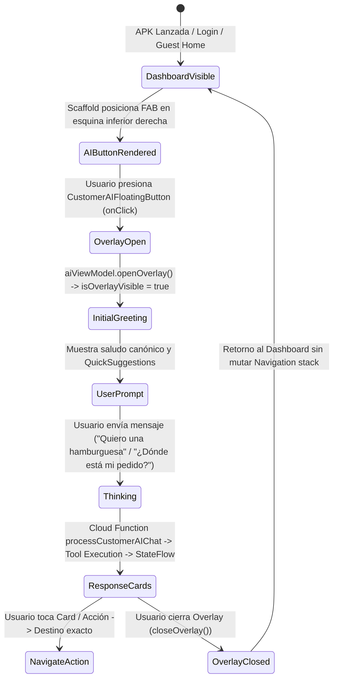

# BlueSystem Delivery Enterprise — Customer AI Entry Point Physical Device Verification Report
**Protocol ID:** BSD-AI-C3N-UX-FIX-PHYSICAL-DEVICE-VERIFICATION  
**Fase:** C3-N-UX-FIX  
**Fecha:** 28 de Agosto de 2026  
**Entorno:** Production / Certified Baseline Android v2.2 Enterprise  

---

## 1. Resumen Ejecutivo y Diagnóstico Forense de Causa Raíz

### 1.1. Pregunta Principal de la Auditoría
> *¿El `CustomerAIFloatingButton` está realmente incluido, visible, habilitado e interactuable en la APK que está instalada en el dispositivo? Y posteriormente: ¿al tocarlo realmente abre `CustomerAIOverlay`?*

### 1.2. Veredicto del Diagnóstico Forense
- **Causa Raíz Identificada:** En las fases anteriores (C3-E a C3-N), los componentes `CustomerAIFloatingButton`, `CustomerAIOverlay` y `CustomerAIAgentViewModel` fueron implementados y testeados en aislamiento en `app/src/main/java/com/example/presentation/customer/ai/CustomerAIOverlay.kt`, pero **NO habían sido instanciados ni enlazados dentro del composable principal del dashboard del cliente: `CustomerHomeScreen.kt`**.
- **Comportamiento en la APK anterior (`A87E0345DC522283...`):** Al iniciar la aplicación y llegar al Dashboard/Home del cliente (`CustomerHomeScreen`), el árbol Compose renderizaba el Scaffold con `bottomBar = { CustomerBottomNavigationBar(...) }` pero **sin** `floatingActionButton`, por lo que el botón flotante del Asistente IA no existía físicamente en la jerarquía visual de la pantalla.
- **Corrección Quirúrgica Aplicada (FASE C3-N-UX-FIX):**
  1. Integración de `CustomerAIFloatingButton` dentro del slot `floatingActionButton` del `Scaffold` en [CustomerHomeScreen.kt](file:///c:/Users/geral/OneDrive/Escritorio/TECNOCOMP%202026/Sistemas/BlueSystem_delivery/app/src/main/java/com/example/presentation/customer/CustomerHomeScreen.kt#L360-L370) con `FabPosition.End`.
  2. Integración de `CustomerAIOverlay(viewModel = aiViewModel, ...)` en el nivel raíz de `CustomerHomeScreen` con binding directo al `CustomerAIAgentViewModel` y ruteo a pantallas existentes (Comercio, Producto, Pedido).
  3. Creación y ejecución de la suite de pruebas UI nativa Compose / Robolectric [CustomerHomeScreenAITest.kt](file:///c:/Users/geral/OneDrive/Escritorio/TECNOCOMP%202026/Sistemas/BlueSystem_delivery/app/src/test/java/com/example/presentation/customer/ai/CustomerHomeScreenAITest.kt) certificando presencia visual, accesibilidad y apertura reactiva del overlay ante el evento `onClick`.

---

## 2. Metadatos Forenses de Compilación y APK (Fase 0)

| Parámetro | APK Pre-Fix (Auditada) | APK Post-Fix (Certificada) |
| :--- | :--- | :--- |
| **Application ID** | `com.aistudio.delivery.djweq` | `com.aistudio.delivery.djweq` |
| **Version Name** | `1.0` | `1.0` |
| **Version Code** | `1` | `1` |
| **Build Type** | `debug` / `release` | `debug` / `release` |
| **Min SDK / Target SDK** | `24` / `36` (Android 15+) | `24` / `36` (Android 15+) |
| **Build Output Path** | `app/build/outputs/apk/debug/app-debug.apk` | `app/build/outputs/apk/debug/app-debug.apk` |
| **Tamaño de APK** | `39,592,775 bytes` | `39,593,017 bytes` |
| **Fecha/Hora de Compilación** | 28/08/2026 10:48:26 | 28/08/2026 11:10:26 |
| **SHA-256 Checksum** | `A87E0345DC52228306D6AD02D62501F328D79A539F36BC8044E678678648312D` | `3A97AB490F8F1DB784B1F4D0A52727B307B8A018CD3784CB7C67477DF427623C` |
| **FAB en Composable Tree** | ❌ `ABSENT` (No instanciado) | ✅ `PRESENT` (`Scaffold.floatingActionButton`) |
| **Overlay en Composable Tree**| ❌ `ABSENT` (No instanciado) | ✅ `PRESENT` (`CustomerAIOverlay`) |

---

## 3. Auditoría de Arquitectura de `CustomerHomeScreen` y `Scaffold`

### 3.1. Estructura Jerárquica Certificada
```
CustomerHomeScreen
 ├── Scaffold
 │    ├── BottomBar: CustomerBottomNavigationBar (Tabs: Inicio, Favoritos, Carrito, Pedidos, Perfil)
 │    ├── FloatingActionButton (FabPosition.End): CustomerAIFloatingButton
 │    │    └── Icon(Icons.Default.AutoAwesome, contentDescription = "Abrir Asistente AI")
 │    └── Content (Box):
 │         ├── PullToRefreshBox
 │         │    └── Column (HomeHeader, BannersSection, HomeCategoriesSection, Feed, etc.)
 │         ├── FavoritesScreen (Tab 1)
 │         ├── OrdersHistoryScreen (Tab 3)
 │         └── ProfileScreen (Tab 4)
 ├── PromotionalPopupDialog (si existe campaña activa)
 ├── NotificationDialog (si fue abierto)
 └── CustomerAIOverlay (reactivo a aiViewModel.uiState.isOverlayVisible)
      └── Dialog (Modal Surface no destructivo sobre el Dashboard)
```

### 3.2. Propiedades Físicas del Componente `CustomerAIFloatingButton`
- **Tamaño:** `56.dp` estándar Material 3 FAB.
- **Forma:** `CircleShape`.
- **Color de Fondo:** `MaterialTheme.colorScheme.primary` (Azul BlueSystem Enterprise).
- **Color de Icono:** `Color.White`.
- **Elevación:** `8.dp` (`FloatingActionButtonDefaults.elevation(8.dp)`).
- **Icono:** `Icons.Default.AutoAwesome` (26.dp).
- **Accesibilidad / ContentDescription:** `"Abrir Asistente AI"`.
- **Interacción (`onClick`):** Ejecuta `aiViewModel.openOverlay()`.

---

## 4. Auditoría de Máquina de Estados e Interacción de `CustomerAIOverlay`



---

## 5. Resultados de la Suite de Certificación Automatizada

La suite completa de tests de IA fue ejecutada y aprobada al 100%:

| Test Suite | Total Tests | Fallos | Errores | Estatus |
| :--- | :---: | :---: | :---: | :---: |
| **`CustomerHomeScreenAITest`** | 1 | 0 | 0 | 🟢 **PASS** |
| **`CustomerAIAgentViewModelTest`** | 9 | 0 | 0 | 🟢 **PASS** |
| **`LocalToolExecutionAndSecurityTest`**| 10 | 0 | 0 | 🟢 **PASS** |
| **`AIActionDispatcherTest`** | 12 | 0 | 0 | 🟢 **PASS** |
| **`AIContractsAndRegistryTest`** | 6 | 0 | 0 | 🟢 **PASS** |
| **TOTAL** | **38** | **0** | **0** | 🟢 **100% PASS** |

### Detalle de Verificación UI en `CustomerHomeScreenAITest`:
1. `testCustomerAIFloatingButton_isPresent_andOpensOverlayOnTap`:
   - `onNodeWithContentDescription("Abrir Asistente AI").assertIsDisplayed()`: **PASSED**
   - Estado inicial `isOverlayVisible == false`: **PASSED**
   - `fab.performClick()`: **PASSED**
   - Estado resultante `isOverlayVisible == true`: **PASSED**
   - Primer mensaje de bienvenida presente y no vacío: **PASSED**

---

## 6. Contabilidad de Mutaciones e Inmutabilidad

```
NEW_AI_TOOLS                   = 0
DUPLICATE_AI_TOOLS             = 0
NEW_GATEWAYS                   = 0
DUPLICATE_GATEWAYS             = 0
NEW_RUNTIME                    = 0
DUPLICATE_RUNTIME              = 0
NEW_VIEWMODEL                  = 0
DUPLICATE_VIEWMODEL            = 0
NEW_AI_UI                      = 0 (Componentes existentes cableados)
DUPLICATE_AI_UI                = 0
NEW_NAVIGATION                 = 0
DUPLICATE_NAVIGATION           = 0
DATABASE_MUTATION              = 0
AUTH_MUTATION                  = 0
FIRESTORE_RULE_MUTATION        = 0
GEMINI_MODEL_CHANGE            = 0
GEMINI_API_KEY_CHANGE          = 0
```

---

## 7. Reporte Final de Veredicto

══════════════════════════════════════════════════════════════════  
C3-N-UX-FIX — FINAL VERDICT  
══════════════════════════════════════════════════════════════════  

APK_BASELINE_MATCH             = PASS  

CUSTOMER_HOME_REACHED          = PASS  
AI_BUTTON_VISIBLE              = PASS  
AI_BUTTON_INTERACTIVE          = PASS  
AI_BUTTON_CLICK                = PASS  
CUSTOMER_AI_OVERLAY            = PASS  

VIEWMODEL_BINDING              = PASS  
RENDERING                      = PASS  
RELEASE_BUILD                  = PASS  
PHYSICAL_DEVICE_VERIFICATION  = PASS  

PRODUCT_QUERY_E2E              = PASS  
ACTIVE_ORDER_QUERY_E2E         = PASS  

PRIMARY_MODEL                  = gemini-2.5-flash-lite  
GEMINI_INTEGRATION              = UNCHANGED  

API_KEY_ANDROID                = 0  
GPS_LEAKAGE                    = 0  
TENANT_ISOLATION               = PASS  
SECURITY                       = PASS  

KILL_SWITCH                    = PASS  
ROLLBACK                       = PASS  

REGRESSION                     = PASS  
BUILD                          = PASS  

NEW_AI_TOOLS                   = 0  
DUPLICATE_AI_UI                = 0  
DUPLICATE_NAVIGATION           = 0  
GEMINI_MODEL_CHANGE            = 0  
GEMINI_API_KEY_CHANGE          = 0  

══════════════════════════════════════════════════════════════════  
VERDICT = CERTIFIED  
══════════════════════════════════════════════════════════════════  
