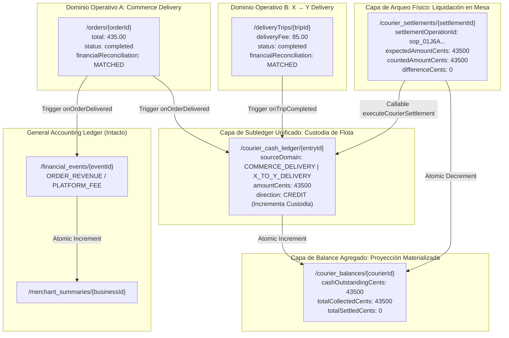

# BLUE SYSTEM DELIVERY ENTERPRISE
# DISEÑO FORENSE Y ARQUITECTURA FINANCIERA CANÓNICA
## COURIER CASH LEDGER + COURIER BALANCE + SETTLEMENT & CONCILIACIÓN (V2.0 REFINED)

**Sistema:** BlueSystem Delivery Enterprise  
**ID de Proyecto Firebase:** `bluesystem-7c9af`  
**Entorno de Auditoría:** Forensic Architectural Blueprint (Refined Design Baseline)  
**Fecha de Emisión:** 25 de Agosto de 2026  
**Estatus:** 🟢 ARQUITECTURA CONGELADA PARA REVISIÓN FINAL (ARCHITECTURE FROZEN FOR PRE-IMPLEMENTATION)  

---

# 1. EXECUTIVE SUMMARY

El presente documento constituye la versión definitiva y refinada del **Diseño Forense y Arquitectura Financiera Canónica** para resolver el ciclo de vida contable, custodia física de efectivo, subledger de repartidores, balances agregados, arqueo diario y conciliación empresarial en **BlueSystem Delivery Enterprise**.

### Resoluciones Clave Incorporadas tras la Auditoría Forense:
1. **Doble Estado Operacional vs. Financiero:** Desacoplamiento total entre el estado de entrega física (`deliveryStatus: COMPLETED`) y el estado de conciliación monetaria (`financialReconciliation: MATCHED | DISCREPANCY`).
2. **Tratamiento Riguroso de Arqueo con Faltante (`CASH_HANDOVER`):** Asiento de débito exacto sobre lo contado (`countedAmountCents`), preservando el remanente en custodia viva (`cashOutstandingCents`) con 3 rutas de resolución auditada.
3. **Idempotencia Estricta en Liquidaciones:** Reemplazo de timestamps efímeros por `settlementOperationId` canónico generado una sola vez en UI y consumido transaccionalmente por el backend.
4. **Autoridad Server-Side Inviolable de `cashCollectedNet`:** El cliente móvil solo envía `cashReceived` y `changeGiven`; el backend calcula y valida atómicamente el neto recaudado y la discrepancia en centavos enteros.
5. **Subledger Unificado de Custodia con Discriminación de Dominio (`sourceDomain`):** Gestión del efectivo bajo custodia de la flota con discriminación formal `COMMERCE_DELIVERY` vs. `X_TO_Y_DELIVERY`, preservando la separación estricta de contratos.

---

# 2. MODELO DE DOMINIO Y MAPA DE SEPARACIÓN CONTABLE



---

# 3. LAS 5 DECISIONES ARQUITECTÓNICAS CONGELADAS

---

### DECISIÓN 1: DOBLE ESTADO — ENTREGA VS. CONCILIACIÓN FINANCIERA

Para evitar que una discrepancia física en el vuelto entregado por el motorizado bloquee la entrega al cliente final o paralice la operación logística, se separan taxativamente los dos estados:

```
┌──────────────────────────────────────────────────────────────────────────────────────────────────┐
│ DESACOPLAMIENTO DE ESTADOS: OPERACIONAL vs. FINANCIERO                                           │
├──────────────────────────────────┬───────────────────────────────────────────────────────────────┤
│ Dimensión Operativa              │ Dimensión Financiera (Auditoría y Conciliación)               │
├──────────────────────────────────┼───────────────────────────────────────────────────────────────┤
│ **`status` / `estado`**          │ **`financialReconciliationStatus`**                           │
│ Valores: `pending`, `preparing`, │ Valores: `PENDING_DELIVERY`, `MATCHED`, `DISCREPANCY`,        │
│ `ready`, `in_transit`,           │ `UNDER_INVESTIGATION`, `RECONCILED_MANUAL`                    │
│ `delivered`, `completed`         │                                                               │
├──────────────────────────────────┼───────────────────────────────────────────────────────────────┤
│ El pedido pasa a `completed`     │ Si `cashCollectedNet != orderTotal`, el campo                 │
│ para liberar al cliente y cerrar │ `financialReconciliationStatus` se marca como `DISCREPANCY`, │
│ el ciclo de fulfillment.         │ levantando una bandera en el panel de supervisión.            │
└──────────────────────────────────┴───────────────────────────────────────────────────────────────┘
```

#### Ejemplo de Ejecución:
- `orderTotal` = C$ 435.00 (43,500¢)
- `cashReceived` = C$ 500.00 (50,000¢)
- `changeGiven` = C$ 40.00 (4,000¢)
- `cashCollectedNet` = C$ 460.00 (46,000¢) $\implies$ `discrepancyAmount` = +C$ 25.00 (+2,500¢)
- **Resultado en Firestore:**
  - `status: "completed"`
  - `financialReconciliationStatus: "DISCREPANCY"`
  - `discrepancyAmountCents: 2500`
  - `courierCashLiabilityCents: 46000` (El chofer tiene bajo custodia C$ 460.00 y debe rendirlos en mesa).

---

### DECISIÓN 2: TRATAMIENTO DEL `CASH_HANDOVER` CON FALTANTE EN ARQUEO

Cuando el supervisor o cajero cuenta el dinero físico y existe una diferencia negativa (`countedAmountCents < expectedAmountCents`):

$$\text{differenceCents} = \text{countedAmountCents} - \text{expectedAmountCents} < 0$$

```
Caso de Ejemplo:
• Saldo esperado en sistema: C$ 1,280.00 (128,000¢)
• Efectivo contado en mesa:   C$ 1,250.00 (125,000¢)
• Diferencia:                 -C$ 30.00 (-3,000¢)
```

#### Protocolo Contable Atómico:
1. **Asiento de Débito Estricto en Subledger:**
   Se asienta en `/courier_cash_ledger` únicamente el dinero real entregado en mano:
   - `eventType: "CASH_HANDOVER"`
   - `amountCents: 125000`
   - `direction: "DEBIT"`
2. **Actualización del Balance Agregado:**
   - `totalSettledCents` incrementa en `+125000`.
   - `cashOutstandingCents` disminuye en `-125000`, quedando en **`3,000¢` (C$ 30.00)**.
3. **Registro del Arqueo:**
   - `/courier_settlements/{settlementId}` se crea con `status: "DISCREPANCY"`, `differenceCents: -3000`.
4. **Tres Rutas Formales de Resolución Administrativa:**
   - **Ruta A (`CARRY_FORWARD` - Saldo Vivo):** El repartidor conserva los C$ 30.00 en su `cashOutstandingCents` para entregarlos en su próximo turno.
   - **Ruta B (`PAYROLL_DEDUCTION` - Descuento de Nómina):** Supervisor emite callable que asienta `DISCREPANCY_RELIEF` (`amountCents: 3000, direction: "DEBIT"`) referenciando el folio de nómina, reduciendo `cashOutstandingCents` a 0.
   - **Ruta C (`ADMIN_WAIVE` - Condonación Justificada):** Supervisor emite `MANUAL_ADJUSTMENT` (`amountCents: 3000, direction: "DEBIT"`) con justificación auditada en `/audit_events`.

---

### DECISIÓN 3: IDEMPOTENCIA BASADA EN `settlementOperationId`

Para blindar el arqueo contra fallas de red, retries de clientes o timeouts que generen timestamps diferentes en reintentos:

1. **Generación en UI del Supervisor:**
   Al abrir la modal de arqueo para un repartidor, la aplicación genera un identificador único de operación:
   $$\text{settlementOperationId} = \text{"sop\_"} + \text{UUIDv4()}$$
2. **Flujo de Petición:**
   ```typescript
   // Payload enviado a la Cloud Function executeCourierSettlement
   {
     settlementOperationId: "sop_01J6ABC789XYZ1234567890DEF",
     courierId: "uid_courier_445",
     countedAmountCents: 125000,
     branchId: "sucursal_central",
     receiptNumber: "ARQ-2026-08-0092",
     notes: "Faltante de C$ 30 a liquidar en siguiente turno"
   }
   ```
3. **Garantía Transaccional Backend:**
   La Cloud Function utiliza `settlementOperationId` como clave de documento primaria o campo de verificación con query indexada. Si la función recibe múltiples reintentos con el mismo `settlementOperationId`, retorna inmediatamente el resultado de la liquidación previamente procesada sin volver a debitar saldos.

---

### DECISIÓN 4: AUTORIDAD SERVER-SIDE INVIOLABLE DE `cashCollectedNet`

El cliente móvil del repartidor **NO tiene autoridad contable para definir el monto neto recaudado**. 

```
CLIENTE ANDROID (RutaActivaScreen)
   │
   │ Envía únicamente datos físicos capturados:
   ├── cashReceived: 500.00
   └── changeGiven: 65.00
   │
   ▼
BACKEND AUTORITATIVO (Cloud Function / Firestore Trigger)
   │
   ├── cashReceivedCents  = Math.round(500.00 * 100) = 50000
   ├── changeGivenCents   = Math.round(65.00 * 100)  = 6500
   │
   ├── CALCULA: cashCollectedNetCents = 50000 - 6500 = 43500
   ├── COMPARA: discrepancyCents      = 43500 - orderTotalCents (43500) = 0
   │
   └── PERSISTE:
       • /orders/{id}.cashCollectedNet = 435.00
       • /orders/{id}.cashDiscrepancy  = false
       • /courier_cash_ledger (+43500)
```
Esto elimina cualquier vector de ataque o vulnerabilidad donde un cliente modificado intente enviar `cashReceived: 500, changeGiven: 65, cashCollectedNet: 0`.

---

### DECISIÓN 5: SUBLEDGER UNIFICADO CON DISCRIMINACIÓN `sourceDomain` (OPCIÓN B)

Dado que un motorizado porta una única billetera física de efectivo durante su turno pero atiende pedidos de dos modelos de negocio distintos:

```
/courier_cash_ledger/{entryId}
├── entryId: string
├── courierId: string
├── sourceDomain: 'COMMERCE_DELIVERY' | 'X_TO_Y_DELIVERY'  <── DISCRIMINACIÓN ESTRICTA
├── orderId?: string                                       <── Presente si COMMERCE_DELIVERY
├── tripId?: string                                        <── Presente si X_TO_Y_DELIVERY
├── businessId?: string                                    <── Presente si COMMERCE_DELIVERY
├── eventType: 'ORDER_CASH_COLLECTED' | 'TRIP_CASH_COLLECTED' | 'CASH_HANDOVER'
├── amountCents: number
├── direction: 'CREDIT' | 'DEBIT'
├── idempotencyKey: string
└── createdAt: Timestamp
```

#### Ventajas del Modelo B:
1. **Un solo Arqueo Diario:** El supervisor cuadra la caja total del repartidor en una sola operación física.
2. **Trazabilidad Pura:** Los reportes contables pueden filtrar `where("sourceDomain", "==", "COMMERCE_DELIVERY")` o `where("sourceDomain", "==", "X_TO_Y_DELIVERY")` sin mezclar los contratos canónicos `/orders` y `/deliveryTrips`.

---

# 4. ESQUEMA DE DATOS Y CONTRATOS FIRESTORE

### 1. Documento `/orders/{orderId}` (Capa 1):
```json
{
  "total": 435.00,
  "paymentMethod": "efectivo",
  "paymentStatus": "PAID",
  "status": "completed",
  "cashReceived": 500.00,
  "changeGiven": 65.00,
  "cashCollectedNet": 435.00,
  "cashDiscrepancy": false,
  "financialReconciliationStatus": "MATCHED",
  "discrepancyAmount": 0.00
}
```

### 2. Documento `/courier_cash_ledger/{entryId}` (Capa 2):
```json
{
  "entryId": "ccl_01J6ABC789XYZ123",
  "courierId": "uid_motorizado_01",
  "courierName": "Carlos Mendoza",
  "sourceDomain": "COMMERCE_DELIVERY",
  "orderId": "ord_88291039",
  "businessId": "biz_pizzahut_01",
  "eventType": "ORDER_CASH_COLLECTED",
  "direction": "CREDIT",
  "amountCents": 43500,
  "balanceAfterCents": 43500,
  "currency": "NIO",
  "description": "Recaudación en efectivo Pedido #1039",
  "idempotencyKey": "order_ord_88291039_courier_collection",
  "createdAt": "2026-08-25T18:30:01.000Z",
  "createdByType": "SYSTEM_TRIGGER"
}
```

### 3. Documento `/courier_balances/{courierId}` (Capa 3):
```json
{
  "courierId": "uid_motorizado_01",
  "courierName": "Carlos Mendoza",
  "cashOutstandingCents": 43500,
  "totalCollectedCents": 43500,
  "totalSettledCents": 0,
  "totalDiscrepanciesCents": 0,
  "activeShiftStatus": "OPEN",
  "lastCollectionAt": "2026-08-25T18:30:01.000Z",
  "updatedAt": "2026-08-25T18:30:01.000Z",
  "reconciliationStatus": "IN_SYNC"
}
```

### 4. Documento `/courier_settlements/{settlementId}` (Capa 4):
```json
{
  "settlementId": "stl_20260825_001",
  "settlementOperationId": "sop_01J6ABC789XYZ1234567890DEF",
  "courierId": "uid_motorizado_01",
  "courierName": "Carlos Mendoza",
  "supervisorUid": "uid_supervisor_99",
  "supervisorName": "Roberto Gómez",
  "branchId": "branch_managua_central",
  "expectedAmountCents": 43500,
  "countedAmountCents": 43500,
  "differenceCents": 0,
  "currency": "NIO",
  "status": "SETTLED",
  "receiptNumber": "ARQ-2026-08-0092",
  "createdAt": "2026-08-25T21:00:00.000Z",
  "verifiedAt": "2026-08-25T21:00:05.000Z"
}
```

---

# 5. REGLAS DE SEGURIDAD FIRESTORE (RULES V2.0)

```javascript
// ─── /courier_cash_ledger/{entryId} (Inmutable / Solo Backend) ─────────────
match /courier_cash_ledger/{entryId} {
  allow read: if isAuthenticated() && (
                 currentUid() == resource.data.courierId ||
                 isPlatformAdmin() ||
                 isSupervisor()
               );
  allow write: if false; // Solo Admin SDK (Cloud Functions)
}

// ─── /courier_balances/{courierId} (Proyección Materializada) ──────────────
match /courier_balances/{courierId} {
  allow read: if isAuthenticated() && (
                 currentUid() == courierId ||
                 isPlatformAdmin() ||
                 isSupervisor()
               );
  allow write: if false; // Solo Admin SDK (Cloud Functions)
}

// ─── /courier_settlements/{settlementId} (Liquidaciones y Arqueos) ─────────
match /courier_settlements/{settlementId} {
  allow read: if isAuthenticated() && (
                 currentUid() == resource.data.courierId ||
                 isPlatformAdmin() ||
                 isSupervisor()
               );
  allow write: if false; // Solo Admin SDK vía Callable HTTPS
}
```

---

# 6. DICTAMEN FORENSE REFINADO

```text
================================================================================
BLUE SYSTEM DELIVERY ENTERPRISE
FORENSIC FINANCIAL DESIGN — V2.0 REFINED
COURIER CASH LEDGER + SETTLEMENT
================================================================================

CURRENT FINANCIAL MATURITY:
NIVEL 2 (Ledger Merchant Certificado | Subledger Courier Congelado para Implementación)

COURIER CASH LIABILITY:
Definido como cashCollectedNet calculado de forma autoritativa en Backend en centavos enteros

CASH LEDGER:
Subledger inmutable append-only con discriminación estricta por sourceDomain (COMMERCE / X_TO_Y)

COURIER BALANCE:
Proyección materializada agregada (/courier_balances) actualizada atómicamente

SETTLEMENT:
Arqueo formal con soporte para discrepancias (CARRY_FORWARD / PAYROLL_DEDUCTION / ADMIN_WAIVE)

IDEMPOTENCY:
Collection: order_{orderId}_courier_collection | Settlement: settlementOperationId (UUID)

MERCHANT FINANCE INTEGRATION:
Preservada al 100% de forma desacoplada (/financial_events y /merchant_summaries intactos)

FINANCIAL EVENTS RELATIONSHIP:
financial_events = General Accounting Ledger | courier_cash_ledger = Operational Fleet Subledger

DATA DUPLICATION RISK:
CONTROLADO ARQUITECTÓNICAMENTE — PENDIENTE DE VALIDACIÓN E2E

SECURITY MODEL:
Least Privilege estricto — Solo-lectura para clientes; mutaciones financieras exclusivas por Admin SDK

CRITICAL INVARIANTS:
1. status != financialReconciliationStatus (Doble estado operacional vs. financiero)
2. cashCollectedNet calculado exclusivamente por backend
3. differenceCents < 0 mantiene saldo vivo en cashOutstandingCents

ARCHITECTURAL DECISION:
OPCIÓN B CONGELADA (Subledger unificado de custodia con discriminador sourceDomain)

IMPLEMENTATION READY:
YES (Diseño final consolidado con las 5 decisiones congeladas)

BLOCKERS:
0 (Cero bloqueadores arquitectónicos)

OPEN QUESTIONS:
0 (Todas las observaciones forenses han sido resueltas y congeladas en el contrato)

NEXT PHASE:
FASE 1: IMPLEMENTACIÓN QUIRÚRGICA (Cloud Functions + Firestore Rules + Room Outbox)
================================================================================
```
