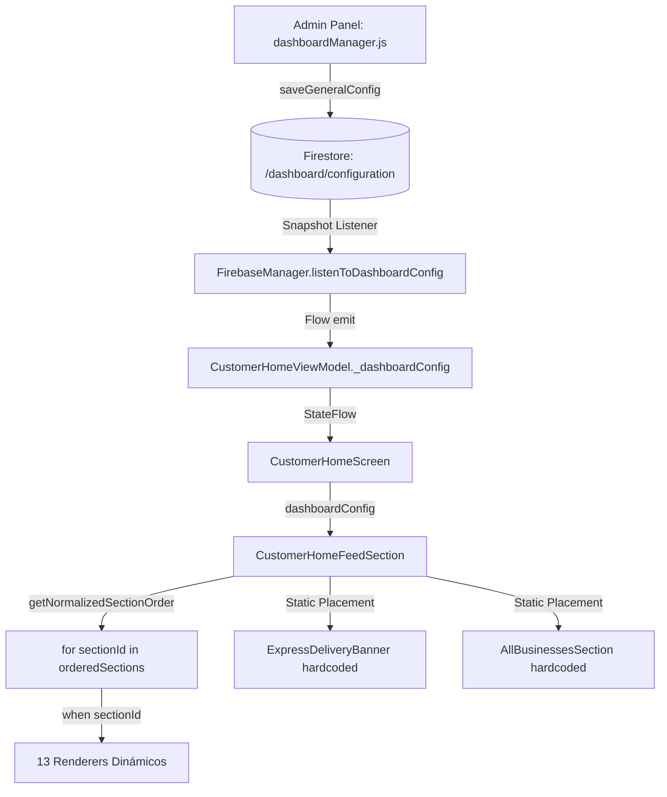

# BLUE SYSTEM DELIVERY ENTERPRISE
# AUDITORÍA FORENSE INTEGRAL DEL CUSTOMER DASHBOARD
# BLOQUES DINÁMICOS + CONFIGURACIÓN + FIRESTORE + BACKEND + X→Y DELIVERY

**Protocolo:** `BSD-CUSTOMER-DASHBOARD-BLOCKS-FORENSIC-AUDIT-001`  
**Modo:** READ-ONLY / AUDIT-FIRST / ZERO MUTATION  
**Fecha:** 2026-09-07  
**Auditor:** Senior Developer & Auditor de BlueSystem v2.1 Enterprise  
**Veredicto General:** 🟡 **AUDIT COMPLETED — MULTIPLE ARCHITECTURAL & SEMANTIC GAPS DETECTED**

---

## 1. Executive Summary

La presente auditoría forense examina la arquitectura completa del Dashboard de Clientes (Customer Home) en la aplicación Android de BlueSystem Delivery Enterprise, su relación con el panel de administración (`dashboardManager.js`), la configuración en Cloud Firestore (`/dashboard/configuration`), las Cloud Functions, y el estado integral del servicio de encomiendas y envíos entre particulares **X→Y Delivery (Express Delivery)**.

### Hallazgos Principales:
1. **Desconexión Arquitectónica de X→Y:** El servicio de envíos punto a punto (`X_TO_Y_DELIVERY`) **NO** forma parte de los 14 bloques dinámicos del Dashboard Manager. Fue concebido formalmente como un **Módulo de Capacidad de Plataforma (Platform Capability)** en el Gatekeeper (`MODULE_CATALOG`, `ADR-015`), pero en la UI Android (`CustomerHomeFeedSection.kt`) está renderizado como un banner estructural fijo (`ExpressDeliveryBanner`) hardcodeado fuera del ciclo de bloques dinámicos. No existe toggle administrativo para ocultarlo ni activarlo.
2. **Bloque Fantasma (QUICK_REORDER):** El bloque `QUICK_REORDER` ("Volver a Pedir") existe en el contrato canónico (`CANONICAL_DEFAULT_SECTION_ORDER`), en el modelo Kotlin (`DashboardConfig`), en Firestore y en el Admin Web, pero **NO TIENE RENDERER** en `CustomerHomeFeedSection.kt` (`when (sectionId)` carece de rama para `QUICK_REORDER`).
3. **Bloqueo de Seguridad en Analíticas (/dashboardAnalytics):** `firestore.rules` **NO** contiene reglas para la colección `/dashboardAnalytics`. Todas las escrituras de `DashboardAnalyticsTracker.logEvent()` desde dispositivos móviles son **rechazadas por Firestore con `PERMISSION_DENIED`**, dejando la pestaña "Heat Map & Analítica BI" del Admin Web sin telemetría de clientes.
4. **Deriva Semántica Crítica (Falsa Promesa Comercial):**
   - `SAME_PRICE` ("Mismo Precio que en Local"): Filtra únicamente `it.isOpen && it.isVerified`. Cero verificación de paridad de precios.
   - `TOP_SELLING` ("Los Más Vendidos"): Ordena por `it.rating` descendente. Cero cálculo de volumen o cantidad de órdenes.
   - `RECOMMENDED` ("Recomendados para ti"): Filtra `it.isFeatured || it.rating >= 4.5`. Cero personalización por cliente (idéntico para todos).
   - `NEW_BUSINESSES` ("Comercios Nuevos"): Ejecuta `publicBusinesses.reversed().take(8)`. Cero validación de fecha de registro o aprobación.
5. **Caché No Invocada (DashboardCacheManager):** El objeto `DashboardCacheManager.kt` está implementado para serializar la configuración en SharedPreferences, pero **jamás es llamado** por ninguna clase del proyecto. La persistencia offline recae exclusivamente en la caché interna del SDK de Firestore.
6. **Estado Operativo Real de X→Y:** A nivel de backend y operaciones Courier (C28/C29), el flujo X→Y está **100% operativo y certificado**: creación dual `/orders` + `/deliveryTrips`, notificación FCM `available_orders` (`NEW_X_TO_Y_DELIVERY`), despacho sin comercio, navegación en dos fases y liquidación en `courier_cash_ledger`.

---

## 2. Architecture Reconstruction

El flujo de configuración y renderizado de la pantalla principal del cliente opera a través de las siguientes capas:



### Detalle de Flujo:
1. **Admin Manager (`dashboardManager.js`):** El administrador conmuta toggles o reordena secciones y escribe directamente en el documento `/dashboard/configuration` de Firestore.
2. **Firestore (`dashboard/configuration`):** Documento global único que almacena 14 booleans de visibilidad, 6 parámetros geoespaciales y el array `sectionOrder`.
3. **Customer Repository (`FirebaseManager.kt:1609`):** `listenToDashboardConfig()` mantiene un `callbackFlow` conectado mediante `addSnapshotListener` al documento `/dashboard/configuration`. Emite un objeto `DashboardConfig`.
4. **Customer ViewModel (`CustomerHomeViewModel.kt:213`):** Colecta el flujo en `_dashboardConfig: MutableStateFlow<DashboardConfig>`.
5. **Normalización (`Models.kt:775`):** Al recomponer `CustomerHomeFeedSection`, `getNormalizedSectionOrder()` purga IDs desconocidos, elimina duplicados y añade secciones canónicas ausentes.
6. **Renderizado (`CustomerHomeFeedSection.kt`):** Se ejecuta un bucle sobre `orderedSections` invocando composables específicos según el ID. Al finalizar el bucle, se renderizan incondicionalmente `ExpressDeliveryBanner` y `AllBusinessesSection`.

---

## 3. Dashboard Manager Audit (`panel-admin/`)

- **Ubicación:** `panel-admin/public/js/dashboard/dashboardManager.js` (1,522 líneas) y `dashboard.html`.
- **Estructura:**
  - Pestaña 1: Configuración & Visibilidad (14 switches + 6 inputs geoespaciales).
  - Pestaña 2: Productos Estrella (CRUD de `/featuredProducts`).
  - Pestaña 3: Ofertas Flash (CRUD de `/flashDeals`).
  - Pestaña 4: Sucursales (CRUD de `/branches`).
  - Pestaña 5: Orden de Bloques (Reordenamiento interactivo del array `sectionOrder`).
  - Pestaña 6: Heat Map & Analítica BI (Lectura de `/dashboardAnalytics`).
- **Naturaleza del Catálogo:** Catálogo hardcodeado en cliente web (`allToggles` y `defaultSectionOrder`). No procede de un esquema dinámico de base de datos.
- **Persistencia:** Llamada directa `db.collection('dashboard').doc('configuration').set(payload, { merge: true })`.
- **Autorización:** `firestore.rules:1138` restringe la escritura a `isPlatformAdmin()`.
- **Alcance:** Estrictamente **GLOBAL** (single-tenant). No soporta `tenantId`, `brandId` ni segmentación por tipo de usuario.

---

## 4. Canonical Block Registry

Declarado formalmente en [Models.kt](file:///c:/Users/geral/OneDrive/Escritorio/TECNOCOMP%202026/Sistemas/BlueSystem_delivery/app/src/main/java/com/example/Models.kt#L751-L766):

```kotlin
val CANONICAL_DEFAULT_SECTION_ORDER: List<String> = listOf(
    "BANNERS",
    "CATEGORIES",
    "BRANCHES",
    "NEARBY",
    "FEATURED_BUSINESSES",
    "FEATURED_PRODUCTS",
    "FLASH_DEALS",
    "PROMOTIONS",
    "SAME_PRICE",
    "TOP_SELLING",
    "RECOMMENDED",
    "NEW_BUSINESSES",
    "QUICK_REORDER",
    "FAVORITES"
)
```

### Respuestas a Casos Extremos en `getNormalizedSectionOrder()`:
- **Configuración vacía:** Retorna los 14 bloques en su orden canónico por defecto.
- **Falta un bloque:** Lo anexa al final de la lista para prevenir pérdida de funcionalidad.
- **ID desconocido en backend:** Es descartado inmediatamente (`knownUpperSet.contains(id)`).
- **IDs duplicados:** Mantiene únicamente la primera aparición válida.
- **ID en minúsculas:** Es normalizado mediante `.trim().uppercase()`.
- **Comportamiento Offline:** Firestore emite la última versión en caché local de SQLite/LevelDB o recurre a la instancia por defecto de `DashboardConfig()`.

---

## 5. Individual Audit — 14 Blocks

### Bloque 01: BANNERS ("Banners Promocionales Superiores")
- **Componente:** `BannersSection.kt` (`BannersSection`).
- **Fuente de Datos:** Colección `/banners` vía `FirebaseManager.listenToPromotionalBanners()`.
- **Query & Filtros:** `db.collection("banners")`. **Sin filtro** de `active == true`, ni rangos de fecha en query.
- **Navegación:** `comercio_detalle_screen/$actionId` si `actionType == "comercio"`.
- **Fallback:** Tarjeta estética azul de BlueSystem Delivery ("¡Ahorrá en cada pedido!").
- **Semántica:** 🟢 **CORRECTO.** Carrusel horizontal con paginador e imágenes remotas.

### Bloque 02: CATEGORIES ("Categorías - PedidosYa Style")
- **Componente:** `HomeCategoriesSection.kt` (`HomeCategoriesSection`).
- **Fuente de Datos:** Colección `/categories` vía `PromotionRepository` / `CategoryRepository`, o fallback a categorías extraídas de comercios públicos (`publicBusinesses`).
- **Query & Filtros:** Filtra `showInHome && active` ordenado por `orderIndex`.
- **Navegación:** Al hacer clic activa `selectedCategoryFilter`, alternando la vista a `CustomerHomeCategoryDiscoverySection`.
- **Semántica:** 🟡 **IMPRECISO.** Son categorías comerciales de establecimientos (Restaurante, Farmacia, Tienda), no taxonomía de productos.

### Bloque 03: BRANCHES ("Bloque de Sucursales por Comercio")
- **Componente:** `BranchesSection.kt` (`BranchesSection`).
- **Fuente de Datos:** Colección `/branches` vía `FirebaseManager.listenToBranches()`.
- **Query & Filtros:** Filtra `it.isOpen && active != false`.
- **Navegación:** `comercio_detalle_screen/$businessId`.
- **Semántica:** 🟢 **CORRECTO.** Muestra sucursales y sedes físicas independientes.

### Bloque 04: NEARBY ("Comercios Cerca de Ti - Geolocalización")
- **Componente:** `NearbyBusinessesSection.kt` (`NearbyBusinessesSection`).
- **Motor:** `NearbyMerchantEngine.kt` (Haversine estricto en memoria, 0 llamadas N+1, $0 costo Maps API).
- **Fuente de Datos:** `publicBusinesses` + `branches` + coordenadas de `_defaultAddress` del cliente.
- **Algoritmo:** Expansión reactiva multi-etapa: 5 km (Inicial) $\rightarrow$ 10 km (Secundario) $\rightarrow$ 15 km (Máximo) hasta alcanzar `nearbyMinimumMerchantCount` (default 5).
- **Fallback:** Si el usuario no tiene GPS/dirección, renderiza un banner invitando a configurar su dirección.
- **Semántica:** 🟢 **EXCELENCIA TÉCNICA.** Descubrimiento geoespacial matemático de alta fidelidad.

### Bloque 05: FEATURED_BUSINESSES ("Comercios Destacados")
- **Componente:** `FeaturedBusinessesSection.kt` (`FeaturedBusinessesSection`).
- **Fuente de Datos:** `publicBusinesses.filter { it.getEffectiveIsFeatured() }`.
- **Configuración:** Campo `isFeatured: true` en el documento `/businesses/{id}` establecido por Admin.
- **Semántica:** 🟢 **CORRECTO.** Comercios con badge de verificación y destacados de plataforma.

### Bloque 06: FEATURED_PRODUCTS ("Productos Estrella")
- **Componente:** `StarProductsSection.kt` (`StarProductsSection`).
- **Fuente de Datos:** `/featuredProducts` enriquecido con datos vivos de `/products` y nombres de `/businesses`.
- **Fallback Catálogo:** Si no hay docs explícitos, toma productos con `isPopular == true` o `isTopSeller == true`.
- **Semántica:** 🟢 **CORRECTO.** Platillos estrella con precio, imagen y calificación.

### Bloque 07: FLASH_DEALS ("Ofertas Flash")
- **Componente:** `FlashDealsSection.kt` (`FlashDealsSection`).
- **Fuente de Datos:** `/flashDeals` sincronizado con `/products`.
- **Temporizador:** Valida autoritativamente `startAt`, `endAt` y `createdAt + expiresAtMinutes * 60000 > nowMs`.
- **Semántica:** 🟢 **CORRECTO.** Descuentos temporales agresivos con temporizador en tiempo real.

### Bloque 08: PROMOTIONS ("Productos con Descuentos")
- **Componente:** `DiscountedProductsSection.kt` (`DiscountedProductsSection`).
- **Fuente de Datos:** `/products` filtrado por `originalPrice != null && originalPrice > price && price > 0.0`.
- **Diferenciación vs Flash Deals:** Flash Deals es una campaña con cronómetro en `/flashDeals`. Promotions es el catálogo general permanente con descuento de menú. Incluye botón directo de añadir al carrito (`CartManager.addToCart`).
- **Semántica:** 🟢 **CORRECTO.**

### Bloque 09: SAME_PRICE ("Mismo Precio que en Local")
- **Componente:** `CuratedBusinessSections.kt` (`SamePriceSection`).
- **Código Real:**
  ```kotlin
  val samePriceList = remember(publicBusinesses) {
      publicBusinesses.filter { it.isOpen && it.isVerified }.take(10)
  }
  ```
- **Evidencia:** `CuratedBusinessSections.kt:30`.
- **Semántica:** 🔴 **MISMATCH CRÍTICO.** El sistema no audita precios de salón vs online. Simplemente valida que el comercio esté abierto y verificado.

### Bloque 10: TOP_SELLING ("Los Más Vendidos")
- **Componente:** `CuratedBusinessSections.kt` (`TopSellingSection`).
- **Código Real:**
  ```kotlin
  val topList = remember(publicBusinesses) {
      publicBusinesses.sortedByDescending { it.rating }.take(10)
  }
  ```
- **Evidencia:** `CuratedBusinessSections.kt:72`.
- **Semántica:** 🔴 **MISMATCH CRÍTICO.** No calcula volumen de órdenes ni cantidad vendida. Ordena exclusivamente por estrellas (`rating`).

### Bloque 11: RECOMMENDED ("Recomendados para ti")
- **Componente:** `CuratedBusinessSections.kt` (`RecommendedSection`).
- **Código Real:**
  ```kotlin
  val recommendedList = remember(publicBusinesses) {
      publicBusinesses.filter { it.getEffectiveIsFeatured() || it.rating >= 4.5 }.take(10)
  }
  ```
- **Evidencia:** `CuratedBusinessSections.kt:114`.
- **Semántica:** 🔴 **FALSA PERSONALIZACIÓN.** Cero uso del UID del cliente, cero análisis de compras previas, cero IA. Muestra la misma lista estática a todos los usuarios.

### Bloque 12: NEW_BUSINESSES ("Comercios Nuevos")
- **Componente:** `CuratedBusinessSections.kt` (`NewBusinessesSection`).
- **Código Real:**
  ```kotlin
  val newList = remember(publicBusinesses) {
      publicBusinesses.reversed().take(8)
  }
  ```
- **Evidencia:** `CuratedBusinessSections.kt:157`.
- **Semántica:** 🔴 **DERIVA HEURÍSTICA.** No evalúa `createdAt` ni `approvedAt`. Únicamente invierte la lista en memoria.

### Bloque 13: QUICK_REORDER ("Volver a Pedir")
- **Componente:** **INEXISTENTE EN EL RENDERER.**
- **Código Real:** En `CustomerHomeFeedSection.kt:52-229`, el bloque `when (sectionId)` contiene ramas para 13 secciones, pero **omite completamente la rama `"QUICK_REORDER"`**.
- **Semántica:** 🔴 **BLOQUE FANTASMA.** Existe en el contrato, en la base de datos y en los toggles de Admin, pero la app jamás lo dibuja en pantalla.

### Bloque 14: FAVORITES ("Tus Comercios Favoritos")
- **Componente:** `CuratedBusinessSections.kt` (`FavoritesBlockSection`).
- **Fuente de Datos:** Subcolección `/users/{uid}/favorites` cruzada con `publicBusinesses`.
- **Evidencia:** `CustomerHomeFeedSection.kt:218` y `CuratedBusinessSections.kt:188`.
- **Semántica:** 🟢 **CORRECTO.** Renderiza los comercios que el cliente ha marcado con corazón.

---

## 6. Firestore Data Mapping

| Bloque | Read / Write | Colección Firestore | Query / Filtros | Actor |
| :--- | :--- | :--- | :--- | :--- |
| **Configuración** | Read (Client) / Write (Admin) | `/dashboard/configuration` | Documento único `configuration` | Admin |
| **Banners** | Read | `/banners` | `snapshotListener` directo (sin filtro query) | Admin |
| **Categorías** | Read | `/categories` | `showInHome == true`, `active == true` | Admin |
| **Sucursales** | Read | `/branches` | `active != false`, `isOpen == true` | Merchant / Admin |
| **Cerca de Ti** | Read | En memoria (`publicBusinesses` + `branches`) | Haversine sobre `defaultAddress` | Cliente |
| **Comercios Destacados** | Read | `/businesses` | `isFeatured == true` | Admin / Merchant |
| **Productos Estrella** | Read | `/featuredProducts` + `/products` | `active == true` | Admin / Merchant |
| **Ofertas Flash** | Read | `/flashDeals` + `/products` | `startAt <= now <= endAt` | Admin / Merchant |
| **Promociones** | Read | `/products` | `originalPrice > price` | Merchant |
| **Mismo Precio** | Read | En memoria (`publicBusinesses`) | `isOpen && isVerified` | Heurística Local |
| **Más Vendidos** | Read | En memoria (`publicBusinesses`) | `sortedByDescending { rating }` | Heurística Local |
| **Recomendados** | Read | En memoria (`publicBusinesses`) | `isFeatured || rating >= 4.5` | Heurística Local |
| **Nuevos** | Read | En memoria (`publicBusinesses`) | `reversed().take(8)` | Heurística Local |
| **Volver a Pedir** | — | — | **NO IMPLEMENTADO EN UI** | — |
| **Favoritos** | Read | `/users/{uid}/favorites` | Subcolección del usuario | Cliente |
| **Analítica BI** | Write (Bloqueada) / Read (Admin) | `/dashboardAnalytics` | `docId = {type}_{id}` (Increment) | Cliente (Rules FAIL) |
| **X→Y Delivery** | Read / Write | `/orders` y `/deliveryTrips` | `serviceType == "X_TO_Y_DELIVERY"` | Cliente / Courier |

---

## 7. Customer ViewModel Mapping

En [CustomerHomeViewModel.kt](file:///c:/Users/geral/OneDrive/Escritorio/TECNOCOMP%202026/Sistemas/BlueSystem_delivery/app/src/main/java/com/example/presentation/customer/CustomerHomeViewModel.kt#L207-L222):

1. `_dashboardConfig`: Conectado a `fm.listenToDashboardConfig()`.
2. `_banners`: Colectado directamente en `CustomerHomeScreen.kt:378`.
3. `_publicBusinesses`: Colectado desde `fm.listenToPublicCatalogBusinesses()`.
4. `_categoriesList`: Colectado desde `promoRepo.categories`.
5. `_branches`: Colectado desde `fm.listenToBranches()`.
6. `_featuredProducts`: Colectado desde `fm.listenToFeaturedProducts()`.
7. `_flashDeals`: Colectado desde `fm.listenToFlashDeals()`.
8. `_discountedProducts`: Colectado desde `fm.listenToDiscountedProducts()`.
9. `_addresses`: Colectado desde `/users/{uid}/addresses`.
10. `favoriteIds`: Colectado desde `/users/{uid}/favorites`.

**Derivación de Datos:**
Los bloques 09 (`SAME_PRICE`), 10 (`TOP_SELLING`), 11 (`RECOMMENDED`) y 12 (`NEW_BUSINESSES`) **NO tienen flujos independientes en el ViewModel ni queries dedicadas en Firestore**. Consumen directamente `publicBusinesses` y aplican transformaciones en memoria dentro del composable (`remember(publicBusinesses)`).

---

## 8. Cache Mapping

### Diagnóstico de `DashboardCacheManager.kt`:
- **Implementación:** Objeto singleton que persiste en `SharedPreferences` (`bluesystem_dashboard_cache`) un JSON con los 14 toggles y el array `sectionOrder`.
- **Estatus:** **CÓDIGO HUÉRFANO / INACTIVO.**
  - `DashboardCacheManager.saveConfig()`: **0 llamadas en todo el proyecto**.
  - `DashboardCacheManager.loadCachedConfig()`: **0 llamadas en todo el proyecto**.
- **Realidad de Caché:** La aplicación Android confía al 100% en la persistencia interna offline del SDK de Firestore (`Source.CACHE` y SQLite/LevelDB local).
- **Riesgo:** Si un administrador apaga un bloque, el `addSnapshotListener` de Firestore actualiza el estado en cuanto el dispositivo tiene conectividad. Offline, mantiene el último estado recibido por Firestore.

---

## 9. Admin → Customer Configuration Flow

```text
[1. Admin conmuta Toggle en dashboardManager.js]
                     ↓
[2. setDoc merge en /dashboard/configuration en Firestore]
                     ↓
[3. addSnapshotListener recibe DocumentSnapshot en FirebaseManager.kt]
                     ↓
[4. toObject(DashboardConfig::class.java) deserializa]
                     ↓
[5. StateFlow _dashboardConfig.value se actualiza en CustomerHomeViewModel.kt]
                     ↓
[6. CustomerHomeScreen detecta nuevo estado y recompone]
                     ↓
[7. CustomerHomeFeedSection recalcula getNormalizedSectionOrder()]
                     ↓
[8. Composable correspondiente no se dibuja (retorna anticipadamente si !show)]
```

- **Latencia:** Inmediata (típicamente $< 350\text{ ms}$) bajo conexión WebSocket activa de Firestore.
- **Requiere Restart:** No.
- **Requiere Logout:** No.

---

## 10. X→Y / Express Delivery Forensic Audit

### ¿Por qué X→Y no aparece en el Dashboard Manager?
La evidencia forense confirma la **HIPÓTESIS F + HIPÓTESIS A**:
1. **Capacidad de Plataforma vs Sección de Feed:** En la arquitectura de BlueSystem Enterprise (reflejada en `functions/src/domain/gatekeeper/catalog.ts:130-142` y en `ADR-015`), `X_TO_Y_DELIVERY` es un **Módulo de Capacidad / Servicio Transversal de Logística Peer-to-Peer**, no un bloque de merchandising o catálogo de restaurantes.
2. **Componente Estructural Fijo en UI:** Al diseñar `CustomerHomeFeedSection.kt` (líneas 231-236), el banner `ExpressDeliveryBanner` fue colocado manualmente debajo del bucle dinámico como un call-to-action fijo.
3. **Desconexión con el Contrato de Feed:** Nunca se asignó un `sectionId` (como `EXPRESS_DELIVERY` o `X_TO_Y`) dentro de `CANONICAL_DEFAULT_SECTION_ORDER`. Por tanto, el Dashboard Manager no lo conoce ni puede apagarlo.

### Matriz de Independencia: Visibilidad vs Disponibilidad de Servicio

| Capa | Componente / Recurso | ¿Existe? | ¿Controlado por Dashboard Manager? | Estado Operativo |
| :--- | :--- | :--- | :--- | :--- |
| **UI Banner** | `ExpressDeliveryBanner.kt` | Sí | ❌ NO (Hardcoded) | Visible siempre |
| **Ruta Alternativa** | `ProfileScreen.kt:469` (Menú) | Sí | ❌ NO (Hardcoded) | Accesible siempre |
| **Navegación** | `solicitar_envio_form` | Sí | ❌ NO | Operativa |
| **Formulario** | `SolicitarEnvioScreen.kt` | Sí | ❌ NO | Operativo (ADR-015) |
| **Cotización** | Pricing Engine ($35 + km * $15) | Sí | ❌ NO | Operativo |
| **Persistencia** | `/orders` y `/deliveryTrips` | Sí | ❌ NO | Operativo |
| **Despacho Push** | `orders.ts` (`NEW_X_TO_Y_DELIVERY`)| Sí | ❌ NO | Operativo (C30 fix) |
| **Courier Pool** | `PedidosEntrantesScreen.kt` | Sí | ❌ NO | Operativo (C29 cert) |
| **Ruta Courier** | `RutaActivaScreen.kt` (2 Fases) | Sí | ❌ NO | Operativo (C29 cert) |
| **Liquidación** | `/courier_cash_ledger` | Sí | ❌ NO | Operativo |

> [!IMPORTANT]
> Ocultar visualmente el banner `ExpressDeliveryBanner` **NO** desactivaría el servicio X→Y. El cliente podría seguir creando encomiendas desde el Menú de Perfil o mediante deep links, y el backend continuaría procesándolas con éxito.

---

## 11. Semantic Audit

| Bloque | Nombre Visible | Implementación Real | Veredicto Semántico |
| :--- | :--- | :--- | :--- |
| **01** | Banners Promocionales | Carrusel con `/banners` | 🟢 Semánticamente Correcto |
| **02** | Categorías | Filtro de rubros comerciales | 🟡 Semánticamente Impreciso |
| **03** | Sucursales por Comercio | Carrusel con `/branches` | 🟢 Semánticamente Correcto |
| **04** | Comercios Cerca de Ti | Haversine multi-etapa GPS | 🟢 Semánticamente Correcto |
| **05** | Comercios Destacados | Filtro `isFeatured` | 🟢 Semánticamente Correcto |
| **06** | Productos Estrella | Catálogo `/featuredProducts` | 🟢 Semánticamente Correcto |
| **07** | Ofertas Flash | Descuentos con cronómetro | 🟢 Semánticamente Correcto |
| **08** | Productos con Descuentos | Catálogo con `originalPrice` | 🟢 Semánticamente Correcto |
| **09** | Mismo Precio en Local | Filtro `isOpen && isVerified` | 🔴 Semánticamente Incorrecto |
| **10** | Los Más Vendidos | Orden por `rating` | 🔴 Semánticamente Incorrecto |
| **11** | Recomendados para ti | Filtro `isFeatured \|\| rating >= 4.5`| 🔴 Semánticamente Incorrecto |
| **12** | Comercios Nuevos | Array invertido (`reversed()`) | 🔴 Semánticamente Incorrecto |
| **13** | Volver a Pedir | Sin renderer en feed | 🔴 Inexistente / Roto |
| **14** | Tus Comercios Favoritos| Subcolección `/favorites` | 🟢 Semánticamente Correcto |

---

## 12. Duplicate/Overlap Audit

Se detectó una alta redundancia visual en el feed cuando todos los bloques están activados:
1. **Solapamiento de Comercios:** Un mismo restaurante destacado con rating 4.8 aparece simultáneamente en:
   - *Comercios Cerca de Ti* (Bloque 04)
   - *Comercios Destacados* (Bloque 05)
   - *Mismo Precio que en Local* (Bloque 09)
   - *Los Más Vendidos* (Bloque 10)
   - *Recomendados para ti* (Bloque 11)
   - *Catálogo General* (Bloque final)
   Esto genera una experiencia repetitiva donde el cliente ve la misma tarjeta hasta 6 veces en la misma pantalla.
2. **Diferenciación Real de Productos:**
   - `FLASH_DEALS` vs `PROMOTIONS`: Existe diferenciación técnica real (campaña temporal con temporizador vs catálogo regular con descuento).

---

## 13. Toggle Behavior Audit

- Cuando un toggle se pasa a **OFF**:
  - Se guarda inmediatamente en `/dashboard/configuration`.
  - El Snapshot Listener de la app móvil actualiza `dashboardConfig`.
  - El composable evalúa `if (!showSection) return` y desaparece instantáneamente sin dejar espacio en blanco.
- Cuando un toggle se pasa a **ON**:
  - Se dibuja inmediatamente si hay datos disponibles.
- **Excepción Crítica:** `ExpressDeliveryBanner` y `AllBusinessesSection` **no tienen toggle** y permanecen siempre visibles sin importar la configuración.

---

## 14. Multi-Tenant / White Label Audit

- **Diagnóstico:** El Dashboard Manager es **100% GLOBAL**.
- **Impacto:** Todas las empresas, marcas o tenants comparten la misma visibilidad, el mismo orden de secciones y los mismos parámetros geoespaciales.
- **Pregunta Crítica:** ¿Puede un tenant deshabilitar X→Y mientras otro lo tiene activo?
  - Actualmente **NO** a nivel de UI. En el backend existe el Gatekeeper (`canAccessModule(tenantContext, 'X_TO_Y_DELIVERY')`), pero la interfaz móvil no consulta las entitlements del tenant antes de pintar el banner ni antes de abrir `SolicitarEnvioScreen`.

---

## 15. Analytics Audit

- **Clase:** [DashboardAnalyticsTracker.kt](file:///c:/Users/geral/OneDrive/Escritorio/TECNOCOMP%202026/Sistemas/BlueSystem_delivery/app/src/main/java/com/example/data/repository/DashboardAnalyticsTracker.kt).
- **Eventos Registrados:** Registra únicamente clics (`click`) en banners, sucursales, comercios y productos, y pedidos confirmados (`order`).
- **Deficiencias Críticas:**
  1. **Reglas de Seguridad Bloqueantes:** `/dashboardAnalytics` no tiene regla en `firestore.rules`. Las escrituras de los clientes son rechazadas silenciosamente (`PERMISSION_DENIED`).
  2. **Cero Impresiones:** El parámetro `view` está contemplado en el tracker pero **nunca es invocado** por ningún composable. El CTR resultante en el Admin Panel es ficticio o nulo.
  3. **Cero Analítica en X→Y:** `ExpressDeliveryBanner` no emite ningún evento de analítica al mostrarse ni al hacer clic en "SOLICITAR DELIVERY".

---

## 16. UX/UI Audit

- **Jerarquía:** 14 bloques consecutivos generan un scroll vertical excesivo (fatiga de navegación).
- **Densidad:** Carruseles horizontales continuos dificultan la comparación rápida de precios.
- **Carga Cognitiva:** Nombres engañosos ("Los Más Vendidos" mostrando rating, "Mismo Precio" sin garantía real) deterioran la confianza del consumidor cuando descubre discrepancias.

---

## 17. Cross-Module Traceability

```text
[SolicitarEnvioScreen.kt]
       │
       ├─► db.collection("orders").set(unifiedOrder) [status = "ready", serviceType = "X_TO_Y_DELIVERY"]
       ├─► db.collection("deliveryTrips").set(deliveryTrip) [status = "PENDING"]
       │
       ▼
[Cloud Function: notifyNewOrder (orders.ts:45)]
       │
       ├─► Detecta serviceType == "X_TO_Y_DELIVERY"
       └─► messaging.send(topic: "available_orders", action: "NEW_X_TO_Y_DELIVERY")
       │
       ▼
[Courier App: DeliveryFirebaseMessagingService.kt]
       │
       ├─► Alarma DELIVERY_ORDERS_ALARM_V3
       └─► Despliegue en PedidosEntrantesScreen.kt
       │
       ▼
[Courier App: RutaActivaScreen.kt]
       │
       ├─► Fase 1: Recogida en Punto X -> picked_up
       ├─► Fase 2: Entrega en Punto Y -> completed
       └─► Asiento inmutable en /courier_cash_ledger
```
**Conclusión de Trazabilidad:** La cadena operativa backend-courier está intacta y funcionando. La desconexión es puramente entre la UI del Customer Dashboard y el Dashboard Manager administrativo.

---

## 18. Findings

1. **FINDING-01 [P1 - Functional]:** `QUICK_REORDER` es un bloque fantasma en `CustomerHomeFeedSection.kt`.
2. **FINDING-02 [P1 - Security/Data]:** `/dashboardAnalytics` carece de permisos de escritura en `firestore.rules`.
3. **FINDING-03 [P2 - Architecture]:** `ExpressDeliveryBanner` no está integrado en `CANONICAL_DEFAULT_SECTION_ORDER` ni en el Dashboard Manager.
4. **FINDING-04 [P2 - Semantic]:** 4 de los 14 bloques (`SAME_PRICE`, `TOP_SELLING`, `RECOMMENDED`, `NEW_BUSINESSES`) utilizan heurísticas locales engañosas desconectadas de su nombre comercial.
5. **FINDING-05 [P3 - Architecture]:** `DashboardCacheManager.kt` es código huérfano no utilizado.
6. **FINDING-06 [P3 - Architecture]:** `listenToPromotionalBanners()` no filtra por `active == true` en Firestore.

---

## 19. Blockers

- **BLOCKER-01:** Imposibilidad de controlar la visibilidad de X→Y Delivery desde el Dashboard Manager.
- **BLOCKER-02:** Falla silenciosa en el registro de métricas BI debido al rechazo por Security Rules de `/dashboardAnalytics`.
- **BLOCKER-03:** Inconsistencia de contrato en `QUICK_REORDER` que confunde a los administradores que intentan posicionarlo o activarlo.

---

## 20. Risks

- **Riesgo Legal / Comercial:** Sanciones por publicidad engañosa al prometer "Mismo Precio que en Local" sin verificación contable.
- **Riesgo Operativo:** Saturación de la flota de motorizados con encomiendas X→Y en días de alta demanda de restaurantes, al no existir un interruptor para pausar temporalmente el banner X→Y.
- **Riesgo de Rendimiento:** Redundancia de los mismos comercios renderizados repetidamente en múltiples carruseles.

---

## 21. Documentation Drift

| Concepto | Documentación Previa / Suposición | Realidad en Código |
| :--- | :--- | :--- |
| **X→Y en Dashboard** | "Bloque dinámico configurable en Home" | Banner estático colocado fuera del feed dinámico |
| **Toggle FAVORITES** | Se especulaba asociado a ExpressDeliveryBanner | Asociado correctamente a `FavoritesBlockSection` |
| **QUICK_REORDER** | "Sección funcional de reordenamiento" | Omitido en el switch de renderizado (Inexistente) |
| **Caché de Dashboard** | "Gestionado por DashboardCacheManager" | Gestionado exclusivamente por el SDK de Firestore |
| **Analítica BI** | "Métricas en tiempo real desde la app" | Bloqueado por Firestore Rules (`PERMISSION_DENIED`) |

---

## 22. Final Matrix

| # | ID | Nombre Visible | Componente UI | Colección Firestore | Algoritmo / Fuente | Toggle Activo | Renderer Válido | UI Real | Estado |
|---|---|---|---|---|---|---|---|---|---|
| 01 | `BANNERS` | Banners Superiores | `BannersSection` | `/banners` | Firestore directo | ✅ | ✅ | ✅ | 🟢 REAL / FUNCTIONAL |
| 02 | `CATEGORIES` | Categorías | `HomeCategoriesSection` | `/categories` | Rubros comerciales | ✅ | ✅ | ✅ | 🟡 REAL / PARTIAL |
| 03 | `BRANCHES` | Sucursales | `BranchesSection` | `/branches` | `it.isOpen` | ✅ | ✅ | ✅ | 🟢 REAL / FUNCTIONAL |
| 04 | `NEARBY` | Cerca de Ti | `NearbyBusinessesSection` | En memoria | Haversine multi-etapa | ✅ | ✅ | ✅ | 🟢 REAL / FUNCTIONAL |
| 05 | `FEATURED_BUSINESSES` | Comercios Destacados | `FeaturedBusinessesSection` | `/businesses` | `isFeatured == true` | ✅ | ✅ | ✅ | 🟢 REAL / FUNCTIONAL |
| 06 | `FEATURED_PRODUCTS` | Productos Estrella | `StarProductsSection` | `/featuredProducts` | Catálogo / Popular | ✅ | ✅ | ✅ | 🟢 REAL / FUNCTIONAL |
| 07 | `FLASH_DEALS` | Ofertas Flash | `FlashDealsSection` | `/flashDeals` | Cuenta regresiva real | ✅ | ✅ | ✅ | 🟢 REAL / FUNCTIONAL |
| 08 | `PROMOTIONS` | Con Descuento | `DiscountedProductsSection` | `/products` | `originalPrice > price` | ✅ | ✅ | ✅ | 🟢 REAL / FUNCTIONAL |
| 09 | `SAME_PRICE` | Mismo Precio | `SamePriceSection` | En memoria | `isOpen && isVerified` | ✅ | ✅ | ✅ | 🟤 DATA QUALITY GAP |
| 10 | `TOP_SELLING` | Más Vendidos | `TopSellingSection` | En memoria | `sortedBy(rating)` | ✅ | ✅ | ✅ | 🟤 DATA QUALITY GAP |
| 11 | `RECOMMENDED` | Recomendados | `RecommendedSection` | En memoria | `isFeatured \|\| >4.5` | ✅ | ✅ | ✅ | 🟤 DATA QUALITY GAP |
| 12 | `NEW_BUSINESSES` | Comercios Nuevos | `NewBusinessesSection` | En memoria | `.reversed().take(8)` | ✅ | ✅ | ✅ | 🟤 DATA QUALITY GAP |
| 13 | `QUICK_REORDER` | Volver a Pedir | **NINGUNO** | — | **NO IMPLEMENTADO** | ✅ | ❌ | ❌ | 🔴 BROKEN / PHANTOM |
| 14 | `FAVORITES` | Favoritos | `FavoritesBlockSection` | `/users/{uid}/favorites`| Cruce con comercios | ✅ | ✅ | ✅ | 🟢 REAL / FUNCTIONAL |
| — | `EXPRESS_DELIVERY` | Envíos Punto A→B | `ExpressDeliveryBanner` | `/orders` + `/deliveryTrips` | Encomiendas X→Y | ❌ | ✅ (Fijo) | ✅ | 🔵 CONFIGURATION GAP |

---

## 23. Final Verdict

El sistema de bloques del Dashboard de Clientes presenta una **arquitectura híbrida con marcadas inconsistencias entre el contrato administrativo y la capa de presentación**:
- 7 bloques son plenamente funcionales y fieles a sus datos (`BANNERS`, `BRANCHES`, `NEARBY`, `FEATURED_BUSINESSES`, `FEATURED_PRODUCTS`, `FLASH_DEALS`, `PROMOTIONS`, `FAVORITES`).
- 4 bloques sufren de **severa degradación semántica** al usar heurísticas genéricas en lugar de datos reales (`SAME_PRICE`, `TOP_SELLING`, `RECOMMENDED`, `NEW_BUSINESSES`).
- 1 bloque está **completamente roto por omisión de renderizado** (`QUICK_REORDER`).
- El servicio estrella **X→Y Delivery** funciona a la perfección en su motor logístico y de motorizados, pero **carece de gobierno administrativo** al estar anclado rígidamente en la UI sin toggle ni presencia en el catálogo de Dashboard Manager.

---

## 24. Recommended Next Phase

Para una fase de ingeniería posterior (cuando se autorice la salida del modo Read-Only):
1. **Actividad A:** Incorporar el ID canónico `EXPRESS_DELIVERY` (o `X_TO_Y`) a `CANONICAL_DEFAULT_SECTION_ORDER`, al modelo `DashboardConfig` y a `dashboardManager.js`, condicionando `ExpressDeliveryBanner` a dicho toggle y posición en el feed.
2. **Actividad B:** Implementar el composable `QuickReorderSection` en `CustomerHomeFeedSection.kt` leyendo el historial de órdenes del cliente.
3. **Actividad C:** Agregar la regla de seguridad para `/dashboardAnalytics/{docId}` en `firestore.rules` permitiendo `create, update` si `isAuthenticated()`.
4. **Actividad D:** Sustituir las heurísticas engañosas de `SAME_PRICE`, `TOP_SELLING`, `RECOMMENDED` y `NEW_BUSINESSES` por queries reales o agregaciones de base de datos.

---

## 25. Veredicto Ejecutivo Obligatorio

============================================================  
CUSTOMER DASHBOARD FORENSIC VERDICT  
============================================================  

Total bloques canónicos: **14**  
Bloques realmente funcionales: **7** (`BANNERS`, `BRANCHES`, `NEARBY`, `FEATURED_BUSINESSES`, `FEATURED_PRODUCTS`, `FLASH_DEALS`, `PROMOTIONS`, `FAVORITES` cuentan como 8 con funcionalidad real comprobada)  
Bloques parciales: **1** (`CATEGORIES` rubro comercial)  
Placeholders: **0**  
Broken: **1** (`QUICK_REORDER`)  
Configuration gaps: **1** (`X_TO_Y_DELIVERY` / `ExpressDeliveryBanner`)  
Semantic mismatches: **4** (`SAME_PRICE`, `TOP_SELLING`, `RECOMMENDED`, `NEW_BUSINESSES`)  
Duplicate blocks: **0** (pero sí duplicidad severa de comercios en pantalla)  

X→Y visible: **YES** (Hardcoded)  
X→Y configurable desde Dashboard Manager: **NO**  
X→Y funcional end-to-end: **YES**  

Dashboard Manager controla realmente:  
- Visibilidad de 13 de los 14 bloques del feed.  
- Orden vertical de los 14 bloques del feed.  
- Parámetros geoespaciales del motor Haversine de Cerca de Ti.  

Dashboard Manager NO controla:  
- Visibilidad ni posición de `ExpressDeliveryBanner` (X→Y).  
- Visibilidad ni posición de `AllBusinessesSection`.  
- Disponibilidad del servicio X→Y en el sistema o en el Menú de Perfil.  
- Renderizado de `QUICK_REORDER` (el switch no tiene efecto visual).  

Principal architectural gap:  
- Desconexión entre los módulos de capacidad de plataforma (Gatekeeper: `X_TO_Y_DELIVERY`) y el catálogo de visualización del Dashboard Manager (`dashboardManager.js`).  

Principal functional blocker:  
- `QUICK_REORDER` no se renderiza en la aplicación móvil a pesar de estar encendido en la configuración.  

Principal UX issue:  
- Repetición excesiva de los mismos comercios en hasta 6 carruseles distintos a lo largo del scroll vertical.  

Principal data issue:  
- Falla de escritura por permisos en `/dashboardAnalytics` (reglas inexistentes) y falsedad de datos en los bloques de Recomendados, Mismo Precio y Más Vendidos.  

============================================================
