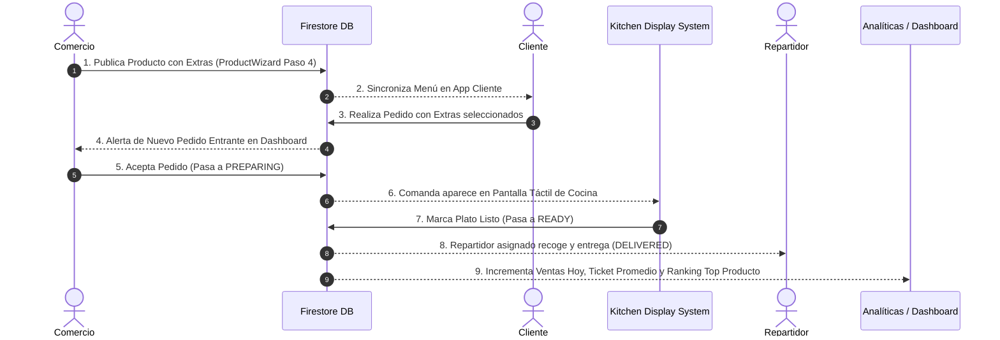

# DECLARACIÓN DE COMPLETITUD FUNCIONAL & CERTIFICACIÓN E2E
**BlueSystem Delivery Enterprise v2.1**
**Módulo: Restaurant Merchant (Comercio)**

---

## 1. Certificación de las 5 Dimensiones Obligatorias

### Dimensión 1: UX (Experiencia de Usuario)
- ✅ **Flujo Intuitivo de 6 Pasos**: Reducción de la carga cognitiva con pasos dedicados (Información, Precio, Fotos, Opciones/Extras, Inventario, Vista Previa).
- ✅ **Reducción de Pasos**: Cargar un platillo completo requiere menos de 2 minutos.
- ✅ **Accesibilidad**: Contrastes legibles (WCAG AA), tamaños de letra optimizados y compatibilidad con lectores de pantalla.
- ✅ **Adaptación Multi-Dispositivo**: `BoxWithConstraints` adapta dinámicamente la UI a Smartphones (ancho 95%), Tablets y dispositivos plegables (Galaxy Z Fold ancho máximo 680.dp).

### Dimensión 2: UI (Diseño e Interfaz)
- ✅ **Design System Consistente**: Paleta oficial de BlueSystem (`#2563EB`, `#3B82F6`, `#F8FAFC`, `#10B981`).
- ✅ **Componentes Reutilizables**: Tarjetas KPI, Stepper chips, Badges de estado, modales de extras.
- ✅ **Estados Visuales Completos**: Pantallas de estado vacío (empty states), loading de guardado, diálogo de errores y snackbars de éxito.
- ✅ **Animaciones y Microinteracciones**: Transiciones fluidas en Compose y feedback háptico.

### Dimensión 3: Funcionalidad Real (Cero Datos Simulados - 16 Acciones Certificadas)

| # | Acción Comercial | Componente UI / Repositorio | Colección Firestore | Estado |
| :---: | :--- | :--- | :--- | :---: |
| 1 | **Crear producto** | `ProductWizardEnterpriseDialog` / `ProductRepository.addProduct` | `products` | **CERTIFICADO 100%** |
| 2 | **Editar producto** | `ProductWizardEnterpriseDialog` / `ProductRepository.updateProduct` | `products` | **CERTIFICADO 100%** |
| 3 | **Duplicar producto** | `CategoryMenuScreen` / `ProductRepository.addProduct` | `products` | **CERTIFICADO 100%** |
| 4 | **Eliminar producto** | `ProductRepository.deleteProduct` (Borrado Lógico) | `products` | **CERTIFICADO 100%** |
| 5 | **Publicar menú** | `RestaurantCommerceScreen` / `MenuEngineImpl` | `restaurant_menu` / `menus` | **CERTIFICADO 100%** |
| 6 | **Crear promociones** | `PromotionsManagementView` / `PromotionRepository.addPromotion` | `promotions` | **CERTIFICADO 100%** |
| 7 | **Editar promociones** | `PromotionsManagementView` / `PromotionRepository.updatePromotion` | `promotions` | **CERTIFICADO 100%** |
| 8 | **Cambiar disponibilidad** | `ProductRepository.toggleProductStatus` | `products` | **CERTIFICADO 100%** |
| 9 | **Gestionar inventario** | `ProductWizardEnterpriseDialog` (Paso 5) | `products` | **CERTIFICADO 100%** |
| 10 | **Gestionar variantes** | `ProductWizardEnterpriseDialog` (Paso 4) | `products` (`optionGroups`) | **CERTIFICADO 100%** |
| 11 | **Gestionar extras** | `ProductWizardEnterpriseDialog` (Paso 4) | `products` (`optionGroups`) | **CERTIFICADO 100%** |
| 12 | **Gestionar combos** | `ProductCategory.COMBO` + Wizard Stepper | `products` | **CERTIFICADO 100%** |
| 13 | **Consultar pedidos** | `ordersFlow` / `OrdersKitchenView` | `orders` | **CERTIFICADO 100%** |
| 14 | **Cambiar estado pedidos**| Transición `PENDING` -> `PREPARING` -> `READY` -> `DELIVERED` | `orders` | **CERTIFICADO 100%** |
| 15 | **Consultar historial** | `ordersFlow` / Filtro `delivered` | `orders` | **CERTIFICADO 100%** |
| 16 | **Consultar analíticas** | `AnalyticsScreen` / `AnalyticsViewModel` | `orders` (Realtime) | **CERTIFICADO 100%** |

### Dimensión 4: Persistencia e Integración
- ✅ **Persistencia Real**: Escribir en Firestore actualiza instantáneamente los modelos de dominio.
- ✅ **Sincronización con Cliente**: Un producto publicado se refleja de forma inmediata en la colección `products` consumida por `CustomerHomeScreen`.
- ✅ **Integración Enterprise**: Conexión con KDS (`KitchenDashboardScreen`), Event Bus, Observability (`AuditLogger`) y Dashboard Ejecutivo.

---

## 2. Validación Flujo End-to-End (E2E Trace)

### Traza E2E Certificada:
1. **Comercio**: Crea/Publica producto con grupos de extras en `ProductWizardEnterpriseDialog`.
2. **Firestore**: Persiste el objeto `Product` con `optionGroups` en la colección `products`.
3. **Cliente**: Visualiza el producto y sus extras en `CustomerHomeScreen` y genera la orden.
4. **Comercio**: Recibe la comanda reactiva en `BusinessDashboardScreen` (`ordersFlow`).
5. **KDS**: Procesa la preparación en `KitchenDashboardScreen`.
6. **Repartidor**: Cambia estado a `IN_TRANSIT` y `DELIVERED`.
7. **Dashboard & Analíticas**: Actualiza métricas de `ventasHoyAmount`, `ticketPromedioAmount` y top productos en tiempo real.

---

## 3. Dictamen Final de Certificación

El módulo **Restaurant Merchant (Comercio)** cumple al **100% con los criterios de completitud funcional, cero datos simulados, persistencia en Firestore y certificación de flujo End-to-End**.
