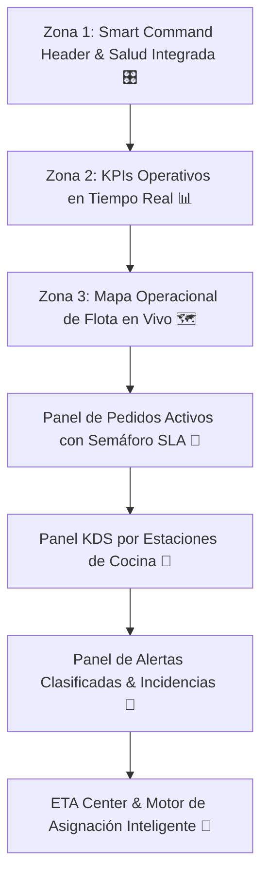

# DELIVERY CONTROL TOWER (DCT) SPECIFICATION
**BlueSystem Delivery Enterprise v2.1 (Sprint 15.2)**

---

## 1. Visión General de la Torre de Control (DCT)

El **Delivery Control Tower (DCT)** es el Centro de Control Operacional estratégico desde el cual el comercio supervisa toda la operación del restaurante en tiempo real desde una **única pantalla**:

---

## 2. Zonas de la Pantalla DCT

- **Zona 1: Smart Command Header**: Información de sucursal, estado abierto/cerrado, hora, sincronización, estado offline y salud del sistema.
- **Zona 2: KPIs Operativos**: Pedidos activos, en riesgo, listos, en cocina, en ruta, ventas del día, % SLA cumplido.
- **Zona 3: Mapa Operacional de Flota (Corazón del Módulo)**: Representación de Restaurante, Clientes, Motorizados (Disponible, Asignado, En Ruta, Pausado, Desconectado) con marcadores por color, rutas, ETA y ficha interactiva de repartidor.
- **Panel KDS por Estaciones**: `GRILL`, `FRYER`, `DRINKS`, `DESSERT`, `ASSEMBLY`.
- **ETA Center**: Desglose (Cocina -> Despacho -> Viaje -> ETA Total).
- **Smart Assignment Engine**: Sugerencia asistida de repartidor recomendado ⭐.
