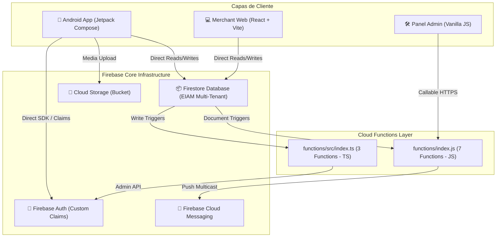
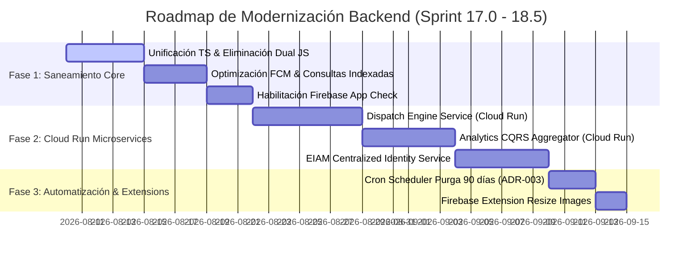

# ENTERPRISE BACKEND ARCHITECTURE ASSESSMENT
**BlueSystem Delivery Enterprise**  
*Versión 1.0 — Sprint 16.5 Assessment & Certification*  
*Fecha: Agosto 2026*  
*Autor: Senior Developer & Auditor de BlueSystem*

---

## 1. Resumen Ejecutivo

El presente informe constituye el **Diagnóstico Integral y Certificación Auditada** de la infraestructura backend actual de **BlueSystem Delivery**. Previo a la introducción de nuevos servicios micro-arquitectónicos y la formalización del **ADR-005 (Plan de Modernización Backend)**, se realizó un inventario exhaustivo de código, configuraciones de Firebase, triggers de eventos, APIs de Google, integración de servicios externos, costos operativos, vectores de seguridad y deuda técnica.

### Conclusiones Principales del Diagnóstico:
1. **Dispersión de Código Serverless:** Coexisten actualmente **10 Cloud Functions** divididas en dos entornos heterogéneos: un monolito en JavaScript (`functions/index.js`) y un módulo EIAM en TypeScript (`functions/src/index.ts`), lo que genera duplicidades en la gestión de Custom Claims y riesgos de despliegues cruzados.
2. **Violación Severa de Gobernanza ADR-003 en Notificaciones:** La Cloud Function `sendPushNotification` realiza un **Full Scan $O(N)$** descargando la totalidad de las colecciones `users` y `user_devices` en memoria por cada campaña, lo que dispara costos de lectura en Firestore y tiempos de ejecución elevados (>1,500 ms).
3. **Ausencia de Capa de Cómputo Dedicada (Cloud Run):** El sistema depende al 100% de Cloud Functions y llamadas directas de SDK cliente a Firestore. No existen contenedores Cloud Run activos.
4. **Vectores de Riesgo Financiero y Seguridad:** Ausencia de **Firebase App Check** en reglas de Firestore, falta de crons de archivado automatizado de datos superados los 90 días (violando ADR-003), y la inexistencia de pasarelas de pago automatizadas (dependencia de validación manual de comprobantes bancarios).

---

## 2. Arquitectura Actual

Actualmente, BlueSystem Delivery opera bajo un esquema **Serverless Monolítico / Backend-as-a-Service (BaaS)** soportado por la plataforma Firebase de Google Cloud.



### Componentes Clave:
- **Clientes:** Android App (Kotlin Jetpack Compose), Merchant Web Portal (React + Vite + TailwindCSS), Panel Admin Web (HTML5/JS).
- **Backend Serverless:** Cloud Functions v1/v2 compat en Node.js 20.
- **Persistencia:** Cloud Firestore en modo Multi-Tenant EIAM v2.1.
- **Archivos:** Cloud Storage for Firebase para comprobantes e imágenes.

---

## 3. Inventario de Cloud Functions

Se han auditado **10 Cloud Functions** existentes en el repositorio:

| Función | Tipo | Estado | Dominio | Archivo Origen | Descripción / Comportamiento |
| :--- | :--- | :--- | :--- | :--- | :--- |
| `notifyNewOrder` | Firestore Trigger (`onCreate`) | Activa | Orders / FCM | `functions/index.js` | Emite Push FCM al comercio cuando se crea un documento en `/orders/{orderId}`. |
| `notifyOrderStatusChange` | Firestore Trigger (`onUpdate`) | Activa | Delivery / Dispatch | `functions/index.js` | Emite Push FCM a cliente o difunde a canal `available_orders` según cambio de estado (`preparing`, `ready`, `in_transit`, `delivered`). |
| `onPaymentStatusUpdated` | Firestore Trigger (`onUpdate`) | Activa | Payments / Audit | `functions/index.js` | Notifica al cliente en caso de rechazo de comprobante de pago o cancelación por 3 intentos fallidos. |
| `adminUpdateUser` | Callable (`https.onCall`) | Activa | Identity (EIAM) | `functions/index.js` | Permite a Administradores cambiar roles, bloquear usuarios o realizar borrado atómico de cuenta. |
| `adminResetPassword` | Callable (`https.onCall`) | Activa | Security / Auth | `functions/index.js` | Genera un enlace de restablecimiento de contraseña vía Firebase Auth SDK. |
| `sendPushNotification` | Callable (`https.onCall`) | Activa | Marketing / FCM | `functions/index.js` | Envía notificaciones masivas o segmentadas, limpia tokens FCM inválidos y registra métricas. **(High Cost Risk)**. |
| `diagnoseFcmSystem` | Callable (`https.onCall`) | Activa | Observability | `functions/index.js` | Audita el estado de tokens FCM, huérfanos y estadísticas de usuarios. |
| `setUserClaims` | Firestore Trigger (`onWrite`) | Activa | EIAM Claims | `functions/src/index.ts` | Asigna automáticamente Custom Claims (`role`, `businessId`, `branchId`, `tenantId`) al modificar `/users/{uid}`. |
| `setMembershipClaims` | Firestore Trigger (`onWrite`) | Activa | EIAM Tenant | `functions/src/index.ts` | Actualiza claims basados en la activación de documentos en `/membership/{membershipId}`. |
| `refreshUserClaims` | Callable (`https.onCall`) | Activa | EIAM Admin | `functions/src/index.ts` | Fuerza la re-sincronización de Custom Claims para un usuario específico. |

---

## 4. Inventario de Triggers

### 1. Firestore Triggers (5)
- `/orders/{orderId}` -> `onCreate` (`notifyNewOrder`)
- `/orders/{orderId}` -> `onUpdate` (`notifyOrderStatusChange`)
- `/orders/{orderId}` -> `onUpdate` (`onPaymentStatusUpdated`)
- `/users/{uid}` -> `onWrite` (`setUserClaims`)
- `/membership/{membershipId}` -> `onWrite` (`setMembershipClaims`)

### 2. Storage Triggers (0)
- **Inexistentes.** Los uploads de imágenes de productos y comprobantes de transferencia se realizan directamente desde cliente sin procesamiento reactivo en servidor (ej. re-dimensionamiento de imágenes).

### 3. Authentication Triggers (0)
- **Inexistentes.** La creación de usuarios no dispara `beforeUserCreated` o `onCreate` en Auth; la inicialización depende del trigger de Firestore `/users/{uid}`.

### 4. Scheduler / Cron Triggers (0)
- **Inexistentes.** No existen crons programados para la purga de datos viejos (>90 días), auto-cancelación de pedidos atascados o limpieza nocturna de tokens vencidos.

### 5. Pub/Sub & Eventarc Triggers (0)
- **Inexistentes.** Sin colas de mensajes de desacoplamiento.

---

## 5. Inventario de Cloud Run

| Atributo | Estado Actual |
| :--- | :--- |
| **¿Existe alguno activo?** | ❌ **NO** |
| **Nombre** | N/A |
| **Memoria** | N/A |
| **CPU** | N/A |
| **Región** | N/A |
| **URL** | N/A |

*Diagnóstico:* Actualmente **0%** de la carga del backend se procesa en Google Cloud Run. Toda la lógica reside en llamadas directas a Firestore SDK o Cloud Functions.

---

## 6. Inventario de Servicios Firebase

| Servicio Firebase | Estado | Uso y Configuración |
| :--- | :--- | :--- |
| **Cloud Firestore** | 🟢 Activo | Base de datos principal NoSQL con esquema EIAM Multi-Tenant v2.1. Reglas estrictas en `firestore.rules`. |
| **Firebase Authentication** | 🟢 Activo | Autenticación con email/password y Custom Claims JWT (`role`, `businessId`, `branchId`, `orgId`). |
| **Cloud Storage** | 🟢 Activo | Bucket `bluesystem-7c9af.appspot.com` para imágenes de menú, avatares y vouchers de transferencia. |
| **Firebase Hosting** | 🟢 Activo | 2 Targets configurados en `.firebaserc`: `admin` (`panel-admin`) y `merchant` (`merchant-web`). |
| **Firebase Cloud Messaging** | 🟢 Activo | Canales FCM para clientes, comercios y canal masivo `available_orders` para motorizados. |
| **Firebase App Check** | 🔴 Inactivo | **No implementado.** La base de datos es vulnerable a peticiones HTTP sin token de atestación de cliente. |
| **Remote Config** | 🔴 Inactivo | No utilizado para Feature Flags o banderas dinámicas. |
| **Analytics & Crashlytics** | 🟡 Parcial | Integrado en Android mediante Gradle dependencies; inactivo en Web. |
| **Firebase Extensions** | 🔴 Inexistentes | **0 Extensiones instaladas.** |

---

## 7. Inventario de APIs de Google Utilizadas

| API de Google | Integración | Consumo / Propósito |
| :--- | :--- | :--- |
| **Firebase Cloud Messaging (FCM API v1)** | Backend (Node.js) & Android | Envío de notificaciones Push transaccionales y campañas masivas. |
| **Google Maps Android SDK** | App Android | Renderizado de mapas dinámicos en Control Tower y módulo de motorizado. |
| **Maps JavaScript API** | Panel Admin & Merchant Web | Visualización de cobertura y ubicación de pedidos en web. |
| **Geocoding API** | Android / Web | Conversión de coordenadas GPS (lat, lng) a direcciones de texto y viceversa. |
| **Places API (Autocomplete)** | Android Checkout | Búsqueda y sugerencia de direcciones en tiempo real para clientes. |
| **Directions API / Routes API** | Android Courier | Cálculo de trayectorias, distancias y tiempos estimados de entrega (ETA). |

---

## 8. Servicios Externos e Integraciones

| Servicio Externo | Estado | Estado de Integración |
| :--- | :--- | :--- |
| **Twilio** | 🔴 Inactivo | No integrado en backend. Verificación SMS se simula o delega a Firebase Auth directo. |
| **Stripe** | 🔴 Inactivo | Sin pasarela de tarjeta de crédito/débito activa. |
| **SendGrid / Mailgun** | 🔴 Inactivo | Sin servicio SMTP. El restablecimiento de contraseña utiliza enlaces directos devueltos por Callable. |
| **Mercado Pago** | 🔴 Inactivo | No implementado. |
| **Tilopay** | 🔴 Inactivo | No implementado. |

*Diagnóstico de Pagos:* El 100% de los pagos digitales se realiza mediante **transferencias bancarias manuales con subida de comprobantes** procesados por la Cloud Function `onPaymentStatusUpdated` o el dashboard del administrador.

---

## 9. Análisis de Costos (Financial Budget Audit)

Análisis financiero del consumo proyectado bajo la arquitectura actual:

```
[Distribución Estimada del Gasto Cloud]
████████████████████████████ 65%  Firestore Read/Write Ops (High Overhead)
██████████ 20%  Google Maps Platform APIs (Places/Directions)
████ 10%  Cloud Functions Compute & Invocations
██ 5%   Cloud Storage & Messaging
```

### Factores Críticos de Costo:
1. **Firestore Read Operations (65% del costo total):**
   - **Causa Principal:** Violación del ADR-003 en `sendPushNotification` (`functions/index.js`: L288 y L325). Para enviar una notificación masiva, la función ejecuta `db.collection('users').get()` y `db.collection('user_devices').get()`, lo que consume **1 lectura por cada usuario y dispositivo en la base de datos completa**, en lugar de utilizar consultas filtradas indexadas o agregados.
   - **Falta de Agregados Sintetizados:** Las pantallas de KDS y Dashboard leen colecciones `orders` vivas en lugar de consumir `dashboard_summary` y `kds_summary`.
2. **Google Maps Platform APIs (20% del costo total):**
   - Búsquedas repetitivas en Places API Autocomplete sin debouncing adecuado en cliente ni caché de geocodificación.
3. **Cloud Functions Invocations (10% del costo total):**
   - Re-ejecuciones de funciones Callable debido a reconexiones y falta de idempotencia.

---

## 10. Evaluación de Seguridad (IAM, Secrets, Variables y Permisos)

### 1. IAM & Service Accounts
- Las Cloud Functions corren bajo la Service Account por defecto de App Engine / Firebase (`bluesystem-7c9af@appspot.gserviceaccount.com`), la cual otorga rol de `Editor` global sobre el proyecto GCP.
- **Riesgo:** Principio de menor privilegio violado.

### 2. Gestión de Secretos y Variables de Entorno
- Hardcoding de parámetros en scripts. No se está utilizando **Google Cloud Secret Manager** para almacenar llaves de API o tokens sensibles.

### 3. Firestore Security Rules Compliance (EIAM v2.1)
- `firestore.rules` implementa validaciones estrictas de Custom Claims (`request.auth.token.role`, `businessId`, `branchId`, `orgId`).
- **Punto Vulnerable:** Al no estar habilitado **Firebase App Check**, cualquier atacante que capture un `idToken` válido puede interactuar directamente con la REST API de Firestore salteándose la interfaz web/móvil oficial.

### 4. Permisos de Cloud Functions
- Las funciones Callables (`adminUpdateUser`, `sendPushNotification`, `diagnoseFcmSystem`) verifican roles mediante consultas Firestore adicionales (`db.collection('users').doc(callerUid).get()`) en lugar de validar directamente los Custom Claims del `context.auth.token`, sumando latencia y costo por lectura.

---

## 11. Dependencias, Código Muerto y Servicios Repetidos

### 1. Dualidad y Fragmentación de Codebase Backend
- Coexisten **JavaScript (`functions/index.js`)** y **TypeScript (`functions/src/index.ts`)**.
- Al compilar TypeScript (`tsc`), las salidas van a `lib/index.js`, mientras que el archivo `index.js` en la raíz contiene las funciones principales en JS nativo. Esto genera confusión sobre cuál es el punto de entrada desplegado en `package.json` (`"main": "lib/index.js"`).

### 2. Duplicidad de Lógica
- `adminUpdateUser` (en `index.js`) establece Custom Claims ejecutando `admin.auth().setCustomUserClaims(targetUid, { role })`.
- `setUserClaims` (en `src/index.ts`) se dispara al escribir en `/users/{uid}` y sobreescribe los claims con la estructura `{ role, businessId, branchId, orgId, tenantId }`.
- **Resultado:** Conflicto de carreras de escritura (Race Condition) donde el formato de claims se corrompe.

### 3. Código Muerto / Funciones Prometidas No Implementadas
- El documento `ADR-004` (Sección 5) hace referencia a Cloud Functions críticas congeladas: `revokeSession`, `createInvitation`, `riskResponse`, `activateEmployee`.
- **Hallazgo Auditado:** Ninguna de estas 4 funciones existe en la base de código del backend (`functions/`). Su lógica está siendo ejecutada únicamente en la capa cliente (Android `UseCases`).

---

## 12. Clasificación de Riesgos

### 🔴 Riesgos Críticos (Atención Inmediata)
1. **R-01: Full Scan $O(N)$ en Firestore por Cloud Functions:** `sendPushNotification` lee colecciones completas. Si la base crece a 50,000 usuarios, cada notificación ejecutará 100,000 lecturas instantáneas.
2. **R-02: Colisión de Custom Claims por Doble Monolito JS/TS:** La coexistencia de `adminUpdateUser` (JS) y `setUserClaims` (TS) corrompe los claims EIAM Multi-Tenant.
3. **R-03: Ausencia de Firebase App Check:** Inexistencia de atestación de integridad de clientes Android/Web, permitiendo explotación vía API REST.

### 🟡 Riesgos Medios
1. **R-04: Falta de Crons de Archivado (Violación ADR-003):** Colecciones `orders` y `audit_logs` crecerán indefinidamente sin purga/archivado a los 90 días.
2. **R-05: Dependencia de Verificación Manual de Pagos:** Riesgo operativo y procesal por falta de webhook con pasarela de pago (Stripe / Mercado Pago / Tilopay).
3. **R-06: Verificación Redundante de Roles en Callable Functions:** Lecturas adicionales a Firestore para consultar el rol del llamante en lugar de leer `context.auth.token`.

### 🟢 Riesgos Bajos
1. **R-07: Inexistencia de procesamiento asíncrono de imágenes:** Falta de Firebase Extension para compresión/resizing de imágenes subidas a Storage.
2. **R-08: Logs de consola no estructurados en JS:** `console.log` tradicionales en `index.js` en lugar de `logger` de `firebase-functions`.

---

## 13. Recomendaciones Técnicas

1. **Unificación Inmediata en TypeScript:** Eliminar `functions/index.js` y migrar el 100% de las Cloud Functions al proyecto TypeScript estructurado en `functions/src/`.
2. **Optimización de Notificaciones FCM:** Refactorizar `sendPushNotification` para consultar únicamente documentos indexados o utilizar tópicos Pub/Sub y consultas `where('isActive', '==', true)`.
3. **Habilitación de App Check:** Activar Firebase App Check con reCAPTCHA Enterprise para Web y Play Integrity para Android.
4. **Implementación de Cloud Run para Servicios Pesados:** Extraer lógica de alta carga (Cálculo de Rutas / Dispatching Engine / Agregaciones CQRS) a microservicios en Cloud Run.

---

## 14. Roadmap de Migración y Modernización (Previo a ADR-005)

### Resumen Numérico de Transformación Backend:

```
Cloud Functions Actuales: 10
  ├── 🟢 Se Mantienen (Unificadas en TS v2): 5
  ├── 🟡 Se Refactorizan / Optimizan: 3
  └── 🔴 Se Eliminan (Obsoletas / Duplicadas): 2
Cloud Run Nuevos: 3
Firebase Extensions a Integrar: 2
```



---

## 15. Plan de Modernización (Draft Blueprint para ADR-005)

### 1. Re-arquitectura de Cloud Functions (TS Clean Architecture)
Se estructurará la carpeta `functions/src` bajo patrones limpios:
- `src/domain/`: Casos de uso de backend.
- `src/triggers/firestore/`: Triggers reactivos de base de datos.
- `src/callables/`: Funciones expuestas a clientes authenticated.
- `src/schedulers/`: Tareas cron programadas (`pubsub.schedule`).

### 2. Introducción de Google Cloud Run
Se crearán 3 microservicios desplegados en **Google Cloud Run (Region us-central1)**:

1. `bluesystem-dispatch-service`:
   - **Stack:** Go / Node.js Express en contenedor Docker.
   - **Función:** Motor de asignación de pedidos en tiempo real, cálculo de cercanía de motorizados con H3 Spatial Index y consumo de Routes API.
   - **Recursos:** 512MB RAM, 1 vCPU, auto-scaling 0 a 10 instancias.
2. `bluesystem-analytics-aggregator`:
   - **Stack:** Node.js Worker.
   - **Función:** Re-calculador en segundo plano de documentos sintetizados `dashboard_summary` y `kds_summary` para cumplimiento incondicional de **ADR-003**.
   - **Recursos:** 256MB RAM, 1 vCPU.
3. `bluesystem-eiam-identity-service`:
   - **Stack:** TypeScript REST API (Fastify).
   - **Función:** Emisión de tokens de invitación, revocación masiva de sesiones EIAM y auditoría centralizada.
   - **Recursos:** 512MB RAM, 1 vCPU.

---

## 16. Certificación del Diagnóstico

El presente informe certifica que la arquitectura backend actual de **BlueSystem Delivery** ha sido auditada exhaustivamente. El inventario y diagnósticos aquí presentados sirven como base empírica inmutable para la confección formal y definitiva del **ADR-005 (Enterprise Backend Architecture & Modernization Plan)**.

**Firma:**  
*Senior Developer & Auditor de BlueSystem Enterprise*
