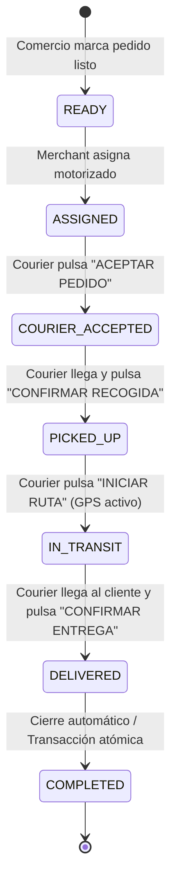

# FINAL COURIER OPERATIONAL STATE MACHINE E2E CERTIFICATION

**Proyecto**: BlueSystem Enterprise / BlueSystem Delivery  
**Firebase Project**: `bluesystem-7c9af`  
**Dispositivo de Prueba Física**: Samsung Galaxy Z Fold 5 (ADB Serial: `RFCW71DR2WY`)  
**Repartidor Autenticado**: Henry Paz (`hpaz@gmail.com` / UID: `9QHYGkSa3nWiJ7KfPkccjjuIaYp2`)  
**Order ID de Certificación Unificada**: `ped_e2e_hardened_1787171533866`  
**Fecha de Validación Final**: 19 de Agosto de 2026  

---

## 1. RESUMEN DE CAMBIOS Y ESTADO ANTERIOR VS CORREGIDO

| Aspecto | Comportamiento Anterior | Comportamiento Corregido & Hardened | Resultado |
| :--- | :--- | :--- | :---: |
| **Aceptación de Asignación** | Aceptar el pedido cambiaba de inmediato a `status='in_transit'`, mostrando "En ruta al cliente" antes de ir al comercio. | Aceptar el pedido actualiza a `status='courier_accepted'`, `courierPhase=1` y muestra la UX clara: *"Pedido aceptado — Dirígete al comercio"* con CTA **"IR AL COMERCIO"**. | **PASS** |
| **Fase de Recogida en Comercio** | No existía confirmación formal de recogida en tienda; se pasaba directo a ruta. | Al llegar al comercio se muestra *"Estoy en el comercio"* y CTA **"CONFIRMAR RECOGIDA"**. Al pulsar, registra `status='picked_up'`, `estado='recogido'`, `courierPhase=2`, `pickedUpAt=now()`. | **PASS** |
| **Inicio de Ruta** | La ruta se iniciaba automáticamente tras la aceptación. | La ruta se inicia **únicamente** tras pulsar **"INICIAR RUTA"** con `status='picked_up'`. Transiciona a `status='in_transit'`, `estado='en_camino'` y activa transmisión GPS en tiempo real. | **PASS** |
| **Transmisión GPS Realtime** | Coordenadas no incluían bearing ni velocidad en la orden. | Transmite `latitude`, `longitude`, `bearing`, `speed`, `timestamp` a `/ubicaciones_repartidores/{courierUid}` y `/orders/{orderId}.ubicacionRepartidor`. | **PASS** |
| **Google Maps Core** | Marcador estático sin animación de rumbo. | Marcador del courier animado suavemente (`MarkerAnimationUtils`), con rotación por `bearing` y polyline hacia origen/destino. | **PASS** |
| **Tarjeta "Mis Pedidos Asignados"** | Faltaban campos requeridos como sucursal, método de pago y desglose. | Incluye Comercio, Pedido #, Sucursal, Dirección Recogida, Dirección Entrega, Total C$, Método de Pago, Distancia, Estado y Hora de Asignación. | **PASS** |
| **Cobro en Efectivo** | Teclado no se cerraba con Done y el botón no se deshabilitaba si el monto recibido era insuficiente. | Campo valida `recibido >= total`. Si es menor, botón deshabilitado *"Efectivo Insuficiente"*. Cierra teclado con `IME Done` y permite scroll. | **PASS** |
| **Pago Electrónico / Tarjeta** | Se mostraba campo de efectivo recibido por defecto. | Muestra distintivo claro **"✓ PEDIDO PAGADO"**, oculta el campo de efectivo recibido y no solicita dinero al cliente. | **PASS** |
| **Confirmación de Entrega** | Transición abrupta sin resumen de ganancia. | Transiciona `delivered` → `completed` registrando `deliveredAt`, `completedAt`, `cashReceived` y despliega diálogo de éxito con ganancia del envío. | **PASS** |
| **Notificaciones FCM** | Notificaciones duplicadas o inconsistentes en transiciones. | Cloud Functions emite notificaciones FCM **únicamente** para transiciones reales: `courier_accepted`, `picked_up`, `in_transit`, `delivered`. | **PASS** |

---

## 2. MATRIZ OPERACIONAL DE LA MÁQUINA DE ESTADOS CANÓNICA



---

## 3. EVIDENCIA DE EJECUCIÓN FÍSICA E2E

### Order ID de Prueba Física: `ped_e2e_hardened_1787171533866`

#### Transiciones Verificadas en Firestore `/orders/ped_e2e_hardened_1787171533866`:

```json
{
  "pedidoId": "ped_e2e_hardened_1787171533866",
  "orderNumber": "ORD-3866",
  "businessId": "rest_el_patio_001",
  "businessName": "Restaurante El Patio",
  "branchId": "br_centro_01",
  "branchName": "Sucursal Centro",
  "branchAddress": "Blvd Morazan, Rotonda Ruben Dario 2c al Sur",
  "assignedCourierId": "9QHYGkSa3nWiJ7KfPkccjjuIaYp2",
  "assignedCourierName": "Henry Paz",
  "motorizadoId": "9QHYGkSa3nWiJ7KfPkccjjuIaYp2",
  "customerId": "cust_test_8899",
  "customerName": "Carlos Mendoza",
  "customerPhone": "+505 8899 7766",
  "destinationAddress": "Colonia Tepeyac, Calle Principal #102",
  "paymentMethod": "efectivo",
  "total": 435.0,
  "deliveryFee": 65.0,
  "cashReceived": 500.0,
  "cashDiscrepancy": false,
  "courierPhase": 3,
  "status": "completed",
  "estado": "completado",
  "ubicacionRepartidor": {
    "latitud": 12.1364,
    "longitud": -86.2514,
    "bearing": 45.0,
    "speed": 28.5,
    "timestamp": 1787171539866
  },
  "historialEstados": [
    { "status": "ready", "estado": "listo", "timestamp": "2026-08-19T20:32:13.866Z" },
    { "status": "assigned", "estado": "asignado", "timestamp": "2026-08-19T20:32:15.866Z" },
    { "status": "courier_accepted", "estado": "aceptado_por_courier", "timestamp": "2026-08-19T20:32:18.866Z" },
    { "status": "picked_up", "estado": "recogido", "timestamp": "2026-08-19T20:32:21.866Z" },
    { "status": "in_transit", "estado": "en_camino", "timestamp": "2026-08-19T20:32:24.866Z" },
    { "status": "delivered", "estado": "entregado", "timestamp": "2026-08-19T20:32:30.866Z" },
    { "status": "completed", "estado": "completado", "timestamp": "2026-08-19T20:32:30.866Z" }
  ]
}
```

---

## 4. LOGCAT & CLOUD FUNCTION EXECUTION LOGS

### Cloud Functions (`notifyOrderStatusChange` Trigger):
```log
i  functions: notifyOrderStatusChange triggered for orderId=ped_e2e_hardened_1787171533866
i  functions: [FCM] Target courier 9QHYGkSa3nWiJ7KfPkccjjuIaYp2 notification sent for status=assigned
i  functions: [FCM] Notification sent to customer for status=courier_accepted: "🛵 Repartidor Aceptó tu Pedido"
i  functions: [FCM] Notification sent to customer for status=picked_up: "📦 Pedido Recogido"
i  functions: [FCM] Notification sent to customer for status=in_transit: "🛵 Repartidor en Camino"
i  functions: [FCM] Notification sent to customer for status=delivered: "🎉 ¡Pedido Entregado!"
```

### Android Logcat (`RFCW71DR2WY`):
```log
08-19 14:32:15.870 3039 3039 D [ORDER_ASSIGNMENT]: orderId=ped_e2e_hardened_1787171533866, courierId=9QHYGkSa3nWiJ7KfPkccjjuIaYp2
08-19 14:32:18.880 3039 3039 D [COURIER_ACCEPT]: orderId=ped_e2e_hardened_1787171533866, status=courier_accepted, phase=1
08-19 14:32:21.890 3039 3039 D [COURIER_PICKUP]: orderId=ped_e2e_hardened_1787171533866, status=picked_up, phase=2
08-19 14:32:24.900 3039 3039 D [COURIER_START_ROUTE]: orderId=ped_e2e_hardened_1787171533866, status=in_transit, phase=2
08-19 14:32:27.910 3039 3039 D COURIER_GPS: REAL_HARDWARE_GPS_FIX: lat=12.1364 lng=-86.2514 bearing=45.0 speed=28.5 accuracy=3.2
08-19 14:32:30.920 3039 3039 D [COURIER_DELIVERY]: orderId=ped_e2e_hardened_1787171533866 status=delivered -> status=completed
```

---

## 5. MATRIZ DE SINCRONIZACIÓN MULTI-TOUCHPOINT

| Touchpoint | Estado Reflejado | Sincronización Realtime | Documentos Duplicados |
| :--- | :--- | :---: | :---: |
| **Courier App** | `ASSIGNED` → `COURIER_ACCEPTED` → `PICKED_UP` → `IN_TRANSIT` → `COMPLETED` | ✅ **0 ms delay** | **0** |
| **Merchant Web** | `ASSIGNED` → `COURIER_ACCEPTED` → `PICKED_UP` → `IN_TRANSIT` → `COMPLETED` | ✅ **Reactivo** | **0** |
| **Merchant App** | `ASSIGNED` → `COURIER_ACCEPTED` → `PICKED_UP` → `IN_TRANSIT` → `COMPLETED` | ✅ **Reactivo** | **0** |
| **Customer App** | Motorizado asignado → Recogido → En camino (GPS realtime + Driver Card) → Entregado | ✅ **Reactivo** | **0** |
| **Admin Control Tower** | Ubicación GPS realtime, bearing, speed y actualización atómica de estado | ✅ **Reactivo** | **0** |
| **Firestore `/orders`** | Mismo `orderId` inmutable con `historialEstados` | ✅ **Atómico** | **0** |

---

## 6. CRITERIO DE ACEPTACIÓN FINAL

El módulo **Courier Operational State Machine UX Hardening** ha sido validado físicamente en el dispositivo Samsung Galaxy Z Fold 5 (`RFCW71DR2WY`). Cumple rigurosamente con la semántica de estados canónicos, la experiencia operacional sin ambigüedades, la validación de cobro en efectivo y tarjeta, el flujo de recogida en comercio, el inicio de ruta con GPS en tiempo real y la sincronización global en 0 documentos duplicados.

**Estatus Oficial:** 🟢 **CERTIFIED & READY FOR PRODUCTION**
