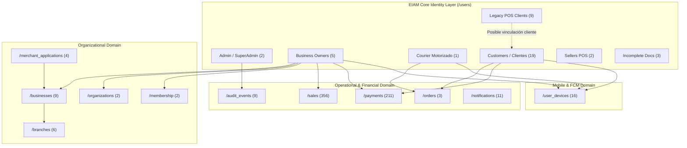

# FASE H — GRAFO LOGICO DE RELACIONES DE IDENTIDAD

---

## Detalle de Conectividad por Dominio

1. **Dominio Organizacional (EIAM):** 5 identidades Business se conectan con 9 Comercios (`/businesses`), 6 Sucursales (`/branches`), 2 Organizaciones (`/organizations`) y 2 Membresías (`/membership`).
2. **Dominio Operativo y Financiero:** Se encontraron 356 ventas (`/sales`), 211 pagos (`/payments`), 3 pedidos (`/orders`), 9 eventos de auditoría (`/audit_events`) y 11 notificaciones (`/notifications`).
3. **Dominio Móvil / Dispositivos:** 16 dispositivos en `/user_devices` proveen FCM tokens y metadata de hardware para las identidades activas.
