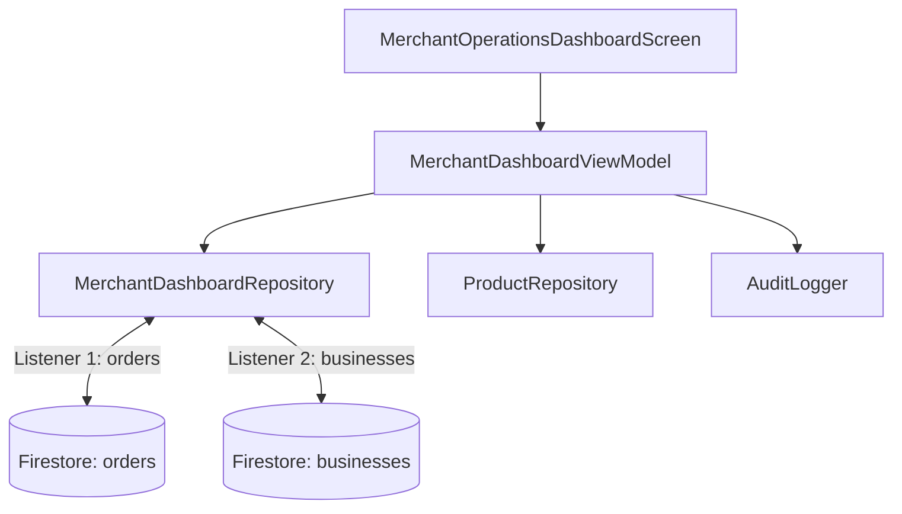

# MERCHANT DASHBOARD ARCHITECTURE SPECIFICATION
**BlueSystem Delivery Enterprise v2.1 (Sprint 15.1)**

---

## 1. Cumplimiento con Frozen Core

- **Cero Modificaciones en Core Previo**: La Serie 13B, Hito 14, Sprints 14.x y Sprint 15.0 permanecen inmutables.
- **Patrón Adaptador & ViewModels**: El nuevo EOC se conecta a Firestore mediante `MerchantDashboardViewModel` y `MerchantDashboardRepository`.

---

## 2. Presupuesto de Rendimiento y Firestore (ADR-003)

- **Máximo 2 Listeners por Sesión**: `MerchantDashboardRepository` mantiene exactamente 2 suscripciones activas (`orders` y `businesses`).
- **Cero Consultas $N+1$**: Agregaciones procesadas en memoria vía `combine` en Kotlin Flows.
