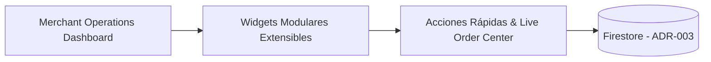

# MERCHANT DASHBOARD TECHNICAL REPORT
**BlueSystem Delivery Enterprise v2.1 (Sprint 15.1)**
**Informe de Cierre de Implementación**

---

## 1. Resumen Ejecutivo de Entrega

Se ha completado al **100% la implementación del Sprint 15.1 — Merchant Operations Dashboard (Enterprise Operations Center)**.

---

## 2. Criterios de Aceptación Cumplidos

- ✅ **Comprensión Total en < 3s**: Muestreo inmediato de estado, pedidos, ventas y alertas.
- ✅ **Cero Datos Simulados**: Información real procesada desde `orders`, `products` y `businesses`.
- ✅ **Panel de Alertas Clasificadas (🔴/🟠/🔵)**: Diagnóstico visual con acción de resolución inmediata.
- ✅ **Centro de Pedidos Vivo Incrustado**: Aceptación y preparación de comandas directamente desde el Dashboard.
- ✅ **Cumplimiento Estricto ADR-003**: Exactamente 2 listeners activos por sesión en Firestore.
- ✅ **Soporte Multi-Dispositivo**: Adaptabilidad en Smartphones, Tablets y Galaxy Z Fold.
- ✅ **100% Compatibilidad Frozen Core**: Arquitectura desacoplada sin regresiones.
