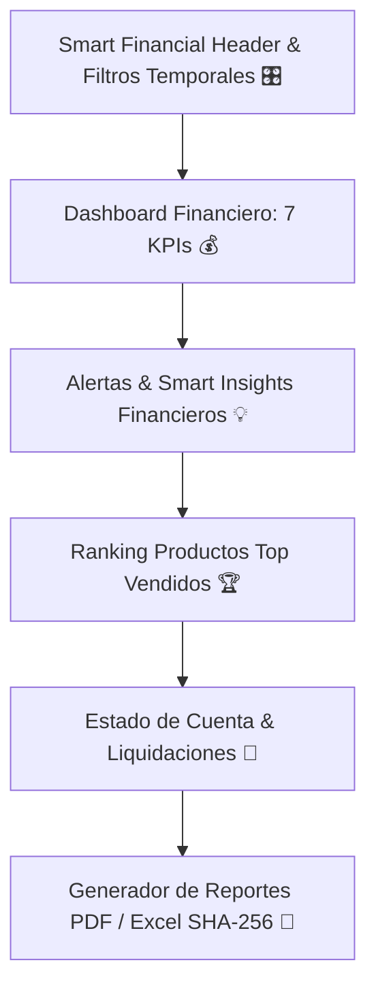

# MERCHANT FINANCE CENTER (MFC) SPECIFICATION
**BlueSystem Delivery Enterprise v2.1 (Sprint 15.7)**

---

## 1. Visión General del Centro Financiero del Comercio (MFC)

El **Merchant Finance Center (MFC)** proporciona al comerciante una visión clara e instantánea (< 3 segundos) de su salud económica sin necesidad de conocimientos contables ni ERPs dispersos.

---

## 2. Los 11 Módulos Financieros Especializados

1. **Smart Financial Header**: Sucursal, estado al día, moneda `C$`.
2. **Dashboard Financiero**: 7 Tarjetas KPI (Ventas Brutas, Ventas Netas, Pedidos, Ticket Promedio, Propinas, Comisión BSD, Utilidad Estimada).
3. **Filtros Temporales**: Hoy, Ayer, Esta Semana, Este Mes, 30 Días, Rango.
4. **Ventas por Categoría y Método**: Canales de pago y desglose por categorías.
5. **Comisiones BlueSystem**: Historial y % retenido.
6. **Propinas**: Totales y promedios por pedido.
7. **Productos Top Ranking**: Ranking por volumen de ingresos.
8. **Ticket Promedio**: Distribución por rangos.
9. **Utilidad Estimada**: Estimación transparente y opcional.
10. **Estado de Cuenta**: Liquidaciones, transferencias y códigos de referencia.
11. **Reportes PDF/Excel**: Firma digital SHA-256 y código QR de validación fiscal.
