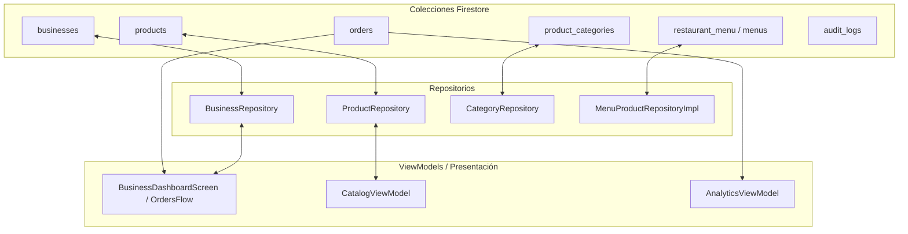
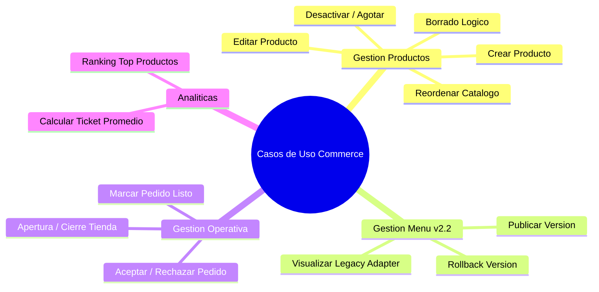

# RESTAURANT MERCHANT MODULE ARCHITECTURE
**BlueSystem Delivery Enterprise v2.1**
**Fase 0 — Descubrimiento, Auditoría y Levantamiento de Arquitectura**

---

## 1. Árbol Completo de Paquetes y Clases (Entregable 1)

El módulo **Restaurant Merchant (Comercio)** está estructurado bajo patrones de Arquitectura Limpia (Clean Architecture) combinados con la arquitectura recomendada por Android (UI - Domain - Data) utilizando Jetpack Compose.

```
com.example
├── presentation
│   ├── business
│   │   ├── BusinessDashboardScreen.kt      # Pantalla/Host Principal del Comercio & Navegación Tabs
│   │   ├── analytics
│   │   │   ├── AnalyticsScreen.kt          # UI de Analíticas, KPIs y Gráficas del Comercio
│   │   │   └── AnalyticsViewModel.kt       # ViewModel de Métricas Comerciales y Financieras
│   │   ├── catalog
│   │   │   ├── CatalogScreen.kt            # Vista de Grilla de Productos y Filtros Rápido
│   │   │   ├── CatalogViewModel.kt         # ViewModel Reactivo de Productos y Categorías
│   │   │   ├── ProductDialog.kt            # Formulario Modal Legacy (1 solo paso)
│   │   │   └── ProductWizardDialog.kt      # Stepper de 5 Pasos (Enterprise Wizard Alta/Edición)
│   │   ├── commerce
│   │   │   └── RestaurantCommerceScreen.kt # Vista Enterprise de Gestión por Menús v2.2 (Sprints 13B)
│   │   └── menu
│   │       ├── CategoryMenuScreen.kt       # Gestión por Categorías, Menús y Badges
│   │       └── MenuFilterChip.kt           # Enums y Filtros Rápidos de Menú
│   ├── kitchen
│   │   └── KitchenDashboardScreen.kt       # Panel KDS (Kitchen Display System) para Cocina
│   ├── admin
│   │   └── ComercioDetalleScreen.kt        # Vista Administrativa de Expediente de Comercio
│   └── splash / auth
├── domain
│   ├── model
│   │   ├── Product.kt                      # Modelo Plano Legacy de Producto y Enums de Estado
│   │   ├── BusinessInfo.kt                 # Perfil, Horarios y Parámetros del Comercio
│   │   ├── Analytics.kt                    # Modelos DTO de Analíticas Comerciales
│   │   └── order
│   │       └── Order.kt                    # Modelo de Pedido y Estados de Cocina
│   └── engine
│       ├── menu
│       │   ├── MenuEngine.kt               # Motor de Jerarquía y Publicación de Menú v2.2
│       │   ├── PricingEngine.kt            # Motor de Cálculo de Precios y Opciones
│       │   ├── AvailabilityEngine.kt       # Motor de Horarios y Disponibilidad Atómica
│       │   └── ValidationEngine.kt         # Motor de Validaciones de Selección
│       ├── promotion
│       │   └── PromotionEngine.kt          # Motor de Reglas de Promociones y Descuentos
│       └── kds
│           └── KdsQueueEngine.kt           # Motor de Colas de Cocina y Priorización
└── data
    └── repository
        ├── BusinessRepository.kt           # Repositorio de Perfil de Comercio en Firestore
        ├── ProductRepository.kt            # Repositorio Firestore (`products`) y Storage
        ├── AnalyticsRepository.kt          # Repositorio de Agregación de Métricas
        ├── CategoryRepository.kt           # Repositorio de Categorías del Comercio
        └── menu
            ├── MenuCategoryRepositoryImpl.kt # Implementación v2.2 para Categorías de Menú
            ├── MenuProductRepositoryImpl.kt  # Implementación v2.2 para Productos Hardened
            └── MenuVersionRepositoryImpl.kt  # Control de Versiones de Menú (`MenuVersion`)
```

### Matriz de Responsabilidad de Clases

| Paquete | Clase | Responsabilidad Principal |
| :--- | :--- | :--- |
| `presentation.business` | `BusinessDashboardScreen` | Host principal de navegación por Pestañas (Dashboard, Orders, Commerce, Menu, Promos, Stats, More). Gestiona flujos reactivos de pedidos en tiempo real y métricas del día. |
| `presentation.business.catalog` | `CatalogScreen` | Renderiza el catálogo plano de productos en grilla/lista con barra de búsqueda, chips de estadísticas y menú de acciones. |
| `presentation.business.catalog` | `CatalogViewModel` | Maneja el estado reactivo `CatalogUiState`, exposición de `Flow<List<Product>>`, guardado de imágenes en Firebase Storage y borrado lógico. |
| `presentation.business.catalog` | `ProductDialog` | Diálogo modal legacy de un solo formulario para agregar/editar productos de forma rápida. |
| `presentation.business.catalog` | `ProductWizardDialog` | Formulario avanzado stepper de 5 pasos estilo Uber Eats / PedidosYa (Datos Generales, Precios, Stock/Etiquetas, Opciones/Extras, Preview). |
| `presentation.business.commerce` | `RestaurantCommerceScreen` | Pantalla Enterprise para la gestión modular del menú v2.2 (Categorías, Variantes, Grupos de Opciones y Publicación). |
| `presentation.business.menu` | `CategoryMenuScreen` | Organiza el catálogo por pestañas de categorías, chips de filtrado (`ALL`, `ACTIVE`, `OUT_OF_STOCK`, `DISCOUNTED`) y permite agregar categorías al vuelo. |
| `presentation.business.analytics` | `AnalyticsScreen` | Dashboard visual de analíticas comerciales: tarjetas de KPIs, gráficos de pedidos por estado y ranking de productos más vendidos. |
| `presentation.business.analytics` | `AnalyticsViewModel` | Procesa y calcula las métricas de ingresos, ticket promedio y frecuencia de compra a partir de los pedidos consumidos. |
| `presentation.kitchen` | `KitchenDashboardScreen` | Interfaz KDS (Kitchen Display System) para pantalla táctil de cocina con tarjetas de preparación, temporizadores y cambios de estado atómicos. |
| `data.repository` | `ProductRepository` | Abstracción de acceso a datos para productos (`products`) en Firestore y carga de imágenes a Firebase Storage (`product_images`). |
| `data.repository` | `BusinessRepository` | Escucha en tiempo real del perfil del comercio (`businesses`), estado abierto/cerrado (`isOpen`), tarifas de envío y horarios. |
| `data.repository` | `CategoryRepository` | CRUD y sincronización en tiempo real de las categorías asociadas al comercio. |
| `domain.engine.menu` | `MenuEngineImpl` | Motor de dominio que ensambla la jerarquía v2.2 de menús, genera la síntesis denormalizada y emite eventos de publicación. |
| `domain.engine.promotion` | `PromotionEngine` | Evaluación de reglas de negocio para la aplicación de cupones, descuentos de producto y combos promocionales. |

---

## 2. Integración con Firestore (Entregable 6)

El módulo de Comercio interactúa con **6 colecciones principales** en Firebase Firestore. A continuación se detalla la matriz de lectura, escritura y componentes asociados:



### Matriz de Colecciones y Componentes

| Colección Firestore | Lectura | Escritura | Repositorio Consumidor | ViewModel / Screen Consumidor | Propósito |
| :--- | :---: | :---: | :--- | :--- | :--- |
| `businesses` | ✔ (Snapshots) | ✔ (Updates) | `BusinessRepository` | `BusinessDashboardScreen`, `ComercioDetalleScreen` | Expediente del negocio: estado `isOpen`, tarifas, horarios, comisiones. |
| `products` | ✔ (Realtime Flow) | ✔ (Set / Update) | `ProductRepository` | `CatalogViewModel`, `CategoryMenuScreen` | Catálogo de productos plano (Legacy v2.0). Contiene stock, precios, imágenes. |
| `orders` | ✔ (Realtime Query) | ✔ (Status update) | `OrderRepository` | `BusinessDashboardScreen` (ordersFlow), `KitchenDashboardScreen` | Pedidos entrantes del comercio filtrados por `businessId`. |
| `product_categories` | ✔ (Realtime) | ✔ (Add) | `CategoryRepository` | `CategoryMenuScreen`, `CatalogViewModel` | Listado de categorías de menú creadas por el comercio. |
| `restaurant_menu` | ✔ (MenuVersion) | ✔ (Batch publish) | `MenuVersionRepositoryImpl` | `RestaurantCommerceScreen` | Árbol sintetizado del catálogo v2.2 Enterprise. |
| `audit_logs` | ✖ | ✔ (Add) | `AuditLogger` | `CatalogViewModel`, `BusinessDashboardScreen` | Bitácora inmutable de cambios de estado y precio para integridad. |

---

## 3. Inventario de ViewModels (Entregable 7)

### 1. `CatalogViewModel`
- **Ubicación**: `com.example.presentation.business.catalog.CatalogViewModel`
- **Estado UI (`CatalogUiState`)**:
  - `products`: `List<Product>` (Lista completa consumida de Firestore)
  - `sections`: `List<CatalogSection>` (Agrupamiento dinámico por categoría)
  - `isLoading`: `Boolean`
  - `isSaving`: `Boolean`
  - `errorMessage`: `String?`
  - `successMessage`: `String?`
  - `searchQuery`: `String`
  - `selectedCategory`: `ProductCategory?`
  - `showAddDialog`: `Boolean`
  - `editingProduct`: `Product?`
- **Flujos / StateFlows**:
  - `uiState`: `StateFlow<CatalogUiState>`
- **Funciones de Dominio / Eventos**:
  - `loadProducts(businessId: String)`: Escucha reactiva con fallback automático anti-índice Firestore.
  - `addProduct(product: Product, imageBytes: ByteArray?)`: Sube imagen a Storage y registra documento.
  - `updateProduct(productId: String, updates: Map<String, Any>, newImageBytes: ByteArray?)`: Actualización atómica.
  - `toggleProductStatus(productId: String, currentStatus: ProductStatus)`: Cambio de estado (`ACTIVE` <-> `OUT_OF_STOCK`).
  - `deleteProduct(productId: String)`: Borrado lógico pasando estado a `INACTIVE`.
  - `reorderProducts(products: List<Product>)`: Batch update del campo `order`.

### 2. `AnalyticsViewModel`
- **Ubicación**: `com.example.presentation.business.analytics.AnalyticsViewModel`
- **Estado UI (`AnalyticsUiState`)**:
  - `analytics`: `BusinessAnalytics?` (Ventas totales, entregados, cancelados, ticket promedio)
  - `topProducts`: `List<TopProductStat>`
  - `salesByDay`: `List<SalesByDayStat>`
  - `isLoading`: `Boolean`
- **Flujos**:
  - `uiState`: `StateFlow<AnalyticsUiState>`
- **Funciones**:
  - `loadAnalytics(businessId: String, dateRange: DateRange)`: Procesa la colección `orders` y sintetiza los KPIs.

### 3. `OrdersKitchenViewModel` (Incrustado en `BusinessDashboardScreen` / `KitchenDashboardScreen`)
- **Estado UI**:
  - `orders`: `StateFlow<List<Pedido>>` alimentado mediante `callbackFlow` directamente desde la colección `orders`.
- **Funciones de Evento**:
  - `onAcceptOrder(orderId)`: Cambia `status` a `"preparing"`.
  - `onReadyOrder(orderId)`: Cambia `status` a `"ready"`.
  - `onRejectOrder(orderId, reason)`: Cambia `status` a `"cancelled"` registrando `cancellationReason`.

---

## 4. Inventario de Repositorios (Entregable 8)

### 1. `ProductRepository`
- **Clase**: `com.example.data.repository.ProductRepository`
- **Consume**: Collection `"products"`, Storage Path `"product_images"`.
- **Firma de Métodos**:
  - `getProductsByBusiness(businessId: String): Flow<List<Product>>`: Retorna flujo reactivo ordenado por `order` ASC y `createdAt` DESC. Incluye manejo anti-crash para errores de índice Firestore (`FAILED_PRECONDITION`).
  - `getActiveProducts(businessId: String): Flow<List<Product>>`: Retorna sólo los productos en estado `ACTIVE`.
  - `addProduct(product: Product, imageBytes: ByteArray?): Result<Product>`: Genera UUID, sube imagen si existe y escribe documento.
  - `updateProduct(productId: String, updates: Map<String, Any>, newImageBytes: ByteArray?): Result<Unit>`: Actualiza campos específicos e incrementa `updatedAt`.
  - `toggleProductStatus(productId: String, status: ProductStatus): Result<Unit>`: Actualización rápida de stock/disponibilidad.
  - `deleteProduct(productId: String): Result<Unit>`: Marca el producto como `INACTIVE`.

### 2. `BusinessRepository`
- **Clase**: `com.example.data.repository.BusinessRepository`
- **Consume**: Collection `"businesses"`.
- **Firma de Métodos**:
  - `getBusinessInfo(businessId: String): Flow<BusinessInfo?>`: Escucha en tiempo real el documento del comercio.
  - `updateBusinessStatus(businessId: String, isOpen: Boolean): Result<Unit>`: Toggle instantáneo de apertura/cierre de tienda.
  - `updateBusinessSettings(businessId: String, settings: Map<String, Any>): Result<Unit>`: Actualización de tarifas, tiempos y horarios.

### 3. `CategoryRepository`
- **Clase**: `com.example.data.repository.CategoryRepository`
- **Consume**: Collection `"product_categories"`.
- **Firma de Métodos**:
  - `addCategory(name: String, businessId: String)`: Crea nueva categoría para clasificar productos.
  - `getCategories(businessId: String): Flow<List<Category>>`: Retorna categorías activas.

---

## 5. Inventario de Casos de Uso Implementados (Entregable 9)



1. **Crear Producto (`CreateProductUseCase`)**:
   - Soporta flujo de 1 paso (`ProductDialog`) y flujo avanzado de 5 pasos (`ProductWizardDialog`).
   - Carga opcional de imagen a Firebase Storage en Base64/ByteArray con codificación.
2. **Editar Producto (`UpdateProductUseCase`)**:
   - Modificación parcial de precio, descripción, nombre, impuestos, tiempos de preparación y atributos.
3. **Duplicar Producto (`DuplicateProductUseCase`)**:
   - Clonación local en `CategoryMenuScreen` (asigna nuevo ID `p_timestamp` y sufijo `"(Copia)"`).
4. **Archivar / Eliminar Producto (`DeleteProductUseCase`)**:
   - Ejecuta borrado lógico actualizando el estado del producto a `ProductStatus.INACTIVE`.
5. **Agotar / Pausar Producto (`ToggleAvailabilityUseCase`)**:
   - Alterna instantáneamente entre `ProductStatus.ACTIVE` y `ProductStatus.OUT_OF_STOCK`.
6. **Publicar Menú v2.2 (`PublishMenuVersionUseCase`)**:
   - Ensambla el catálogo mediante `MenuEngineImpl`, genera el hash SHA-256 (`MenuVersion`) y publica en Firestore.
7. **Gestión de Pedidos en Cocina (`ManageOrderWorkflowUseCase`)**:
   - Transiciones de estado de pedido: `PENDING` -> `PREPARING` -> `READY` -> `IN_TRANSIT` -> `DELIVERED`.
8. **Rechazo de Pedido (`RejectOrderUseCase`)**:
   - Diálogo modal con motivo de rechazo obligando al comercio a dar trazabilidad a la cancelación.
