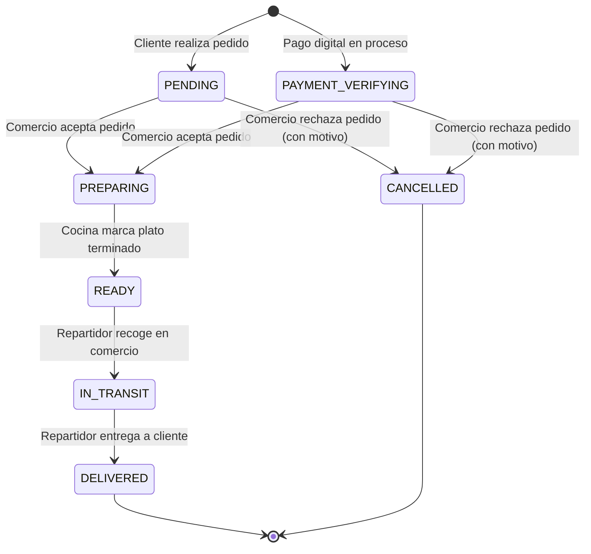

# RESTAURANT MERCHANT NAVIGATION FLOW
**BlueSystem Delivery Enterprise v2.1**
**Fase 0 — Descubrimiento, Auditoría y Levantamiento de Arquitectura**

---

## 1. Mapa Global de Navegación del Módulo (Entregable 2)

El módulo **Restaurant Merchant (Comercio)** opera bajo una arquitectura de pantalla única receptora (`BusinessDashboardScreen`) como contenedor central de pestañas, complementado con ventanas modales flotantes (Dialogs) y vistas de pantalla completa especializadas.

### Diagrama General de Navegación (Mermaid)

```mermaid
graph TD
    AppStart[Login / Auth / Splash] -->|Rol: business / comercio| MainContainer[BusinessDashboardScreen]
    
    subgraph BOTTOM_NAV ["Barra Inferior de Navegación (Bottom Navigation Bar)"]
        MainContainer --> Tab1[Tab 1: DASHBOARD]
        MainContainer --> Tab2[Tab 2: ORDERS / Cocina Digital]
        MainContainer --> Tab3[Tab 3: COMMERCE / Restaurant Commerce Enterprise v2.2]
        MainContainer --> Tab4[Tab 4: MENU / Categorías]
        MainContainer --> Tab5[Tab 5: PROMOTIONS / Promociones]
        MainContainer --> Tab6[Tab 6: STATS / Analíticas]
        MainContainer --> Tab7[Tab 7: MORE / Ajustes & Perfil]
    end

    subgraph DASHBOARD_ACTIONS ["Acciones Rápidas (Dashboard)"]
        Tab1 -->|Toggle Switch| SwitchOpen[Abierto / Cerrado Tienda]
        Tab1 -->|Card Click: Alerta Stock| WizardFromAlert[ProductWizardDialog]
        Tab1 -->|Botón Rápido: + Producto| WizardFromDash[ProductWizardDialog]
        Tab1 -->|Botón Rápido: Ver Menú| Tab4
        Tab1 -->|Botón Rápido: Promociones| Tab5
        Tab1 -->|Botón Rápido: Analíticas| Tab6
        Tab1 -->|Botón Rápido: Ajustes| Tab7
    end

    subgraph ORDERS_WORKFLOW ["Flujo de Pedidos (Orders / Kitchen)"]
        Tab2 --> P_PENTRANTES[Pestaña Nuevos: PENDING / PAYMENT_VERIFYING]
        P_PENTRANTES -->|Aceptar| P_PREP[Pestaña En Preparación: PREPARING]
        P_PENTRANTES -->|Rechazar| M_REJECT[Modal Motivo Rechazo -> CANCELLED]
        P_PREP -->|Marcar Listo| P_READY[Pestaña Listos: READY]
        P_READY -->|Asignar / Recoger| P_TRANSIT[En Camino: IN_TRANSIT]
        P_TRANSIT -->|Entrega| P_DELIVERED[Completados: DELIVERED]
    end

    subgraph CATALOG_ACTIONS ["Flujo de Catálogo (Menu & Commerce)"]
        Tab4 --> CatGrid[CategoryMenuScreen / CatalogScreen]
        CatGrid -->|Filtro Chip: Todos / Activos / Agotados / Descuento| CatGrid
        CatGrid -->|+ Categoría| ModalCat[Modal Creador Categoría]
        CatGrid -->|+ Producto| ProductWizard[ProductWizardDialog (5 Pasos)]
        CatGrid -->|Editar Producto| ProductWizard
        CatGrid -->|Duplicar Producto| ActionDuplicate[Clonación Local: (Copia)]
        CatGrid -->|Toggle Stock| ActionStock[ProductStatus: ACTIVE <-> OUT_OF_STOCK]
        CatGrid -->|Eliminar| ActionDelete[Borrado Lógico: INACTIVE]

        Tab3 --> CommerceScreen[RestaurantCommerceScreen v2.2]
        CommerceScreen -->|Publicar Menú| PublishEngine[MenuEngineImpl -> MenuVersion]
    end
```

---

## 2. Mapa de Flujos Detallados por Pantalla y Acción

### Flujo 1: Alta de Producto mediante Wizard Stepper
```
Dashboard / Menú
  │
  ├── [Clic "+ Agregar Producto"]
  ▼
ProductWizardDialog (Paso 1: Datos Generales)
  │ ├── Nombre del Platillo
  │ ├── Descripción
  │ ├── Selección de Categoría
  │ └── Carga de Fotos (Cámara / Galería Base64)
  │
  ├── [Clic "Seguir ➔"]
  ▼
ProductWizardDialog (Paso 2: Precios e Impuestos)
  │ ├── Precio de Venta (C$)
  │ ├── Precio Original (Descuento)
  │ ├── Porcentaje de Impuesto (% ISV)
  │ └── Tiempo Estimado de Preparación (Minutos)
  │
  ├── [Clic "Seguir ➔"]
  ▼
ProductWizardDialog (Paso 3: Stock y Etiquetas)
  │ ├── Disponibilidad Activa (Switch)
  │ ├── Cantidad en Stock (Unidades o Ilimitado)
  │ └── Atributos: Popular, Vegetariano, Picante
  │
  ├── [Clic "Seguir ➔"]
  ▼
ProductWizardDialog (Paso 4: Opciones y Extras)
  │ ├── Grupos de Opciones (Variantes, Tamaños)
  │ └── Adicionales y Modificadores
  │
  ├── [Clic "Seguir ➔"]
  ▼
ProductWizardDialog (Paso 5: Vista Previa del Cliente)
  │ ├── Card Preview Reactiva (Tarjeta cómo se verá en la App Cliente)
  │ └── Verificación de Checklist de Datos Completos
  │
  ├── [Clic "Guardar Producto ✔"]
  ▼
ProductRepository.addProduct() ──► Firestore / Storage ──► Cierre de Dialog & Refresh Catálogo
```

### Flujo 2: Edición, Desactivación y Clonación de Producto
```
CategoryMenuScreen / CatalogScreen
  ├── Clic en Menú 3 Puntos (Opciones de Producto)
  │
  ├── Opción "Editar":
  │     └── Abre ProductWizardDialog con campos pre-poblados.
  │
  ├── Opción "Agotar / Activar":
  │     └── Invocación atómica `toggleProductStatus()`.
  │     └── Actualiza `status` en Firestore (`ACTIVE` ↔ `OUT_OF_STOCK`).
  │
  ├── Opción "Duplicar":
  │     └── Genera una copia en memoria asignando nuevo ID `p_timestamp` y sufijo `"(Copia)"`.
  │
  └── Opción "Eliminar":
        └── Invocación `deleteProduct()`.
        └── Ejecuta borrado lógico actualizando el estado a `INACTIVE`.
```

---

## 3. Flujo Detallado de Pedidos y Cocina Digital (Entregable 12)

El ciclo de vida del pedido en el comercio está diseñado para alta concurrencia operacional y control en tiempo real en cocinas aceleradas.

### Diagrama de Estados del Pedido (State Machine)



### Descripción de Componentes del Flujo de Pedidos

#### 1. Listado de Pedidos Entrantes (`BusinessTab.ORDERS` / `OrdersKitchenView`)
- **Pestaña 1: Nuevos (`PENDING` / `PAYMENT_VERIFYING`)**
  - Muestra badge rojo con el número de pedidos pendientes por responder.
  - Alerta auditiva/visual de nuevo pedido entrante.
  - **Acciones Disponibles**:
    - **Aceptar Pedido**: Cambia el estado a `preparing` mediante consulta Firestore.
    - **Rechazar Pedido**: Abre diálogo con selector de motivo de rechazo (*"Sin insumos"*, *"Cocina saturada"*, *"Fuera de horario"*) y cambia el estado a `cancelled`.

- **Pestaña 2: En Preparación (`PREPARING`)**
  - Muestra la comanda digital con los ítems pedidos, notas especiales del cliente y temporizador transcurrido.
  - **Acción Disponible**:
    - **Marcar Listo**: Cambia el estado a `ready` y notifica al repartidor asignado.

- **Pestaña 3: Listos / En Camino (`READY` / `IN_TRANSIT`)**
  - Visualiza los pedidos empaquetados en mostrador o que ya se encuentran con el repartidor en ruta hacia el cliente.

#### 2. Timeline de Transición de Estados

| Estado | Nombre Comercial | Acción del Comercio | Disparador Firestore | Efecto en App Cliente |
| :--- | :--- | :--- | :--- | :--- |
| `PENDING` | Nuevo Pedido | Clic en "Aceptar" | `status = "preparing"` | "El restaurante está preparando tu pedido 🍳" |
| `PREPARING` | En Cocina | Clic en "Marcar Listo" | `status = "ready"` | "Tu pedido está listo para ser recogido por el repartidor 🛍️" |
| `READY` | En Mostrador | Espera de Repartidor | `status = "in_transit"` | "El repartidor va en camino a tu ubicación 🛵" |
| `IN_TRANSIT` | En Camino | Ninguna (Monitoreo) | `status = "delivered"` | "¡Pedido entregado con éxito! 🎉" |
| `CANCELLED` | Rechazado | Clic en "Rechazar" + Motivo | `status = "cancelled"` | "Tu pedido fue cancelado por el restaurante ❌" |

#### 3. Búsqueda y Filtros de Pedidos
- **Filtro por Folio / ID**: Permite ubicar rápidamente comandas de clientes en caja o consulta telefónica.
- **Filtro por Nombre de Cliente**: Búsqueda en tiempo real en la lista en memoria alimentada por `ordersFlow`.
