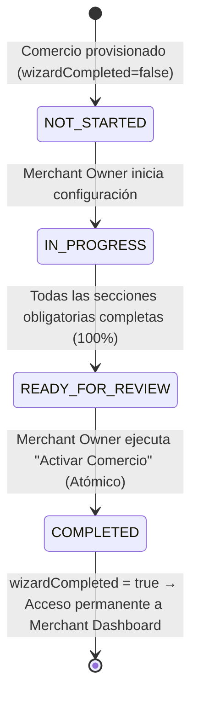

# MERCHANT ONBOARDING & BUSINESS ACTIVATION CONTRACT (V1)
**BlueSystem Delivery Enterprise v2.2**  
**Documento Canónico de Arquitectura y Ciclo de Vida**  
**Fecha:** 17 de Agosto de 2026  

---

## 1. Principio Fundamental de Tenencia e Identidad

El portal **Merchant Web** NO crea la Organización, el Comercio, la Sucursal ni la Membresía.
La entidad comercial y su cadena de tenencia ya fueron creadas y provisionadas por **Governance Center** bajo la jerarquía:

```text
GOVERNANCE CENTER (Admin)
        │
        ▼
/organizations/{orgId} (Holding)
        │
        ▼
/businesses/{businessId} (Comercio provisionado, lifecycleStatus: ONBOARDING / ACTIVE, wizardCompleted: false)
        │
        ▼
/branches/{branchId} (Sucursal Principal pre-asignada)
        │
        ▼
/membership/{membershipId} (EIAM SSOT: role = MERCHANT_OWNER, status = ACTIVE, permissions)
        │
        ▼
FIREBASE AUTH USER (UID, email, password)
        │
        ▼
JWT CUSTOM CLAIMS ({ role: "MERCHANT_OWNER", businessId, orgId, branchId })
```

---

## 2. Máquina de Estados del Onboarding

El estado del onboarding se desacopla del estado legal de la empresa (`lifecycleStatus`) para evitar ambigüedades operativas:



### Definición de Estados
* **`NOT_STARTED` (`onboardingStep = 0`):** El usuario ha ingresado pero no ha guardado datos adicionales.
* **`IN_PROGRESS` (`onboardingStep = 1..7`):** El usuario está completando información comercial, sucursal, horarios, delivery, finanzas, o menú.
* **`READY_FOR_REVIEW` (`onboardingStep = 8`):** El validador central `MerchantOnboardingValidator` confirma que el 100% de los requisitos obligatorios están satisfechos.
* **`COMPLETED` (`wizardCompleted = true`):** El comercio está operacionalmente configurado y el portal redirige permanentemente al **Merchant Dashboard**.

---

## 3. Matriz de Secciones del Onboarding

| Paso | Sección | Entidad Principal Impactada | Campos Gestionados | Requerido |
| :--- | :--- | :--- | :--- | :--- |
| **1** | **Información Comercial** | `/businesses/{businessId}` | `name`, `description`, `category`, `phone`, `email` | **Sí** |
| **2** | **Identidad Visual** | `/businesses/{businessId}` | `logoUrl`, `coverUrl`, `photoUrl`, `bannerUrl` (ADR-006 Storage URLs) | **Sí** |
| **3** | **Sucursal & GPS** | `/branches/{branchId}` | `name`, `address`, `city`, `zone`, `location` (`latitude`, `longitude`), `phone` | **Sí** |
| **4** | **Horarios Operativos** | `/restaurant_settings/{businessId}` | `schedule` (Lunes a Domingo con `open`, `close`, `isOpen`) | **Sí** |
| **5** | **Delivery & Logística** | `/restaurant_settings/{businessId}` | `deliveryFee`, `maxDeliveryRadiusKm`, `kitchenPrepTimeMinutes` | **Sí** |
| **6** | **Finanzas & Pagos** | `/restaurant_settings/{businessId}` | `bankName`, `accountNumber`, `accountHolder`, `accountType`, `acceptedPayments` | **Sí** |
| **7** | **Menú & Producto Inicial**| `/categories/{catId}`, `/products/{prodId}` | Categoría privada del comercio + Primer Producto con precio y disponibilidad | **Sí** |
| **8** | **Revisión & Activación** | Transacción Atómica Multicolección | Verificación de integridad y marcado de `wizardCompleted = true` | **Sí** |

---

## 4. Protocolo de Activación Atómica

Al presionar **🚀 Activar Comercio**, el sistema ejecuta una transacción/escritura atómica (`WriteBatch`) que garantiza:

1. `/businesses/{businessId}`: `wizardCompleted = true`, `onboardingStatus = 'COMPLETED'`, `onboardingCompletedAt = serverTimestamp()`, `isOpen = true`, `isActive = true`.
2. `/branches/{branchId}`: Persistencia de datos de sucursal con `branchId`, `businessId`, `orgId` y coordenadas GPS.
3. `/restaurant_settings/{businessId}`: Configuración operacional, horarios y finanzas enlazados al `businessId`.
4. `/categories/{categoryId}`: Creación de la categoría inicial del comercio (`businessId: businessId`).
5. `/products/{productId}`: Creación del primer producto activo con URL de imagen válida.
6. `/audit_events/{eventId}`: Registro inmutable con `actorUid`, `businessId`, `orgId`, `branchId`, `timestamp`, `correlationId`.

---

## 5. Reglas de No Regresión e Inmutabilidad

* Queda estrictamente **prohibido** alterar `businessId`, `orgId`, `branchId`, `role` u `ownerUid` durante el onboarding.
* Queda estrictamente **prohibido** almacenar Base64, Bitmaps o ByteArrays en Firestore (ADR-006).
* Si el usuario cierra el navegador en cualquier paso intermedio, el progreso se conserva en Firestore y se retoma al volver a iniciar sesión.
