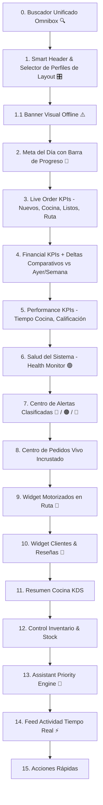

# MERCHANT OPERATIONS DASHBOARD SPECIFICATION
**BlueSystem Delivery Enterprise v2.1 (Sprint 15.1)**
**Enterprise Operations Center (EOC) con 10 Mejoras + 7 Adiciones Enterprise**

---

## 1. Visión General del Centro de Operaciones (EOC)

El **Merchant Operations Dashboard (Sprint 15.1)** integra las **10 Mejoras + 7 Adiciones Enterprise** de refinamiento operacional:

1. 🎛️ **Dashboard Layout Profiles**: Cambia al instante entre perfiles preconfigurados (`Operación`, `Cocina`, `Ventas`, `Inventario`, `Personalizado`).
2. 🧩 **Widget Marketplace (Registry & Factory Architecture)**: Patrón `WidgetRegistry` y `WidgetFactory` desacoplado para añadir nuevos módulos sin tocar el core.
3. 📊 **KPIs Históricos Comparativos**: Badges Delta en tiempo real (`Hoy vs Ayer`, `Hoy vs Semana Pasada`) con variación porcentual (+14.5%).
4. 🎯 **Widget de Meta del Día (Daily Sales Goal)**: Tarjeta de objetivo diario con barra de progreso visual (ej: Meta C$ 5,000 | Llevas C$ 3,400 -> 68%).
5. 🟢 **Widget de Salud del Sistema (System Health Monitor)**: Estado operativo integrado (Firestore 🟢, Sincronización 🟢, Offline 🟢, Notificaciones 🟢).
6. ⚡ **Acciones Contextuales Avanzadas**: Menú desplegable contextual enriquecido en tarjetas y alertas.
7. 👤 **Dashboard Snapshots por Usuario**: Persistencia por `userId` + `businessId` para configuraciones multi-usuario.

---

## 2. Diagrama de Widgets Modulares Completo

