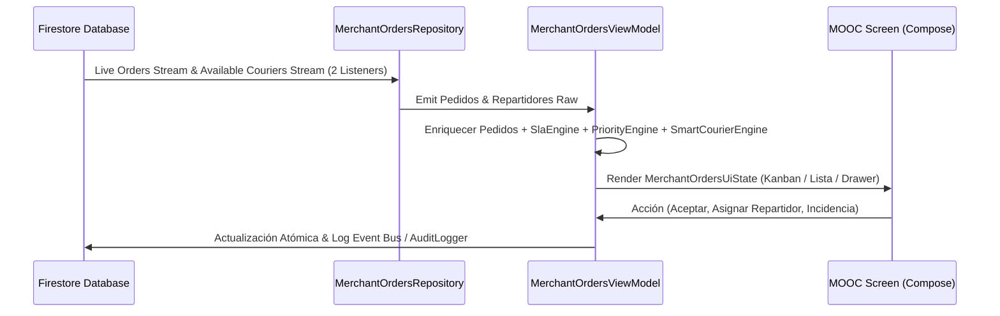

# MERCHANT ORDERS OPERATIONS CENTER (MOOC) ARCHITECTURE
**BlueSystem Delivery Enterprise v2.1 (Sprint 15.2)**

---

## 1. Patrón Arquitectónico y Capas

El MOOC sigue el patrón **Clean Architecture + Unidirectional Data Flow (UDF)**:

- **Dominio**: `MerchantOrder`, `SlaStatus`, `OrderPriority`, `CourierRecommendation`, `OrderIncident`, `OrderRefund`, `OrderTimelineStep`.
- **Motores (Engines)**: `SlaEngine`, `OrderPriorityEngine`, `SmartCourierAssignmentEngine`.
- **Datos**: `MerchantOrdersRepository` (ADR-003 compliant: máx 2 listeners activos).
- **Presentación**: `MerchantOrdersViewModel`, `MerchantOrdersOperationsCenterScreen`.

---

## 2. Diagrama de Flujo de Datos

