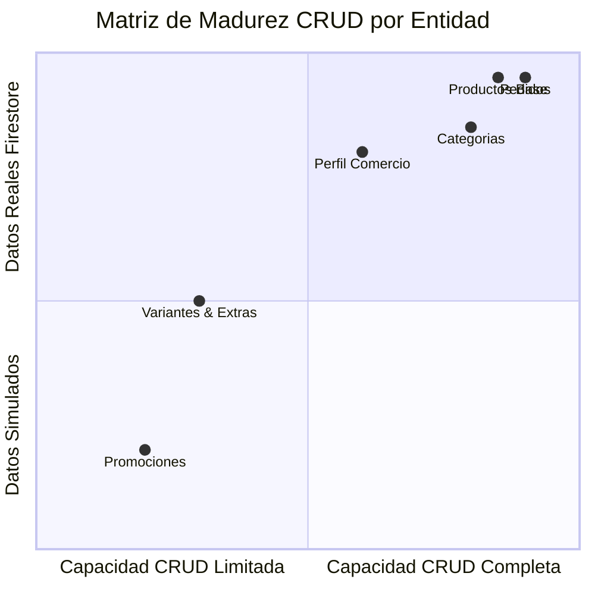

# RESTAURANT MERCHANT SCREEN & FUNCTIONAL INVENTORY
**BlueSystem Delivery Enterprise v2.1**
**Fase 0 — Descubrimiento, Auditoría y Levantamiento de Arquitectura**

---

## 1. Inventario Completo de Pantallas y Diálogos (Entregable 3)

A continuación se documentan todas las pantallas, vistas tabulares y diálogos modales implementados en el módulo de Comercio:

| Nombre de Pantalla / Componente | Archivo Kotlin | Ruta / Tab | Función Principal | Estado de Implementación | Porcentaje |
| :--- | :--- | :--- | :--- | :--- | :---: |
| **`BusinessDashboardScreen`** | `BusinessDashboardScreen.kt` | `BusinessTab.DASHBOARD` | Host principal de navegación. Muestra métricas operativas del día, tarjetas de resumen, interruptor Abierto/Cerrado y acciones rápidas. | **Implementado (Realtime)** | **95%** |
| **`OrdersKitchenView`** | `BusinessDashboardScreen.kt` | `BusinessTab.ORDERS` | Gestión de cocina digital (KDS) por pestañas. Aceptación, rechazo con motivos y marcado de platos listos. | **Implementado (Realtime)** | **90%** |
| **`CatalogScreen`** | `CatalogScreen.kt` | Sub-pantalla Catálogo | Grilla tradicional de productos con buscador en tiempo real, chips de totalizadores de stock y menú modal de edición. | **Implementado (Realtime)** | **90%** |
| **`CategoryMenuScreen`** | `CategoryMenuScreen.kt` | `BusinessTab.MENU` | Gestión del menú clasificado por categorías dinámicas, filtros por estado (`ACTIVO`, `AGOTADO`, `DESCUENTO`) y duplicación local. | **Implementado (Parcial)** | **85%** |
| **`RestaurantCommerceScreen`** | `RestaurantCommerceScreen.kt` | `BusinessTab.COMMERCE` | Interfaz Enterprise v2.2 para la gestión modular de menús (Categorías, Productos, Opciones, Variantes y Publicación). | **Implementado (UI + Engine)** | **80%** |
| **`ProductDialog`** | `ProductDialog.kt` | Diálogo Modal | Formulario rápido de un solo paso para alta y edición rápida de productos. | **Implementado (Legacy)** | **85%** |
| **`ProductWizardDialog`** | `ProductWizardDialog.kt` | Diálogo Modal | Stepper de 5 pasos estilo Uber Eats / PedidosYa (Datos, Precios, Stock, Opciones/Extras, Preview). | **Parcial (Incompleto)** | **70%** |
| **`AnalyticsScreen`** | `AnalyticsScreen.kt` | `BusinessTab.STATS` | Panel visual de analíticas de ventas, desglose de pedidos por estado, ticket promedio y ranking de top productos. | **Implementado (Realtime)** | **85%** |
| **`KitchenDashboardScreen`** | `KitchenDashboardScreen.kt` | KDS Independiente | Panel de cocina en pantalla completa diseñado para tablets de preparación con comandas gigantes y timers. | **Implementado** | **90%** |
| **`PromotionsPlaceholderView`** | `BusinessDashboardScreen.kt` | `BusinessTab.PROMOTIONS` | Vista de promociones y descuentos. | **UI Placeholder (Simulado)** | **30%** |
| **`MoreSettingsView`** | `BusinessDashboardScreen.kt` | `BusinessTab.MORE` | Panel de perfil de comercio, configuración de sucursal, horarios y cierre de sesión. | **Parcial** | **60%** |

---

## 2. Estado Funcional por Módulo (Entregable 4)

| Módulo / Funcionalidad | Qué Funciona ✔ | Qué NO Funciona / Faltante ✖ | Tipo de Datos | Estado General |
| :--- | :--- | :--- | :--- | :---: |
| **Cocina Digital / Pedidos** | Escucha reactiva en tiempo real de `orders`, aceptación y cambio a `preparing`, marcado listo `ready`. | Notificación push sonora nativa al recibir pedido cuando la app está en background. | **Datos Reales (Firestore)** | **90%** |
| **Catálogo de Productos (Plano)** | Carga en tiempo real, búsqueda por nombre/descripción, toggle de estado (`ACTIVE` / `OUT_OF_STOCK`), borrado lógico. | Filtrado multidimensional por categoría en `CatalogScreen` (falta selector UI del enum). | **Datos Reales (Firestore)** | **85%** |
| **Wizard Agregar Producto (5 Pasos)** | Stepper visual, formulario de precios, stock, flags (Popular/Spicy/Veggie), preview reactivo de card. | **Paso 4 (Opciones/Extras) es solo UI y no guarda las opciones en Firestore**. No comprime fotos nativamente en cliente. | **Mezcla (Guardado parcial)** | **70%** |
| **Gestión de Menú v2.2 (Enterprise)** | Ensamblado modular de menú, integración con `MenuEngineImpl`, soporte de `LegacyMenuAdapter`. | Interfaz de arrastrar y soltar (drag & drop) para reordenar categorías en pantalla. | **Datos Reales (Firestore)** | **80%** |
| **Analíticas Comerciales** | Cálculo reactivo de ventas acumuladas, ticket promedio, total entregados/cancelados y top de productos. | Exportación de informes a PDF o Excel / CSV. Gráficos interactivos de líneas temporales. | **Datos Reales (Calculados)** | **85%** |
| **Promociones & Cupones** | Cálculo de precio tachado con `originalPrice` y porcentaje de descuento en card. | Creación de cupones por comercio desde la app (actualmente gestionado por Admin). | **Simulado / UI Only** | **30%** |
| **Perfil y Horarios del Comercio** | Toggle global Abierto/Cerrado (`isOpen`) con actualización instantánea en la colección `businesses`. | Editor de horario semanal detallado por franjas horarias y excepciones por días festivos. | **Datos Reales (Firestore)** | **60%** |

---

## 3. Matriz CRUD Completa por Entidad (Entregable 5)

La siguiente tabla evalúa la capacidad de Operaciones CRUD (Create, Read, Update, Delete) para cada entidad clave dentro del módulo:

### Tabla Matriz CRUD

| Entidad de Dominio | Create (C) | Read (R) | Update (U) | Delete (D) | Detalle y Cobertura Técnica |
| :--- | :---: | :---: | :---: | :---: | :--- |
| **Productos (`products`)** | ✔ | ✔ | ✔ | ✔ | **CRUD 100% Completo**. Creación vía `ProductRepository.addProduct`, lectura en tiempo real mediante `Flow`, actualización atómica mediante map y borrado lógico (`status = INACTIVE`). |
| **Categorías (`product_categories`)** | ✔ | ✔ | ✖ | ✖ | **CRUD Parcial (50%)**. Permite agregar categorías (`addCategory`) y leerlas en tiempo real, pero falta edición de nombre y borrado de categoría. |
| **Variantes de Producto** | ✖ | ✔ | ✖ | ✖ | **CRUD Incompleto (25%)**. La infraestructura de lectura existe en el motor v2.2 (`ProductVariant`), pero la creación y edición desde el Wizard no persiste en Firestore. |
| **Grupos de Opciones / Extras** | ✖ | ✔ | ✖ | ✖ | **CRUD Incompleto (25%)**. Paso 4 del Wizard presenta controles visuales pero no guarda el objeto `OptionGroup` en base de datos. |
| **Pedidos (`orders`)** | N/A | ✔ | ✔ | ✖ | **CRUD Operativo (100%)**. La creación pertenece al Cliente; el Comercio realiza Lectura en tiempo real y Actualización de estados (`preparing`, `ready`, `cancelled`). El borrado no aplica por trazabilidad. |
| **Promociones / Descuentos** | ✖ | ✔ | ✔ | ✖ | **CRUD Limitado (40%)**. Lectura de promociones aplicables; actualización indirecta mediante `originalPrice` en producto. Creación de campañas no disponible. |
| **Perfil Comercio (`businesses`)** | ✖ | ✔ | ✔ | ✖ | **CRUD Operativo (75%)**. Lectura del perfil y actualización del estado `isOpen` y parámetros de entrega. Alta de comercio pertenece al módulo Admin. |
| **Horarios Operativos** | ✖ | ✔ | ✔ | ✖ | **CRUD Básico (50%)**. Lectura y actualización de texto plano de horario (`schedule`). Falta gestor gráfico por días. |
| **Dispositivos FCM (`user_devices`)** | ✔ | ✔ | ✔ | ✔ | **CRUD 100% Completo**. Registro automático de tokens FCM mediante `FcmManager.registerCurrentDeviceToken("business")`. |
