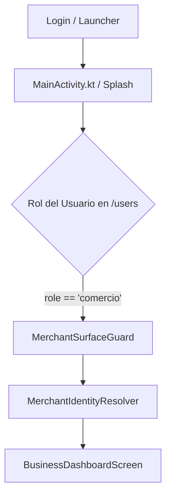
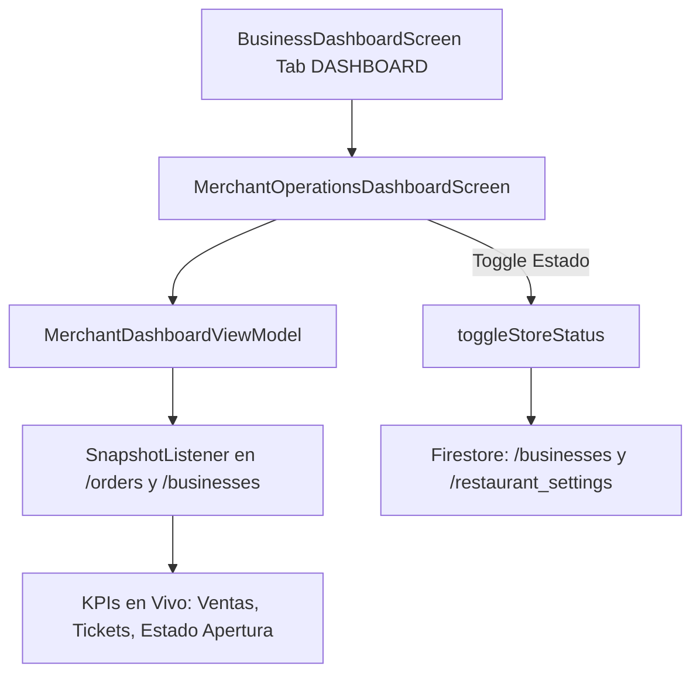
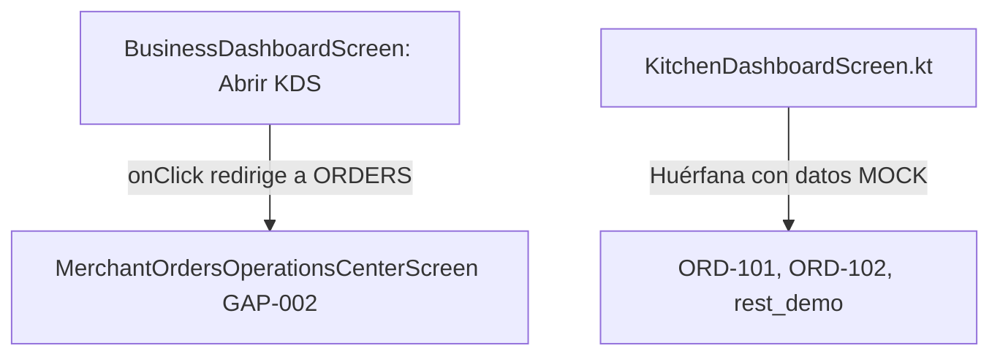
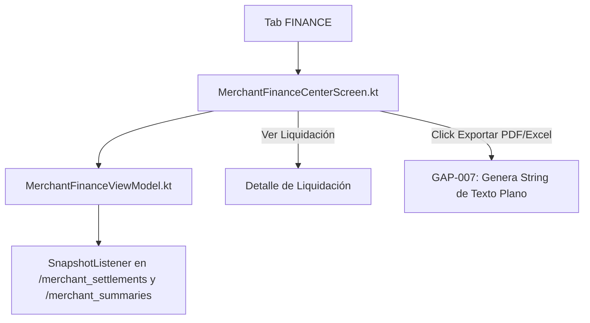
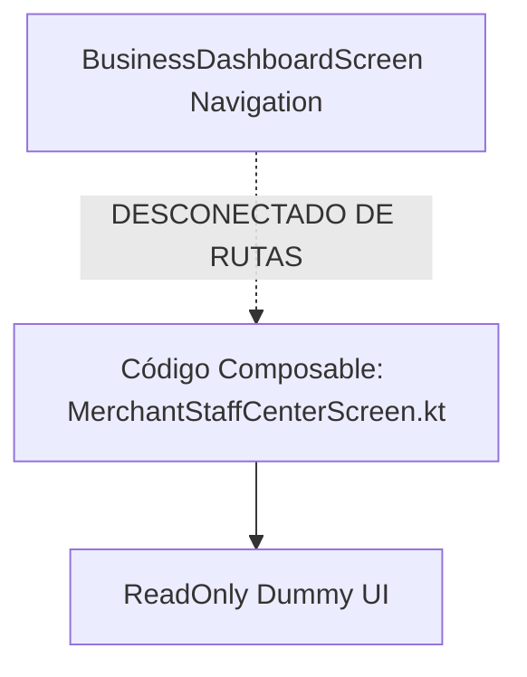

# MER 18.2 — Arquitectura del Módulo Comercio (Architecture Map)
**Auditoría Física E2E Integral — Módulo Comercio BlueSystem Delivery Enterprise**  
*Fecha: 14 de Septiembre de 2026*  
*Auditor: Senior Developer & Auditor Forense de BlueSystem*  
*Veredicto Global: AUDITORÍA COMPLETADA — REPORTE FORENSE DE INTEGRACIÓN*

---

## Resumen Ejecutivo de Arquitectura

El módulo de Comercio de BlueSystem Delivery en la plataforma Android (`app/src/main/java/com/example/bluesystem_delivery/`) fue diseñado como una suite operativa que coexiste dentro de la APK unificada. Esta arquitectura implementa un modelo híbrido:
1. **Punto de Entrada & Routing**: Gobernado por `MainActivity.kt` que canaliza el flujo del comercio hacia `business_dashboard` (`BusinessDashboardScreen.kt`), resguardado por `MerchantSurfaceGuard` y validado por `MerchantIdentityResolver`.
2. **Navegación Interna del Comercio**: Estructurada mediante una barra de navegación inferior (`NavigationBar`) con cinco pestañas activas:
   - `DASHBOARD`: `MerchantOperationsDashboardScreen`
   - `ORDERS`: `MerchantOrdersOperationsCenterScreen`
   - `MENU`: `CategoryMenuScreen` (con enlace a `ProductWorkspaceScreen`)
   - `FINANCE`: `MerchantFinanceCenterScreen`
   - `MORE`: `RestaurantSettingsCenterScreen`
3. **Módulos Periféricos o Aislados**:
   - `KitchenDashboardScreen` (KDS): Existe en código pero desconectado de la navegación activa y poblado con datos mock.
   - `PromotionsManagementView` / `PromotionViewModel`: Existe en código pero omitido de la barra de navegación y drawers.
   - `MerchantStaffCenterScreen`: Existe en código pero desconectado del flujo principal.

A continuación se detalla el mapa técnico flujo a flujo para cada una de las 11 áreas funcionales del comercio.

---

## 1. Autenticación & Acceso al Módulo Comercio

### Flujo E2E


- **Composable**: `MainActivity.kt` (Líneas 330-380) $\rightarrow$ `BusinessDashboardScreen.kt` (Líneas 70-150).
- **Callback / Routing**: Al detectar autenticación exitosa con rol de comercio (`role == "comercio"` o claims correspondientes), el `NavHost` despacha la ruta canónica `"business_dashboard"`.
- **ViewModel**: `MerchantDashboardViewModel.kt` y `MerchantIdentityResolver.kt`.
- **Repository**: `FirebaseManager.kt` (`fetchCurrentUserData`, `getBusinessData`).
- **Colección Firestore**: `/users/{uid}` y `/businesses/{businessId}`.
- **Touchpoint Web (`merchant-web`)**: `merchant-web/src/modules/Dashboard/` y `merchant-web/src/context/AuthContext.tsx`.
- **Touchpoint Admin (`panel-admin`)**: `panel-admin/public/js/dashboard/liveRestaurants.js`.
- **Touchpoint App Cliente**: No aplica directamente (solo lee `/businesses/{id}` para mostrar catálogo público).
- **Diagnóstico Forense**: 🟢 **CERTIFIED**. El guard verifica la autenticidad del UID, valida la pertenencia del comercio y previene el acceso de roles no autorizados (repartidor o cliente).

---

## 2. Dashboard Principal de Operaciones

### Flujo E2E


- **Composable**: `MerchantOperationsDashboardScreen.kt` (invocado en `BusinessDashboardScreen.kt` Línea 290).
- **Callback**: `onToggleOpenStatus`, `onNavigateToOrders`, `onNavigateToMenu`.
- **ViewModel**: `MerchantDashboardViewModel.kt` (Líneas 45-180).
- **Repository**: `FirebaseManager.kt` (`observeMerchantLiveOrders`, `updateBusinessOpenState`).
- **Colección Firestore**:
  - Lectura: `/businesses/{businessId}`, `/orders` (filtrado por `businessId == id`).
  - Escritura: `/businesses/{businessId}` (`isOpen: Boolean`, `updatedAt: Timestamp`).
- **Touchpoint Web**: `merchant-web/src/modules/Dashboard/DashboardModule.tsx` (KPIs en tiempo real y switch de apertura).
- **Touchpoint Admin**: `panel-admin/public/js/dashboard/liveRestaurants.js` (`renderCardHtml`, actualiza estado abierto/cerrado con badge verde/rojo).
- **Touchpoint App Cliente**: `CustomerHomeScreen.kt` y `ComercioDetalleScreen.kt` reflejan si el comercio está abierto o cerrado en tiempo real.
- **Diagnóstico Forense**: 🟢 **CERTIFIED** con observación de doble escritura en `/businesses` y `/restaurant_settings` (`GAP-010`).

---

## 3. Gestión de Menú y Catálogo

### Flujo E2E
```mermaid
graph TD
    A[Tab MENU] --> B[CategoryMenuScreen.kt]
    B --> C[MenuViewModel.kt]
    C --> D[MenuCategoryRepositoryImpl.kt]
    D --> E[SnapshotListener en /categories y /products]
    B -->|Crear/Editar Categoría| F[Dialog Form]
    F --> G[MenuCategoryRepositoryImpl.saveCategory]
    G --> H[Firestore: /categories/{catId}]
```

- **Composable**: `CategoryMenuScreen.kt` (Líneas 1-450).
- **Callback**: `onCategoryClick`, `onAddProductClick`, `onEditCategoryClick`, `onDeleteCategoryClick`.
- **ViewModel**: `MenuViewModel.kt`.
- **Repository**: `MenuCategoryRepositoryImpl.kt` y `ProductCatalogRepositoryImpl.kt`.
- **Colección Firestore**:
  - `/categories` (campo `businessId`, `name`, `order`, `isActive`).
  - `/products` (campo `businessId`, `categoryId`, `name`, `price`, `isAvailable`).
- **Touchpoint Web**: `merchant-web/src/modules/Catalog/CatalogModule.tsx`.
- **Touchpoint Admin**: `panel-admin/public/js/dashboard/liveRestaurants.js` (Menú viewer).
- **Touchpoint App Cliente**: `ComercioDetalleScreen.kt` (descarga catálogo filtrado por `businessId`).
- **Diagnóstico Forense**: 🟢 **CERTIFIED**. Las categorías y productos se sincronizan en tiempo real bidireccionalmente.

---

## 4. Workspace de Producto

### Flujo E2E
```mermaid
graph TD
    A[CategoryMenuScreen] -->|Click en Producto o '+'| B[ProductWorkspaceScreen.kt]
    B --> C[ProductWorkspaceViewModel.kt]
    C --> D[ProductCatalogRepositoryImpl.kt]
    B -->|Modificar Campos| E[Estado Local en Memoria]
    B -->|Click 'Guardar'| F[saveProductAtómico]
    F --> G[Firestore: /products/{prodId}]
    B -->|Click 'Publicar'| H[GAP-003: Delay 400ms Fake]
```

- **Composable**: `ProductWorkspaceScreen.kt` (Líneas 1-850).
- **Callback**: `onSaveProduct`, `onDeleteProduct`, `onUploadImage`, `onAddModifierGroup`.
- **ViewModel**: `ProductWorkspaceViewModel.kt`.
- **Repository**: `ProductCatalogRepositoryImpl.kt` y `CloudStorageManager.kt`.
- **Colección Firestore**: `/products/{productId}`.
- **Touchpoint Web**: `merchant-web/src/modules/Catalog/ProductDetailModal.tsx`.
- **Touchpoint Admin**: Visualización indirecta en pedidos y detalle del comercio.
- **Touchpoint App Cliente**: `ComercioDetalleScreen.kt` renderiza el producto, precio y grupos de opciones.
- **Diagnóstico Forense**: 🟡 **PARTIAL**.
  - El guardado básico de producto funciona (`saveProduct` escribe en `/products`).
  - El botón "Publicar" en `ProductWorkspaceScreen.kt` (Líneas 140-150) contiene un mock: `delay(400)` que limpia `pendingChangesCount = 0` sin invalidar caché en servidor ni emitir evento (`GAP-003`).
  - El sub-menú "Historial de Snapshots" y "Rollback" en el overflow tiene callbacks vacíos (`GAP-004`).
  - El bottom sheet de nueva categoría en `ProductWorkspaceScreen.kt` (Líneas 628-636) tiene un input con `onValueChange = {}` desconectado (`GAP-004`).

---

## 5. Gestión de Combos

### Flujo E2E
```mermaid
graph TD
    A[CategoryMenuScreen / Tab Combos] --> B[ComboManagementSection]
    B --> C[ComboViewModel.kt]
    C --> D[MenuComboRepositoryImpl.kt]
    D --> E[Firestore: /combos/{comboId}]
    E -.->|Falta Listener en Cliente| F[App Cliente: ComercioDetalleScreen GAP-005]
```

- **Composable**: Subvistas de combos dentro del módulo de menú y `ComboDialogs.kt`.
- **Callback**: `onCreateCombo`, `onUpdateCombo`, `onToggleComboState`.
- **ViewModel**: `ComboViewModel.kt`.
- **Repository**: `MenuComboRepositoryImpl.kt`.
- **Colección Firestore**: `/combos/{comboId}` (con `businessId`, `title`, `items`, `comboPrice`, `isActive`).
- **Touchpoint Web**: `merchant-web/src/modules/Catalog/` (Soporte de combos en web).
- **Touchpoint Admin**: N/A.
- **Touchpoint App Cliente**: 🔴 **DESCONECTADO (`GAP-005`)**. `ComercioDetalleViewModel.kt` en la app cliente solo escucha `/categories` y `/products`, omitiendo por completo `/combos`. Un cliente nunca puede ver ni comprar combos creados por la APK de comercio.
- **Diagnóstico Forense**: 🟠 **CODE ONLY / PARTIAL BACKEND**. El comercio puede crear combos y guardarlos en `/combos`, pero no hay ciclo de venta cerrado hacia el cliente.

---

## 6. Gestión de Promociones

### Flujo E2E
```mermaid
graph TD
    A[Código Composable: PromotionsManagementView] --> B[PromotionViewModel.kt]
    B --> C[PromotionRepository.kt]
    C --> D[Firestore: /promotions/{promoId}]
    E[BusinessDashboardScreen Navigation] -.->|NUNCA INVOCA| A
```

- **Composable**: `BusinessDashboardScreen.kt` (Líneas 787-850 `PromotionsManagementView`).
- **Callback**: Declarados dentro del composable pero huérfanos.
- **ViewModel**: `PromotionViewModel.kt`.
- **Repository**: `PromotionRepository.kt` (o métodos directos en `FirebaseManager`).
- **Colección Firestore**: `/promotions`.
- **Touchpoint Web**: `merchant-web/src/modules/Promotions/PromotionsModule.tsx` (Módulo 100% funcional en Web).
- **Touchpoint Admin**: `panel-admin/public/js/dashboard/promotions.js` (Gestión global de banners y promociones).
- **Touchpoint App Cliente**: `CustomerHomeViewModel.kt` escucha `/promotions` para el banner carrusel principal.
- **Diagnóstico Forense**: 🔴 **MOCK / UNLINKED (`GAP-001`)**. En la APK de comercio Android, no hay ningún botón, pestaña ni ítem de drawer que navegue a `PromotionsManagementView`. Es código muerto en la versión instalada.

---

## 7. Kitchen Display System (KDS)

### Flujo E2E


- **Composable**: `KitchenDashboardScreen.kt` (Líneas 1-320).
- **Callback**: `onAdvanceStage`, `onRejectOrder`.
- **ViewModel**: No posee ViewModel dedicado conectado a Firestore; manipula listas mutables en memoria con IDs mock (`"ORD-101"`, `"ORD-102"`, `"rest_demo"`).
- **Repository**: Ninguno enlazado.
- **Colección Firestore**: Debería escuchar `/orders` con filtro de estados de cocina (`CONFIRMED`, `PREPARING`, `READY`), pero no existe tal listener.
- **Touchpoint Web**: `merchant-web` no tiene KDS nativo (usa vista de órdenes activas).
- **Touchpoint Admin**: N/A.
- **Touchpoint App Cliente**: N/A.
- **Diagnóstico Forense**: 🔴 **MOCK / REDIRECTED (`GAP-002`)**. Cuando el usuario pulsa "Abrir KDS" en la APK, la app ejecuta `currentTab = BusinessTab.ORDERS` (Línea 350), enviándolo al centro de pedidos normal en lugar de a `KitchenDashboardScreen`. La pantalla de KDS es puramente demostrativa con datos hardcodeados.

---

## 8. Centro de Pedidos (Orders Operations Center)

### Flujo E2E
```mermaid
graph TD
    A[Tab ORDERS] --> B[MerchantOrdersOperationsCenterScreen.kt]
    B --> C[MerchantOrdersOperationsViewModel.kt]
    C --> D[SnapshotListener en /orders where businessId == id]
    B -->|Aceptar / Rechazar / Preparar / Listo| E[Transición de Estado]
    E --> F[MerchantOrdersOperationsViewModel.updateOrderStatus]
    F --> G[Firestore: /orders/{orderId}]
    G --> H[Notificación FCM a Cliente / Courier]
```

- **Composable**: `MerchantOrdersOperationsCenterScreen.kt` (Líneas 1-1350).
- **Callback**: `onAcceptOrder`, `onRejectOrder`, `onMarkPreparing`, `onMarkReady`, `onAssignCourier`.
- **ViewModel**: `MerchantOrdersOperationsViewModel.kt`.
- **Repository**: `FirebaseManager.kt` (`listenToBusinessOrders`, `updateOrderStatus`).
- **Colección Firestore**: `/orders/{orderId}`.
- **Touchpoint Web**: `merchant-web/src/modules/Orders/OrdersModule.tsx`.
- **Touchpoint Admin**: `panel-admin/public/js/dashboard/liveOrders.js`.
- **Touchpoint App Cliente**: `OrderTrackingScreen.kt` (escucha `/orders/{orderId}` y actualiza el stepper en tiempo real).
- **Diagnóstico Forense**: 🟢 **CERTIFIED** para el ciclo de vida de la orden (`PENDING` $\rightarrow$ `ACCEPTED` $\rightarrow$ `PREPARING` $\rightarrow$ `READY`).
  - *Observación*: Los botones de llamada directa y WhatsApp en el modal de detalle del pedido (`MerchantOperationsCenterScreen.kt` Líneas 1286-1287) tienen callbacks vacíos `onClick = {}` (`GAP-004`).

---

## 9. Configuración del Comercio (Restaurant Settings Center)

### Flujo E2E
```mermaid
graph TD
    A[Tab MORE] --> B[RestaurantSettingsCenterScreen.kt]
    B --> C[RestaurantSettingsViewModel.kt]
    C --> D[RestaurantSettingsRepository.kt]
    D --> E[Escritura y Lectura Dual]
    E --> F[Firestore: /restaurant_settings/{id}]
    E --> G[Firestore: /businesses/{id}]
```

- **Composable**: `RestaurantSettingsCenterScreen.kt` (Líneas 1-600).
- **Callback**: `onSaveSchedule`, `onUpdateDeliveryRadius`, `onUpdatePreparationTime`, `onToggleAutoAccept`.
- **ViewModel**: `RestaurantSettingsViewModel.kt`.
- **Repository**: `RestaurantSettingsRepository.kt`.
- **Colección Firestore**:
  - `/restaurant_settings/{businessId}` (horarios, radio de entrega, tiempos de cocina, auto-accept).
  - `/businesses/{businessId}` (sincronizado mediante batch o listener secundario).
- **Touchpoint Web**: `merchant-web/src/modules/Settings/SettingsModule.tsx`.
- **Touchpoint Admin**: `panel-admin/public/js/dashboard/liveRestaurants.js` (`editRestaurantModal`).
- **Touchpoint App Cliente**: `ComercioDetalleScreen.kt` (evalúa si el comercio acepta pedidos según su horario).
- **Diagnóstico Forense**: 🟢 **CERTIFIED**. Los horarios y configuraciones básicas se persisten y sincronizan adecuadamente.

---

## 10. Finanzas y Liquidaciones

### Flujo E2E


- **Composable**: `MerchantFinanceCenterScreen.kt` (Líneas 1-520).
- **Callback**: `onSelectSettlement`, `onExportReport`, `onDisputeSettlement`.
- **ViewModel**: `MerchantFinanceViewModel.kt`.
- **Repository**: `MerchantSettlementRepository.kt` y `FirebaseManager.kt`.
- **Colección Firestore**: `/merchant_settlements` y `/merchant_summaries/{businessId}`.
- **Cloud Functions**: `adminGeneratePreSettlement`, `merchantConfirmSettlement`, `merchantDisputeSettlement` (`merchantSettlement.ts`).
- **Touchpoint Web**: `merchant-web/src/modules/Finance/FinanceModule.tsx`.
- **Touchpoint Admin**: `panel-admin/public/js/dashboard/financeCenter.js`.
- **Touchpoint App Cliente**: N/A (Área estrictamente contable interna).
- **Diagnóstico Forense**: 🟡 **PARTIAL**.
  - La visualización de balances, estados de cuenta y lista de liquidaciones (`PENDING`, `CONFIRMED`, `PAID`) es 100% real y sincronizada con Firestore.
  - La confirmación y disputa de liquidaciones invoca las Cloud Functions correspondientes.
  - La exportación de reportes (`GAP-007`): `FinancialReportGenerator.kt` solo compone un `String` multilínea formateado, no un archivo binario PDF o Excel con Storage URL o Intent de descarga real.

---

## 11. Gestión de Staff y Roles

### Flujo E2E


- **Composable**: `MerchantStaffCenterScreen.kt` (Líneas 1-280).
- **Callback**: No implementa eventos de mutación (solo renders estáticos de cajeros y administradores).
- **ViewModel**: Inexistente o genérico.
- **Repository**: N/A.
- **Colección Firestore**: `/businesses/{id}/staff` (diseñada en esquema, pero sin operaciones en la app).
- **Touchpoint Web**: `merchant-web/src/modules/Staff/StaffModule.tsx` (Funcional en Web).
- **Touchpoint Admin**: `panel-admin` (gestión de claims y usuarios globales).
- **Touchpoint App Cliente**: N/A.
- **Diagnóstico Forense**: 🔴 **MOCK / ISOLATED (`GAP-008`)**. En la APK de Android, `MerchantStaffCenterScreen` es un componente huérfano sin acceso desde el menú del comercio y sin lógica para invitar o remover personal.

---

## Resumen de Certificación por Área Arquitectónica

| # | Área Funcional | Android APK | Firestore | Web Sync | App Cliente | Dictamen Arquitectónico |
|---|---|:---:|:---:|:---:|:---:|:---:|
| 1 | Autenticación & Guard | 🟢 Conectado | 🟢 `/users`, `/businesses` | 🟢 Activo | ⚪ N/A | 🟢 **CERTIFIED** |
| 2 | Dashboard de Operaciones | 🟢 Conectado | 🟢 `/businesses`, `/orders` | 🟢 Activo | 🟢 Activo | 🟢 **CERTIFIED** |
| 3 | Menú y Catálogo | 🟢 Conectado | 🟢 `/categories`, `/products` | 🟢 Activo | 🟢 Activo | 🟢 **CERTIFIED** |
| 4 | Workspace de Producto | 🟡 Parcial | 🟡 `/products` | 🟢 Activo | 🟢 Activo | 🟡 **PARTIAL (`GAP-003`, `GAP-004`)** |
| 5 | Gestión de Combos | 🟠 Solo Código | 🟢 `/combos` | 🟡 Parcial | 🔴 Desconectado | 🟠 **CODE ONLY (`GAP-005`)** |
| 6 | Promociones | 🔴 Desconectado | 🟢 `/promotions` | 🟢 Activo | 🟢 Activo | 🔴 **MOCK / UNLINKED (`GAP-001`)** |
| 7 | KDS (Kitchen Display) | 🔴 Mock Data | 🔴 Desconectado | ⚪ N/A | ⚪ N/A | 🔴 **MOCK (`GAP-002`)** |
| 8 | Centro de Pedidos | 🟢 Conectado | 🟢 `/orders` | 🟢 Activo | 🟢 Activo | 🟢 **CERTIFIED (`GAP-004`)** |
| 9 | Configuración & Horarios | 🟢 Conectado | 🟢 Dual Sync | 🟢 Activo | 🟢 Activo | 🟢 **CERTIFIED (`GAP-010`)** |
| 10 | Finanzas & Liquidaciones | 🟡 Parcial | 🟢 `/merchant_settlements` | 🟢 Activo | ⚪ N/A | 🟡 **PARTIAL (`GAP-007`)** |
| 11 | Staff & Roles | 🔴 Desconectado | 🔴 Inactivo | 🟢 Activo | ⚪ N/A | 🔴 **MOCK / ISOLATED (`GAP-008`)** |
