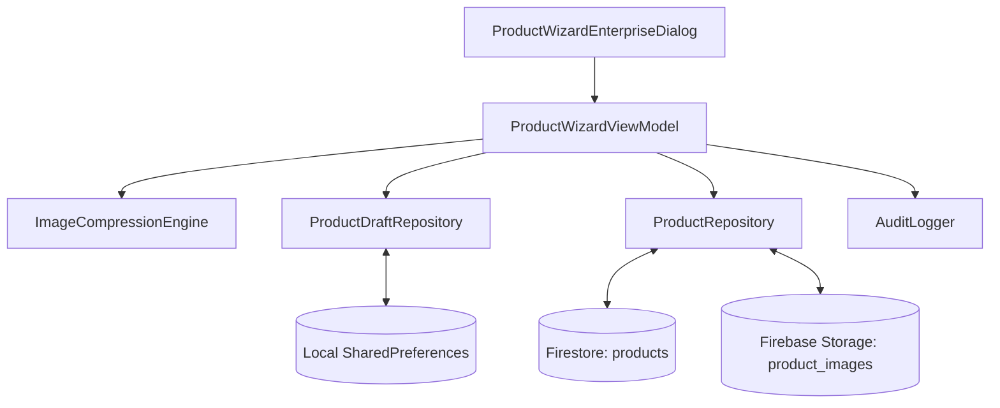

# PRODUCT WIZARD ARCHITECTURE
**BlueSystem Delivery Enterprise v2.1**
**Patrones de Diseño, Adaptadores y Frozen Core Compliance**

---

## 1. Cumplimiento con Frozen Core

Para cumplir estrictamente con la política **Frozen Core**:
- **Cero Modificaciones en Core Inmutable**: No se alteraron los componentes de la Serie 13B, Hito 14, Sprints 14.x ni SDKs compartidos.
- **Patrón Adaptador**: El nuevo asistente utiliza `ProductWizardEnterpriseDialog` y `ProductWizardViewModel` como capa de presentación dedicada que encapsula la lógica sin alterar las llamadas heredadas del `ProductRepository`.

---

## 2. Componentes de la Arquitectura

1. **`ProductWizardEnterpriseDialog`**: Composable principal de UI. Contiene la barra superior persistente con stepper de 6 pasos, cuerpo dinámico y barra inferior sticky con validación del botón guardado.
2. **`ProductWizardViewModel`**: ViewModel reactivo que sostiene el estado `ProductWizardUiState`. Procesa auto-guardado en background cada 15 segundos, ejecuta validaciones en tiempo real y realiza llamadas suspendidas a repositorios.
3. **`ImageCompressionEngine`**: Utilidad singleton para decodificar, escalar a máx. 1200px y comprimir bitmaps a bytes WebP/JPEG antes de la subida a Storage.
4. **`ProductDraftRepository`**: Almacenamiento JSON local de borradores temporales.
