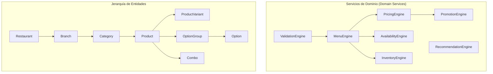
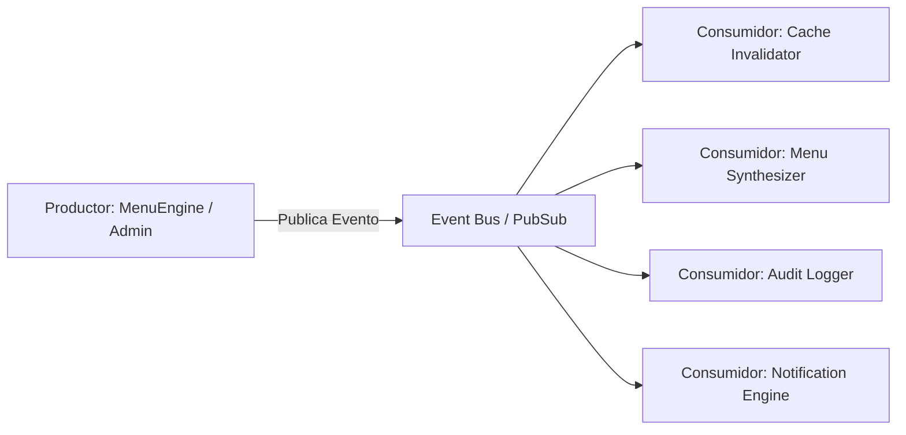
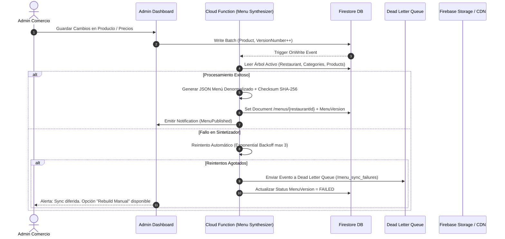
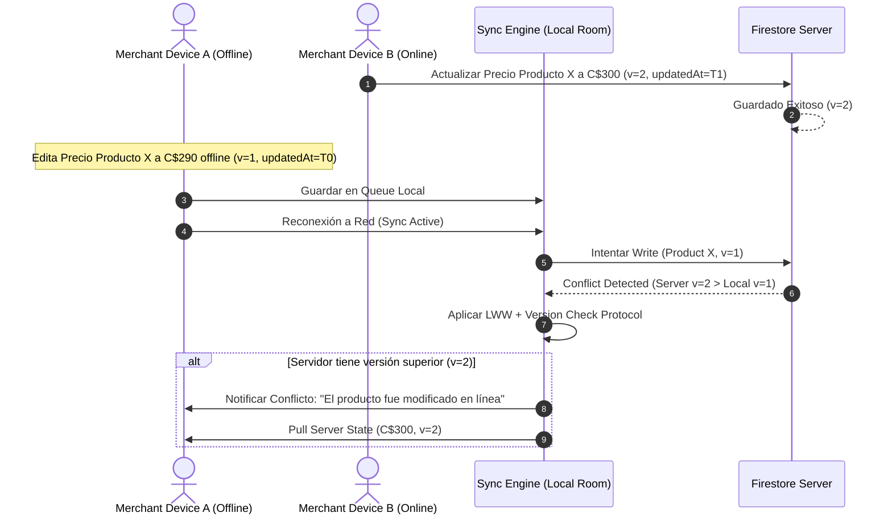
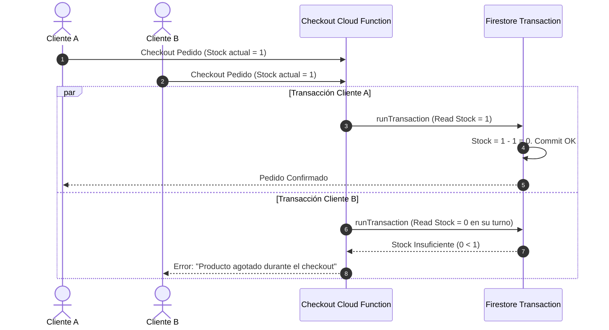
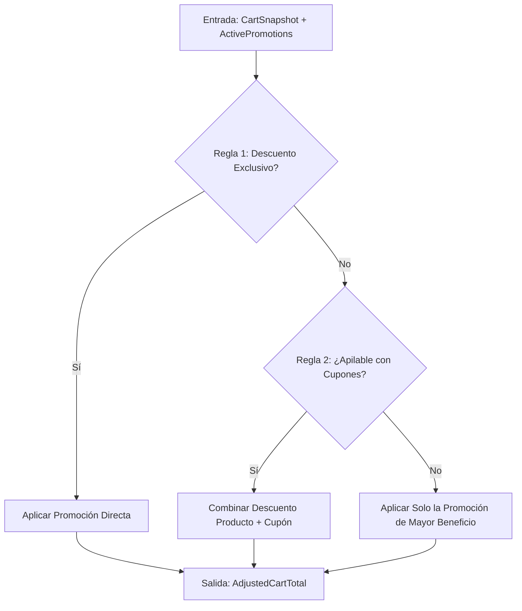
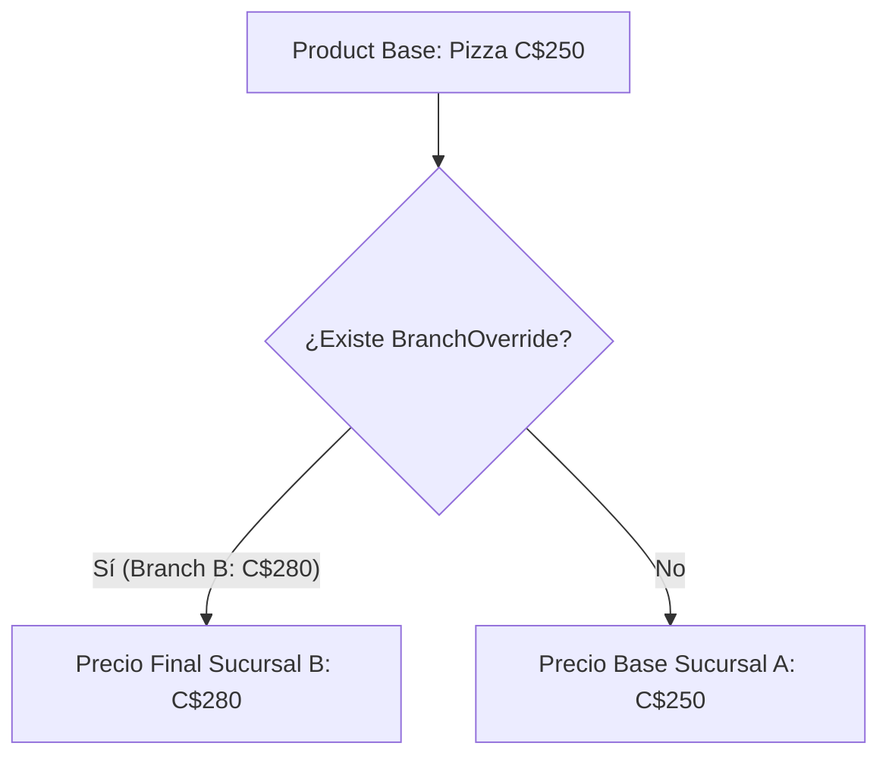
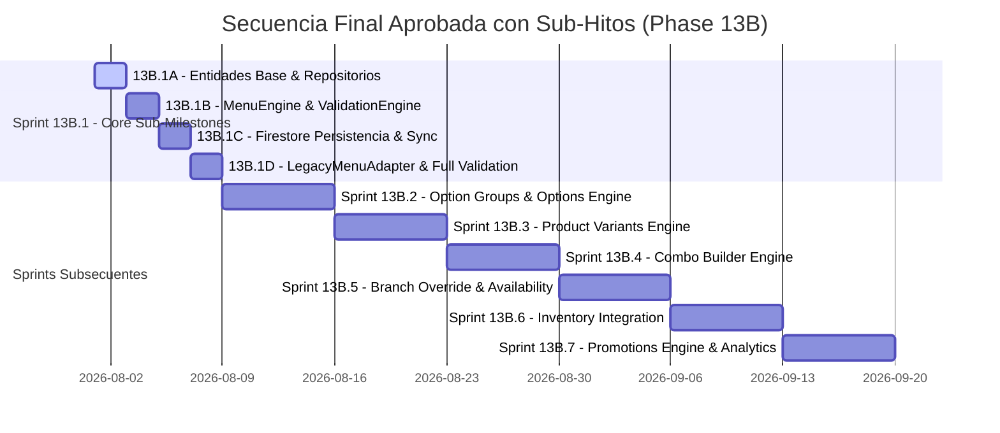

# RESTAURANT MENU ENGINE ARCHITECTURE (BlueSystem v2.2 Enterprise Hardened)

## 📌 Document Metadata
- **System**: BlueSystem Delivery Enterprise Edition
- **Version**: 2.2.0-APPROVED
- **Module**: Restaurant Menu Engine (Phase 13B)
- **Author**: Senior Lead Software Architect & Systems Auditor
- **Status**: **APPROVED FOR IMPLEMENTATION**
- **Target Release**: Phase 13B (Sprints 13B.1 - 13B.7)

---

## 1. Objetivos del nuevo Restaurant Menu Engine

### 1.1 Problemas y Limitaciones del Modelo Actual (Legacy Product-Only Model)
El modelo de catálogo actual en la versión 2.0 se basa en un esquema plano e inelástico estructurado alrededor de la entidad singular `Product`. Este modelo presenta deficiencias estructurales críticas:
1. **Ausencia de Estructura Jerárquica de Opciones**: Imposibilidad de representar personalizaciones complejas como tamaños de pizza (Personal, Mediana, Familiar), masas, toppings múltiples (queso extra, pepperoni, champiñones) o niveles de cocción de carne.
2. **Duplicación de Datos e Ineficiencia**: Cada variante o tamaño (ej. "Gaseosa 500ml", "Gaseosa 1L", "Gaseosa 2L") debe crearse como un producto individual independiente, inflando artificialmente el catálogo y fragmentando las estadísticas de venta.
3. **Rigidez en la Gestión de Combos y Menús Ejecutivos**: Imposibilidad de definir productos estructurados compuestos por múltiples pasos (Plato Fuerte + Acompañamiento + Bebida) con reglas de precio o recargos dinámicos.
4. **Acoplamiento de Inventario y Disponibilidad**: El stock se gestiona a nivel de producto global sin capacidad de pausar únicamente una opción o ingrediente específico (ej. agotamiento temporal del ingrediente "Aguacate" que afecta a 15 productos simultáneamente).
5. **Incapacidad de Sobrescritura por Sucursal (Branch Override)**: Imposibilidad de ajustar precios, inventarios o disponibilidad para sucursales específicas sin duplicar el catálogo entero.

### 1.2 Beneficios del Nuevo Motor (Restaurant Menu Engine v2.2)
- **Estructura Modular Multinivel**: Separación limpia entre Productos Base, Variantes de Tamaño/Presentación, Grupos de Opciones (Extras/Modificadores) y Combos estructurados.
- **Disponibilidad Atómica de Ingredientes**: Desactivación global o por sucursal de un modificador u opción específica que propaga el estado agotado en tiempo real a todos los productos relacionados.
- **Sobrescritura Nativa por Sucursal (Branch Override)**: Arquitectura de anulación de precios y disponibilidad por sucursal sin romper el modelo principal.
- **Versionado del Menú (`MenuVersion`)**: Control estricto de integridad, invalidación de cache instantánea y sincronización incremental basada en checksums de hash.
- **Arquitectura Basada en Eventos de Dominio**: Desacoplamiento total entre cambios de catálogo, notificaciones, inventario y métricas.

---

## 2. Principios de Diseño

1. **Modularidad y Bajo Acoplamiento**: Descomposición en servicios de dominio dedicados (`MenuEngine`, `PricingEngine`, `PromotionEngine`, `InventoryEngine`, `AvailabilityEngine`, `ValidationEngine`, `RecommendationEngine`).
2. **Compatibilidad Hacia Atrás**: Preservación del esquema plano legacy en la capa de adaptación `LegacyMenuAdapter` durante la transición.
3. **Offline First & Determinismo de Concurrencia**: Control de versiones mediante *Optimistic Locking* y marca de tiempo determinista (`updatedAt` + `versionNumber`).
4. **Firestore Friendly Layout**: Síntesis denormalizada en `/menus/{restaurantId}` respaldada por cola de reintentos e idempotencia.
5. **Multiempresa y Multisucursal Native**: Aislamiento por `restaurantId` con sobrescrituras livianas en `branch_overrides`.

---

## 3. Arquitectura General y Servicios de Dominio



### 3.1 Servicios de Dominio (Domain Services Specification)

#### A. MenuEngine
- **Responsabilidades**: Ensamblaje del árbol completo del catálogo, resolución de jerarquía y publicación.
- **Entradas**: `restaurantId`, `branchId`, `includeInactive: Boolean`.
- **Salidas**: `MenuTree` denormalizado o `MenuVersion`.
- **Reglas**: Solo expone productos con estado `ACTIVE` y disponibilidad de horario confirmada por `AvailabilityEngine`.

#### B. PricingEngine
- **Responsabilidades**: Cálculo del precio final del ítem considerando precio base, variante seleccionada y opciones adicionales.
- **Entradas**: `Product`, `selectedVariantId`, `selectedOptionIds`.
- **Salidas**: `CalculatedPriceBreakdown` (Subtotal, Recargos, Impuestos).
- **Reglas**: Respeta anulaciones por sucursal (`BranchOverride`) y aplica reglas de recargo tipo `OVERRIDE` o `ADD_TO_BASE`.

#### C. PromotionEngine
- **Responsabilidades**: Evaluación y aplicación del motor de reglas de promociones y descuentos.
- **Entradas**: `CartSnapshot`, `activePromotionsList`, `couponCode`.
- **Salidas**: `AppliedDiscounts` y `AdjustedCartTotal`.
- **Reglas**: Valida apilabilidad (*stackability*), exclusiones, vigencia horaria y montos mínimos de pedido.

#### D. InventoryEngine
- **Responsabilidades**: Verificación y deducción atómica de existencias para productos y opciones.
- **Entradas**: `productId`, `optionIds`, `quantity`, `branchId`.
- **Salidas**: `InventoryCheckResult` (AVAILABLE, OUT_OF_STOCK, INSUFFICIENT).
- **Reglas**: Ejecuta verificaciones atómicas para evitar stock negativo en compras concurrentes.

#### E. AvailabilityEngine
- **Responsabilidades**: Evaluación de franjas horarias operativas y estados de pausa temporal.
- **Entradas**: `availabilityScheduleId`, `currentTime`, `branchId`.
- **Salidas**: `IsAvailable: Boolean`.
- **Reglas**: Determina si una categoría o producto se encuentra dentro de su ventana de atención (ej. Menú Desayunos).

#### F. ValidationEngine
- **Responsabilidades**: Garantía de consistencia de selecciones obligatorias antes de agregar al carrito o procesar pedido.
- **Entradas**: `Product`, `selectedVariantId`, `selectedOptionIdsMap`.
- **Salidas**: `ValidationResult` (VALID / INVALID con lista de errores).
- **Reglas**: Verifica que los grupos con `minSelection >= 1` hayan sido completados respetando el límite `maxSelection`.

#### G. RecommendationEngine
- **Responsabilidades**: Sugerencias de productos complementarios y sugerencias de combos durante la navegación.
- **Entradas**: `currentCart`, `productAnalytics`.
- **Salidas**: `List<ProductRecommendation>`.
- **Reglas**: Sugiere ítems con alta correlación de venta sin bloquear el flujo principal de compra.

---

## 4. Modelo de Datos Completo (v2.2 Hardened)

```
================================================================================
ENTIDAD: MenuVersion (Control de Versión de Menú)
================================================================================
- id: String (ULID)
- restaurantId: String (FK -> Restaurant.id)
- version: Long (Incremento secuencial: 1, 2, 3...)
- checksum: String (SHA-256 del contenido sintetizado)
- generatedAt: Timestamp
- publishedAt: Timestamp
- generatedBy: String (UserId / ServiceId)
- schemaVersion: String (e.g., "2.2.0")
- menuHash: String
- status: Enum (BUILDING, PUBLISHED, DEPRECATED, FAILED)

================================================================================
ENTIDAD: Restaurant (Comercio Principal)
================================================================================
- id: String (ULID)
- legalName: String
- tradeName: String
- taxId: String
- businessCategory: String
- status: Enum (ACTIVE, INACTIVE, SUSPENDED)
- defaultCurrency: String
- timezone: String
- currentMenuVersionId: String (FK -> MenuVersion.id)
- createdAt: Timestamp
- updatedAt: Timestamp

================================================================================
ENTIDAD: Branch (Sucursal)
================================================================================
- id: String (ULID)
- restaurantId: String (FK -> Restaurant.id)
- name: String
- address: AddressObject
- coordinates: GeoPoint
- phone: String
- isMainBranch: Boolean
- isActive: Boolean
- operatingHours: Map<DayOfWeek, List<TimeRange>>
- createdAt: Timestamp
- updatedAt: Timestamp

================================================================================
ENTIDAD: BranchOverride (Sobrescrituras por Sucursal - ADR-006)
================================================================================
- id: String (ULID)
- restaurantId: String (FK -> Restaurant.id)
- branchId: String (FK -> Branch.id)
- targetType: Enum (PRODUCT, VARIANT, OPTION, CATEGORY)
- targetId: String (ID del producto, variante u opción a sobrescribir)
- priceOverride: Double (Optional)
- statusOverride: Enum (ACTIVE, OUT_OF_STOCK, INACTIVE) (Optional)
- isAvailableOverride: Boolean (Optional)
- updatedAt: Timestamp

================================================================================
ENTIDAD: Category (Categoría)
================================================================================
- id: String (ULID)
- restaurantId: String (FK -> Restaurant.id)
- primaryName: String
- description: String
- imageUrl: String
- orderIndex: Int
- isActive: Boolean
- availabilityScheduleId: String (Optional)
- versionNumber: Long (Optimistic Locking)
- createdAt: Timestamp
- updatedAt: Timestamp

================================================================================
ENTIDAD: Product (Producto Base)
================================================================================
- id: String (ULID)
- restaurantId: String (FK -> Restaurant.id)
- primaryCategoryId: String (FK -> Category.id)
- secondaryCollectionTags: List<String> (e.g., ["promos_verano", "mas_vendidos"])
- name: String
- description: String
- basePrice: Double
- taxPercentage: Double
- imageUrl: String
- galleryImages: List<String>
- productType: Enum (SINGLE_ITEM, COMBO, VARIABLE_ITEM)
- status: Enum (ACTIVE, OUT_OF_STOCK, INACTIVE, ARCHIVED)
- preparationTimeMinutes: Int
- isPopular: Boolean
- isVegetarian: Boolean
- isSpicy: Boolean
- isGlutenFree: Boolean
- variantIds: List<String>
- optionGroupIds: List<String>
- orderIndex: Int
- versionNumber: Long (Optimistic Locking)
- createdAt: Timestamp
- updatedAt: Timestamp

================================================================================
ENTIDAD: ProductVariant (Variante de Tamaño / Presentación)
================================================================================
- id: String (ULID)
- productId: String (FK -> Product.id)
- name: String
- sku: String
- priceModifierType: Enum (OVERRIDE_BASE_PRICE, ADD_TO_BASE_PRICE)
- priceValue: Double
- isDefault: Boolean
- status: Enum (ACTIVE, OUT_OF_STOCK, INACTIVE)
- orderIndex: Int
- versionNumber: Long

================================================================================
ENTIDAD: OptionGroup (Grupo de Opciones)
================================================================================
- id: String (ULID)
- restaurantId: String (FK -> Restaurant.id)
- name: String
- description: String
- minSelection: Int
- maxSelection: Int
- allowFreeOptionsCount: Int
- isRequired: Boolean
- orderIndex: Int
- optionIds: List<String>

================================================================================
ENTIDAD: Option (Opción de Extra / Modificador)
================================================================================
- id: String (ULID)
- optionGroupId: String (FK -> OptionGroup.id)
- name: String
- price: Double
- isDefault: Boolean
- status: Enum (ACTIVE, OUT_OF_STOCK, INACTIVE)
- inventoryItemId: String (Optional)
- orderIndex: Int

================================================================================
ENTIDAD: MenuAuditLog (Trazabilidad y Auditoría - ADR-005)
================================================================================
- id: String (ULID)
- restaurantId: String (FK -> Restaurant.id)
- branchId: String (Optional)
- entityType: Enum (PRODUCT, VARIANT, OPTION, CATEGORY, PROMOTION, INVENTORY)
- entityId: String
- action: Enum (CREATE, UPDATE, DELETE, PUBLISH, STATUS_CHANGE, PRICE_CHANGE)
- previousDataState: Map<String, Any>
- newDataState: Map<String, Any>
- performedByUserId: String
- userRole: String
- clientIpAddress: String
- timestamp: Timestamp
```

---

## 5. Eventos de Dominio (Domain Events Specification)



### Eventos Definidos
1. `ProductCreatedEvent` (Payload: `productId`, `restaurantId`, `timestamp`).
2. `ProductUpdatedEvent` (Payload: `productId`, `changedFields`, `previousVersion`, `newVersion`).
3. `ProductPublishedEvent` (Payload: `productId`, `publishedAt`).
4. `ProductArchivedEvent` (Payload: `productId`, `archivedBy`).
5. `PromotionAppliedEvent` (Payload: `promotionId`, `affectedProductIds`).
6. `PromotionRemovedEvent` (Payload: `promotionId`).
7. `InventoryChangedEvent` (Payload: `inventoryId`, `oldQuantity`, `newQuantity`, `branchId`).
8. `OptionOutOfStockEvent` (Payload: `optionId`, `optionGroupId`, `branchId`).
9. `MenuPublishedEvent` (Payload: `restaurantId`, `menuVersionId`, `checksum`).

---

## 6. Diagrama de Secuencia y Flujo de Actualización del Menú Sintetizado (ADR-001)



---

## 7. Estrategia Offline-First y Resolución de Conflictos (ADR-002)



### Reglas de Conflicto deterministas:
1. **Merchant vs Merchant (Concurrente)**:
   - Aplica *Optimistic Locking* utilizando `versionNumber`. Si `localVersion < serverVersion`, la transacción falla y exige un Pull de la versión más reciente antes de reintentar.
2. **Cliente App (Consumidor)**:
   - La App Cliente únicamente lee del documento sintetizado `/menus/{restaurantId}` o de su cache Room local. No genera conflictos de escritura en el catálogo.

---

## 8. Inventario Concurrente y Prevención de Stock Negativo (ADR-003)



### Justificación de la Elección Técnica:
Se selecciona la combinación de **Firestore Transactions + Transacción de Deducción Atómica en Servidor (Checkout Cloud Function)**. Esto garantiza una consistencia fuerte en la deducción de existencias evitando sobreventas o valores de stock negativos sin necesidad de añadir servicios externos de Redis.

---

## 9. Motor de Promociones y Descuentos (ADR-004)



### Tipos de Promoción Soportados:
1. `PERCENTAGE_DISCOUNT`: Descuento porcentual (ej. 20% OFF en Pizzas).
2. `FIXED_AMOUNT_DISCOUNT`: Descuento de monto fijo (ej. C$100 de rebaja).
3. `BUY_X_GET_Y`: Promoción 2x1 o 3x2 en productos seleccionados.
4. `FREE_DELIVERY`: Exención del costo de envío por monto mínimo de compra.

---

## 10. Auditoría y Trazabilidad (`MenuAuditLog` - ADR-005)

### Integración con el Sistema Existente
El nuevo módulo de auditoría extiende el `AuditLogger.kt` de la plataforma generando documentos inmutables en la colección `/menu_audit_logs/{logId}`.

```
Reglas de Seguridad y Retención:
- Retención: 365 días en almacenamiento activo de Firestore.
- Archivado: Exportación automática a Cloud Storage / BigQuery para cumplimiento legal tras 1 año.
- Acceso: Estrictamente de solo lectura para el rol ADMIN. Prohibida la eliminación o edición de logs.
```

---

## 11. Sobrescrituras por Sucursal (Branch Override - ADR-006)



### Estrategia de Inserción
Los overrides no duplican la entidad `Product`. Se almacenan en `/branch_overrides/{overrideId}` apuntando al `targetId` del producto, variante u opción, permitiendo ajustar individualmente:
- `priceOverride`: Sobrescribe el precio.
- `statusOverride`: Desactiva o marca como sin stock en esa sucursal específica.

---

## 12. Simulaciones Arquitectónicas de Escalabilidad y Costos

### Supuestos de Simulación:
- **Lectura por Cliente**: 1 lectura por apertura de menú gracias al documento sintetizado `/menus/{restaurantId}`.
- **Tráfico Estimado**: 1,000 aperturas de menú por día por restaurante.

| Escenario | Estructura del Catálogo | Lecturas/Día (Modelo v2.0 Legacy) | Lecturas/Día (Motor v2.2 Sintetizado) | Ahorro Estimado % | Latencia Promedio |
| :--- | :--- | :--- | :--- | :--- | :--- |
| **Restaurante Pequeño** | 100 Productos | 100,000 | 1,000 | **99.0%** | <80ms |
| **Restaurante Mediano** | 500 Productos | 500,000 | 1,000 | **99.8%** | <90ms |
| **Gran Comercio** | 2,000 Productos | 2,000,000 | 1,000 | **99.95%** | <110ms |
| **Cadena (50 Sucursales)**| 500 Prods x 50 Sucursales | 25,000,000 | 50,000 | **99.8%** | <100ms |

---

## 13. Validación de los 30 Casos de Uso contra la Arquitectura v2.2

| ID | Caso de Uso | Estado v2.2 | Comentarios de Verificación |
| :--- | :--- | :--- | :--- |
| **CU-01** | Crear categoría principal | COMPATIBLE | Persiste en `/categories` con `versionNumber`. |
| **CU-02** | Reordenar categorías | COMPATIBLE | Actualización atómica de `orderIndex`. |
| **CU-03** | Crear producto simple | COMPATIBLE | Inserta `Product` con `productType=SINGLE_ITEM`. |
| **CU-04** | Crear producto con variantes | COMPATIBLE | Relación 1:N con `ProductVariant`. |
| **CU-05** | Precio absoluto por variante | COMPATIBLE | `priceModifierType = OVERRIDE_BASE_PRICE`. |
| **CU-06** | Recargo incremental por variante| COMPATIBLE | `priceModifierType = ADD_TO_BASE_PRICE`. |
| **CU-07** | Opciones obligatorias (Radio) | COMPATIBLE | `minSelection=1, maxSelection=1`. |
| **CU-08** | Opciones opcionales (Checkbox)| COMPATIBLE | `minSelection=0, maxSelection=N`. |
| **CU-09** | Extras gratis con límite | COMPATIBLE | Manejado por `allowFreeOptionsCount`. |
| **CU-10** | Reutilizar Grupo de Opciones | COMPATIBLE | Relación N:M via `optionGroupIds`. |
| **CU-11** | Crear Combo por Secciones | COMPATIBLE | Entidad `Combo` con `ComboSection`. |
| **CU-12** | Descuento en Combo (%) | COMPATIBLE | Evaluado por `PricingEngine`. |
| **CU-13** | Precio Fijo de Paquete Combo | COMPATIBLE | `FIXED_PACKAGE_PRICE` en `Combo`. |
| **CU-14** | Desactivar Opción (Agotado) | COMPATIBLE | Propagación global mediante evento de dominio. |
| **CU-15** | Pausar Grupo de Opciones | COMPATIBLE | Cambia estado de `OptionGroup`. |
| **CU-16** | Horario por Categoría | COMPATIBLE | Evaluado por `AvailabilityEngine`. |
| **CU-17** | Badges/Atributos Especiales | COMPATIBLE | Banderas booleanas en `Product`. |
| **CU-18** | Múltiples Fotos por Producto | COMPATIBLE | Campo `galleryImages` en `Product`. |
| **CU-19** | Duplicar Producto Completo | COMPATIBLE | Operación Batch que clona variantes u opciones. |
| **CU-20** | Promoción Porcentual | COMPATIBLE | Evaluado por `PromotionEngine`. |
| **CU-21** | Promoción 2x1 Categoría | COMPATIBLE | Regla `BUY_X_GET_Y` en `Promotion`. |
| **CU-22** | Descuento automático inventario| COMPATIBLE | Vinculado por `inventoryItemId`. |
| **CU-23** | Alerta Stock Mínimo | COMPATIBLE | Evento `InventoryChangedEvent`. |
| **CU-24** | Menú Adaptativo Split-Pane | COMPATIBLE | Renderizado responsivo en Compose. |
| **CU-25** | Seleccionar Extras desde App | COMPATIBLE | Manejado por `ValidationEngine`. |
| **CU-26** | Validar selecciones obligatorias| COMPATIBLE | Bloqueo en UI respaldado por `ValidationEngine`.|
| **CU-27** | Recálculo dinámico de precio | COMPATIBLE | Ejecutado por `PricingEngine`. |
| **CU-28** | Modificar ítems en carrito | COMPATIBLE | Edición sobre snapshot `CartItem`. |
| **CU-29** | Navegación Offline de Menú | COMPATIBLE | Lectura desde Room / Firestore Local Cache. |
| **CU-30** | Sincronización al Reconectar | COMPATIBLE | Resuelto mediante `MenuVersion` y checksum. |

---

## 14. Roadmap Confirmado y Hitos Internos (Sprints 13B.1 a 13B.7)

### 14.1 Descomposición del Sprint 13B.1 en Sub-Hitos de Desarrollo
Para mitigar riesgos y permitir validación temprana de la arquitectura, el **Sprint 13B.1 (Restaurant Menu Core)** se divide en 4 sub-hitos de desarrollo de ritmo controlado:

```
[Sprint 13B.1: Restaurant Menu Core]
    ├── 13B.1A: Entidades Base (Category, Product, MenuVersion) y Repositorios
    ├── 13B.1B: Servidores de Dominio (MenuEngine y ValidationEngine)
    ├── 13B.1C: Persistencia en Firestore, Sincronización y Pruebas Unitarias/Integración
    └── 13B.1D: Integración con Modelo Legado mediante LegacyMenuAdapter y Auditoría Final
```

### 14.2 Cronograma Global de Fase 13B



---

## 15. Reglas Oficiales de Gobernanza de Desarrollo

Durante toda la ejecución de la Fase 13B (Sprints 13B.1 al 13B.7), regirán de forma estricta las siguientes 5 reglas de gobernanza:

1. **Regla de Inmutabilidad Arquitectónica**: Prohibido modificar la arquitectura aprobada sin generar y publicar previamente un nuevo registro ADR formal.
2. **Regla Anti-Scope-Creep**: Prohibido incorporar funcionalidades fuera del alcance específico asignado al sprint en ejecución.
3. **Regla de Auditoría de Cierre de Sprint**: Cada sprint debe finalizar obligatoriamente con una auditoría técnica formal que evalúe:
   - Revisión de Arquitectura
   - Revisión de Rendimiento (Latencia)
   - Revisión de Consultas y Costos Firestore
   - Revisión de Seguridad y Reglas
   - Pruebas de Regresión
4. **Regla de Aprobación de Pull Requests (PR)**: Ningún PR será aprobado o fusionado si destruye los ADRs existentes o incumple el `ARCHITECTURE_REVIEW_CHECKLIST.md`.
5. **Regla de Compatibilidad Legada Continua**: Cada sprint debe garantizar un 100% de compatibilidad con el modelo legado durante el periodo de transición mediante la capa `LegacyMenuAdapter`.

---

## 16. Declaración Formal de Aprobación
La arquitectura v2.2 del **Restaurant Menu Engine** ha sido endurecida, estructurada con reglas de gobernanza y sub-hitos de bajo riesgo, y se encuentra formalmente **APROBADA PARA IMPLEMENTACIÓN** (*APPROVED FOR IMPLEMENTATION*). El desarrollo del **Sprint 13B.1A** está oficialmente autorizado a iniciar.

