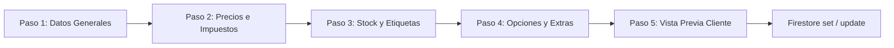
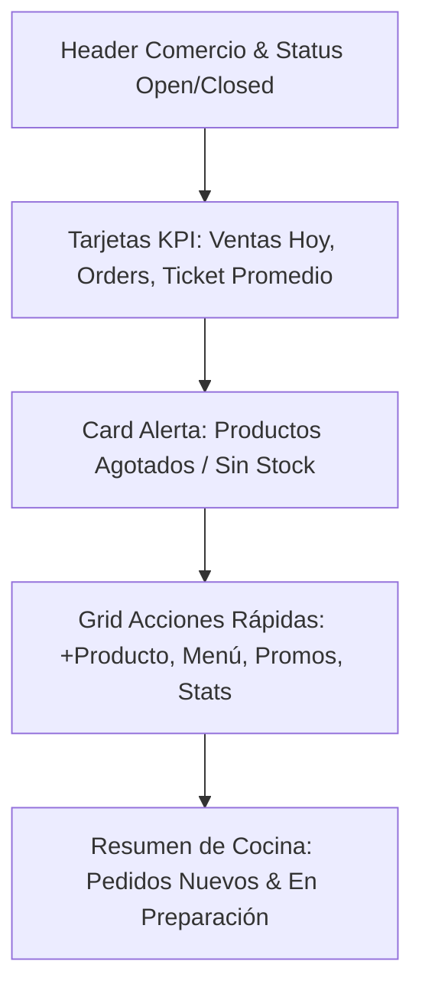
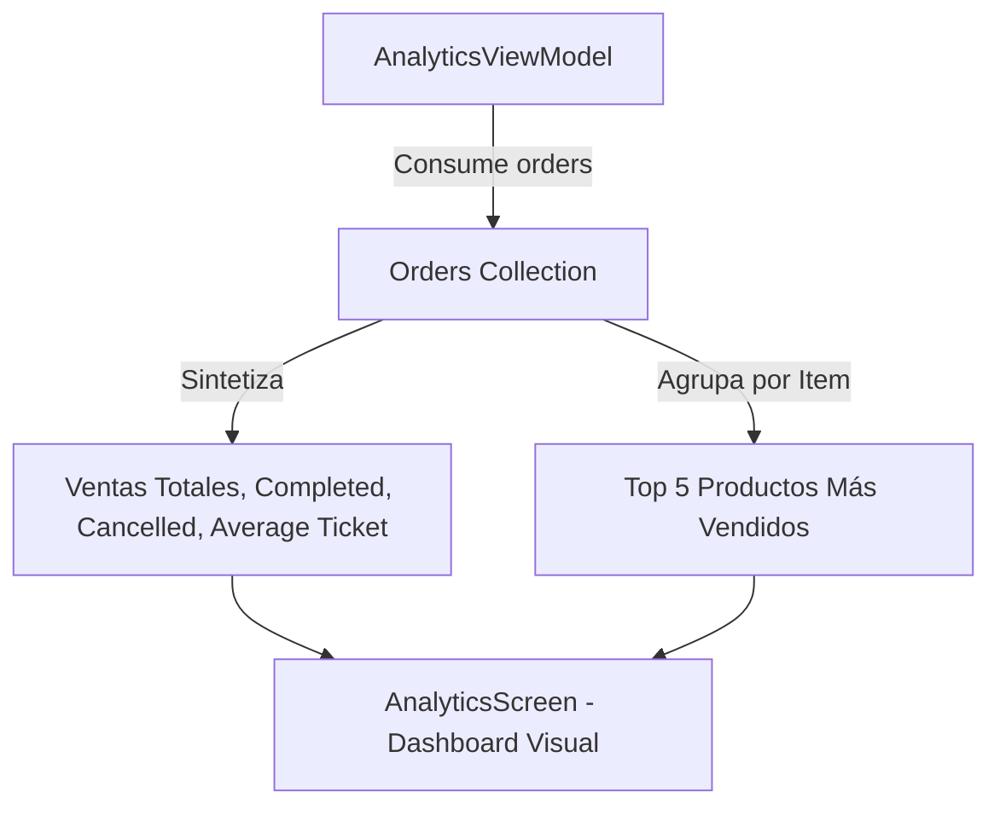
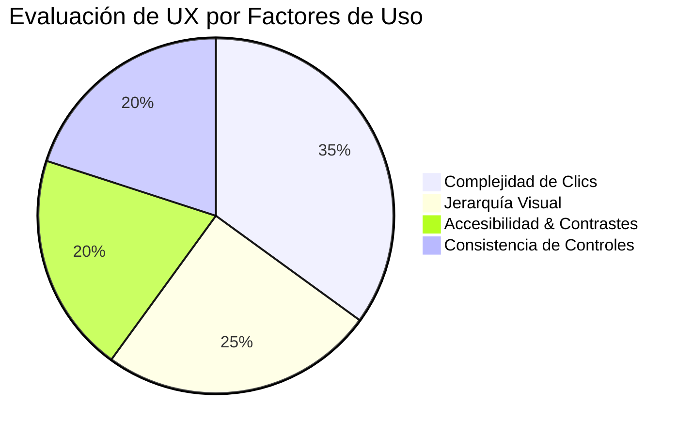
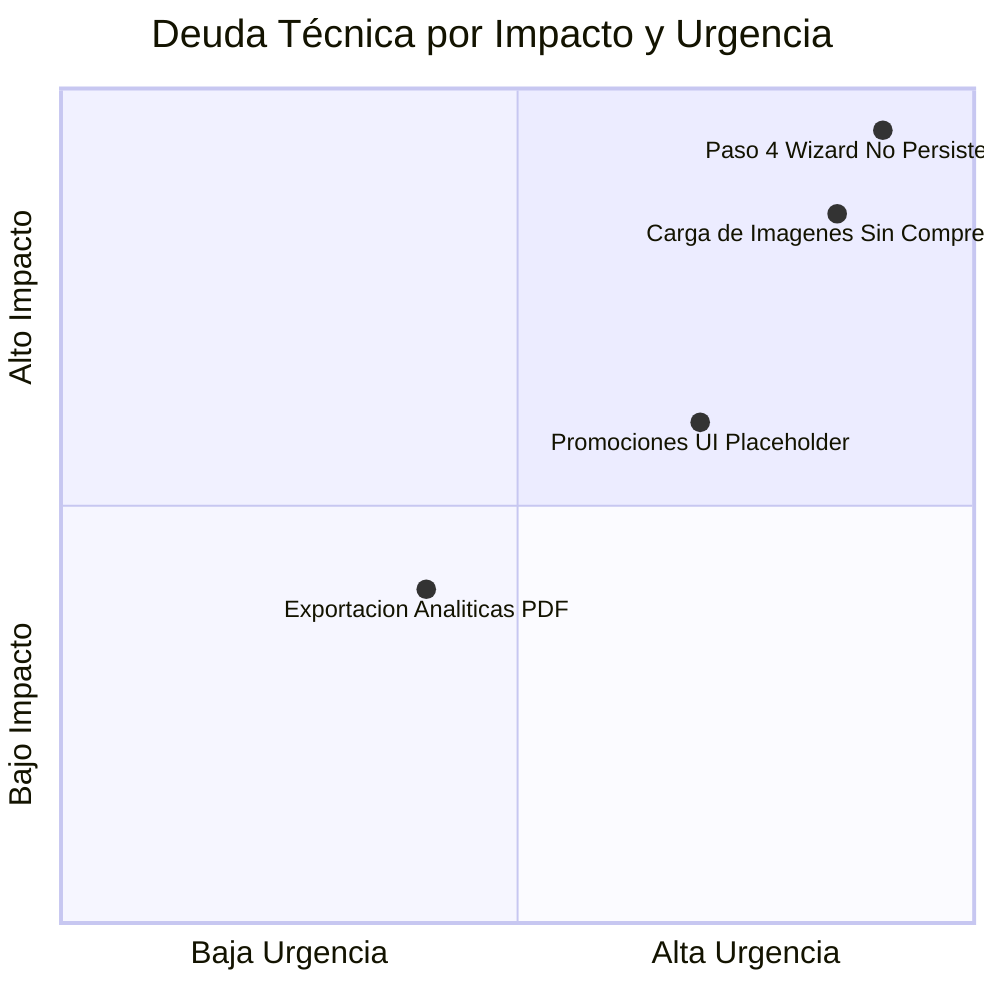

# RESTAURANT MERCHANT COMPREHENSIVE AUDIT REPORT
**BlueSystem Delivery Enterprise v2.1**
**Fase 0 — Descubrimiento, Auditoría y Levantamiento de Arquitectura**

---

## 1. Auditoría Especializada del Wizard de Productos (`ProductWizardDialog.kt`) (Entregable 10)

El `ProductWizardDialog` es la pieza central para la carga de catálogo. Se compone de un Stepper modal de **5 Pasos** con navegación persistente ("Sticky Bottom Bar").

### Análisis Paso a Paso

#### Paso 1: Datos Generales
- **Campos Existentes**:
  - `Nombre del Producto` (OutlinedTextField)
  - `Descripción` (OutlinedTextField multilínea)
  - `Categoría` (Selector dinámico de categorías)
  - `Fotos del Platillo` (Subida multi-foto desde Cámara o Galería codificado en Base64/ByteArray)
- **Validaciones**:
  - `Nombre`: Obligatorio (Checklist `step1Done = name.isNotBlank() && categoryName.isNotBlank()`).
  - `Categoría`: Obligatoria.
- **Deficiencias / Errores Detectados**:
  - ⚠️ **Carga de Imágenes**: Codifica directamente la imagen a Base64 string dentro del diálogo en lugar de comprimir la imagen nativamente mediante WebP/JPEG antes de la transmisión.
  - ⚠️ **Múltiples Fotos**: La UI permite seleccionar varias fotos (`photosList`), pero la función de guardado `onSave` sólo transmite la primera imagen como `ByteArray` a `ProductRepository`, descartando la galería adicional.

#### Paso 2: Precios e Impuestos
- **Campos Existentes**:
  - `Precio de Venta` (KeyboardType.Decimal)
  - `Precio Original` (Para cálculo de descuento visual)
  - `Porcentaje de Impuesto` (Default: 15% ISV)
  - `Tiempo Estimado de Preparación` (Default: 15 min)
- **Validaciones**:
  - `Precio`: Requisito numérico estricto (`priceText.toDoubleOrNull() > 0`).
- **Deficiencias / Errores Detectados**:
  - ⚠️ **Validación de Descuento**: No valida que `originalPrice` sea mayor que `price`. Si el usuario ingresa un precio original menor, el cálculo de porcentaje muestra un valor negativo o erróneo en el badge.

#### Paso 3: Stock y Etiquetas
- **Campos Existentes**:
  - `Switch de Disponibilidad` (`isAvailable`)
  - `Cantidad en Stock` (Unidades numéricas)
  - `Flags Atributos`: `isPopular` (Popular), `isVegetarian` (Vegetariano), `isSpicy` (Picante)
- **Validaciones**:
  - Ninguna estricta (`step3Done = true`). Si no se ingresa stock, se asume inventario ilimitado (`stockQuantity = null`).
- **Deficiencias / Errores Detectados**:
  - ⚠️ **Stock Negativo**: Aunque la UI no permite números negativos, no existe validación en el ViewModel si se edita vía mapa de campos.

#### Paso 4: Opciones y Extras (Crítico)
- **Campos Existentes**:
  - Interfaz visual para creación de Grupos de Opciones (ej. *"Elija la salsa"*, *"Seleccione el tamaño"*), agregación de opciones individuales y precios adicionales.
- **Deficiencias / Errores Detectados**:
  - 🚨 **FUNCIONALIDAD DESCONECTADA (SOLO UI)**: El Paso 4 renderiza los elementos visuales pero el objeto `Product` que se emite en `onSave` **NO persiste los grupos de opciones en Firestore**. La información ingresada en este paso se pierde completamente al guardar.

#### Paso 5: Vista Previa del Cliente
- **Campos Existentes**:
  - Live Card Preview (Tarjeta idéntica a la vista del cliente en `CustomerHomeScreen`).
  - Checklist de verificación de pasos completados.
- **Deficiencias / Errores Detectados**:
  - Ninguno visual. Funciona como un espejo en tiempo real de las variables del estado.

---

## 2. Auditoría del Dashboard Comercio (`BusinessDashboardScreen.kt`) (Entregable 11)

El Dashboard principal integra métricas ejecutivas y control operacional:

- **Widgets & KPI Cards**:
  - **Ventas Hoy (C$)**: Calculado dinámicamente sumando pedidos en estado `delivered` / `completed`. **(100% Real)**.
  - **Ticket Promedio (C$)**: `Ventas Totales / Pedidos Completados`. **(100% Real)**.
  - **Producto Más Vendido**: Agregación en memoria de los ítems en la colección `orders`. **(100% Real)**.
  - **Pedidos por Estado**: Badges contadores para `Nuevos`, `En Preparación`, `Listos` y `En Camino`. **(100% Real)**.
- **Acciones Rápidas**:
  - `+ Agregar Producto`: Dispara `ProductWizardDialog`.
  - `Ver Menú`: Navega a la pestaña `BusinessTab.MENU`.
  - `Promociones`: Navega a `BusinessTab.PROMOTIONS`.
  - `Analíticas`: Navega a `BusinessTab.STATS`.

---

## 3. Promociones y Descuentos (Entregable 13)

- **Estado Actual**:
  - `BusinessTab.PROMOTIONS` renderiza una vista de marcador de posición (`PromotionsPlaceholderView`).
  - El soporte de promociones actual se limita a descuentos individuales sobre producto mediante el campo `originalPrice` vs `price` en `Product.kt`.
- **Integración con `PromotionEngine`**:
  - El motor de promociones `PromotionEngine.kt` está implementado en la capa de dominio (`domain.engine.promotion`), pero **el módulo de Comercio no tiene una UI para configurar campañas de descuento, cupones o combos 2x1 desde la App**. Las promociones actualmente se leen en modo consumidor.

---

## 4. Analíticas Comerciales (`AnalyticsScreen.kt`) (Entregable 14)

- **KPIs Evaluados**:
  - **Ventas Acumuladas (C$)**: Calculado en tiempo real.
  - **Volumen de Pedidos**: Conteo de pedidos exitosos vs cancelados.
  - **Ticket Promedio (C$)**: División matemática determinista.
  - **Ranking Top Productos**: Lista ordenada por unidades vendidas e ingresos totales.
- **Gráficas y Exportaciones**:
  - Gráfico de barras simple mediante Compose Canvas / Composables personalizados.
  - ⚠️ **Faltante**: No existe funcionalidad de exportación a PDF, Excel o CSV para contabilidad.

---

## 5. Configuración del Comercio (Entregable 15)

- **Campos Soportados en `BusinessInfo`**:
  - `isOpen`: Switch de estado de tienda (Abierto / Cerrado) **(Operativo)**.
  - `deliveryFee` & `deliveryTime`: Parámetros de envío **(Operativo)**.
  - `schedule`: Texto de horario semanal **(Operativo plano)**.
- **Deficiencias**:
  - No existe un gestor visual de franjas horarias por día de la semana (ej. *Lunes 08:00 AM - 10:00 PM*).
  - No existe asignación de roles de usuario (Cajero, Cocinero, Administrador) dentro de la App del Comercio.

---

## 6. UX Audit (Evaluación de Experiencia de Usuario) (Entregable 16)

- **Complejidad y Cantidad de Clics**:
  - Para aceptar un pedido: **1 Clic** (Excelente).
  - Para agregar un producto en el Wizard: **5 Clics obligatorios** a través del Stepper. Se recomienda permitir guardar en cualquier paso si los campos obligatorios del Paso 1 y 2 están completos.
- **Jerarquía Visual y Accesibilidad**:
  - **Excelente legibilidad**: Uso de tipografía Roboto/Inter con pesos `ExtraBold` para números de venta y badges contrastados.
  - **Uso del Espacio**: Excelente aprovechamiento en tablets y pantallas panorámicas con diseño adaptable (`BoxWithConstraints`).

---

## 7. UI Audit (Evaluación de Diseño e Interfaz) (Entregable 17)

- **Tipografía y Colores**:
  - Paleta nativa consistente con la identidad de BlueSystem (`BluePrimary = #2563EB`, `BlueSecondary = #3B82F6`, `Background = #F8FAFC`). Modo oscuro nativo soportado en Theme.
- **Componentes Compose**:
  - Cards con bordes redondeados (`20.dp` / `24.dp`) y elevación sutil (`shadowElevation = 8.dp`).
  - Inputs con validación de estados y foco automático.
- **Adaptabilidad Responsive (Galaxy Z Fold & Tablets)**:
  - `ProductWizardDialog` utiliza `BoxWithConstraints` para ajustar su ancho: `640.dp` en tablets/plegables desplegados y `94%` del ancho en smartphones estándar.

---

## 8. Performance Audit & Cumplimiento ADR-003 (Entregable 18)

- **Recomposición Compose**:
  - Los estados en `BusinessDashboardScreen` están correctamente recordados mediante `remember` y `collectAsState()`.
- **Listeners Firestore & Anti-Consultas $N+1$ (ADR-003)**:
  - ✅ **Cumplimiento ADR-003**: No existen consultas $N+1$ en bucles `for`. Los pedidos se consumen mediante una única suscripción `addSnapshotListener` filtrada por `businessId`.
  - ✅ **Cancelación de Listeners**: El `callbackFlow` ejecuta `awaitClose { subscription.remove() }`, previniendo fugas de memoria o lecturas fantasma en background.
- **Estrategia Offline**:
  - Firestore cache nativo (`PersistenceEnabled`) permite visualizar el último catálogo cargado ante pérdidas de conectividad.

---

## 9. Deuda Técnica Priorizada (Entregable 19)

### Clasificación de Deuda Técnica

#### 🚨 Crítica (Severidad Alta - Corrección Prioritaria)
1. **Paso 4 del Wizard de Productos Desconectado**: Los grupos de opciones y extras creados en el Paso 4 no se guardan en Firestore.
2. **Descarte de Galería Multi-foto**: El Wizard permite seleccionar múltiples fotos pero sólo persiste 1 en Firebase Storage.

#### ⚠️ Alta (Severidad Media-Alta)
3. **Compresión de Imágenes en Cliente**: Falta compresión nativa WebP/JPEG antes del envío a Storage para reducir consumo de ancho de banda.
4. **Módulo de Promociones Incompleto**: `BusinessTab.PROMOTIONS` es un placeholder visual que no permite crear cupones.

#### 🟡 Media (Severidad Media)
5. **Falta de Exportación en Analíticas**: No permite descargar reportes financieros en PDF/Excel.
6. **Gestor de Horarios Plano**: Falta un selector interactivo por días para franjas de atención.

---

## 10. Roadmap de Mejoras Recomendadas (Entregable 20)

> [!NOTE]
> Las siguientes propuestas están destinadas a ejecutarse en fases posteriores (Fase 1 de Desarrollo) y no alteran la arquitectura actual durante la Fase 0.

### Prioridad P0 (Crítico - Próximo Sprint)
- **Persistencia Completa del Wizard (Paso 4)**: Conectar el modelo `OptionGroup` e `ItemOption` a la colección Firestore `products` / `restaurant_menu`.
- **Compresor Nativo de Imágenes**: Implementar utilidad de compresión WebP antes de la subida a Firebase Storage.

### Prioridad P1 (Alta Impacto UX/UI)
- **Generador de Cupones y Promociones**: Habilitar UI en `BusinessTab.PROMOTIONS` para crear descuentos temporales y conectar con `PromotionEngine`.
- **Notificaciones Sonoras de Pedidos**: Integrar canal de audio persistente tipo "Timbre de Comanda" al recibir un pedido entrante.

### Prioridad P2 (Media)
- **Exportación de Analíticas**: Añadir botón de descarga de reportes en PDF/CSV desde `AnalyticsScreen`.
- **Gestor de Horarios Visual**: Interface gráfica semanal para configurar horarios de apertura y días festivos.

### Prioridad P3 (Baja)
- **Impresión de Comandas Bluetooth / POS**: Integración de SDK para impresoras térmicas de tickets en cocina.
