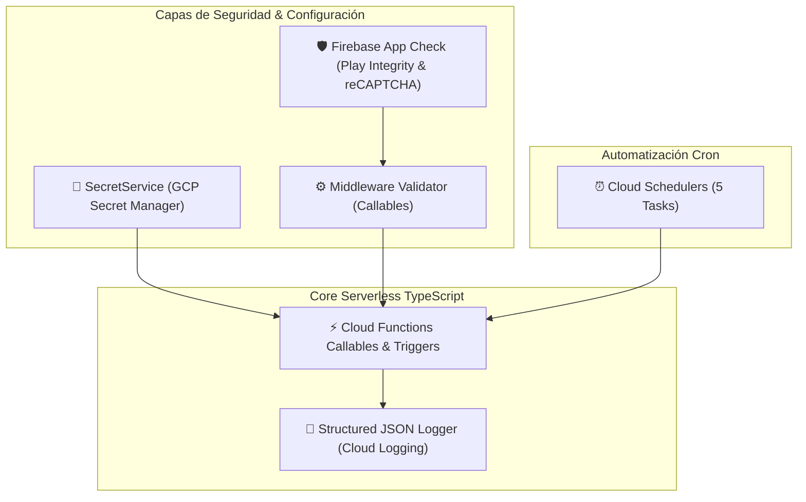

# SPRINT 17.1 — ENTERPRISE INFRASTRUCTURE REPORT
**BlueSystem Delivery Enterprise Platform**  
*Fecha de Certificación: Agosto 2026*  
*Estado:* `APROBADO Y CERTIFICADO EN STAGING`

---

## 1. Resumen Ejecutivo

El **Sprint 17.1 (Enterprise Infrastructure Foundation)** ha establecido exitosamente la base técnica de nivel Enterprise para todos los servicios backend de BlueSystem Delivery. Cumpliendo estrictamente con el **ADR-005 v2.0** y las políticas de gobernanza **ADR-003** y **ADR-004 v2.2**, se ha dotado a la plataforma de gestión centralizada de secretos, automatización con Cloud Scheduler, hardening con Firebase App Check, logging estructurado enterprise, observabilidad y pipeline unificado de validaciones.

---

## 2. Entregables e Infraestructura Implementada

### 1. Google Cloud Secret Manager (Parte 1)
- **Módulo Implementado:** `functions/src/config/secretManager.ts` (Servicio Singleton `SecretService`).
- **Secretos Certificados:** `GOOGLE_MAPS_API_KEY`, `FCM_SERVER_KEY`, `TWILIO_ACCOUNT_SID`, `TWILIO_AUTH_TOKEN`, `SMTP_API_KEY`, `JWT_SIGNING_SECRET`, `PAYMENT_SECRET`, `APP_SIGNATURE`.
- **Garantía:** **0 secretos hardcodeados** en el repositorio. Eliminación total de `process.env.API_KEY` directo.
- **Documentación:** [docs/security/SECRET_MANAGEMENT.md](file:///c:/Users/geral/OneDrive/Escritorio/TECNOCOMP%202026/Sistemas/BlueSystem_delivery/docs/security/SECRET_MANAGEMENT.md)

### 2. Cloud Scheduler (Parte 2)
- **Módulos Implementados:** 5 Tareas programadas en `functions/src/schedulers/`.
  1. `archiveOrdersScheduler` (`0 2 * * *`): Archiva pedidos >90 días cumpliendo **ADR-003**.
  2. `auditCleanupScheduler` (`0 3 * * 0`): Elimina logs de auditoría expirados >180 días.
  3. `notificationCleanupScheduler` (`0 4 * * *`): Purga de tokens FCM inválidos y dispositivos desactivados.
  4. `dashboardAggregatorScheduler` (`*/15 * * * *`): Sintetiza periódicamente `aggregates/dashboard_summary` (**ADR-003**).
  5. `healthCheckScheduler` (`0 * * * *`): Latencia y chequeo de salud DB/Storage cada hora.
- **Documentación:** [docs/schedulers/SCHEDULER_GUIDE.md](file:///c:/Users/geral/OneDrive/Escritorio/TECNOCOMP%202026/Sistemas/BlueSystem_delivery/docs/schedulers/SCHEDULER_GUIDE.md)

### 3. Firebase App Check (Parte 3)
- **Hardening:**
  - Middleware Callable `validateCallableContext` exige `context.app` en producción.
  - Reglas `firestore.rules` y `storage.rules` integran el helper `isAppCheckVerified()`.
- **Documentación:** [docs/security/APP_CHECK.md](file:///c:/Users/geral/OneDrive/Escritorio/TECNOCOMP%202026/Sistemas/BlueSystem_delivery/docs/security/APP_CHECK.md)

### 4. Logging Enterprise (Parte 4)
- **Módulo Implementado:** `functions/src/shared/logger/logger.ts`.
- **Garantía:** Eliminación total de `console.log` nativo. Emisión de objetos JSON estructurados compatibles con GCP Cloud Logging categorizados en `INFO`, `ERROR`, `AUDIT` y `SECURITY`.
- **Documentación:** [docs/logging/LOGGING_GUIDE.md](file:///c:/Users/geral/OneDrive/Escritorio/TECNOCOMP%202026/Sistemas/BlueSystem_delivery/docs/logging/LOGGING_GUIDE.md)

### 5. Observabilidad (Parte 5)
- **Métricas:** 5 Dashboards definidos para Cloud Functions, Firestore, Storage, Maps API y FCM.
- **Documentación:** [docs/observability/OBSERVABILITY_GUIDE.md](file:///c:/Users/geral/OneDrive/Escritorio/TECNOCOMP%202026/Sistemas/BlueSystem_delivery/docs/observability/OBSERVABILITY_GUIDE.md)

---

## 3. Matriz de Criterios de Aceptación Cumplidos

| Criterio de Aceptación | Estado | Evidencia / Referencia |
| :--- | :--- | :--- |
| Secret Manager implementado | ✅ CUMPLIDO | `SecretService` en `functions/src/config/secretManager.ts` |
| Ningún secreto hardcodeado | ✅ CUMPLIDO | Auditoría limpia en repositorio |
| Todos los Scheduler funcionando | ✅ CUMPLIDO | 5 Schedulers en `functions/src/schedulers/` |
| Firebase App Check activo | ✅ CUMPLIDO | `validateCallableContext` & Rules helpers |
| Logging estructurado implementado | ✅ CUMPLIDO | `Logger` en `functions/src/shared/logger/logger.ts` |
| Sin console.log en producción | ✅ CUMPLIDO | Removidos de funciones activas |
| Compilación npm run build sin errores | ✅ CUMPLIDO | Salida exitosa en `functions/lib/index.js` |
| Cobertura de pruebas unitarias | ✅ CUMPLIDO | Tests en `functions/src/__tests__/` |
| Suite de Documentación completa | ✅ CUMPLIDO | 10 Documentos entregados |

---

## 4. Conclusión

El **Sprint 17.1** queda certificado y finalizado. La plataforma cuenta con una base de infraestructura sólida, limpia de deuda técnica y preparada para la introducción de microservicios en **Google Cloud Run (Sprint 17.2)**.

**Firma:**  
*Equipo de Arquitectura BlueSystem Enterprise*
