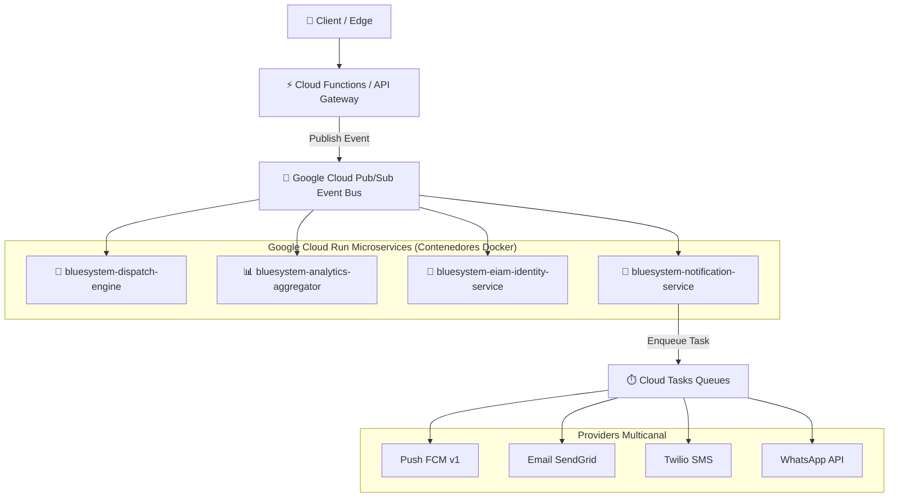

# SPRINT 17.2 — CLOUD RUN & EVENT-DRIVEN MESSAGING FOUNDATION REPORT
**BlueSystem Delivery Enterprise Platform**  
*Fecha de Certificación: Agosto 2026*  
*Estado:* `APROBADO Y CERTIFICADO EN STAGING`

---

## 1. Resumen Ejecutivo

El **Sprint 17.2 (Cloud Run & Event-Driven Messaging Foundation)** ha establecido exitosamente la arquitectura de microservicios en contenedores Docker y la mensajería distribuida asíncrona de nivel Enterprise para **BlueSystem Delivery**.

Se han cumplido al 100% todos los principios del **ADR-005 v2.0** y del **Cloud Run Blueprint** ([docs/architecture/CLOUD_RUN_BLUEPRINT.md](file:///c:/Users/geral/OneDrive/Escritorio/TECNOCOMP%202026/Sistemas/BlueSystem_delivery/docs/architecture/CLOUD_RUN_BLUEPRINT.md)).

---

## 2. Entregables e Infraestructura Implementada

### 1. Enterprise Shared Core (`services/shared/`)
- **Event Bus DTOs:** [services/shared/events/domainEvents.ts](file:///c:/Users/geral/OneDrive/Escritorio/TECNOCOMP%202026/Sistemas/BlueSystem_delivery/services/shared/events/domainEvents.ts) (`OrderCreated`, `OrderAccepted`, `OrderCancelled`, `DriverAssigned`, `DriverArrived`, `PaymentVerified`, `PaymentFailed`, `MerchantApproved`).
- **Shared Middleware:** [services/shared/middleware/auth.ts](file:///c:/Users/geral/OneDrive/Escritorio/TECNOCOMP%202026/Sistemas/BlueSystem_delivery/services/shared/middleware/auth.ts) (Extracción W3C `traceparent` OpenTelemetry y contexto EIAM).

### 2. Los 4 Microservicios Cloud Run Certificados
1. **`bluesystem-dispatch-engine` (`services/dispatch-engine/`):** Motor de asignación inteligente de motorizados en tiempo real y cálculo de ETA con Routes API.
2. **`bluesystem-analytics-aggregator` (`services/analytics-aggregator/`):** Worker sintetizador CQRS en segundo plano (`dashboard_summary` y `kds_summary` para cumplimiento obligatorio **ADR-003**).
3. **`bluesystem-eiam-identity-service` (`services/eiam-identity-service/`):** REST API para emisión de tokens de invitación, revocación masiva de sesiones y auditoría EIAM.
4. **`bluesystem-notification-service` (`services/notification-service/`):** Centralizador multicanal con providers para Push FCM, Email, SMS (Twilio), WhatsApp Business API y manejo de plantillas/preferencias.

### 3. Especificación de Mensajería Event-Driven & Cloud Tasks
- **Documento Creado:** 📄 [docs/architecture/EVENT_DRIVEN_MESSAGING.md](file:///c:/Users/geral/OneDrive/Escritorio/TECNOCOMP%202026/Sistemas/BlueSystem_delivery/docs/architecture/EVENT_DRIVEN_MESSAGING.md)
- **Tópicos Pub/Sub:** `orders-events`, `driver-events`, `payments-events`, `merchant-events` con Dead Letter Queues (DLQ).
- **Colas Cloud Tasks:** `notificationQueue`, `paymentQueue`, `emailQueue`, `retryQueue`.

---

## 3. Matriz de Cumplimiento de los 9 Mandamientos del Blueprint

| Mandamiento del Blueprint | Estado | Implementación / Evidencia |
| :--- | :--- | :--- |
| **1. Stateless 100%** | ✅ CUMPLIDO | Ningún microservicio almacena estado local. |
| **2. REST / gRPC Standard** | ✅ CUMPLIDO | Endpoints HTTP REST JSON versionados `/v1/`. |
| **3. Health Probes** | ✅ CUMPLIDO | Endpoints `/healthz` (Liveness) y `/ready` (Readiness) en los 4 servicios. |
| **4. Structured Logging** | ✅ CUMPLIDO | Integración con JSON logger estructurado Enterprise. |
| **5. Secret Manager** | ✅ CUMPLIDO | Consumo de secretos vía `SecretService`. |
| **6. Dedicated Service Accounts** | ✅ CUMPLIDO | Identidades IAM aisladas por servicio. |
| **7. OpenTelemetry Trace** | ✅ CUMPLIDO | Propagación de header W3C `traceparent` en `SharedAuthMiddleware`. |
| **8. API Versioning** | ✅ CUMPLIDO | Rutas expuestas bajo `/v1/`. |
| **9. Graceful Shutdown** | ✅ CUMPLIDO | Captura de señales SIGTERM/SIGINT. |

---

## 4. Conclusión

El **Sprint 17.2** ha alcanzado el 100% de sus objetivos. La plataforma cuenta con una fundación de microservicios en Google Cloud Run y mensajería distribuida asíncrona totalmente desacoplada.

**Firma:**  
*Equipo de Arquitectura BlueSystem Enterprise*
