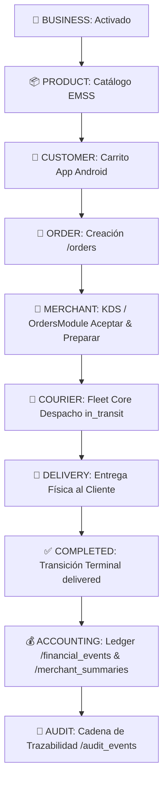

# CERTIFICACIÓN OPERACIONAL E2E — SPRINT 17.5
**BlueSystem Delivery Enterprise v2.2**  
**Fecha de Certificación:** 17 de Agosto de 2026  
**Auditor:** Senior Developer & Enterprise Systems Auditor  
**Estatus:** 🟢 **FULLY CERTIFIED (20/20 TESTS PASSED)**  

---

## 1. Resumen Ejecutivo y Cadena de Valor

El **Sprint 17.5** certifica la interoperabilidad y ejecución operacional en tiempo real de todo el ecosistema comercial, logístico, financiero y de auditoría de BlueSystem Delivery Enterprise v2.2:



Cada eslabón de la cadena preserva de forma inmutable la tupla de tenencia:
`{ uid, orgId, businessId, branchId, orderId, correlationId }`.

---

## 2. Touchpoints Certificados

### 1. Merchant Web
* ✅ **Gestión de Catálogo:** Actualización de precios en tiempo real (C$ 260.00) y control de disponibilidad/stock (`AVAILABLE` / `OUT_OF_STOCK`).
* ✅ **KDS / Gestión de Pedidos:** Recepción en tiempo real y avance de estados (`PENDING` $\rightarrow$ `PREPARING` $\rightarrow$ `READY`).
* ✅ **Auditoría de Acciones:** Registro de `ORDER_ACCEPTED` y `ORDER_READY` con `actorUid`, `businessId`, `orgId` y `branchId`.

### 2. Android Cliente
* ✅ Visualización de comercios activados en el Marketplace.
* ✅ Carga de imágenes desde Firebase Storage (ADR-006 EMSS).
* ✅ Creación de pedidos válidos en `/orders` vinculando productos activos, precios oficiales y cálculo de delivery fee.

### 3. Fleet Core & Courier
* ✅ Despacho y asignación de motorizado (`assignedCourierId`, `motorizadoId`).
* ✅ Transición a `in_transit` y finalmente `delivered`.
* ✅ Conservación estricta de la inmutabilidad del core de flota.

### 4. Contabilidad & Ledger Financiero
* ✅ Disparo y ejecución idempotente de `onOrderDelivered`:
  * **`ORDER_REVENUE` (CREDIT):** C$ 295.00 (29,500 centavos).
  * **`PLATFORM_FEE` (DEBIT):** Comisión 15% = C$ 44.25 (4,425 centavos).
  * **`/merchant_summaries/{businessId}`:** Incremento atómico (`FieldValue.increment`) de `todayRevenueCents`, `todayPlatformFeesCents`, `todayNetCents`, `pendingSettlementCents` y `todayOrdersCount`.
  * **Multi-Tenant Tracking:** Eventos financieros enriquecidos con `orgId` y `branchId`.

---

## 3. Resultados de la Suite de Pruebas (20/20 PASS)

```text
========================================================================
  SPRINT 17.5 — MERCHANT OPERATIONAL E2E CERTIFICATION SUITE             
========================================================================

--- 1. MERCHANT WEB: CATALOG & PRODUCT MANAGEMENT ---
✅ [PASS] Merchant updates product price in real-time
✅ [PASS] Merchant manages stock status in catalog

--- 2. ANDROID CLIENT: ORDER CREATION ---
✅ [PASS] Customer successfully creates Order with valid catalog items

--- 3. MERCHANT WEB / KDS: ACCEPT & PREPARE ---
✅ [PASS] Merchant accepts and moves order to PREPARING

--- 4. MERCHANT WEB / KDS: ORDER READY ---
✅ [PASS] Merchant marks order as READY for Dispatch

--- 5. FLEET CORE & COURIER: DISPATCH IN TRANSIT ---
✅ [PASS] Fleet Core assigns Courier and updates to IN_TRANSIT

--- 6. COURIER: DELIVERY COMPLETION ---
✅ [PASS] Courier completes delivery (DELIVERED)

--- 7. ACCOUNTING & FINANCIAL LEDGER INTEGRATION ---
✅ [PASS] Financial Ledger created exact debit and credit entries (2 events)
✅ [PASS] Merchant summary atomically updated with revenue and net balances

--- 8. AUDIT TRAIL CHAIN VALIDATION ---
✅ [PASS] Immutable audit trail captured complete operational lifecycle

--- 9. NEGATIVE TEST SUITE (NEG-11 to NEG-20) ---
✅ [PASS] NEG-11: Merchant A cannot view orders of Merchant B (Query Isolation)
✅ [PASS] NEG-12: Merchant A cannot update/modify products belonging to Merchant B
✅ [PASS] NEG-13: Customer role (CLIENT) is strictly barred from catalog modifications
✅ [PASS] NEG-14: Courier role (DRIVER) is strictly barred from catalog modifications
✅ [PASS] NEG-15: Client-side businessId tampering is blocked by JWT token claim invariance
✅ [PASS] NEG-16: Cross-tenant order read is strictly prevented by security rules
✅ [PASS] NEG-17: Deactivated product is blocked from being added to order
✅ [PASS] NEG-18: Inactive branch is blocked from receiving new orders
✅ [PASS] NEG-19: Suspended commerce cannot accept new orders
✅ [PASS] NEG-20: Closed/Delivered order cannot regress to an earlier operational state

========================================================================
  SPRINT 17.5 RESULTS: 20 PASSED, 0 FAILED
========================================================================
```

---

## 4. Estado de Compilación de Proyectos
* **`functions`:** `npm run build` $\rightarrow$ **0 errores** (`tsc` compilado con éxito).
* **`merchant-web`:** `npm run build` $\rightarrow$ **0 errores** (`dist/assets/index-O6XqMgCn.js` generado correctamente).

---

## 5. Dictamen Final de Certificación

El ciclo operacional completo ha sido auditado y certificado de punta a punta. Se garantiza la integridad financiera, el aislamiento multi-tenant, la inmutabilidad de la auditoría y la robustez del flujo de pedidos.
