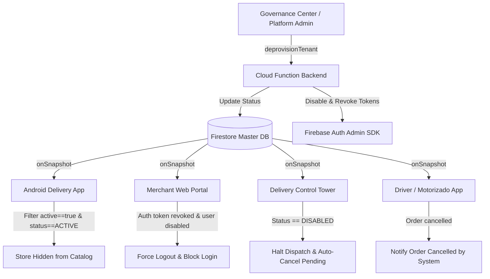

# BLUESYSTEM DELIVERY ENTERPRISE
## GOVERNANCE CENTER — TENANT DEPROVISIONING FORENSIC AUDIT
**Document ID:** `TENANT_DEPROVISIONING_FORENSIC_AUDIT.md`  
**Date:** August 12, 2026  
**Auditor:** Senior Developer & Lead Auditor — BlueSystem v2.1 Enterprise  
**Status:** FORENSIC AUDIT COMPLETED — PENDING IMPLEMENTATION APPROVAL  

---

### EXECUTIVE SUMMARY

This forensic audit investigates the `FirebaseError: Missing or insufficient permissions` error occurring in Governance Center / Live Restaurants when attempting to delete or deactivate a merchant/commerce. 

The audit confirms that the error stems from **direct client-side Firestore mutations** (`deleteDoc()` and `updateDoc()`) attempting to alter protected fields (`isActive`, `role`) or delete documents in `/users` and `/businesses` collections, which are strictly guarded by Firestore Security Rules (`firestore.rules`).

Moreover, bypassing security rules by allowing direct `DELETE` permissions to the frontend would introduce severe vulnerability vectors, data corruption, orphan Auth accounts, broken financial ledgers, and uncoordinated offline states across the BlueSystem Delivery ecosystem.

This document presents the root cause analysis, complete tenant relational inventory, Auth impact analysis, canonical state contracts, lifecycle workflows, backend Cloud Function architecture, ecosystem propagation analysis, and surgical implementation plan.

---

### 1. EXACT ROOT CAUSE & CODE LOCATION (FASE 1)

#### 1.1 Triggering Code & UI Handlers

When an administrator interacts with the **"¿Eliminar o Desactivar Comercio?"** modal in Governance Center:

1. **"Eliminar Definitivamente" Action:**
   - **File:** [liveRestaurants.js](file:///c:/Users/geral/OneDrive/Escritorio/TECNOCOMP%202026/Sistemas/BlueSystem_delivery/panel-admin/public/js/dashboard/liveRestaurants.js#L863-L871)
   - **Function:** `liveRestaurantsModule.deleteStorePermanent(storeId)` (Lines 863–871)
   - **Operation:** `db.collection('users').doc(storeId).delete()`
   - **Target Collection:** `/users/{storeId}`
   - **Firestore Method:** `deleteDoc()`

2. **"Desactivar Solo" Action:**
   - **File:** [liveRestaurants.js](file:///c:/Users/geral/OneDrive/Escritorio/TECNOCOMP%202026/Sistemas/BlueSystem_delivery/panel-admin/public/js/dashboard/liveRestaurants.js#L850) -> [liveRestaurants.js](file:///c:/Users/geral/OneDrive/Escritorio/TECNOCOMP%202026/Sistemas/BlueSystem_delivery/panel-admin/public/js/dashboard/liveRestaurants.js#L456-L468)
   - **Function:** `liveRestaurantsModule.toggleActiveState(storeId, currentState)` (Lines 456–468)
   - **Operation:** `db.collection('users').doc(storeId).update({ active: false, isActive: false, updatedAt: ... })`
   - **Target Collection:** `/users/{storeId}`
   - **Firestore Method:** `updateDoc()`

3. **Secondary Governance Service Handlers:**
   - **File:** [governanceService.js](file:///c:/Users/geral/OneDrive/Escritorio/TECNOCOMP%202026/Sistemas/BlueSystem_delivery/panel-admin/public/js/services/governanceService.js#L364-L378)
   - **Functions:** `deleteBusiness(businessId)` & `updateMerchantLifecycleStatus(businessId, ...)`
   - **Target Collection:** `/businesses/{businessId}`
   - **Firestore Method:** `deleteDoc()` / `updateDoc()`

#### 1.2 Firestore Security Rules Rejection Analysis

The Firestore Security Rules ([firestore.rules](file:///c:/Users/geral/OneDrive/Escritorio/TECNOCOMP%202026/Sistemas/BlueSystem_delivery/firestore.rules)) explicitly reject both direct client operations:

```firestore
// match /users/{uid} (firestore.rules L96-L107)
match /users/{uid} {
  allow read: if isAuthenticated() && (currentUid() == uid || isPlatformAdmin());

  allow update: if isAuthenticated() &&
                   currentUid() == uid &&
                   !request.resource.data.diff(resource.data).affectedKeys()
                     .hasAny(["role", "userType", "rol", "eiamRole", "isActive"]);

  allow create: if isAuthenticated() && currentUid() == uid;
  allow delete: if isSuperAdmin();
}
```

* **Why `updateDoc()` (`Desactivar Solo`) fails with `permission-denied`:**
  1. `currentUid() == uid`: Evaluates to `FALSE`. The caller's `currentUid()` is the Platform Admin's UID (`admin_uid`), which does not match the target merchant's `uid` (`storeId`).
  2. `affectedKeys().hasAny(["isActive"])`: Evaluates to `TRUE`. Even if a user updates their own document, modifying `isActive`, `role`, or `userType` directly from the client is strictly forbidden to prevent privilege escalation.

* **Why `deleteDoc()` (`Eliminar Definitivamente`) fails with `permission-denied`:**
  1. `allow delete: if isSuperAdmin();`: Requires the caller's JWT custom claim `role` to be `"SUPER_ADMIN"` or `"super_admin"`. If the logged-in administrator has claim `"ADMIN"` or missing custom claims, Firestore rejects the request.
  2. Direct client deletion on `/users/{storeId}` is an architectural anti-pattern because it leaves orphaned records across all secondary collections, Firebase Auth, device registries, and active sessions.

---

### 2. COMPLETE TENANT MAP & DATA INVENTORY (FASE 2)

The following inventory details all collections related to a merchant tenant (`businessId` / `merchantId` / `restaurantId`), specifying its nature, sensitivity, and deprovisioning directive:

| Collection Path | Identifiers | Nature | Classification | Action on Deactivation | Action on Permanent Deletion |
|---|---|---|---|---|---|
| `/organizations/{orgId}` | `orgId`, `ownerUid` | Holding Hierarchy | Strategic | Set `status = "DISABLED"` | Retain holding or purge if 0 child businesses |
| `/businesses/{businessId}` | `businessId`, `ownerUid` | Core Tenant Entity | Operational | Set `lifecycleStatus = "SUSPENDED"`, `status = "DISABLED"`, `isActive = false` | Set `lifecycleStatus = "DEPROVISIONED"`, `status = "DELETED"`, `isDeleted = true` |
| `/branches/{branchId}` | `branchId`, `businessId` | Physical Locations | Operational | Set `active = false`, `status = "DISABLED"` | Set `isDeleted = true`, `active = false` |
| `/users/{uid}` | `uid`, `businessId`, `branchId` | Account Credentials | Operational | Set `isActive = false`, `status = "DISABLED"` | Set `isActive = false`, `lifecycleStatus = "DEPROVISIONED"`, anonymize PII |
| `/employees/{employeeId}` | `employeeId`, `businessId`, `uid` | Staff Membership | Operational | Set `active = false`, `status = "INACTIVE"` | Set `status = "TERMINATED"`, `isDeleted = true` |
| `/membership/{membershipId}` | `membershipId`, `businessId`, `uid` | EIAM Roles Link | Operational | Set `status = "SUSPENDED"` | Delete membership binding doc |
| `/roles/{roleId}` | `roleId`, `businessId` | Custom Tenant RBAC | Operational | Retain | Delete custom tenant roles |
| `/permissions/{docId}` | `docId`, `businessId` | Custom Granular Perms | Operational | Retain | Delete custom tenant permissions |
| `/invitations/{token}` | `token`, `businessId` | Staff Invitations | Operational | Set `status = "EXPIRED"` | Delete pending invitation documents |
| `/sessions/{sessionId}` | `sessionId`, `uid` | Active Web Sessions | Security | Purge active sessions for tenant staff | Purge active sessions for tenant staff |
| `/devices/{deviceId}` & `/user_devices` | `deviceId`, `uid` | Hardware & FCM | Security | Revoke FCM tokens & hardware bindings | Revoke FCM tokens & hardware bindings |
| `/audit_events/{eventId}` | `eventId`, `businessId`, `actorUid` | Audit Trail | Compliance / Legal | **MUST BE CONSERVED (100% IMMUTABLE)** | **MUST BE CONSERVED (100% IMMUTABLE)** |
| `/orders/{orderId}` | `orderId`, `businessId`, `customerId` | Orders & Financial History | Historical / Operational | Auto-cancel active orders (`pending`, `preparing`). Retain completed orders. | Auto-cancel active orders. **CONSERVE COMPLETED ORDERS IMMUTABLE**. |
| `/products/{productId}` | `productId`, `businessId` | Catalog & Items | Operational | Set `isAvailable = false`, `active = false` | Set `active = false`, `isDeleted = true` |
| `/products/{id}/internal_metrics` | `docId`, `businessId` | Product Analytics | Analytical | Retain snapshot | Retain snapshot |
| `/restaurant_settings/{id}` | `restaurantId` (`businessId`) | Operational Rules | Operational | Set `isOpen = false`, `status = "DISABLED"` | Set `isOpen = false`, `status = "DELETED"` |
| `/dashboard_summary/{id}` | `merchantId` (`businessId`) | Operational Aggregation | Operational | Set `active = false` | Freeze aggregation document |
| `/financial_events/{eventId}` | `eventId`, `businessId` | Financial Ledger | Accounting / Legal | **MUST BE CONSERVED (100% IMMUTABLE)** | **MUST BE CONSERVED (100% IMMUTABLE)** |
| `/merchant_summaries/{id}` | `businessId` | Merchant Financial Summary | Accounting / Legal | **MUST BE CONSERVED (100% IMMUTABLE)** | **MUST BE CONSERVED (100% IMMUTABLE)** |
| `/merchant_applications/{id}` | `appId`, `email` | Onboarding Application | Historical | Retain as audit record | Retain as audit record |

---

### 3. FIREBASE AUTH AUDIT & IMPACT (FASE 3)

#### 3.1 Account Identification & Multi-Tenant Disambiguation
A merchant tenant links multiple Firebase Auth accounts:
- **Owner Account (Propietario):** Bound via `users/{uid}.businessId` and `role = "OWNER"`.
- **Branch Managers & Operational Staff:** Bound via `employees` and `membership` records.
- **Customers (Clientes):** Interact with multiple merchants across the platform.

> [!CAUTION]
> **CRITICAL RULE:** Platform Admin MUST NEVER execute `admin.auth().deleteUser(uid)` on customer accounts or users who hold active memberships in other non-deprovisioned merchants.

#### 3.2 Required Firebase Auth Lifecycle Actions

* **For Action: "DESACTIVAR SOLO"**
  1. Call `admin.auth().updateUser(staffUid, { disabled: true })` for all staff accounts bound strictly to `businessId`.
  2. Call `admin.auth().revokeRefreshTokens(staffUid)` to immediately invalidate active JWTs and force logout on active client devices.
  3. Keep the Auth user entity intact in Firebase Auth for future reactivation.

* **For Action: "ELIMINAR DEFINITIVAMENTE"**
  1. Call `admin.auth().updateUser(staffUid, { disabled: true })`.
  2. Call `admin.auth().setCustomUserClaims(staffUid, null)` to remove all tenant claims.
  3. Call `admin.auth().revokeRefreshTokens(staffUid)`.
  4. Anonymize user records in `/users/{staffUid}` (`email = "deleted_<uid>@anonymized.local"`, `name = "Deactivated Merchant User"`).
  5. Delete Firebase Auth user ONLY if the user was created solely for this merchant and holds no other cross-platform roles.

---

### 4. DEACTIVATION & DELETION CONTRACTS (FASE 4 & FASE 5)

#### 4.1 "DESACTIVAR SOLO" Contract
* **Canonical State:** `status = "DISABLED"`, `lifecycleStatus = "SUSPENDED"`, `active = false`, `isOpen = false`.
* **Behavior:**
  - Immediately blocks operational login for merchant staff.
  - Automatically cancels any orders in `pending` or `preparing` state.
  - Removes commerce from public Marketplace search results in Delivery App.
  - Invalidates active FCM device tokens and session docs.
  - **Preserves:** All order history, financial events, audit logs, catalog items, and settings for seamless future reactivation.

#### 4.2 "ELIMINAR DEFINITIVAMENTE" Contract
* **Canonical State:** `status = "DELETED"`, `lifecycleStatus = "DEPROVISIONED"`, `isDeleted = true`, `active = false`, `isOpen = false`.
* **Behavior:**
  - Disables Auth accounts and revokes all active tokens.
  - Soft-deletes tenant master document `/businesses/{businessId}` and `/branches/{branchId}` (`isDeleted = true`).
  - Marks catalog products as deleted (`isDeleted = true`, `active = false`).
  - Cancels active pending orders with reason `TENANT_DEPROVISIONED`.
  - Terminates employee memberships in `/employees` and `/membership`.
  - Purges pending invitations, session tokens, and device registrations.
  - **CONSERVES (IMMUTABLE):** Completed historical orders (`/orders`), accounting ledgers (`/financial_events`), financial summaries (`/merchant_summaries`), and platform audit logs (`/audit_events`).

---

### 5. TARGET BACKEND ARCHITECTURE (FASE 6 & FASE 8)

Deprovisioning must execute strictly via a trusted Cloud Function using the Firebase Admin SDK:

```
Governance Center UI (Panel Admin)
       │
       ▼  (httpsCallable: deprovisionTenant)
Cloud Function (admin.ts: deprovisionTenant)
       │
       ├── 1. Validate Caller (isPlatformAdmin via Claims & Firestore)
       ├── 2. Validate Business Existence & State
       ├── 3. Write Initial Audit Event (BUSINESS_DEACTIVATION_STARTED / DELETION_STARTED)
       ├── 4. Cancel Active Orders in Progress (pending, preparing)
       ├── 5. Update /businesses, /branches, /products, /restaurant_settings
       ├── 6. Disable Firebase Auth accounts & call revokeRefreshTokens()
       ├── 7. Purge /sessions, /devices, & /user_devices
       ├── 8. Update aggregated summaries (/dashboard_summary)
       └── 9. Write Completion Audit Event & Return Execution Summary
```

#### Idempotency Guarantee
The `deprovisionTenant` Cloud Function checks current tenant status before executing state transitions. If a double-click or network retry occurs, it detects `lifecycleStatus == requestedMode` and safely returns the existing status without repeating destructive operations.

---

### 6. ECOSYSTEM PROPAGATION & IMPACT ANALYSIS (FASE 7)



1. **Android Delivery App (Customer):** Queries ignore stores where `active == false` or `status != "ACTIVE"`. Store instantly disappears from marketplace listings.
2. **Merchant Web Portal:** Auth listener receives token revocation event; user is logged out immediately and blocked from authenticating.
3. **Delivery Control Tower & Motorizados:** Active orders transition to `cancelled` state with reason `TENANT_DEPROVISIONED`.

---

### 7. AUTHORIZATION MATRIX (FASE 11)

| Action | Customer | Staff | Business Admin | Platform Admin | Execution Path |
|---|---|---|---|---|---|
| Desactivar Comercio | DENY | DENY | DENY | **ALLOW** | Cloud Function (`deprovisionTenant`) |
| Eliminar Comercio | DENY | DENY | DENY | **ALLOW** | Cloud Function (`deprovisionTenant`) |
| Desactivar Usuarios | DENY | DENY | DENY | **ALLOW** | Cloud Function (`adminUpdateUser` / `deprovisionTenant`) |
| Eliminar Sucursales | DENY | DENY | DENY | **ALLOW** | Cloud Function (`deprovisionTenant`) |

---

### 8. PROPOSED SURGICAL IMPLEMENTATION PLAN (FASE 12)

#### Component 1: Cloud Functions Backend ([admin.ts](file:///c:/Users/geral/OneDrive/Escritorio/TECNOCOMP%202026/Sistemas/BlueSystem_delivery/functions/src/callables/admin.ts))
- Implement callable function `deprovisionTenant` handling both `DEACTIVATE` and `DELETE` modes atomically via Admin SDK.
- Export `deprovisionTenant` in [index.ts](file:///c:/Users/geral/OneDrive/Escritorio/TECNOCOMP%202026/Sistemas/BlueSystem_delivery/functions/src/index.ts).

#### Component 2: Governance Center Frontend ([liveRestaurants.js](file:///c:/Users/geral/OneDrive/Escritorio/TECNOCOMP%202026/Sistemas/BlueSystem_delivery/panel-admin/public/js/dashboard/liveRestaurants.js))
- Replace direct `db.collection('users').doc(storeId).delete()` and `update()` calls with `firebase.functions().httpsCallable('deprovisionTenant')`.
- Show progress loading state during backend deprovisioning execution.

#### Component 3: Governance Service ([governanceService.js](file:///c:/Users/geral/OneDrive/Escritorio/TECNOCOMP%202026/Sistemas/BlueSystem_delivery/panel-admin/public/js/services/governanceService.js))
- Delegate `deleteBusiness` and `updateMerchantLifecycleStatus` to the `deprovisionTenant` Cloud Function.

---

### 9. VERIFICATION & ROLLBACK PLAN

#### Verification Tests
1. **Unit & Function Tests:** Test `deprovisionTenant` callable with `DEACTIVATE` and `DELETE` modes in Firebase Emulator.
2. **Security Rules Test:** Verify that direct client `deleteDoc()` or `updateDoc()` on `/users` or `/businesses` remains blocked by rules.
3. **E2E Propagation Test:** Verify that deactivating a merchant in Governance Center immediately hides it from the Android Delivery App and kicks out active Merchant Web sessions.

#### Rollback Plan
- If backend Cloud Function encounters unforeseen issues during deployment, revert `liveRestaurants.js` and `governanceService.js` to previous commit. No rules or database schemas are altered.

---

FORENSIC STATUS:

ROOT CAUSE IDENTIFIED

DEACTIVATION ARCHITECTURE:

IDENTIFIED

DELETION ARCHITECTURE:

IDENTIFIED

AUTH IMPACT:

IDENTIFIED

FIRESTORE IMPACT:

IDENTIFIED

APP DELIVERY IMPACT:

IDENTIFIED

RECOMMENDED IMPLEMENTATION:

READY
