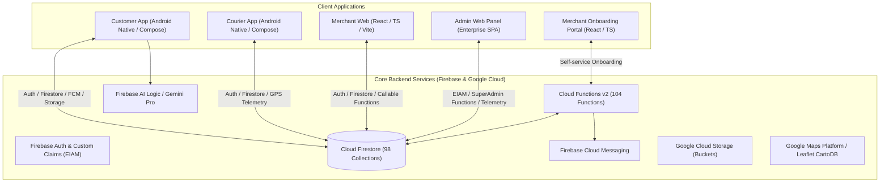

# 01 — EXECUTIVE PLATFORM OVERVIEW

**System:** BlueSystem Delivery Enterprise  
**Project Reference:** `bluesystem-7c9af`  
**Architecture Mode:** ONE CORE / ONE CODEBASE / MULTI-TENANT / WHITE-LABEL  
**Platform Status:** Advanced Enterprise Stage (Pre-Production Rollout Baseline v2.2)

---

## 🚀 1. Platform Mission & Strategic Architecture

BlueSystem Delivery Enterprise is an integrated end-to-end commercial logistics, on-demand marketplace, point-to-point courier, and multi-tenant restaurant operations platform.

The system is architected around the principle of **One Unified Backend** orchestrating four primary client platforms:
1. **Customer App (Android / Jetpack Compose):** Consumer marketplace, restaurant ordering, cart, checkout, live order tracking, X→Y point-to-point shipping, and Gemini-powered smart shopping assistant.
2. **Courier App (Android / Jetpack Compose):** Fleet operations, real-time telemetry (GPS broadcast every 5s/60s), Fleet Pool available order claims, assigned delivery execution, electronic proof of delivery, and cash settlement.
3. **Merchant Web (React / TypeScript / Vite / TailwindCSS):** Commercial operational center, Live Kanban, Product & Menu Wizard, branch configuration, restaurant settings, staff management, and embedded Control Tower.
4. **Admin Web Panel (Vanilla JS / Tailwind / EIAM):** Platform-wide Governance Center, multi-tenant & brand provisioning, subscription & entitlement management, live operations tower, audit logging, and canary deployment controls.

---

## 💼 2. Dual Business Domain Model

The platform strictly isolates two distinct business models at the data, security, and UI levels:

### Domain 1: Commerce Delivery (`/orders/{orderId}`)
- **Nature:** Food & retail orders placed by Customers at registered Merchant branches.
- **Workflow:** Order Created → Merchant Accepts & Prepares → Marked READY → Dispatched via Fleet Pool or Merchant Courier Assignment → Courier Transits → Delivered to Customer with Pin/Signature validation.
- **Pricing:** Dynamic cart calculation + delivery fee computed by Merchant distance tiers or flat rate.

### Domain 2: X → Y Point-to-Point Delivery (`/deliveryTrips/{tripId}`)
- **Nature:** On-demand peer-to-peer package shipping requested directly by Customers without Merchant involvement.
- **Workflow:** Customer selects Pick-up (X) & Drop-off (Y) on native map → Price computed via Haversine Distance Engine (Base $35 + $15/km) → Trip broadcast to Fleet Pool → Courier claims trip atomically → Pick-up verified → Package delivered with signature & photo evidence.

---

## 🛡️ 3. Core Enterprise Governance Rules

1. **Zero Data Leaks (Multi-Tenant Isolation):** Every merchant document is scoped by `tenantId`, `businessId`, and `branchId`. Security rules prevent cross-merchant leakage.
2. **Concurrency Safety:** Fleet orders and trips are claimed exclusively via atomic transactions (`runTransaction` with `claimOrderAtomically` / `claimTripAtomically`) to prevent double assignment.
3. **No Auto-Rollout Policy (ADR-014):** System promotion, canary percentage adjustments, and custom claim provisioning strictly require human authorization.
4. **Architectural Freezes:**
   - **ADR-013:** Merchant Control Tower web cartography frozen on Leaflet + CartoDB Voyager.
   - **ADR-015:** X→Y Location & Map Picker frozen on native Android Geocoder + FusedLocationProviderClient.
   - **ADR-016:** Courier Core & Fleet Eligibility Engine frozen.

---
*Evidence: active codebase inspection across `app/`, `merchant-web/`, `panel-admin/`, `functions/`, and `firestore.rules`.*
