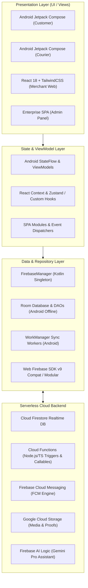

# 02 — SYSTEM ARCHITECTURE & PLATFORM TOPOLOGY

**Architecture Paradigm:** ONE CORE / ONE CODEBASE / ZERO FORKS  
**Multi-Tenancy Engine:** Enterprise IAM (EIAM v2.1/v3) with Hierarchical Scoping  
**Backend Infrastructure:** Google Cloud & Firebase Serverless

---

## 🏗️ 1. Global Multi-Layer Architecture

BlueSystem Delivery Enterprise follows a clean multi-layer reactive architecture across mobile, web, and serverless backends.

---

## 📱 2. Mobile Architecture (Android Native)

- **Package Root:** `com.example` (shared mobile codebase)
- **Framework:** 100% Kotlin with Jetpack Compose & Material 3.
- **Dependency Management:** Gradle Version Catalogs / Kotlin DSL (`build.gradle.kts`).
- **Core Mobile Modules:**
  - `com.example.ui.customer`: Customer screens, shopping cart, product details, checkout, active tracking.
  - `com.example.ui.courier`: Courier dashboard, Fleet Pool, active delivery navigation, proof of delivery dialogs.
  - `com.example.ui.auth`: Login, Registration, Password recovery, Role router.
  - `com.example.data`: Repositories, Room Database (`AppDatabase`), DAOs, Data Models.
  - `com.example.service`: Foreground Location Service, `FirebaseMessagingService`, Telemetry Sync.
  - `com.example.worker`: `LocationSyncWorker`, offline sync workers.

---

## 💻 3. Web Architecture (Merchant & Admin)

### A. Merchant Web (`merchant-web/`)
- **Technology:** React 18, TypeScript, Vite, TailwindCSS, Lucide Icons.
- **Cartography Engine:** Leaflet + CartoDB Voyager (`LiveMap.tsx`). Zero Google Maps JS API cost footprint.
- **State Management:** Reactive React state + real-time Firestore listeners scoped to `activeMerchantId`.
- **Core Modules:**
  - `DeliveryControlTowerModule.tsx`: Real-time fleet oversight and dispatch.
  - `ProductWizard.tsx`: Product creation and category binding.
  - `RestaurantSettingsCenter.tsx`: Delivery radius, hours, branch parameters.
  - `MerchantFinanceCenter.tsx`: Balances, daily closures, ledger.

### B. Admin Web Panel (`panel-admin/`)
- **Technology:** Modular Enterprise SPA (HTML5, TailwindCSS, Vanilla JS architecture).
- **Core Services:**
  - `governanceService.js`: Tenant creation, quota enforcement, feature flags.
  - `identityService.js`: Custom claims management, role elevation.
  - `opsTowerService.js`: Platform-wide live courier & order tracking.
  - `securityService.js`: Session auditing and rate limiting.

---

## ⚡ 4. Cloud Functions Backend (`functions/`)

- **Runtime:** Node.js 18 / 20 with TypeScript.
- **Structure:**
  - `functions/src/domain/orders/`: Order creation, state transitions, auto-cancellation.
  - `functions/src/domain/fleet/`: Fleet eligibility engine, courier assignment, timeout re-dispatch.
  - `functions/src/domain/trips/`: Point-to-point X→Y delivery trip orchestration.
  - `functions/src/domain/notifications/`: Push notification dispatcher for FCM.
  - `functions/src/domain/governance/`: EIAM provisioning, custom claims sync, tenant deprovisioning.
  - `functions/src/domain/finance/`: Financial events, merchant balance recalculation.

---
*Evidence: inspected `app/build.gradle.kts`, `merchant-web/package.json`, `panel-admin/public/js/`, and `functions/src/`.*
