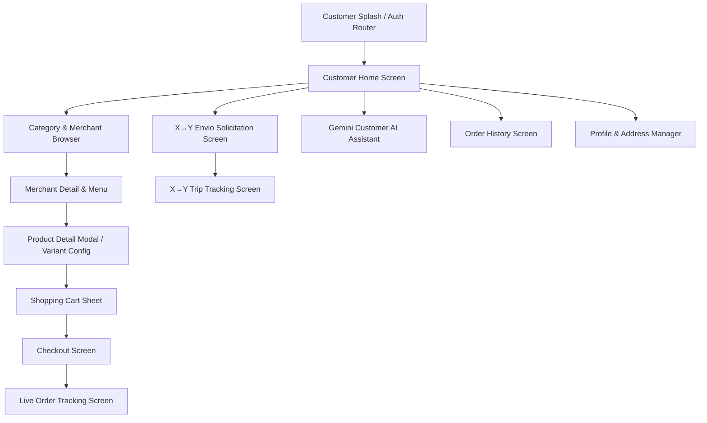

# 03 — CUSTOMER APP COMPLETE RADIOGRAPHY

**Platform:** Android Native (Customer Module)  
**Language / Framework:** Kotlin / Jetpack Compose / Material Design 3  
**Target Package:** `com.example.ui.customer`  
**Primary Entry Point:** `MainActivity.kt` (Role: `CUSTOMER`)

---

## 🛍️ 1. Functional Architecture & Overview

The Customer App provides the complete consumer experience for BlueSystem Delivery Enterprise. It encompasses:
1. **Storefront & Catalog:** Dynamic categories, merchant listings, product variants, combo configurator.
2. **Shopping Cart & Checkout:** Multi-item cart, delivery address selection, payment method selection (Cash, Card, Transfer), voucher upload.
3. **Real-time Order Tracking:** Live status timeline, courier location map updates via `/ubicaciones_repartidores`, direct chat/call.
4. **X → Y Point-to-Point Shipping:** Interactive map picker, origin/destination address resolution, package details, instant quote.
5. **AI Smart Shopping Assistant:** Integrated Gemini chat assistant (`CustomerAIScreen.kt`) for product recommendations and natural language ordering.
6. **Profile & History:** Saved addresses, past orders, reviews and rating submission.

---

## 📱 2. Core State Management & Repositories

- **`CustomerViewModel.kt` / `HomeViewModel.kt`:** Manages active categories, merchant feeds, active promotions, and customer cart.
- **`CartManager.kt` / `CartRepository.kt`:** Reactive in-memory and Room-persisted shopping cart with single-merchant validation (warning dialog on cross-merchant cart addition).
- **`OrderRepository.kt`:** Creates `/orders` documents, subscribes to active order snapshots (`onSnapshot`), handles cancellation requests.
- **`DeliveryTripRepository.kt`:** Handles creation and state listening for `/deliveryTrips`.
- **`CustomerAIViewModel.kt`:** Orchestrates conversational prompts to Firebase AI Logic / Gemini Pro backend.

---

## 📦 3. Data Flow: Customer Ordering Lifecycle

1. **Merchant Selection:** Customer chooses a store from `/merchants` collection.
2. **Item Customization:** Customer selects product options from `/merchants/{id}/products` or `/products`.
3. **Cart Assembly:** In-memory cart calculates `subtotal`, `deliveryFee`, and `total`.
4. **Order Placement:** Order submitted to `/orders/{orderId}` with status `PENDING`.
5. **Cloud Function Trigger:** `onOrderCreated` validates stock, alerts Merchant Web via FCM and Firestore listener.
6. **Tracking Transition:** App navigates to `OrderTrackingScreen.kt` which listens to `/orders/{orderId}`. When assigned, it attaches a listener to `/ubicaciones_repartidores/{courierId}` to display real-time bike marker movement.

---
*Evidence: source code analysis of `app/src/main/java/com/example/ui/customer/`.*
